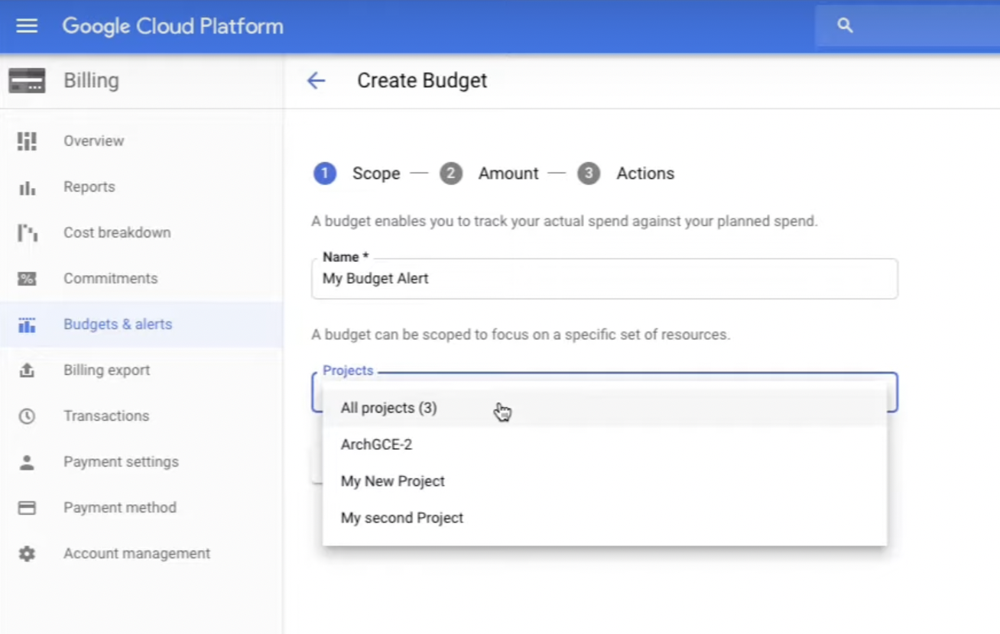

# Demo: Billing Administration

[Demo: Billing Administration](https://www.cloudskillsboost.google/course_sessions/1685040/video/314490)

- Billing -> Budgets & alerts -> Create Budget
- **Scope**-> Project: All projects(3), proj1, proj2, proj3
- **Amount**: $500
- **Actions**: 50%: $250, 90%: $450, 100%: $500
- Billing -> Transactions
- Billing -> Billing export -> BigQuery or Files(CSV, JSON)

