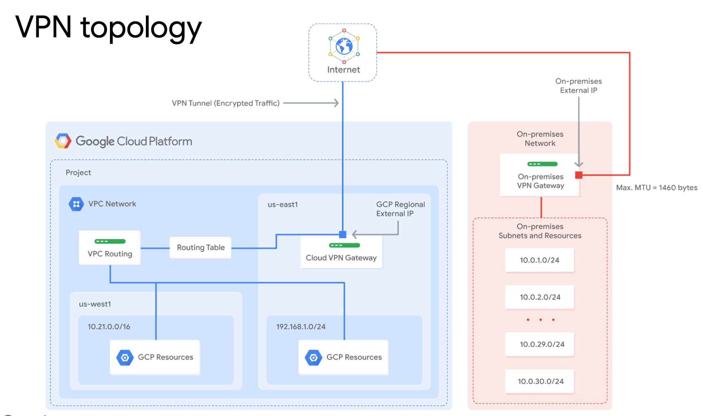
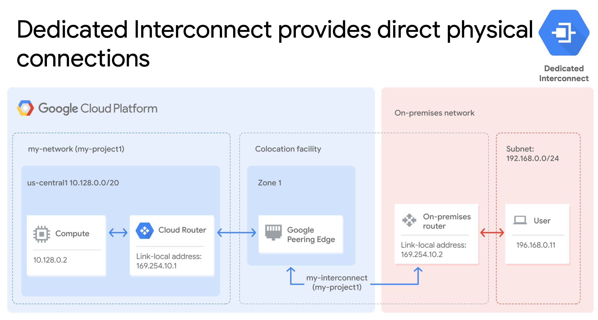
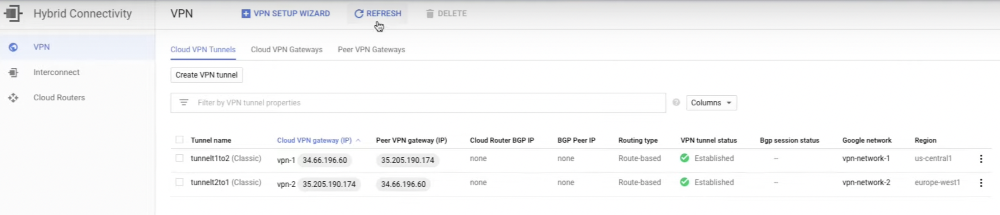
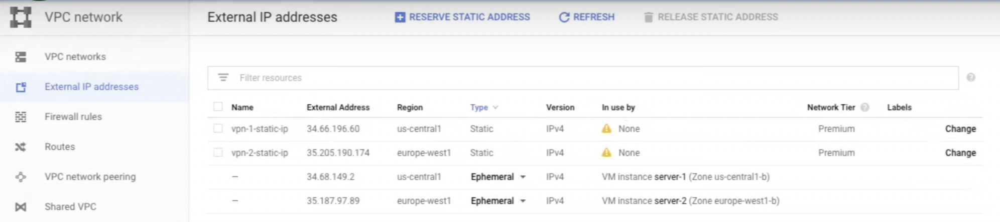

# Lab: Cloud VPN

[Lab: Cloud VPN](https://www.cloudskillsboost.google/course_sessions/1831826/labs/338547)

> Cloud VPN securely connects your on-premises network to your GCP VPC network through an IPsec VPN tunnel. Traffic traveling between the two networks is encrypted by one VPN gateway, then decrypted by the other VPN gateway. This protects your data as it travels over the public internet, and that’s why Cloud VPN is useful for low-volume data connections.

> This diagram shows a simple VPN connection between your VPC and on-premises network. Your VPC network has subnets in us-east1 and us-west1, with GCP resources in each of those regions. These resources are able to communicate using their internal IP addresses because routing within a network is automatically configured (assuming that firewall rules allow the communication).



- vpc - us-east1, us-west1, internal IP, routing-ok
- vpc - on-premises, cloud vpn gateway, on-premises gateway, two vpn tunnels

## Dedicated Interconnect



> Dedicated Interconnect provides direct **physical connections** between your on-premises network and Google’s network. This enables you to transfer large amounts of data between networks, which can be more cost-effective than purchasing additional bandwidth over the public internet.

## Lab

0. Resource Manager

1. VM1 us-central1, internal IP, external IP, vpn-network1
   VM2 europe-east1, internal IP, external IP, vpn-network2
2. To see details, click on nic0. Checking connectivity.

```
ping -c 3 external OK
ping -c 3 internal failed // because of the different VPC network btw two VMs.
```

3. VPN -> Reserve a static address
4. Hybrid Connectivity -> Classic VPN
5. Test the connectivity again.

```
// Open VM1 SSH and ping VM2 internal IP
ping -c 3 internal #OK:the packets sent successfuly!

// Open VM2 SSH and ping VM1 internal IP
ping -c 3 internal #OK:the packets sent successfuly!
```



