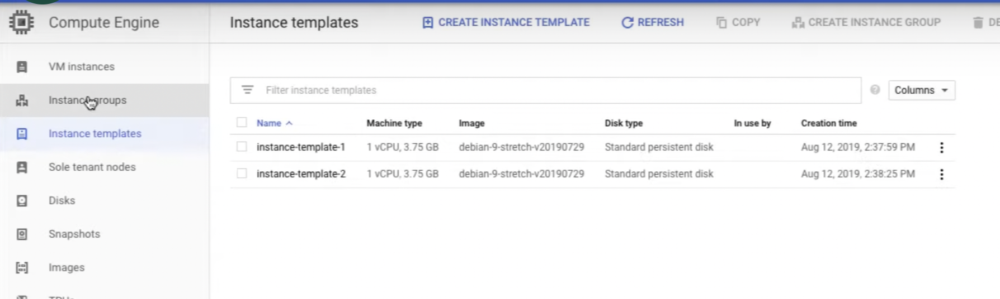
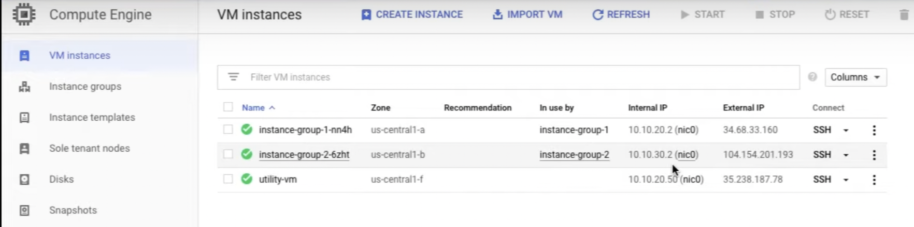
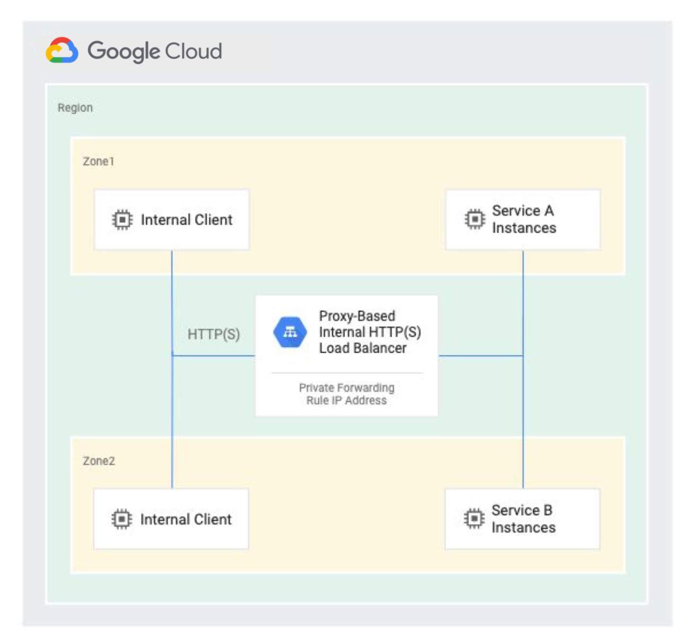
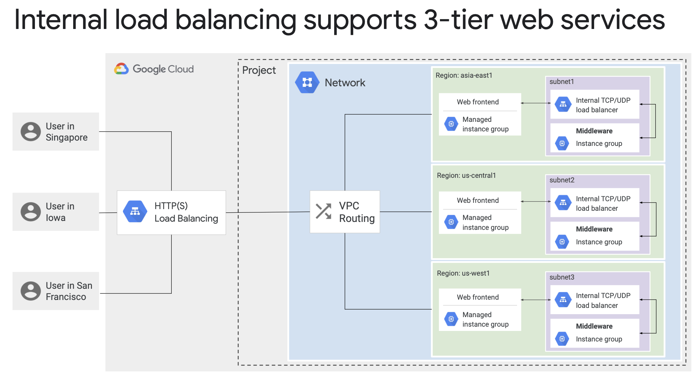

# Internal LB

[Internal Load Balancer](https://www.cloudskillsboost.google/course_sessions/1831826/labs/338570)

1. VPC

   - default
   - my-internal-app
     - us-central1: Subnet-a
     - us-central2: Subnet-b

2. FW

   - default
   - app-allow-icmp
   - app-allow-ssh-rdp

3. Create FW

   - (Name) app-allow-http
   - (NW) my-internal-app
   - (Tag) lb-backend
   - (IP) 0.0.0.0/0
   - (TCP) 80

4. Create FW

   - (Name) app-allow-health-check
   - (NW) my-internal-app
   - (Tag) lb-backend
   - (IP) 0.0.0.0/0
   - (TCP) 80

5. Instance Template Template 1

   - (NW) my-internal-app
   - (Subnet) subnet-a
   - (Tags) lb-backend

6. Instance Template Template 2

   - (NW) my-internal-app
   - (Subnet) subnet-b
   - (Tags) lb-backend

7. Create MIGs for Instance Template 1
8. Create MIGs for Instance Template 2
9. Create an utility VM

## Internal LB

> Now, Google Cloud Internal HTTP(S) Load Balancing is a proxy-based, regional Layer 7 load balancer that also enables you to run and scale your services behind an internal load balancing IP address. Backend services support the HTTP, HTTPS, or HTTP/2 protocols.
> Internal HTTP(S) Load Balancing is a managed service based on the open source Envoy proxy. This enables rich traffic control capabilities based on HTTP(S) parameters. After the load balancer has been configured, it automatically allocates Envoy proxies to meet your traffic needs.

