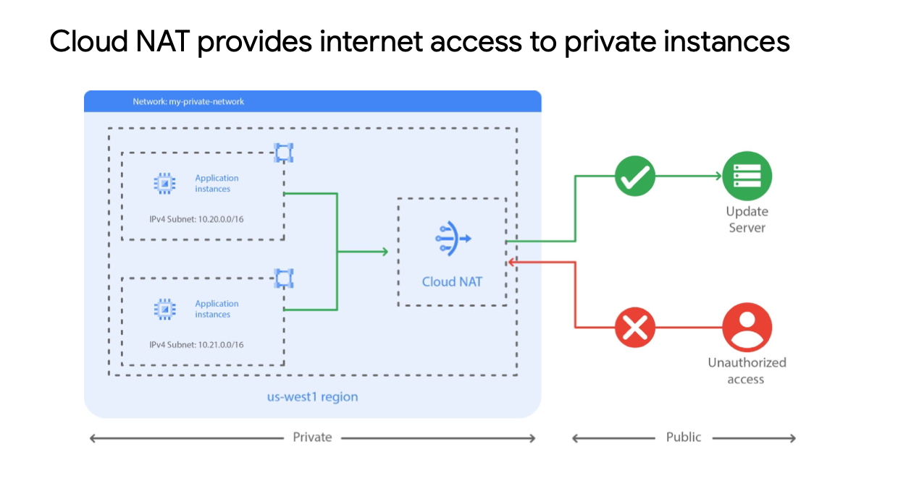
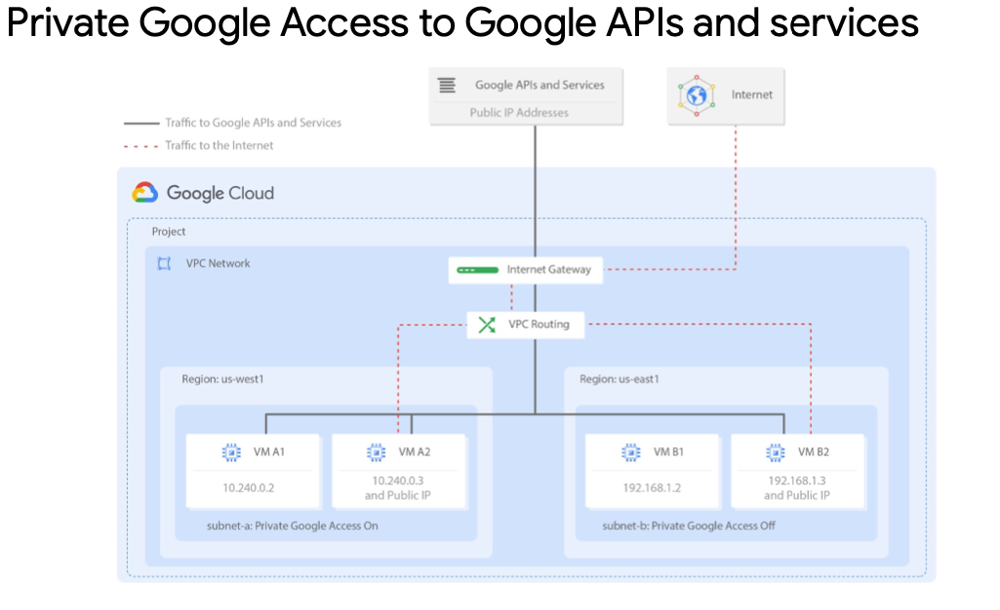

# Private Google Access and Cloud NAT

[Private Google Access and Cloud NAT](https://www.cloudskillsboost.google/course_sessions/1685038/labs/314349)

- I recommend using only assigning internal
  IP addresses to your VM instances wherever possible.

- Cloud NAT is Google’s managed network address translation service. It lets you
  provision your application instances without public IP addresses, while also allowing
  them to access the internet in a controlled and efficient manner. This means your
  private instances can access the internet for updates, patching, configuration
  management, and more.

- In this diagram, Cloud NAT enables two private instances to access an update server
  on the internet, which is referred to as outbound NAT. However, Cloud NAT does not
  implement inbound NAT. In other words, hosts outside your VPC network cannot
  directly access any of the private instances behind the Cloud NAT gateway. This
  you keep your VPC networks isolated and secure.

- you should enable Private Google Access to allow VM instances that only have internal IP addresses to reach the external IP addresses of Google APIs and services. For example, if your private VM instance needs to access a Cloud Storage bucket, you need to enable Private Google Access.

- You enable Private Google Access on a subnet-by-subnet basis. As you can see in this diagram, subnet-a has Private Google Access enabled, and subnet-b has it disabled. This allows VM A1 to access Google APIs and services, even though it has no external IP address.

- Private Google Access has no effect on instances that have external IP addresses. That’s why VMs A2 and B2 can access Google APIs and services. The only VM that can’t access those APIs and services is VM B1. This VM has no public IP address, and it is in a subnet where Google Private Access is disabled.
