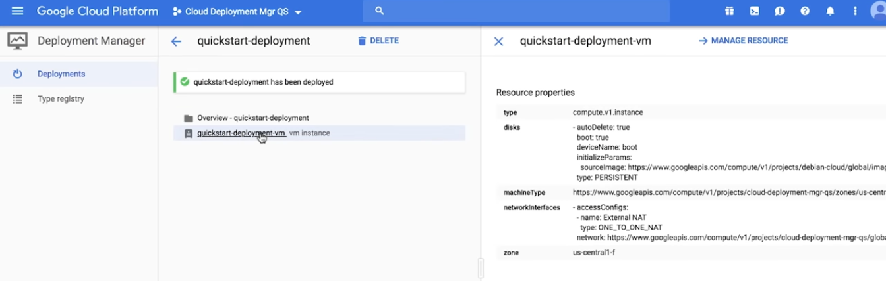

### Deployment Manager




**demo test**

- canary release
- LB scaling - VM cannot auto scaling. Options: manually add a vm,
- gcloud compute networks --list - List an external and internal IP on VM

1. gcloud compute instances list (this is correct)
2. gcloud compute networks --list

```
$ gcloud compute instances list
NAME: test-vm
ZONE: us-central1-a
MACHINE_TYPE: f1-micro
PREEMPTIBLE:
INTERNAL_IP: 10.128.0.3
EXTERNAL_IP: 34.134.154.119
STATUS: RUNNING
```

- sole-tenant VM - isolated at hardware level (correct)
- Cloud Storage - billing against for **bucket**, obj, proj, account.
  A: bucket based on storage classes
  https://cloud.google.com/storage#section-10

> Pricing for Cloud Storage services is based on what you use, including the amount of data you store, the duration for which you store it, the number of operations you perform on your data, and the network resources used when moving or accessing your data. For “cold” storage classes meant to store long-term, infrequently accessed data, there are also charges for retrieving data and early deletion of data.

- Cloud SQL Proxy gcloud auth application --login or --default login
- Datastore mandatory fields - ns, kind, identifier

  https://cloud.google.com/datastore/docs/store-query-data

- (DB) cache, analytics, offline - Firestore(correct)
- (NW) on-pre, video/VPC - Dynamic routes
- (NW) private, 15 GB cable, hybrid
- (NW) currentl auto-mode. Delete a few subnets, modify => custom mode
- (NW) private /google API/ Carreir /Partner/ Dedicate
- (NW) start up script, always download the latest version

  **Links:**
  https://www.youtube.com/watch?v=ZnOSw23Z6no

```
gcloud auth login
gcloud compute instances create hiroko-vm
```

- (IAM) gcloud config configurations create my-config.config
- (IAM) VM pub/sub
- (IAM) gcloud functions deploy
  > gcloud functions deploy (NAME : --region=REGION)
- (IAM) Bill alert, BA
  > Question 109 You need to set a budget alert for use of Compute Engineer services on one of the three Google Cloud Platform projects that you manage. All three projects are linked to a single billing account. What should you do?
