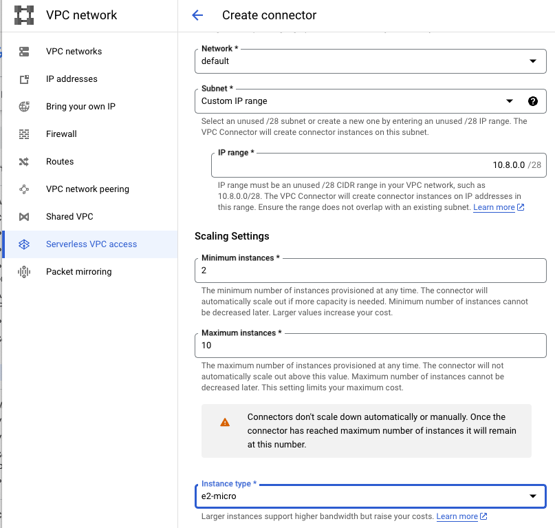

# Serverless VPC access Connector

- [Create a Serverless VPC Access connector](https://cloud.google.com/vpc/docs/configure-serverless-vpc-access#create-connector)

- **Step 7.a.** Set the minimum and maximum number of instances for your connector, or use the defaults, which are **2 (min)** and **10 (max)**.

- **Step 7.b.** In the Instance Type menu, choose the machine type to be used for the connector, or use the default **e2-micro**.



```
gcloud compute networks vpc-access connectors create CONNECTOR_NAME \
--region REGION \
--subnet SUBNET \
# If you are not using Shared VPC, omit the following line.
--subnet-project HOST_PROJECT_ID \
# Optional: specify minimum and maximum instance values between 2 and
10, default is 2 min, 10 max.
--min-instances MIN \
--max-instances MAX \
# Optional: specify machine type, default is e2-micro
--machine-type MACHINE_TYPE
```

- MIN: Use an integer between 2 and 9. **Default is 2**.
- MAX: Use an integer between 3 and 10. **Default is 10**.
- MACHINE_TYPE: **f1-micro**, **e2-micro**, or **e2-standard-4**.

# Cloud Run

- [Configure your service to connect to a VPC network](https://cloud.google.com/run/docs/configuring/connecting-vpc#configuring)
- [Cloud Run min instances: Minimize your serverless cold starts](https://cloud.google.com/blog/products/serverless/cloud-run-adds-min-instances-feature-for-latency-sensitive-apps)
- [Use minimum instances to reduce cold starts](https://cloud.google.com/run/docs/tips/general#use_minimum_instances_to_reduce_cold_starts)

# Cloud SQL for MySQL

- https://cloud.google.com/sql/docs/mysql/connect-instance-cloud-run#expandable-4

  > For private IP paths, your application connects directly to your instance through _Serverless VPC Access_. This method uses a TCP socket to connect directly to the Cloud SQL instance without using the Cloud SQL Auth Proxy.

# Python

- [Python Client Libraries](https://cloud.google.com/python/docs/reference)
- [Cloud Scheduler -> Cloud Scheduler Client -> create_job](https://cloud.google.com/python/docs/reference/cloudscheduler/latest/google.cloud.scheduler_v1.services.cloud_scheduler.CloudSchedulerClient#google_cloud_scheduler_v1_services_cloud_scheduler_CloudSchedulerClient_create_job)

# Node.js

-
