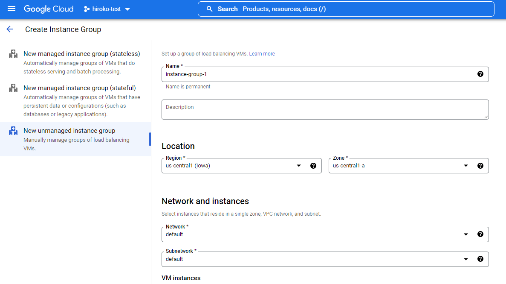
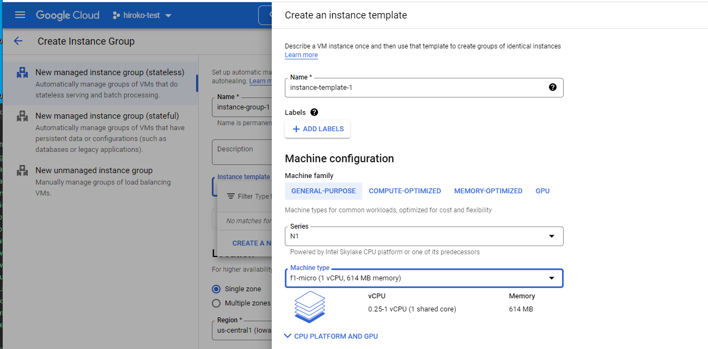
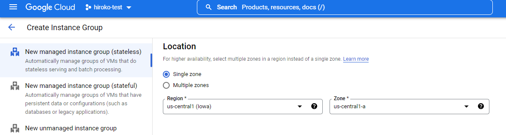
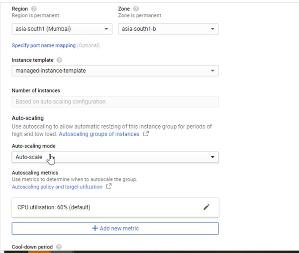
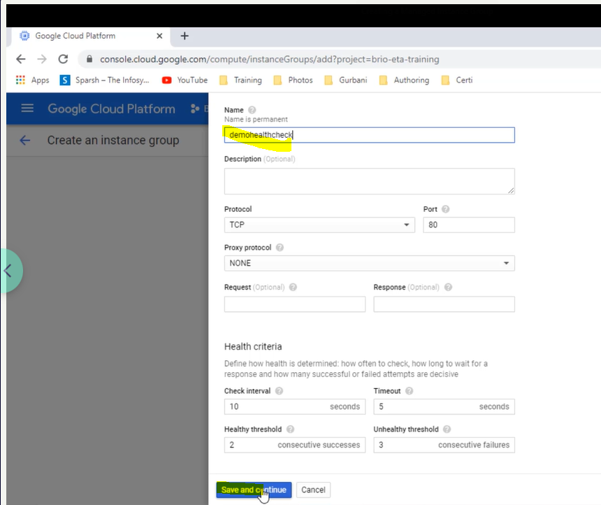
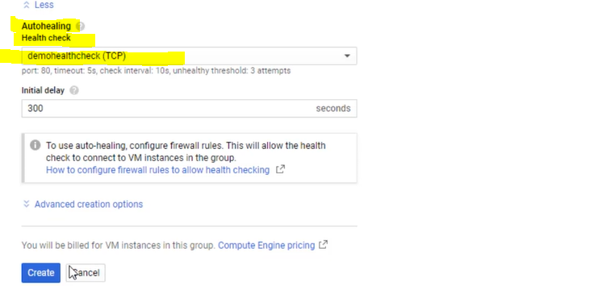
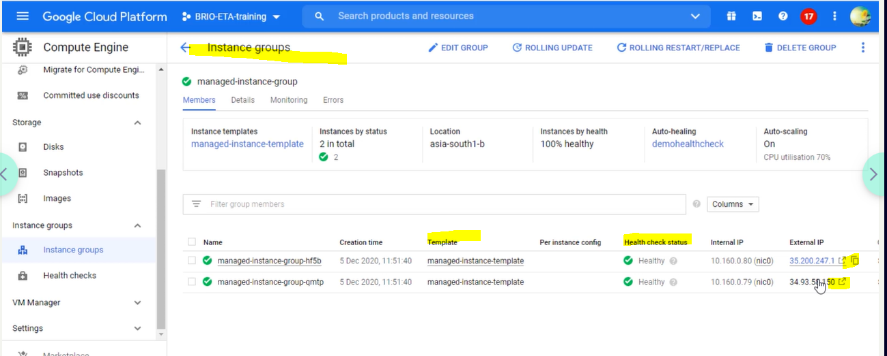

# Instance Groups in GCP

- Panchama offers attractive discounts on music albums
- Application usage increased
- IT team manages the fluctuating load by manual provisioning of GCP instances
- Requirement:
  A solution in cloud to auto provision instances based
  on pre-defined workload conditions
- Solution: using GCP services:
  Use managed instance group for automatic scaling
- Allows to create groups of VM instances to reduce management effort in managing multiple individual instances. Compute Engine offers 2 types of instance groups:
  - Unmanaged instance groups
  - Managed instance groups

## Unmanaged instance group

https://cloud.google.com/compute/docs/instance-groups

- Unmanaged instance groups do not offer autoscaling, autohealing, rolling update support, multi-zone support, or the use of instance templates and are not a good fit for deploying highly available and scalable workloads.
- if you need to apply load balancing to groups of heterogeneous instances, or if you need to manage the instances yourself.

# Managed instance group

Lab Guide-Creating a Managed Instance Group

- Managed instance groups (MIGs) let you operate apps on multiple identical VMs. You can make your workloads scalable and highly available by taking advantage of automated MIG services, including: **autoscaling, autohealing, regional (multiple zone) deployment, and automatic updating**.

## How to create managed instance group

1. Compute Engine -> Create Instance Group
2. Select New unmanaged instance group

## Quiz

**Q1:** To ensure that your application will handle the load even if an entire zone fails, what should you do?

1. Spread managed instance group over two zones and overprovision by 100% (Correct)
2. Create regional unmanaged instance group and spread instances across multiple zones.
3. Don't select multizone option while creating managed instance group.
4. None of the above

> If one zone fails you still have 100% desired capacity in another zone

**Q2:** Susan is looking for a solution to protect applications and services from potentially disruptive system events. How should she achieve this?

1. Use managed instance groups to perform health checking and scaling across groups of Compute Engine instances. (Correct)
2. Compute Engine automatically performs health checking and scaling of instances.
3. Make use of persistent disks for Compute Engine

> An instance group is a collection of VM instances and is used to perform health checking and scaling across groups of Compute Engine instances.

**Q3:** Rahul needs to load balance apps across a fleet of virtual machines that he prefers to manage himself.

1. He should consider managed instance groups.(Correct)
2. He should consider using unmanaged instance groups.
3. Not possible

> Using a managed instance group allows you to run applications on several identically configured virtual machines, and which offers several automated services such as autoscaling, auto-healing
