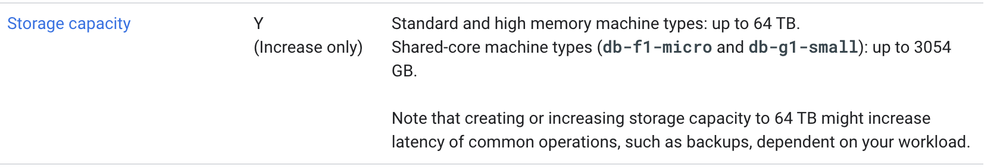

# Exam Topic

**Question 1**

- D. Use separate backend pools for each API path behind the load balancer. 100%
- (Amber25 2 years, 7 months ago)D is the answer because HTTP(S) load balancer can direct traffic reaching a single IP to different backends based on the incoming URL.

<hr />

**Question 2**

- A. Load data into Google BigQuery
- B is not correct because Cloud SQL storage limit doesn't fit the requirement.
- https://cloud.google.com/sql/docs/mysql/instance-settings
- Standard and high memory machine types: up to **64 TB**.



- https://support.google.com/cloud/answer/9113366?hl=en
- **BigQuery** is Google's fully managed, petabyte-scale, low-cost data warehouse for analytics.
- https://medium.com/analytics-vidhya/bigquery-petabyte-scale-data-warehouse-in-gcp-980b930e8bd8

<hr />

**Question 3**

- ADE 31%/Me/RKS_2021, CDE 44%, ACE 24%
- A. Port the application code to run on Google App Engine
- D. Select an automation framework to reliably provision the cloud infrastructure
- E. Deploy a continuous integration tool with automated testing in a staging environment

- A: https://cloud.google.com/appengine/docs/legacy/standard/java/tools/uploadinganapp
- E: CICD
- Operations manager should not touch application for instrument

- (**ADE**)By elimination and if the J2EE is a basic application ADE:

  - B. Integrate Cloud Dataflow => no needed for this application.
  - C. Stackdriver Debugger => it's not the first monitoring tool to put in place, it's only to debug code execution.
  - F. Migrate from MySQL to a managed NoSQL database => no need for that, gcp has SQL supported with cloud SQL.

- I voted ADE.
  - A - App Engine could be used for J2EE application
  - B - Dataflow is not used for real-time metrics
  - C - Debugger is not used for monitoring
  - D - Good practice
  - E - Good practice
  - F - Depends on the situation but I don't think Datastore or BigTable is a good choice for MySQL migration

<hr />

**Question 4**

- A is correct option.
- App Engine spins up new containers automatically according to the load. During peak traffic, HTTP requests originated by the same user could be served by different containers. Given that the variable `sessions` is recreated for each container, it might store different data. The problem here is that this Flask app is stateful. The `sessions` variable is the state of this app. And stateful variables in App Engine / Cloud Run / Cloud Functions are problematic. A solution would be to store the session in some database (e.g., Firestore, Memorystore) and retrieve it from there. This way the app would fetch the session from a single place and would be stateless.

<hr />

**Question 5**

- C 53%/ME/tartar, A 47%
- A. Direct them to download and install the Google StackDriver logging agent Mo
- C. Help them define their requirements and assess viable logging tools
- How do we know the logging required is for GCE .. not for other GKE. or other services -> C

<hr />

**Question 6**

- AC 84%
- A. Introduce a green-blue deployment model
- C. Fragment the monolithic platform into microservices
- A: Blue green deployment is an application release model that gradually transfers user traffic from a previous version of an app or microservice to a nearly identical new release—both of which are running in production.
- https://cloud.google.com/architecture/application-deployment-and-testing-strategies
- **Blue/green deployment**
- In the diagram, blue represents the current application version and green represents the new application version.
- Only one version is live at a time. Traffic is routed to the blue deployment while the green deployment is created and tested. After you're finished testing, you route traffic to the new version.
- https://cloud.google.com/architecture/application-deployment-and-testing-strategies#canary_test_pattern

- **Canary test pattern**
- Canary releases let you route the live production traffic to different versions of the application without any downtime.
- You then split and route a percentage of traffic from the production version to
- B - Canary but not on the QA environments. With Canary you usually test in production

<hr />

**Question 7**

- AD 63%
- Use the flag -no-auto-delete with this flag, the disk won't be deleted when the VM is terminated.
- https://cloud.google.com/compute/docs/images/create-custom#gcloud
- By default, the auto-delete option is enabled on the boot disks.
- Billing export to BigQuery enables you to export your daily usage and cost estimates automatically throughout the day to a BigQuery dataset you specify. You can then access your billing data from BigQuery.

<hr />

**Question 8**

- B. NoSQL 100%

<hr />

**Question 9**

- C. Ensure that a firewall rule exists to allow load balancer health checks to reach the instances in the instance group. 100%

- C is correct because health check failures lead to a VM being marked unhealthy and can result in termination if the health check continues to fail. Because you have already verified that the instances are functioning properly, the next step would be to determine why the health check is continuously failing.

<hr />

**Question 10**

- C. Create a new service account with BigQuery access and execute your script with that user. 83%/tartar
- https://cloud.google.com/iam/docs/service-account-overview
- **A service account** is a special kind of account typically used by **an application** or compute workload, such as a Compute Engine instance, rather than a person.z
- A service account is an account that belongs to your application instead of to an individual end user. This provides an identity for carrying out server-to-server interactions in a project without supplying user credentials. (IAM.pdf)
- For example, if you write an application that interacts with Google Cloud Storage, it must first authenticate to either the Google Cloud Storage XML API or JSON API. (IAM.pdf)

<hr />

**Question 11**

- C. Provision users in Google using the Google Cloud Directory Sync tool. 27%/Me/tartar
- B. Federate authentication via SAML 2.0 to the existing Identity Provider. 73%
- https://support.google.com/a/answer/106368?hl=en
- With Google Cloud Directory Sync (GCDS), you can synchronize the data in your Google Account with your Microsoft Active Directory or LDAP server.
- https://support.google.com/a/answer/6120130?hl=en&ref_topic=2679497#passwords
- GCDS is better as it is a corporate application. The requirements for storing password can be met by GCP. As GCP has many security features
  For SAML, the corporate needs to have Identity provider service such as the one provided by Google, Facebook

<hr />

**Question 12**

- B. Google Cloud Dataflow 100%
- A. Google Cloud Dataproc
- **Dataproc** is a fully managed and highly scalable service for running **Apache Hadoop, Apache Spark**, Apache Flink, Presto.
- **Dataflow**: Unified stream and batch data processing that's serverless, fast, and cost-effective.

<hr />

**Question 13**

- C. Roll back to an earlier known good release initially, then use Stackdriver Trace and Logging to diagnose the problem in a development/test/staging environment 95%
- App engine gives flexibility to roll back to previous version. Priority should be restoring the services to working state. And trace the issue using Stackdriver where the logs are already captured from previous failed service.

<hr />

**Question 14**

- A. In the Cloud Platform Console, increase the size of the persistent disk and use the resize2fs command in Linux. 82%
- Increasing the size of the persistent disk can be done without requiring the virtual machine to be shut down, and the resize2fs command can be used to resize the ext4 filesystem on the disk to take advantage of the additional space.
- https://cloud.google.com/compute/docs/disks/resize-persistent-disk
- You can increase the disk size at any time, whether or not the disk is attached to a **running VM**.
- You don't need to **restart your VM after** you complete this process. You can now use the added disk space to store data.

```
# 1. To increase the size of a boot or non-boot disk, use the following procedures:

gcloud compute disks resize DISK_NAME --size DISK_SIZE

# 2. After increasing the size of a disk, you might need to resize its file system and partitions.

$sudo df -Th

# 3. If you are using ext4, use the resize2fs command to extend the file system:
sudo resize2fs /dev/DEVICE_NAME
```


<hr />

**Question 15**

- A. Create a tokenizer service and store only tokenized data. 100%
- https://cloud.google.com/architecture/tokenizing-sensitive-cardholder-data-for-pci-dss
- Tokenization is a process of replacing sensitive data, such as credit card numbers, with unique, randomly-generated tokens that cannot be used for fraudulent purposes.
- SA: Cloud KMS CryptoKey Encrypter/Decrypter.

<hr />

**Question 16**

- B. Google Cloud Bigtable 94%
- Google Cloud Bigtable is a scalable, high-performance NoSQL database that is well-suited for storing large amounts of data with low latency. It is designed for high-throughput workloads such as streaming data, and is able to handle bursts of up to millions of reads and writes per second.
- https://cloud.google.com/bigtable?hl=en
- NoSQL database service with single-digit millisecond latency, limitless scale, and 99.999% availability for large analytical and operational workloads.
- https://cloud.google.com/blog/topics/developers-practitioners/your-google-cloud-database-options-explained

<hr />

**Question 17**

- B. Write a lifecycle management rule in JSON and push it to the bucket with gsutil 100%
- lifecycle, JSON, delete action
- https://cloud.google.com/storage/docs/gsutil/commands/lifecycle#examples
- The following lifecycle management configuration JSON document specifies that all objects in this bucket that are more than 365 days old are deleted automatically:

```
gsutil lifecycle set <config-json-file> gs://<bucket_name>...
```

```
# config-json-file
{
  "rule":
  [
    {
      "action": {"type": "Delete"},
      "condition": {"age": 365}
    }
  ]
}
```

<hr />

**Question 18**

- B. Google Cloud Dataproc 100%
- https://cloud.google.com/dataproc
- Dataproc is a fully managed and highly scalable service for running Apache Hadoop, Apache Spark, Apache Flink,

<hr />

**Question 19**

- C. Dynamically resize the SSD persistent disk to 500 GB. 78%
- Increasing disk size will also increase its performance.
- https://cloud.google.com/compute/docs/disks/performance#optimize_disk_performance
- To increase disk performance, start with the following steps:
  - Resize your Persistent Disk
  - Change the machine type and number of vCPUs on the VM to increase the per-VM IOPS
- [n1-standard](https://cloud.google.com/compute/docs/disks/performance#pd-standard_5)
- [n1-ssd](https://cloud.google.com/compute/docs/disks/performance#pd-ssd_8)

<hr />

**Question 20**

- C. Google Cloud Bigtable 100%
- https://cloud.google.com/blog/topics/developers-practitioners/your-google-cloud-database-options-explained
- HBase-compatible, enterprise-grade NoSQL database service with single-digit millisecond latency, limitless scale, and 99.999% availability for large analytical and operational workloads.
- real-time, IoT, time series and huge writes are some of the keywords to look after for Bigtable
- Real-Time, IoT/CliekStream/TimeSeries/lowlatency/99.99%/large scale

<hr />

**Question 21**

- B. Create synthetic random user input, replay synthetic load until autoscale logic is triggered on at least one layer, and introduce ג€chaosג€ to the system by **terminating random resources on both zones**. 81%
- resilience test is not about load, is about terminate resources and service not affected. Think it's B. The best for resilience in to introduce chaos in the infraestructure.
- https://cloud.google.com/solutions/scalable-and-resilient-apps#test_your_resilience

<hr />

**Question 22**

- CE 100%
- C. Use a slimmed-down base image like Alpine Linux
- E. Copy the source after he package dependencies (Python and pip) are installed

- https://semaphoreci.com/blog/reduce-docker-image-size
- node:<version>-alpine – This variant uses Linux Alpine distributions to ensure that your base image is 5 MB in size. Here is an example of an alpine image:

```
# You Node.js base image
FROM node:19-alpine3.16
```

- node:<version>-slim – Node.js provides this variant to only the common packages needed to run Node.js, thus providing even smaller base images. The slim variant will consequently reduce Docker image size as follows:

```
# You Node.js base image
FROM node:19-slim
```

- C is an obvious choice, as an optimized image will be much better for a container than the one in the file.

<hr />

**Question 23**

- C 62%, D 34%/ExamTopic/tartar/ME
- C. Increase the load on your test and staging environments
- **D. Deploy changes to a small subset of users before rolling out to production**
- https://cloud.google.com/architecture/application-deployment-and-testing-strategies#canary_test_pattern
- **In canary testing**, you partially roll out a change and then evaluate its performance against a baseline deployment, as the following diagram shows.
- Canary test - most users, few users
<hr />

**Question 24**

- D. Instrument your application with Stackdriver Trace in order to break down the request latencies at each microserviceD. Instrument your application with Stackdriver Trace in order to break down the request latencies at each microservice 92%/tartar
- https://cloud.google.com/trace
- https://cloud.google.com/trace/docs
- Find performance bottlenecks in production
- Cloud Trace is a distributed tracing system for Google Cloud that collects latency data from applications and displays it in near real-time in the Google Cloud console. Learn more about Cloud Trace

<hr />

**Question 25**

- D. Implement routinely scheduled failovers of your databases 64％
- Option D, implementing routinely scheduled failovers of your databases, is the best option in this scenario. This ensures that if the primary database crashes, the replica will automatically be promoted to the master and take over database operations, preventing any downtime or data loss. This can be achieved by setting up automatic failover mechanisms or by manually promoting the replica to the master as soon as the primary database goes down.

<hr />

**Question 26**

- D. Configure Stackdriver Monitoring for all Projects, and export to Google Cloud Storage. 75%
- for 5 years for FUTURE analysis in POSSIBLE legal proceedings ..."FUTURE" and "POSSIBLE" are the key words.
  - So Cloud Storage Coldline storage class is the best option.
  - When analyses are needed, the data can be imported into BigQuery
  - D is the correct answer

<hr />

**Question 27**

- A. Google Cloud Dedicated Interconnect. 100%
  Cloud VPN is not private; it is public but encrypted.
- Google Cloud Dedicated Interconnect - large updates and better security, however may not be the most cost effective choice
- https://cloud.google.com/network-connectivity/docs/how-to/choose-product#cloud-interconnect
- https://cloud.google.com/network-connectivity/docs/interconnect/concepts/dedicated-overview
- Dedicated Interconnect provides **direct physical connections** between your on-premises network and Google's network.
- Dedicated - private IP, Physical connection btw on-prem and GCP, 10-100GBps
  
  

<hr />

**Question 28**

- B. Enable Logging export to Google BigQuery and use ACLs and views to scope the data shared with the auditor. 67%/tartar

<hr />

**Question 29**

- C. In a secret management system Most Voted
- Explanation
  It is important to store the credentials for your database back-end securely in order to protect them from unauthorized access. One way to do this is by using a secret management system, such as Google Cloud's Secret Manager. Secret Manager is a secure and convenient storage system for API keys, passwords, and other sensitive data that is designed to protect against unauthorized access. By storing the credentials in Secret Manager, you can ensure that they are kept secure and can be easily accessed by your microservices as needed.

<hr />

**Question 30**

- CF 45%, EF 23%, CE 23%/ME
- C. Cloud Deployment Manager is unfamiliar to the company's engineers
- E. Cloud Deployment Manager can be used to permanently delete cloud resources
- F. Cloud Deployment Manager only supports automation of Google Cloud resources
- (Palan 3 months, 3 weeks ago)Answer should be C and E. The major risk is always if the resources are permanently getting deleted and learning a new tool like Cloud Deployment Manager requires time and money.

<hr />

**Question 31**

- A. Google Kubernetes Engine, Jenkins, and Helm. 69%

- https://cloud.google.com/kubernetes-engine/docs/tutorials/http-balancer#optional_serving_multiple_applications_on_a_load_balancer

- As per the above document and given example of "fanout-ingress.yaml" in above document and also in GKE sample repository below
  https://github.com/GoogleCloudPlatform/kubernetes-engine-samples/tree/master/load-balancing

- it's clear that GKE LB can handle "6. Route network traffic to specific services based on URL" So NO need for Cloud Load balancing.

- Helm satisfy "5. Deploy application bundles using dynamic templates"
  and no other option satisfies this point #5.
  So correct answer should be: A
- https://cloud.google.com/kubernetes-engine/docs/concepts/ingress#:~:text=GKE%20clusters%20have%20external%20Application,you%20must%20not%20disable%20it.

- Load Balancers are enabled by default in GKE. There's no need to enable them.

<hr />

**Question 32**

- C. Create a shutdown script and use it as the value for a new metadata entry with the key shutdown-script in the Cloud Platform Console when you create the new virtual machine instance. 60%
- https://cloud.google.com/compute/docs/shutdownscript#console

```
# Using the Google Cloud CLI, use the --metadata flag to provide the contents of your shutdown script,
gcloud compute instances create example-instance --metadata shutdown-script="#! /bin/bash
> # Shuts down Apache server
> /etc/init.d/apache2 stop"
```

<hr />

**Question 33**

- D. Add tags to each tier and set up firewall rules to allow the desired traffic flow. 100%
- D is correct because as instances scale, they will all have the same tag to identify the tier. These tags can then be leveraged in firewall rules to allow and restrict traffic as required, because tags can be used for both the target and source.
- https://cloud.google.com/vpc/docs/using-vpc
- https://cloud.google.com/vpc/docs/routes
- https://cloud.google.com/vpc/docs/add-remove-network-tags

<hr />

**Question 34**

- ACE 73%
- A. Use Stackdriver Logging to search for the module log entries
- C. Use gcloud or Cloud Console to connect to the serial console and observe the logs
- E. Adjust the Google Stackdriver timeline to match the failure time, and observe the batch server metrics

- A: Stackdriver Logging can help you identify any issues related to the new Linux kernel module by searching for log entries related to the module.

- C: Connecting to the serial console allows you to view the logs in real-time as the batch servers are running. This can help you identify any issues related to the new kernel module.

- E: By adjusting the timeline in Stackdriver to match the failure time, you can view the batch server metrics during the time when the failures occurred. This can help you identify any issues related to the new kernel module.


- C: https://cloud.google.com/compute/docs/troubleshooting/troubleshooting-using-serial-console
- This page describes how to enable interactive access to an instance's serial console to debug boot and networking issues

<hr />

**Question 35**

- A. Load logs into Google BigQuery
- E. Upload log files into Google Cloud Storage
- Explanation
  If you want to analyze those logs its recommended Big Query. For storing and backup Cloud Storage is your option, so AE.

<hr />

**Question 36**

- B. Revert the source code change, and rerun the deployment pipeline. 61%/tartar

<hr />

**Question 37**

- C. A single Organization with Folders for each department. 100%

<hr />

**Question 38**

- B. Digitally sign all of your JAR files and redeploy your application 92%, tartar

<hr />

**Question 39**

- C. Use public key infrastructure (PKI) to encrypt the message client side using the originating user's private key. 76%

- [AdityaG]Using PKI to encrypt messages using the originating user's private key provides end-to-end encryption, which means only the intended recipient can decrypt the message. This option also ensures that the message's authenticity is protected. If a malicious user changes the sender's name, the recipient will not be able to decrypt the message since it was not encrypted using the correct private key. This option is a strong method for securing chat messages.

- https://support.google.com/messages/answer/10262381?hl=en&sjid=6649918137787088154-AP

<hr />

**Question 40**

- B 50%, D 50%/tartar/ME
- B. Configure a Google Cloud Dedicated Interconnect.
- D. Add additional VPN connections and load balance them
- (tartar)Sorry, D is ok. VPN tunnel has already been established, so adding more seems logical.
  This link back me up: https://cloud.google.com/network-connectivity/docs/vpn/concepts/classic-topologies
- [Increased throughput and load balancing options](https://cloud.google.com/network-connectivity/docs/vpn/concepts/classic-topologies#vpn-throughput)
- **Note:** the solutions in this section for increasing throughput can be also used to **load balance** between two gateways as described for each option.
- There are three options for scaling a Cloud VPN configuration:

<hr />

**Question 41**

- C. De-identify the data with the Cloud Data Loss Prevention API - 100%
- https://cloud.google.com/security/products/sensitive-data-protection?hl=en
- The Cloud Data Loss Prevention (DLP) API

<hr />

**Question 42**

- A. ~/bin (86%)
- https://cloud.google.com/shell/docs/how-cloud-shell-works
- Cloud Shell provisions 5 GB of free persistent disk storage mounted as your $HOME directory on the virtual machine instance.

<hr />

**Question 43**

- A. Create a VPC and connect it to your on-premises data center using Dedicated Interconnect. 86%/tartar

- https://cloud.google.com/network-connectivity/docs/vpn/concepts/overview#network-bandwidth
- Each Cloud VPN tunnel supports up to 250,000 packets per second for the sum of ingress and egress traffic. Depending on average packet size in the tunnel, 250,000 packets per second is equivalent to **between 1 Gbps and 3 Gbps of bandwidth.**
- Cloud VPN supports unto 3 Gbps where as Interconnect can support unto 100 gbps

<hr />

**Question 44**

- B. Utilize free tier and sustained use discounts. Provide training to the team about service cost management. 100%
- https://cloud.google.com/compute/docs/sustained-use-discounts
- Sustained are automatic discounts for running specific GCE a significant portion of the billing month:
- Committed is for workloads with predictable resource needs between 1 year or 3 year, discount is up to 57% for most resources:
- https://cloud.google.com/compute/docs/instances/signing-up-committed-use-discounts

<hr />

**Question 45**

- D 100%, C tartar/others
- C. Use Jenkins to build the staging branches and the master branch. Build and deploy changes to production for 10% of users before doing a complete rollout.
- D. Use Jenkins to monitor tags in the repository. Deploy staging tags to a staging environment for testing. After testing, tag the repository for production and deploy that to the production environment. 100%

- https://stackify.com/continuous-delivery-git-jenkins/

- The question states: "... code changes can be verified BEFORE deploying to production", it eliminates option C.
  The approach of tagging is the correct practise that DevOps use
- Correct answer is D. Question talks about 'before deploying to production'. C talks about after deploying to production.
- https://www.jenkins.io/blog/2018/05/16/pipelines-with-git-tags/

<hr />

**Question 46**

- C. Disable the health check for the instance group. Add his SSH key to the project-wide SSH Keys. 83%/tartar
- https://cloud.google.com/compute/docs/access#granting_users_ssh_access_to_vm_instances
- "Note: To give a user SSH to VM instances and prevent access to all APIs, add the user's SSH keys to the project or instance instead of adding the user to the project and granting them wide ranging permissions."

<hr />

**Question 47**

- C. GKE and GCP provide the tools you need to build a PCI DSS-compliant environment. 100%
- https://cloud.google.com/security/compliance/pci-dss
  Clearly mention GKE as PCI DSS-Compliant but not all GCP service are PCI DSS-Compliant so answer is definitely C.
- Payment Card Industry (PCI) Data Security Standards (DSS)

<hr />

**Question 48**

- B. Upload your files into Cloud Storage. Use Cloud Dataprep to explore and clean your data. 100%
- Cloud Dataprep is a fully managed data preparation service that allows you to quickly and easily explore, clean, and transform your data for analysis.
- "detect anomalies" <<-Very important.

<hr />

**Question 49**

- C. The effective policy is the union of the policy set at the node and policies inherited from its ancestors. 100%
- intersection, the intersection of the policy set

<hr />

**Question 50**

- C. Use an IP range on Google Cloud that does not overlap with the range you use on-premises. 85%/tartar
- https://cloud.google.com/vpc/docs/using-vpc
- "Primary and secondary ranges can't conflict with on-premises IP ranges if you have connected your VPC network to another network with Cloud VPN, Dedicated Interconnect, or Partner Interconnect."

<hr />

**Question 51**

- A. Point gcloud datastore create-indexes to your configuration file. 100%/tartar
- https://cloud.google.com/sdk/gcloud/reference/datastore/indexes/create

```
gcloud datastore indexes create ~/myapp/index.yaml
```

<hr />

**Question 52**

- C. Deploy the application on two Compute Engine instance groups, each in the same project but in a different region. Use the first instance group to serve traffic, and use the HTTP load balancing service to fail over to the standby instance group in case of a disaster
- Google recommend using MIG for Zonal outage and multiple MIG for regional outage
- https://cloud.google.com/architecture/disaster-recovery#compute-engine
- It says: Compute Engine instances are zonal resources, so in the event of a zone outage instances are unavailable by default. Compute Engine does offer managed instance groups (MIGs) which can automatically scale up additional VMs from pre-configured instance templates, both within a single zone and across multiple zones within a region. MIGs are ideal for applications that require resilience to zone loss and are stateless, but require configuration and resource planning. Multiple regional MIGs can be used to achieve regional outage resilience for stateless applications.

<hr />

**Question 53**

- D. Deploy your application on App Engine flexible environment and use Cloud VPN to limit access to the on-premises database, 55%, tartar

- https://cloud.google.com/appengine/docs/the-appengine-environments
- Accesses the resources or services of your Google Cloud project that reside in the Compute Engine network.
- https://stackoverflow.com/questions/37137914/is-it-possible-to-use-google-app-engine-with-google-cloud-vpn

> App Engine Flexible Environment is based on Google Compute Engine and consequently can connect to your remote network via Cloud VPNs. As described in this article, you can specify network settings in your app.yaml configuration file of your GAE Flexible application.

<hr />

**Question 54**

- A. Upload the required installation files to Cloud Storage. Configure the VM on a subnet with a Private Google Access subnet. Assign only an internal IP address to the VM. Download the installation files to the VM using gsutil. 78%/tartar
- https://cloud.google.com/vpc/docs/configure-private-google-access
- you can follow these steps:
- This will allow the VM to access Google APIs and services, such as Cloud Storage, without requiring a public IP address or internet access.
  Assign only an internal IP address to the VM. This will ensure that the VM is not accessible from the public internet.
  Download the installation files to the VM using gsutil, which is a command-line tool that allows you to access Cloud Storage from the VM.

<hr />

**Question 55**

- A. Move your data onto a Transfer Appliance. Use a Transfer Appliance Rehydrator to decrypt the data into Cloud Storage.
- https://cloud.google.com/dataprep
- **Dataprep by Trifacta** - An intelligent cloud data service to visually explore, clean, and prepare data for analysis and machine learning.

<hr />

**Question 56**

- A. Use `kubectl set image deployment/echo-deployment` <new-image>, 91%, tartar
- Selected A - Source: https://kubernetes.io/docs/concepts/workloads/controllers/deployment/#updating-a-deployment

```
kubectl set image deployment nginx nginx=nginx:1.9.1
```

<hr />

**Question 57**

- C. Add all users to a group. Grant the group the roles of BigQuery jobUser on the billing project and BigQuery dataViewer on the projects that contain the data. 100%

- Both A & C are correct but using the principle of least privileges C is the most appropriate.

- **BigQuery User**: (roles/bigquery.user) - When applied to a dataset, this role provides the ability to read the dataset's metadata and list tables in the dataset.
  When applied to a project, this role also provides the ability to run jobs, including queries, within the project. A principal with this role can enumerate their own jobs, cancel their own jobs, and enumerate datasets within a project. <b>Additionally, allows the creation of new datasets within the project; the creator is granted the BigQuery Data Owner role(roles/bigquery.dataOwner) on these new datasets.</b>
  Lowest-level resources where you can grant this role: Dataset

- **BigQuery Job User:** (roles/bigquery.jobUser) - Provides permissions to run jobs, including queries, within the project.
  Lowest-level resources where you can grant this role: Project

- https://cloud.google.com/bigquery/docs/access-control

<hr />

**Question 58**

- B. Have users upload the images to Cloud Storage using a signed URL that expires after 24 hours. 100%
- https://cloud.google.com/storage/docs/access-control/signed-urls

<hr />

**Question 59**

- D. Define a design for the security of data in your web application that meets GDPR requirements. 100%
- Explanation
  D - https://cloud.google.com/security/gdpr

  The GDPR lays out specific requirements for businesses and organizations who are established in Europe or who serve users in Europe. It regulates how businesses can collect, use, and store personal data Builds upon current documentation and reporting requirements to increase accountability Authorizes fines on businesses who fail to meet its requirements

<hr />

**Question 60**

- A. Configure a Cloud SQL instance with high availability enabled. 53%
- D. Set up SQL Server Always On Availability Groups using Windows Failover Clustering. Place nodes in different zones. 46%/tartar/ME
- https://cloud.google.com/sql/docs/sqlserver/high-availability
- By elimination, seems to me like D is the correct option with a definition issue in the answer.

  A. Probably, this question was created when **Cloud SQL wasn't fully compatible with SQL Server**. Even though it is now (2023), Cloud SQL is a regional resource, and the DR strategies talk about failing over from region to region, not from zone to zone - https://cloud.google.com/sql/docs/sqlserver/intro-to-cloud-sql-disaster-recovery#overview_of_the_basic_dr_process.

<hr />

**Question 61**

- B. Use gcloud to create a Kubernetes cluster. Use kubectl to create the deployment. 100%/tartar
- Create a Google Kubernetes Engine (GKE) cluster: You can use the Google Cloud Console or the gcloud command-line tool to create a GKE cluster, which will provide the underlying infrastructure for running your application.

- Deploy the application to the cluster: You can use the kubectl command-line tool to apply the Kubernetes Deployment file provided by the development team to the cluster.

kubectl apply -f deployment.yaml

- https://cloud.google.com/kubernetes-engine/docs/how-to/creating-a-zonal-cluster#interact_with_a_cluster_using_kubectl
- After you create a cluster, you need to configure kubectl before you can interact with the cluster from the command line.

<hr />

**Question 62**

- B. Allocate budget for team training. Create a roadmap for your team to achieve Google Cloud certification based on job role.
- Explanation
- To evaluate your team's readiness for a new GCP project and create a skills gap plan, you should consider the business goal of cost optimization. One way to optimize costs is to invest in training for your team to increase their skills and knowledge of GCP. This can help your team become more efficient and effective in using GCP, potentially resulting in cost savings over time. You should allocate budget for team training and create a roadmap for your team to achieve Google Cloud certification based on their job roles. This will help ensure that your team has the necessary skills and knowledge to successfully deploy the new GCP project.

<hr />

**Question 63**

- A. Cloud Functions 93%
- A. Cloud Functions - managed service scales down to 0
- B. Compute Engine - not a managed service
- C. Google Kubernetes Engine - not a managed service and wont scale down to 0
- D. App Engine flexible environment - managed service but won’t scale down to 0

<hr />

**Question 64**

- A. Create the Key object for each Entity and run a batch get operation
- Correct Answer: A Create the Key object for each Entity and run a batch get operation https://cloud.google.com/datastore/docs/best-practices

- https://cloud.google.com/datastore/docs/concepts/entities#datastore-datastore-basic-entity-nodejs
- An entity has one or more named **properties**, each of which can have one or more values.
- Entity

```
const taskKey = datastore.key('Task');

# Entity ===group of property
const task = {
  category: 'Personal',
  done: false,
  priority: 4,
  description: 'Learn Cloud Datastore',
};

## data of the task entity
const entity = {
  key: taskKey,
  data: task,
};

await datastore.upsert(entity);
// Task inserted successfully.

```

<hr />

**Question 65**

- A. Supply the encryption key in a .boto configuration file. Use gsutil to upload the files. 71%/tartar
- https://cloud.google.com/storage/docs/encryption/using-customer-supplied-keys#gsutil

<hr />

**Question 66**

- B. Output custom metrics to Stackdriver from the game servers, and create a Dashboard in Stackdriver Monitoring Console to view them. 97%/tartar
- Big Table won't talk to Google Data Studio - tartar

- To capture multiple GBs of aggregate real-time KPIs from game servers running on Google Cloud Platform and monitor them with low latency, the customer should output custom metrics to Stackdriver from the game servers. Stackdriver allows you to collect and store custom metrics, as well as view and analyze them in real-time using the Stackdriver Monitoring Console. The customer can create a Dashboard in the Monitoring Console to view the KPIs and monitor them with low latency.

<hr />

**Question 67**

- C. Perform the following: 1. Create a Google Kubernetes Engine (GKE) cluster with n1-standard-1 type machines. 2. Build a Docker image from the production branch with all of the dependencies, and tag it with the version number. 3. Create a Kubernetes Deployment with the imagePullPolicy set to 'IfNotPresent' in the staging namespace, and then promote it to the production namespace after testing. 67%

- You should use GKE, because your can scale up and down based on your demand. Also you can specifiy the resource size like 0.1 CPU and 128 MB of memory per Pod.

- Secondly, Kubernetes Deployment with the imagePullPolicy set to “IfNotPresent” in the staging namespace, and then promote it to production namespace after testing. is best practice.

<hr />

**Question 68**

- B. Use Google Cloud Directory Sync to synchronize Active Directory usernames with cloud identities and configure SAML SSO. 100
  %
- Explanation
  To retain their on-premises Active Directory domain controller for identity management while using Google Cloud resources, the company can use Google Cloud Directory Sync to synchronize Active Directory usernames with cloud identities and configure SAML single sign-on (SSO). This will allow users to use their existing Active Directory credentials to access Google Cloud resources, while still maintaining their on-premises Active Directory domain controller as the primary source of identity management.

<hr />

**Question 69**

- B. Review the Stackdriver logs for the specific GKE container that is serving the unresponsive part of the application.
- Explanation
  Since the application writes logs to standard output, the logs should be available in the Stackdriver logs for the container running the unresponsive part of the application. Kubernetes Engine automatically exports these logs to Stackdriver, so you can use the Stackdriver Logging console to view the logs.

<hr />

**Question 70**

- D. Create a failover replica instance in the same region, but in a different zone. 53%/tartar
- Cloud SQL is regional. For high availability, we need to think fo a failover strategy. So, Option D meets the requirement. create failover replica in the same region but in different Zone
- https://cloud.google.com/sql/docs/mysql/configure-ha
- step 4. In the Choose region and zonal availability section, select Multiple zones (Highly available).

```
gcloud sql instances create REGIONAL_INSTANCE_NAME \
--availability-type=REGIONAL \
--database-version=DATABASE_VERSION \
--tier=MACHINE_TYPE \
--enable-bin-log
```

<hr />

**Question 71**

- C. Create a custom image from the existing disk. Create an instance template from the custom image. Create an autoscaled managed instance group from the instance template. 100%
- answer is C (image -> template -> mig)
- https://cloud.google.com/compute/docs/instance-templates/create-instance-templates

<hr />

**Question 72**

- B. Use firewall rules based on network tags attached to the compute instances
- Explanation
  Right Option - B. Use firewall rules based on network tags attached to the compute instances

  To restrict communications between VM instances within a VPC without relying on static IP addresses or subnets, you can use firewall rules based on network tags attached to the compute instances. This will allow you to specify which instances are allowed to communicate with each other and on which paths and ports. You can then attach the relevant network tags to the compute instances when they are created, allowing you to control communication between the instances without relying on static IP addresses or subnets.

<hr />

**Question 73**

- A. 1. Enable automatic storage increase for the instance. 2. Create a Stackdriver alert when CPU usage exceeds 75%, and change the instance type to reduce CPU usage. 3. Create a Stackdriver alert for replication lag, and shard the database to reduce replication time.

- **Enable automatic storage increases**
- If you enable this setting, Cloud SQL checks your available storage every 30 seconds. If the available storage falls below a threshold size, Cloud SQL automatically adds additional storage capacity. If the available storage repeatedly falls below the threshold size, Cloud SQL continues to add storage until it reaches the maximum of 64 TB.

| Setting                    | Parameter               |
| -------------------------- | ----------------------- |
| Automatic storage increase | --storage-auto-increase |

NOTE: Determines whether Cloud SQL automatically provides more storage for your instance when free space runs low.

```
gcloud sql instances create INSTANCE_NAME \
--region=REGION \
--tier=TIER \
--database-version=MYSQL_8_0_31 \
--edition=ENTERPRISE_PLUS
```

- https://cloud.google.com/sql/docs/mysql/instance-settings#automatic-storage-increase-2ndgen
- https://cloud.google.com/sql/docs/mysql/create-instance#gcloud

<hr />

**Question 74**

- D. BigQuery, because it is designed for large-scale processing of tabular data. 94%/tartar
- https://cloud.google.com/sql/docs/quotas#storage_limits
- Cloud SQL storage limits 64TB
- OLAP = online analytical processing
- https://cloud.google.com/blog/topics/developers-practitioners/your-google-cloud-database-options-explained?source=post_page-----44be039179ea--------------------------------
- BQ == data warehouse, you query terabytes in seconds and petabytes in minutes.

<hr />

**Question 75**

- C. In the GCP Console, navigate to Stackdriver Logging. Consult logs for (GKE) and Cloud SQL. 100%
- postmortem=死体解剖, PM, 事後検討
- C -> post-mortem = log analysis
- https://www.freecodecamp.org/news/what-is-a-software-post-mortem/

<hr />

**Question 76**

- A. Ensure that VM service accounts are granted the appropriate Cloud Pub/Sub IAM roles. 100%
- https://cloud.google.com/pubsub/docs/authentication#service-accounts
- https://cloud.google.com/iam/docs/service-account-overview
- **Service Account** - An identity that an instance or an aplication can use to run API requst on your behalf.

- **A service account is an account that belongs to your application instead of to an individual end user.**

- For example, if you write an application that interacts with Google Cloud Storage, it must first authenticate to either the Google Cloud Storage XML API or JSON API.
  You can enable service accounts and grant read-write access to the account on the instance where you plan to run your application.

- Email: sql-reader@PROJECT_ID.gserviceaccount.com
- Key:c223344556677
- Acceccible by VM, App Engine
- Roles: Cloud SQL Viewer, BigQuery Data Editor

```
gcloud iam service-account list
# List of service accounts including Google-managed SA
gcloud projects get-iam-policy PROJECT
```

**Default SA**

- (GAE)project-id@appspot.gserviceaccount.com
- (VM)project-number-compute@developer.gserviceaccount.com

**Google-managed sa**

- Visibility - click on Include Google-provided role grants checkbox

<hr />

**Question 77**

- D. Deploy Cloud VPN Gateway in each region. Ensure that each region has at least one VPN tunnel to the on-premises peer gateway. 100%/tartar

- Cloud VPN Gateway is a regional service, not global.

- https://cloud.google.com/vpn/docs/how-to/creating-static-vpns

```
gcloud compute vpn-gateways create GW_NAME \
--network=NETWORK \
--region=REGION
```

- Each Cloud VPN gateway is a regional resource that uses one or more regional external IP addresses. A Cloud VPN gateway can connect to a peer VPN gateway.
- https://cloud.google.com/network-connectivity/docs/vpn/concepts/classic-topologies
- https://cloud.google.com/static/network-connectivity/docs/vpn/images/cloud-vpn-overview-01.svg

<hr />

**Question 78**

- B. Make the tables time-partitioned, and configure the partition expiration at 45 days. 100%
- https://cloud.google.com/bigquery/docs/managing-partitioned-tables#partition-expiration

```
ALTER TABLE mydataset.mytable
  SET OPTIONS (
    -- Sets partition expiration to 5 days
    partition_expiration_days = 5);
```

<hr />

**Question 79**

- A. Configure a HorizontalPodAutoscaler with a target CPU usage. Enable the Cluster Autoscaler from the GCP Console. 100%/tartar
- (tartar): https://cloud.google.com/kubernetes-engine/docs/tutorials/hello-app#deploying_the_sample_app_to
- Step 4. Create a HorizontalPodAutoscaler resource for your Deployment.
  ```
  kubectl autoscale deployment hello-app --cpu-percent=80 --min=1 --max=5
  ```
- https://kubernetes.io/docs/tasks/run-application/horizontal-pod-autoscale/
  - This is different from vertical scaling, which for Kubernetes would mean assigning more resources (for example: memory or CPU) to the Pods that are already running for the workload.

<hr />

**Question 80**

- B. Verify that Dedicated Interconnect can replicate files to GCP. Verify that Cloud VPN can establish a secure connection between your networks if Dedicated Interconnect fails. 100%/tartar
- B is correct. Dedicated Interconnect with option of Cloud VPN for redundancy(冗長性)

<hr />

**Question 81**

- B. Provision preemptible VMs to reduce cost. Disable and then discontinue use of all GCP services and APIs that are not HIPAA-compliant. 94%/tartar

- https://cloud.google.com/security/compliance/hipaa#unique_features
  > Google Cloud's security practices allow us to have a HIPAA BAA covering Google Cloud's entire infrastructure, not a set aside portion of our cloud. As a result, you are not restricted to a specific region which has scalability, operational and architectural benefits. You can also benefit from multi-regional service redundancy as well as the ability to use **Preemptible VMs to reduce costs**.

<hr />

**Question 82**

- C. Schedule a disaster simulation exercise during which you can shut off all VMs in a zone to see how your application behaves. 42%/tartar
- Chaos testing is to shutdown random instances.

<hr />

**Question 83**

- D. Use Cloud Audit Logging to view Cloud Audit Logs, and create a filter on the query operation to get the required information. 66%/tartar
- https://cloud.google.com/bigquery/docs/reference/auditlogs#overview
- Cloud Audit Logs are a collection of logs provided by Google Cloud that provide insight into operational concerns related to your use of Google Cloud services. This page provides details about BigQuery specific log information, and it demonstrates how to use BigQuery to analyze logged activity. For more information, see Introduction to audit logs in BigQuery.
- https://cloud.google.com/bigquery/docs/introduction-audit-workloads

```json
{
  "protoPayload": {
    "@type": "type.googleapis.com/google.cloud.audit.AuditLog",
    "status": {
      "code": 5,
      "message": "Not found: Dataset myproject:mydataset was not found in location US"
    },
    "authenticationInfo": { ... },
    "requestMetadata":  { ... },
    "serviceName": "bigquery.googleapis.com",
    "methodName": "google.cloud.bigquery.v2.JobService.InsertJob",
    "metadata": {
  },
  "resource": {
    "type": "bigquery_project",
    "labels": { .. },
  },
  "severity": "ERROR",
  "logName": "projects/myproject/logs/cloudaudit.googleapis.com%2Fdata_access",
  ...
}
```

<hr />

**Question 84**

- B. Create a custom VM image with all OS package dependencies. Use Deployment Manager to create the managed instance group with the VM image. 100%/tartar

- Managed instance groups are a way to manage a group of Compute Engine instances as a single entity. If you want to automate the creation of a managed instance group, you can use tools such as Terraform, Deployment Manager, or Puppet to automate the process. **To minimize the startup time for new VMs in the instance group, you should create a custom VM image with all of the OS package dependencies pre-installed**.
- https://cloud.google.com/compute/docs/images
- Custom images are available only to your Google Cloud project. You can create a custom image from boot disks and other images. Then, use the custom image to create an instance.

<hr />

**Question 85**

- A. Create a group per country. Add analysts to their respective country-groups. Create a single group 'all_analysts', and add all country-groups as members. Grant the 'all_analysts' group the IAM role of BigQuery jobUser. Share the appropriate dataset with view access with each respective analyst country-group. 78%/tartar

- **BigQuery Job User (roles/bigquery.jobUser): **
  Provides permissions to run jobs, including queries, within the project.

- A: As all analysts need to execute query, they need JobUser role.
  They should be restricted to view all datasets (not tables) of respective country.

<hr />

**Question 86**

- B. Memcache backed by Cloud Datastore for the customer session state data. Lifecycle-managed Cloud Storage for log archives, thumbnails, and VM boot/data volumes. 68%/tartar
- Local SSD cannot be used for neither boot nor data. This rules out other options except B.
- A: is wrong Local SSD in non-persistent therefore cannot be used for session state .
- C: Again Local SSD cannot be used for boot volume (because its Non-persistent again) and always used for temporary data storage.
- D: Same reason as C.

<hr />

**Question 87**

- A. StatefulSets 100%/tartar
- StatefulSets is a feature of Kubernetes, which the question asks about. Yes, Persistent volumes are required by StatefulSets https://kubernetes.io/docs/concepts/workloads/controllers/statefulset/
- https://cloud.google.com/kubernetes-engine/docs/concepts/statefulset
- **StatefulSet:** You can use StatefulSets to deploy stateful applications and clustered applications that save data to persistent storage, such as Compute Engine persistent disks.


<hr />

**Question 88**

- A 60%/ME/tartar, D 40%
- A. Customize the cache keys to omit the protocol from the key. 60%
- https://cloud.google.com/cdn/docs/best-practices#using_custom_cache_keys_to_improve_cache_hit_ratio
- A logo needs to be cached whether displayed through HTTP or HTTPS. When you customize the cache keys for the backend service that holds the logo, clear the Protocol checkbox so that requests through HTTP and HTTPS count as matches for the logo's cache entry.

<hr />

**Question 89**

- B. Stackdriver automatically collects admin activity logs for most services. The Stackdriver Logging agent must be installed on each instance to collect system logs. 100%/tartar

<hr />

**Question 90**

- B. Deploy the update as a new version in the App Engine application, and split traffic between the new and current versions. 100%
- https://cloud.google.com/appengine/docs/standard/splitting-traffic

<hr />

**Question 91**

- A. Create an egress rule with priority 1000 to deny all traffic for all instances. Create another egress rule with priority 100 to allow the Active Directory traffic for all instances. 100%

- https://cloud.google.com/vpc/docs/firewalls#default_firewall_rules

- The implied **allow egress rule**: An egress rule whose action is allow, destination is 0.0.0.0/0, and priority is **the lowest possible (65535)** lets any instance send traffic to any destination

- The implied **deny ingress rule**: An ingress rule whose action is deny, source is 0.0.0.0/0, and priority is the lowest possible (65535)

<hr />

**Question 92**

- D. Save a history of recommendations and results of the recommendations in BigQuery, to be used as training data. 100%
- Model performance is generally based on the volume of its training data input. The more the data, the better the model

<hr />

**Question 93**

- A 63%, B 33%/tartar
- A. Use the Horizontal Pod Autoscaler and enable cluster autoscaling. Use an Ingress resource to load-balance the HTTPS traffic.
- B. Use the Horizontal Pod Autoscaler and enable cluster autoscaling on the Kubernetes cluster. Use a Service resource of type LoadBalancer to load-balance the HTTPS traffic.

- https://cloud.google.com/kubernetes-engine/docs/tutorials/hello-app

<hr />

**Question 94**

- B. Create an HTTPS load balancer with URL Maps. 100%
- https://cloud.google.com/load-balancing/docs/https/url-map

<hr />

**Question 95**

- B. Implement retry logic using a truncated exponential backoff strategy.
- Explanation
  You should use exponential backoff to retry your requests when receiving errors with 5xx or 429 response codes from Cloud Storage.
  https://cloud.google.com/storage/docs/request-rate

<hr />

**Question 96**

- B. Use Deployment Manager to automate service provisioning. Use Stackdriver to monitor and debug your tests. 88%/tartar
- It is B, Google Best practice ---> never use scripts. They do not trust anyone else's code it seems. TarTar, from exam topic

<hr />

**Question 97**

- A. Save the files in a Multi-Regional Cloud Storage bucket. 22%/tartar
- D. Save the files in multiple Multi-Regional Cloud Storage buckets, one bucket per multi-region. 73%
- A:
- First: https://cloud.google.com/storage/docs/locations#location_recommendations
  tells us to use Multi-regioun for Content serving;
  Second: if you define multiple buckets, then you have to handle the synch of files between them. This is much more difficult than just maybe configuring Cloud CDN for this bucket.

<hr />

**Question 98**

- C. Store the data in Cloud Storage and use lifecycle management to delete files when they expire. Most Voted
- Explanation
  To delete objects up to 4 years, you add an object lifecycle rule specifying the following form parameters:

Action = "Delete object" Object conditions = select ""Days since custom time" checkbox and specify 1460 days.

<hr />

**Question 99**

- A. Set the memcache service level to dedicated. Create a key from the hash of the query, and return database values from memcache before issuing a query to Cloud SQL. 100%/tartar
- PHP App Engine Stand -> App Engine Memcache PHP API
- https://cloud.google.com/appengine/docs/legacy/standard/php/memcache/using

- Shared (default) - free and provides cache capacity on a best-effort basis.
- Dedicated - billed by the GB-hour of cache size and provides a fixed cache capacity assigned exclusively to your application.

```
$memcache = new Memcache;
$value = $request->getContent();
return $memcache->set($key, $value);
```


<hr />

**Question 100**

- B. Using the Cron service provided by App Engine, publish messages to a Cloud Pub/Sub topic. Subscribe to that topic using a message-processing utility service running on Compute Engine instances. 88%
- B is correct. More appropriately: https://cloud.google.com/solutions/reliable-task-scheduling-compute-engine
