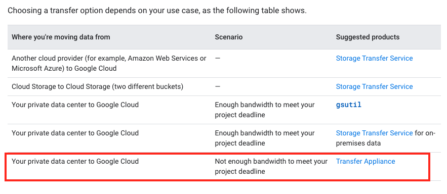

# Test 1-2

**Question 101**

- B. Lease a Transfer Appliance, upload archived files to it, and send it to Google to transfer archived data to Cloud Storage. Establish a connection with Google using a Dedicated Interconnect or Direct Peering connection and use it to upload files daily. 92%
- Agree B. 100Mbps connections for 10TB data transfer is takes too long. wk
- you can not use gsutil to load 10TB daily >>>and then continue loading 10 TB of data daily<<< it will take longer than 24hrs to upload using gsutil. zr79

- Explanation
  Dedicated interconnect will provide a private network with 10gbs. The internet limited to 100 mb is not possible to use cloud VPN ( it will use public internet so be limited for the daily)

<hr />

**Question 102**

- B. Cloud Pub/Sub to Cloud Dataflow. 62%
- I believe the answer is B. "Pub/Sub doesn't provide guarantees about the order of message delivery. Strict message ordering can be achieved with buffering, often using Dataflow." https://cloud.google.com/solutions/data-lifecycle-cloud-platform

<hr />

**Question 103**

- C. 1. Perform an assessment of virtual machines running in the current VMware environment. 2. Define a migration plan, prepare a Migrate for Compute Engine migration RunBook, and execute the migration. 95%
- Migrate for Compute Engine organizes groups of VMs into Waves. After understanding the dependencies of your applications, create runbooks that contain groups of VMs and begin your migration!
- https://cloud.google.com/migrate/compute-engine/docs/4.5/how-to/migrate-on-premises-to-gcp/overview

- https://cloud.google.com/migrate/compute-engine/docs/4.5/reference/runbooks

- https://cloud.google.com/migrate/compute-engine/docs/4.5/how-to/organizing-migrations/creating-and-modifying-runbooks

<hr />

**Question 104**

- D. Use an unmanaged instance group with an active and standby instance in different zones, use a regional persistent disk, and use a network load balancer in front of the instances.
- Correct Ans : D
  Since the Traffic is TCP, Ans A & C gets eliminated as HTTPS load balance is not supported.
  - B - File storage system is Cloud Firestore which do not give full control, hence eliminated.
  - D - Unmanaged instance group with network load balance with regional persistent disk for storage gives full control which is required for the migration.

<hr />

**Question 105**

- D. Configure a Cloud Dedicated Interconnect connection between the on-premises environment and Google Cloud. 100%
- Ans D , Reason : high throughput via internal IPs

<hr />

**Question 106**

- A. Deploy a new revision to Cloud Run with the new version. Configure traffic percentage between revisions. 75%
- https://cloud.google.com/run/docs/resource-model
- VishalB, omermaH

<hr />

**Question 107**

- A. Navigate the predefined dashboards in the Cloud Monitoring workspace, and then add metrics and create alert policies. 58%, kopper2019
- It's A for me... Create a dashboard for each incident?? I think D isn't a good choice...DiegoMDZ

<hr />

**Question 108**

- C. Binary logging, D. Automated backups. 70%
- https://cloud.google.com/sql/docs/mysql/replication#requirements
- Automated backups must be enabled.
- Binary logging must be enabled which requires point-in-time recovery to be enabled. Learn more about the impact of these logs.

<hr />

**Question 109**

- B. When ingesting new data in BigQuery, run the data through the Data Loss Prevention (DLP) API to identify any personal information. As part of the DLP scan, save the result to Data Catalog. Upon a deletion request, query Data Catalog to find the column with personal information. 47%
- B. We do not need to delete entire recrod of sports person but some health information collected by association. B would be correct answer. Aditya G

<hr />

**Question 110**

- A. App Engine
- By process of elimination you arrive at App Engine or GKE. Now the requirement is to "to minimize the operational overhead of the solution". 89%
  On the IaaS to PaaS spectrum, this can only be App Engine!
- IaaS = Compute Engine.
- Hybrid = GKE (engineering heavy).
- PaaS = App Engine.

<hr />

**Question 111**

- B. Use Cloud Scheduler to trigger a Cloud Function that will stop the development and acceptance environments after office hours and start them just before office hours. 89%
- https://cloud.google.com/compute/docs/instances/viewing-and-applying-idle-vm-recommendations

  > B seems close to this Google provided service option, the extra step should be using idle VM recommendations to find and stop idle VM instances to reduce waste of resources. MaryMei

- Since the price of preemptibles is 1/4 the price of a standard machine D costs far less than B since office hours are 1/3 of whole day. It costs less to keep them running 24h as preemptibles. PAUGURU

<hr />

**Question 112**

- C. 1. Set up Cloud VPN to provide private network connectivity between the Compute Engine application and the on-premises MySQL server. 2. Stop the on-premises application. 3. Start the Compute Engine application, configured to read and write to the on-premises MySQL server. 4. Create the replication configuration in Cloud SQL. 5. Configure the source database server to accept connections from the Cloud SQL replica. 6. Finalize the Cloud SQL replica configuration. 7. When replication has been completed, stop the Compute Engine application. 8. Promote the Cloud SQL replica to a standalone instance. 9. Restart the Compute Engine application, configured to read and write to the Cloud SQL standalone instance.100%

<hr />

**Question 113**

- D. Set an Organization Policy with a constraint on constraints/compute.vmExternalIpAccess. List the approved instances in the allowedValues list. 100%

<hr />

**Question 114**

- B. Enable Firewall Rules Logging for the firewall rules you want to monitor.
- when you create a firewall rule there is an option for firewall rule logging on/off. It is set to off by default. 100%
  To get firewall insights or view the logs for a specific firewall rule you need to enable logging while creating the rule or you can enable it by editing that rule.
- https://cloud.google.com/network-intelligence-center/docs/firewall-insights/how-to/view-understand-insights#enabling-fw-rules-logging
- https://cloud.google.com/firewall/docs/firewall-rules-logging

<hr />

**Question 115**

- A. 1. Create a VPC Service Controls perimeter that includes the projects with the buckets. 2. Create an access level with the CIDR of the office network. 100%
- For all Google Cloud services secured with VPC Service Controls, you can ensure that:
  Resources within a perimeter are accessed only from clients within authorized VPC networks using Private Google Access with either Google Cloud or on-premises.
- https://cloud.google.com/vpc-service-controls/docs/overview

<hr />

**Question 116**

- D. Start a new rolling update. Select the Opportunistic update mode.
- https://cloud.google.com/compute/docs/instance-groups/rolling-out-updates-to-managed-instance-groups
- The key here is "you don't want to update any running instances". Only opportunistic support this.
- MIGs, template, Automatic==proactive, Selective=opportunistic

<hr />

**Question 117**

- B. Configure the Compute Engine instances with an instance template for the application, and use a regional persistent disk for the application data. Whenever a zonal outage occurs, use the instance template to spin up the application in another zone in the same region. Use the regional persistent disk for the application data. 100%
- Answer is B, it only request zonal resiliency.
  Regional persistent disk is a storage option that provides synchronous replication of data between two zones in a region. Regional persistent disks can be a good building block to use when you implement HA services in Compute Engine. TotoroC
- https://cloud.google.com/compute/docs/disks/high-availability-regional-persistent-disk

<hr />

**Question 118**

- A. Create a Cloud VPN connection from the new VPC to the data center, create a Cloud Router, and apply new IP addresses so there is no overlapping IP space. 68%
- The correct answer is A, not sure why some here are confused with C... Cloud NAT won't serve this purpose, you can read the documentation here: https://cloud.google.com/nat/docs/troubleshooting#overlapping-ip-addresses, jaxclain

- Can I use Cloud NAT to connect a VPC network to another network to work around overlapping IP addresses?
- No, Cloud NAT cannot apply to any custom route whose next hop is not the default internet gateway. For example, Cloud NAT cannot apply to traffic sent to a next hop Cloud VPN tunnel, even if the destination is a publicly routable IP address.

<hr />

**Question 119**

- A. Create a Dataproc cluster using standard worker instances. Most Voted
- Voting A as preemptible workload should only be used with preemptive task. BigfootPanda -https://cloud.google.com/architecture/hadoop/hadoop-gcp-migration-jobs#using_preemptible_worker_nodes

<hr />

**Question 120**

- B. Add two additional NICs to Instance #1 with the following configuration: ג€¢ NIC1 ג—‹ VPC: VPC #2 ג—‹ SUBNETWORK: subnet #2 ג€¢ NIC2 ג—‹ VPC: VPC #3 ג—‹ SUBNETWORK: subnet #3 Update firewall rules to enable traffic between instances. 69%, MamthaSJ
- https://cloud.google.com/vpc/docs/create-use-multiple-interfaces
- According to my understanding the requirement is that only VM1 shall be able to communicate with VM2 and VM3, but not VM2 with VM3.
- We can exclude d) as d) would enable VM2 to communicate with VM3 as well
- We can exclude c) as well - there is no connection between VPC1 and VPC3.
  IMHO a) will not work.
- So the only correct answer seems to be b)


<hr />

**Question 121**

- B. Create a Debian-based Compute Engine instance, install and configure the application, and use OS patch management to install available updates. 91%, MamthaSJ
- https://cloud.google.com/compute/docs/os-patch-management
- https://cloud.google.com/compute/docs/os-patch-management/create-patch-job#run-patch-job
- Use the os-config patch-jobs execute command to run a patch job.

```
gcloud compute os-config patch-jobs execute \
  --instance-filter-names="zones/us-east1-b/instances/instance-1" \
  --description "patch for instance-1"
```

<hr />

**Question 122**

- A. 1. Update your GKE cluster to use Cloud Operations for GKE. 2. Use the GKE Monitoring dashboard to investigate logs from affected Pods. 72%, TorontoC
- https://cloud.google.com/blog/products/management-tools/using-logging-your-apps-running-kubernetes-engine
- If you have an existing cluster with Cloud Logging and Monitoring disabled, you can still enable logging and monitoring for the cluster.
- https://cloud.google.com/kubernetes-engine/docs/how-to/config-logging-monitoring#migrating

- gcloud container clusters update command's --logging flag.

  ```
  gcloud container clusters update CLUSTER_NAME \
    --region=REGION \
    --logging=NONE | SYSTEM | SYSTEM,WORKLOAD
  ```

- gcloud container clusters update command's --monitoring flag.

  ```
  gcloud container clusters update CLUSTER_NAME \
    --region=REGION \
    --monitoring=NONE | SYSTEM
  ```

<hr />

**Question 123**

- C. Create a Cloud Filestore instance and mount it in each instance.
- https://cloud.google.com/storage/docs/gcs-fuse#notes

| Service       | Filesystem |
| ------------- | ---------- |
| Cloud Storage | FUSE       |
| Filestore     | POSIX      |
|               | NFS< CIFS> |

<hr />

**Question 124**

- A. Use the Service Mesh visualization in the Cloud Console to inspect the telemetry between the microservices.
- https://cloud.google.com/service-mesh/docs/observability/explore-dashboard
- Anthos Service Mesh Visualization
- https://cloud.google.com/service-mesh/docs/observability-overview
- Anthos Service Mesh provides observability into the health and performance of your services. To obtain **telemetry data**, Anthos Service Mesh relies on sidecar proxies that you inject as a separate container into the same pods as your workloads.

<hr />

**Question 125**

- A. Create a retention policy on the bucket for the duration of 5 years. Create a lock on the retention policy. 100% -https://cloud.google.com/storage/docs/bucket-lock#retention-policy

<hr />

**Question 126**

- C. Create a Cloud Build trigger based on the development branch that tests the code, builds the container, and stores it in Container Registry. Create a deployment pipeline that watches for new images and deploys the new image on the development cluster. Ensure only the deployment tool has access to deploy new versions. 100%

- To automate the build and deployment process for your microservices in the development environment, you can use Cloud Build to set up a trigger that listens for code pushes to the development branch on your GitHub repository. When a code change is pushed to the branch, Cloud Build can test the code, build the container image, and store it in Container Registry. You can then create a deployment pipeline that watches for new images in Container Registry and deploys them automatically on the development cluster. To ensure that only code that has been properly tested and built is deployed in the development environment, you should ensure that only the deployment tool has access to deploy new versions.

- Option D is incorrect because relying on Vulnerability Scanning alone is not sufficient to ensure that the code changes are properly tested and built before being deployed in the development environment.

<hr />

**Question 127**

- D. Increase the maximum number of instances in the autoscaling group. 84%, MarthaSJ
- it says "autoscaling has reached the upper limit of instances" and there are no abnormal errors... so the upper limit for autoscaling has to be increased.

<hr />

**Question 128**

- B. Cloud Run and Cloud Bigtable, MamthaSJ
- Any correct answer must involve Cloud Bigtable over BigQuery since Bigtable is optimized for heavy write loads

**Compute:**

- Cloud Run vs. Compute Engine autoscaling managed instance group
- Cloud Run wins because can scale down up to 0 instances -> in Spike workflows will be cheaper.

**Storage:**

- BigQuery vs. Big Table.
- 500,000 requests per second it’s not suitable in BQ:
- https://cloud.google.com/bigquery/quotas
- “A user can make up to 100 API requests per second to an API method”
  

<hr />

**Question 129**

- A. Deploy each microservice as a Deployment. Expose the Deployment in the cluster using a Service, and use the Service DNS name to address it from other microservices within the cluster. MathamSJ

**Benefit of using Service**

- Leveraging service allows for you to set up your environment with static IP addresses. So when your pods die and restart the IP address associated with the deceased pod remains
  for the new pod that replaces it (ephemeral). I think using "Service" is helpful if you are setting up your pods to be able to communicate with specific pods in the cluster.

**Benefit of using DNS for Service**

- Using DNS for your Service (static IP) you can look up Services and/or Pods by name instead of IP. Addressability by name instead of IP is easier for me.

<hr />

**Question 130**

- C (58%, ME), B (42%)
- C. 1. Create a project with a Shared VPC and assign the Network Admin role to the networking team. 2. Create a second project without a VPC, configure it as a Shared VPC service project, and assign the Compute Admin role to the development team. 57%

- https://cloud.google.com/vpc/docs/shared-vpc

- When you use Shared VPC, you designate a project as a host project and attach one or more other service projects to it. The VPC networks in the host project are called Shared VPC networks. Eligible resources from service projects can use subnets in the Shared VPC network.

- **Shared VPC lets organization administrators delegate administrative responsibilities**, such as creating and managing instances, to Service Project Admins while maintaining centralized control over network resources like subnets, routes, and firewalls.

<hr />

**Question 131**

- D. Store static content such as HTML and images in a Cloud Storage bucket. Use Cloud Functions to host the APIs and save the user data in Firestore. 61%
- Cloud Storage buckets are a good choice for static web content. Cloud storage buckets behave like a CDN Network:
- https://cloud.google.com/storage/docs/caching

<hr />

**Question 132**

- C. Export logs to a Pub/Sub topic, and trigger Cloud Function with the relevant log events. 100%
- https://cloud.google.com/blog/products/management-tools/automate-your-response-to-a-cloud-logging-event

**Question 133**

- C. Configure Identity-Aware Proxy (IAP) for the instance and ensure that you have the role of IAP-secured Tunnel User. Use the gcloud command line tool to ssh into the instance. 70%
- https://cloud.google.com/iap/docs/using-tcp-forwarding
- This page explains how you can use Identity-Aware Proxy (IAP) TCP forwarding to enable administrative access to VM instances that do not have external IP addresses or do not permit direct access over the internet.

<hr />

**Question 134**

- C. Assign the development team group the Project Owner role on the Shopping folder, and remove the development team group Project Owner role from the Organization. 89%
- two folders Finance and Shopping
- C seems right, you have to remove the role from organization level

<hr />

**Question 135**

- B. Use Istio's fault injection on the particular microservice whose faulty behavior you want to simulate. 85%
- GKE
- Istio fault injection :https://istiobyexample.dev/fault-injection/
- B is the right answer - reference - https://istio.io/latest/docs/tasks/traffic-management/fault-injection/

<hr />

**Question 136**

- A. App Engine 100%
- App Engine is right choice, Developer can focus on developing code rather than worry about infrastructure. A is right
- The users are global but doesn't mean that app can't be regional. A is the correct answer it seems.

<hr />

**Question 137**

- C. Use a versioning strategy for the APIs that increases the version number on every backward-incompatible change. 100%
- You are responsible for the API lifecycle and
- https://cloud.google.com/apis/design/versioning

<hr />

**Question 138**

- C. The new approach will make it easier to decouple infrastructure from application, develop and release new features, manage the underlying infrastructure, manage CI/CD pipelines and perform A/B testing, and scale the solution if necessary. 88%
- C clearly states all of the benefits, C is right.
- C is better: Management like to understand business benefit in simple language. They don't bother about the technology

<hr />

**Question 139**

- A. Use a load testing tool to simulate the expected number of concurrent users and total requests to your application, and inspect the results. 84%
- A or C - not sure
- GKE

<hr />

**Question 140**

- (84%)D. Configure a Kubernetes autoscaling deployment based on the subscription/num_undelivered_messages metric.
- https://cloud.google.com/kubernetes-engine/docs/tutorials/autoscaling-metrics#pubsubhere
- Scale based on the number of unacknowledged messages remaining in a Pub/Sub subscription

- https://cloud.google.com/kubernetes-engine/docs/tutorials/autoscaling-metrics#pubsub
- This tutorial demonstrates how to automatically scale your Google Kubernetes Engine (GKE) workloads based on metrics available in Cloud Monitoring.

```
apiVersion: autoscaling/v2beta2
kind: HorizontalPodAutoscaler
metadata:
  name: pubsub
spec:
  minReplicas: 1
  maxReplicas: 5
  metrics:
  - external:
      metric:
       name: pubsub.googleapis.com|subscription|num_undelivered_messages
       selector:
         matchLabels:
           resource.labels.subscription_id: echo-read
      target:
        type: AverageValue
        averageValue: 2
    type: External
  scaleTargetRef:
    apiVersion: apps/v1
    kind: Deployment
    name: pubsub
```

<hr />

**Question 141**

- (100%)C. Make the container tag match the source code commit hash.
- https://cloud.google.com/architecture/best-practices-for-building-containers#tagging_using_the_git_commit_hash
- If you have an advanced continuous delivery system and you release your software often, you probably don't use version numbers as described in the Semantic Versioning Specification. In this case, a common way of handling version numbers is to use the Git commit SHA-1 hash

<hr />

**Question 142**

- B. Develop the application for App Engine standard environment. (100%)
- https://cloud.google.com/appengine/docs/the-appengine-environments
- Go 1.12, and can handle sudden spikes.

<hr />

**Question 143**

- D. Store the data in a Cloud Storage bucket. Design the processing pipelines to retrieve the data from the bucket. Most Voted
- https://cloud.google.com/architecture/big-data-analytics/analytics-lakehouse

<hr />

**Question 144**

- B. Create a Google Group per department and add all department members to their respective groups. Create a folder per department and grant the respective group the required IAM permissions at the folder level. Add the projects under the respective folders.(100%)
- https://cloud.google.com/resource-manager/docs/access-control-folders#best-practices-folders-iam

<hr />

**Question 145**

- C. Configure binary authorization policies for the development, staging, and production clusters. Create attestations as part of the continuous integration pipeline.(100%)
- https://cloud.google.com/binary-authorization/docs/overview#policy_model

<hr />

**Question 146**

- B. Use the Data Transfer appliance to perform an offline migration. Most Voted
- https://cloud.google.com/architecture/migration-to-google-cloud-transferring-your-large-datasets

- B because anything above 1TB, Google recommends Data Transfer appliance
  not D because, although the Time to transfer using 1Gbps is around 30 hours, the option is not uploading the content straight away, "Compress the data and upload" - compression of 10TB will take time, again, we must decompress the data before it is usable - again a time consuming process!!

<blockquote>

Answer would be Storage Transfer Service

- A: not suitable for 10 TB load.
- B: It will take around 3 weeks but feasible.
- C: not suitable for 10 TB load.
- D: storage object uploads are limited to 5TiB https://cloud.google.com/storage/quotas. not feasible.

</blockquote>



<hr />

**Question 147**

- C. 1. Attach a regional SSD persistent disk to the first instance. 2. In case of a zone outage, force-attach the disk to the other instance.
- https://cloud.google.com/compute/docs/disks/repd-failover#zonal_failures

<hr />

**Question 148**

- D. Import a key in Cloud KMS. Create a dataset in BigQuery using the customer-supplied key option and select the created key. (70%)
- The answer is easy. It says keys must be left outside of Google Cloud.
  This automatically eliminates A / B.
  Now the C option says decrypts before storing it in BigQuery which the point is to encrypt the data while been in BigQuery, D is the only possible answer.
- If you want to control encryption yourself, you can use customer-managed encryption keys (CMEK) for BigQuery. https://cloud.google.com/bigquery/docs/customer-managed-encryption

<hr />

**Question 149**

- B. Create a key with Cloud Key Management Service (KMS). Set the encryption key on the bucket to the Cloud KMS key. (83%)
- https://cloud.google.com/storage/docs/encryption/customer-managed-keys#key-replacement
- "Your company must be able to rotate the encryption key" is the requirement which eliminates CMEK and why you need a CSEK. You have to use a boto config file to do this and is part of one of the labs.(Ric350)

<hr />

**Question 150**

- A. Configure the GKE cluster as a private cluster, and configure Cloud NAT Gateway for the cluster subnet. (100%)
- https://cloud.google.com/kubernetes-engine/docs/how-to/private-clusters#workloads_on_private_clusters_unable_to_access_internet

<hr />

**Question 151**

- D. Configure serverless VPC access. 91%
- https://cloud.google.com/vpc/docs/serverless-vpc-access#use_cases
- Your serverless environment needs to access data from your on-premises database through Cloud VPN.
- D. Configuring serverless VPC access App Engine can connect to the VPC and then through VPN tunnel to the on-prem DB

<hr />

**Question 152**

- D. 1. Use gsutil -m to upload the files to Cloud Storage. 2. Use gsutil hash -c FILE_NAME to generate CRC32C hashes of all on-premises files. 3. Use gsutil ls -L gs://[YOUR_BUCKET_NAME] to collect CRC32C hashes of the uploaded files. 4. Compare the hashes. 95%
- https://cloud.google.com/storage/docs/gsutil/commands/hash
- Calculate hashes on local files, which can be used to compare with gsutil ls -L output.

```
gsutil hash [-c] [-h] [-m] filename.
///[-c] - Calculate a CRC32c hash for the specified files.
```

<hr />

**Question 153**

- A. Install Anthos Service Mesh on your cluster. Use the Google Cloud Console to define a Service Level Objective (SLO), and create an alerting policy based on this SLO.
- https://cloud.google.com/service-mesh/docs/observability/slo-overview
- Service Level Objectives (SLOs) are a core tool in the Google service monitoring toolkit.
- **Anthos Service Mesh** lets you set SLOs for your services, and monitor and alert on your services in terms of those SLOs

<hr />

**Question 154**

- C. Create a second GKE cluster in asia-southeast1, and use kubemci to create a global HTTP(s) load balancer.

- we are introducing a new command-line interface (CLI) tool called **kubemci** to automatically configure ingress using Google Cloud Load Balancer (GCLB) for multi-cluster Kubernetes Engine environments.

```
$ kubemci create my-mci --ingress=ingress.yaml \
    --kubeconfig=cluster_list.yaml
```

<hr />

**Question 155**

- D. Create a Compute Engine instance with CPU and memory options similar to your application's current on-premises virtual machine. Install the Cloud Monitoring agent, and deploy the third-party application. Run a load test with normal traffic levels on the application, and follow the Rightsizing Recommendations in the Cloud Console. Most Voted

- https://cloud.google.com/migrate/compute-engine/docs/4.9/concepts/planning-a-migration/cloud-instance-rightsizing?hl=en
- Recommends Compute Engine instances based on the CPU and RAM currently allocated to the on-premises VM.

<hr />

**Question 156**

- C. Configure VPC Service Controls and configure Private Google Access. 100%
- https://cloud.google.com/vpc-service-controls/docs/overview

<hr />

**Question 157**

- D. Use node affinity labels based on the node name when creating Compute Engine instances in order to host each workload on the correct node.
- https://cloud.google.com/compute/docs/nodes/sole-tenant-nodes#default_affinity_labels
- D. Afinity should be set at node level, not node-group as every client has its own node in the group


<hr />

**Question 158**

- B. Google Compute Engine managed instance groups with auto-scaling. 100%

<hr />

**Question 159**

- C. Meet with the cloud operations team and the engineer to discuss load balancer options Most Voted

- WebSocket is a computer communications protocol, providing simultaneous two-way communication channels over a single Transmission Control Protocol (TCP) connection.
- https://en.wikipedia.org/wiki/WebSocket#:~:text=The%20WebSocket%20protocol%20enables%20full,from%20and%20to%20the%20server.
- https://cloud.google.com/load-balancing/docs/https#websocket_support
- Google Cloud HTTP(S)-based load balancers have native support for the WebSocket protocol.

<hr />

**Question 160**

- D. 1. Append metadata to file body 2. Compress individual files 3. Name files with a random prefix pattern 4. Save files to one bucket
- https://cloud.google.com/storage/docs/request-rate#naming-convention

> A longer randomized prefix provides more effective auto-scaling when ramping to very high read and write rates. For example,

```
my-bucket/2fa764-2016-05-10-12-00-00/file1
my-bucket/5ca42c-2016-05-10-12-00-00/file2
my-bucket/6e9b84-2016-05-10-12-00-01/file3
```

<hr />

**Question 161**

- correct
- C - In the Logging section of the console, specify GCE Network as the logging section. Search for the Create Insert entry
- In Logs Explorer , Filter "resource.type="gce_firewall_rule" and Query insert Create

```
You would see below and email address
"methodName": "v1.compute.firewalls.insert",
"authorizationInfo": [
{
"permission": "compute.firewalls.create",
```

- GCE, network origin, SSH (firewall rule)

<hr />

**Question 162**

- D. Create a snapshot of the root disk, create an image file in Google Cloud Storage from the snapshot, and create a new virtual machine instance in the US-East region using the image file the root disk. 67%, tartar
- in a different project in the US-East region.
- https://cloud.google.com/compute/docs/instances/copy-vm-between-projects
  > you have to create Image from Snapshot and share it to the destination project. Prakzz
- But this is not the case here, we have:
  Different zones and different project hence, you must use a bucket.

<hr />

**Question 163**

- B. Mount a Local SSD volume as the backup location. After the backup is complete, use gsutil to move the backup to Google Cloud Storage.
- Option B is the most appropriate solution in this case. Mounting a Local SSD volume as the backup location will allow the backups to be taken quickly and efficiently, as Local SSDs have very high I/O performance and low latencies. Additionally, using gsutil to move the backups to Google Cloud Storage after they have been taken will provide a secure and durable storage location for the backups. omermaH

- A, configuring a cron job to use the gcloud tool to take regular backups using persistent disk snapshots, may not be the most efficient option because persistent disks have relatively lower I/O performance compared to Local SSDs.

- C, using gcsfuse to mount a Google Cloud Storage bucket as a volume directly on the instance and writing the backups to the mounted location using mysqldump, may not be the most efficient option because the backups would need to be transferred over the network, which could impact the performance of the backups.

- D, mounting additional persistent disk volumes onto each VM instance in a RAID10 array and using LVM to create snapshots to send to Cloud Storage, may not be the most efficient option because it would require additional disk space and setup, and LVM snapshots may not be as fast as Local SSDs for taking backups.

<hr />

**Question 164**

- ABF 56%
- ADF, omermaH
- A. Ensure that the load tests validate the performance of Cloud Bigtable
- B. Create a separate Google Cloud project to use for the load-testing environment
- F. Instrument the load-testing tool and the target services with detailed logging and metrics collection
- after reading link: https://cloud.google.com/bigtable/docs/performance, rishab86
  > A:Run your typical workloads against Bigtable :Always run your own typical workloads against a Bigtable cluster when doing capacity planning, so you can figure out the best resource allocation for your applications.
  > B. Create a separate Google Cloud project to use for the load-testing environment
  > F : The most important/standard factor of testing, you gather logs and metrics in TEST environment for further scaling.

<hr />

**Question 165**

- B. Org viewer, project viewer 100%
- A is not correct because Project owner is too broad. The security team does not need to be able to make changes to projects.
- B is correct because:-Org viewer grants the security team permissions to view the organization's display name.
  - Project viewer grants the security team permissions to see the resources within projects.
- C is not correct because Org admin is too broad. The security team does not need to be able to make changes to the organization.
- D is not correct because Project owner is too broad. The security team does not need to be able to make changes to projects.

<hr />

**Question 166**

- BE 45% omermaH, DE 37%
- B. Use source code security analyzers as part of the CI/CD pipeline Most Vot
- E. Run a vulnerability security scanner as part of your continuous-integration /continuous-delivery (CI/CD) pipeline
- D. Enable code signing and a trusted binary repository integrated with your CI/CD pipeline Most Voted
- BE - For me, Option D, enabling code signing and a trusted binary repository integrated with your CI/CD pipeline. It's to ensure that the correct code is put in production but not link to security errors.

<hr />

**Question 167**

- C. Update the existing Kubernetes Engine cluster with the following command: gcloud alpha container clusters update mycluster - -enable- autoscaling - -min-nodes=1 - -max-nodes=10. 100%
- To enable autoscaling for an existing node pool, run the following command: tartar

```
gcloud container clusters update cluster-name --enable-autoscaling \
--min-nodes 1 --max-nodes 10 --zone compute-zone --node-pool default-pool
```

- https://cloud.google.com/kubernetes-engine/docs/how-to/cluster-autoscaler

<hr />

**Question 168**

- AC 100%
- A. Use Google App Engine to serve the website and Google Cloud Datastore to store user data.
- C. Use a managed instance group to serve the website and Google Cloud Bigtable to store user data. Most Voted
- by omermeH below.
- A: Google App Engine is a fully managed platform for building and running web applications and APIs. It can automatically scale to meet high traffic demands, making it a good choice for serving the website for the promotional email campaign. Google Cloud Datastore can also scale automatically to meet high traffic demands, making it a good choice for storing user data.

- C: A managed instance group are managed as a single entity and can automatically scale up or down based on demand. This makes it a good choice for serving the website for the promotional email campaign. Google Cloud Bigtable is a fully managed, high-performance NoSQL database that can store and serve large amounts of structured data with low latency. It is designed to scale horizontally and can handle high traffic demands, making it a good choice for storing user data.

<hr />

**Question 169**

- BC 65%
- B. Google Kubernetes Engine with containers
- C. Google App Engine Standard Environment
- No ops = Serverless / Almost Serverless, less operational management overhead.
- Kubernetes and App Engine are the only one that gives us that flexibility, plus is modernizing apps.alexanderC

<hr />

**Question 170**

- C. Digitally sign each timestamp and log entry and store the signature. 100%
- by omermaH
  > I would recommend option C, digitally signing each timestamp and log entry and storing the signature. Digitally signing a log entry involves creating a cryptographic hash of the log entry and a timestamp, and then encrypting the hash using a private key. The encrypted hash, known as the signature, can be stored along with the log entry in a secure manner. To verify the authenticity of the log entry, you can use the public key associated with the private key used to create the signature to decrypt the signature and recreate the hash. If the recreated hash matches the original hash, it indicates that the log entry has not been tampered with and is authentic.

<hr />

**Question 171**

- C. 1. Create folders under the Organization resource named ג€Developmentג€ and ג€Production.ג€ 2. Grant all developers the Project Creator IAM role on the ג€Developmentג€ folder. 3. Move the developer projects into the ג€Developmentג€ folder. 4. Set the policies for all projects on the Organization. 5. Additionally, set the production policies on the ג€Productionג€ folder. omermaH

- I would recommend option C, creating two folders under the Organization resource named "Development" and "Production" and placing developer and production projects in the respective folders. This approach would allow you to centrally manage policies for all projects, while also being able to set more restrictive policies for production projects. It would also allow you to easily move projects between the Development and Production folders as business needs change, without disrupting users or developers.

<hr />

**Question 172**

- D. 1. Create a managed instance group with Compute Engine instances. 2. Create a global load balancer and configure it with two backends: ג—‹ Managed instance group ג—‹ Cloud Storage bucket 3. Enable Cloud CDN on the bucket backend. 97%

- I would recommend option D, creating a managed instance group with Compute Engine instances and a global load balancer with two backends: the managed instance group and the Cloud Storage bucket, and enabling Cloud CDN on the bucket backend. This approach would allow you to scale the number of instances in the managed instance group as needed to handle the demand for the application, and would also use the Cloud CDN to improve the performance of the application by caching the music files closer to the users. omermaH

<hr />

**Question 173**

- A. Set up a filter in Cloud Logging and a Cloud Storage bucket as an export target for the logs you want to save. 100%

<hr />

**Question 174**

- A. Create a Dataflow pipeline to retrieve the data from the external sources. As part of the pipeline, use the Cloud Data Loss Prevention (Cloud DLP) API to remove any PII data. Store the result in BigQuery. 74%
- I would recommend option A, creating a Dataflow pipeline to retrieve the data from the external sources and using the Cloud Data Loss Prevention (Cloud DLP) API to remove any PII data. Storing the result in BigQuery would allow the data warehousing team to easily perform analysis on the data. omermaH

<hr />

**Question 175**

- A. Create an aggregated export on the Production folder. Set the log sink to be a Cloud Storage bucket in an operations project.

- Option B is not the correct solution because it creates an aggregated export on the Organization resource, which will capture logs from all projects in the Organization, including those outside the Production folder. omermaH

- Option A is the correct solution because it allows you to create an aggregated export on the Production folder, which will capture logs from all the production projects contained in the folder. Setting the log sink to a Cloud Storage bucket in an operations project will allow the operations team to store the logs in a central location. omermaH

<hr />

**Question 176**

- A. 1. Install a Cloud Logging agent on all instances. 2. Create a sink to export logs into a regional Cloud Storage bucket. 3. Create an Object Lifecycle rule to move files into a Coldline Cloud Storage bucket after one month. 4. Configure a retention policy at the bucket level using bucket lock. 97%
- This approach would allow you to use Cloud Logging to collect and export the logs from the Compute Engine instances into a Cloud Storage bucket. You can then use an Object Lifecycle rule to automatically move the logs from the regional bucket to a Coldline bucket after one month, which will reduce storage costs for logs that are not actively being queried. By configuring a retention policy using bucket lock, you can ensure that the logs are retained for at least two years for audit purposes. This approach follows Google-recommended practices for storing logs and minimizing costs. omermaH

<hr />

**Question 177**

- A. Configure an organization policy to restrict identities by domain. 100%
- https://cloud.google.com/resource-manager/docs/organization-policy/restricting-domains

<hr />

**Question 178**

- C. Review your RowKey strategy and ensure that keys are evenly spread across the alphabet. 100%, omermaH
- https://cloud.google.com/bigtable/docs/schema-design#row-keys

<hr />

**Question 179**

- C. 1. Create a dataset for the data science team. 2. Create views of tables that you want to share, excluding PII. 3. Assign an appropriate project-level IAM role to the members of the data science team. 4. Assign access controls to the dataset that contains the view. 5. Authorize the view to access the source dataset. 57%

- C is correct here. You need view to avoid PII data. So materialized view is not needed.
- C: view in a different dataset (https://cloud.google.com/bigquery/docs/share-access-views: "Authorized views should be created in a different dataset from the source data. That way, data owners can give users access to the authorized view without simultaneously granting access to the underlying data.") someone2011

<hr />

**Question 180**

- B. Use the Storage Transfer Service to move the data.
- https://cloud.google.com/architecture/migration-to-google-cloud-transferring-your-large-datasets#transfer-options

<hr />

**Question 181**

- C. Set up a Cloud Monitoring sink that triggers the Cloud Function after an instance removal log message arrives in Cloud Logging. 83%, omermaH
- Actually C is correct but Wrong also in a way .. Sink cannot trigger a cloud function directly. It need Pub/Sub which then will trigger Cloud Function. Tesla

<hr />

**Question 182**

- A. Use Google Cloud Shell in the Google Cloud Console to interact with Google Cloud. 100%
- https://cloud.google.com/sdk/gcloud

<hr />

**Question 183**

- C. Set up a Cloud VPN gateway in each Shared VPC and peer Cloud VPNs. 79%, omermaH
- https://cloud.google.com/architecture/best-practices-vpc-design#shared-service

<hr />

**Question 184**

- A. Inspect the logs and metrics from the instances in Cloud Logging and Cloud Monitoring. 100%, omermaH
- When an application becomes slow, the first step you should take is to gather information about the underlying cause of the problem. One way to do this is by inspecting the logs and metrics from the instances where the application is deployed. Google Cloud Platform (GCP) provides tools such as Cloud Logging and Cloud Monitoring that can help you to collect and analyze this information. omermaH

<hr />

**Question 185**

- A. Configure liveness and readiness probes in the Pod specification.

- A: Configuring the right liveness and readiness probes prevents outages when rolling out a new ReplicaSet of a Deployment, because Pods are only getting traffic when they are considered ready.
- B: With GKE, you do not deal with MIGs.
- C: Does not use GKE tools and is therefore not the best option.
- D: Does alert you but does not prevent the outage.
- https://www.youtube.com/watch?v=mxEvAPQRwhw

<hr />

**Question 186**

- C. Configure a HorizontalPodAutoscaler for all stateless workloads and for all compatible stateful workloads. Configure the cluster to use node auto scaling. 100%
- Answer C. Use HorizontalPodAutoscaler.

<hr />

**Question 187**

- B 73%, D 23% omermaH
- D. 1. Activate billing export into BigQuery. 2. Perform a BigQuery query on the billing table to extract the information you need. 23%, omermaH

<blockquote>

- Go to the Billing page of your Google Cloud project.
- In the top left and select "billing Export."
- Follow the prompts to enable billing export and specify the BigQuery dataset and table where you want the data to be exported.
- Perform a BigQuery query on the billing table: Once you have enabled billing export and the data has started flowing into the specified BigQuery table, you can run a query on the table to extract the information you need. For example, you could use a query like the following to get the total cost of queries split by user:

```
SELECT user, SUM(cost) as total_cost
FROM `your-project.your-dataset.billing_export`
GROUP BY user
ORDER BY total_cost DESC
```

</blockquote>

<hr />

**Question 188**

- A. Set up a network peering between vpc-a and vpc-b. 100%
- https://cloud.google.com/vpc/docs/vpc-peering
  > Google Cloud VPC Network Peering allows internal IP address connectivity across two Virtual Private Cloud (VPC) networks regardless of whether they belong to the same project or the same organization.

<hr />

**Question 189**

- B. Object Versioning. 100%
- https://cloud.google.com/storage/docs/object-versioning

<hr />

**Question 190**

- D. Change the filter to metric.label.state = 'free' and the Target utilization to 20. 16%, omermaH
- free is an available state filter for the percent_used metric. MortaW
- https://cloud.google.com/compute/docs/autoscaler/scaling-cloud-monitoring-metrics#autoscale_based_on_memory_usage

<blockquote>
[AMEJack]We have to think in different way.

- Option A: TARGET_TYPE: the autoscaler calculates the average rate of growth per minute and compares that to the utilization target.
  This will not fit question requirments, only the memory utilization growth will be compared with the target value.
- Option C: Adding all the memory cached, buffer, used and free will always be constant. So, this will also not fit the question requirements.
- Option D: I want the "free" memory utilization will be around 20. This will solve the problem.

</blockquote>

<hr />

**Question 191**

- A. An HA Cloud VPN gateway connected with two tunnels to an on-premises VPN gateway. 81%
- A can provide 99.99% availability as well, and no need for C which will be more expensive. alexandE
- https://cloud.google.com/network-connectivity/docs/vpn/concepts/topologies#1-peer-1-address

<hr />

**Question 192**

- A. 1. Set a CORS configuration in the target Cloud Storage bucket where the base URL of the App Engine application is an allowed origin. 2. Use the Cloud Storage Signed URL feature to generate a POST URL. 100%
- https://cloud.google.com/storage/docs/cross-origin#server-side-support
- Signed URL is for TIme-Based access. This needs access all the time.

<hr />

**Question 193**

- B. Configure Cloud NAT and select sub-b in the NAT mapping section. 100%

<blockquote>

- A -> It doesn't make sense, Public Google Access allows you to access Google APIs without an external IP, which doesnt solve the problem
- C -> Bastion host is for the opposite purpose; accessing a machine administratively from the outside without an external IP, not a machine without an external IP accessing the outside.
- D -> It doesn't make sense.
- B -> It's the recommended solution for GCP

</blockquote>

<hr />

**Question 194**

- D 100%

<blockquote>

1. Create an image of the on-premises virtual machines.
2. Import the image as a virtual disk on Compute Engine using --os=windows-2022-dc-v.
3. Create a sole-tenancy instance on Compute Engine that uses the imported disk as a boot disk.

</blockquote>

- https://cloud.google.com/compute/docs/import/importing-virtual-disks

<hr />

**Question 195**

- A. An HA Cloud VPN gateway connected with two tunnels to an on-premises VPN gateway. 100%
- HA VPN supports two tunnels to achieve 99.99%. Classic VPN does not. Any more than 2 tunnels is excessive cost.
- https://cloud.google.com/network-connectivity/docs/vpn/how-to/creating-ha-vpn2

| on-prem - GCP |                     |
| ------------- | ------------------- |
| classic VPN   |                     |
| HA VPN        | 99.99%, two tunnels |

<hr />

**Question 196**

- Duplicate so review question #146
