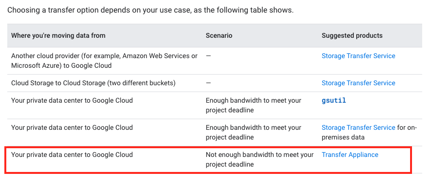

# Exam Topic

**Question 1**

- D. Use separate backend pools for each API path behind the load balancer. 100%
- D is the answer because HTTP(S) load balancer can direct traffic reaching a single IP to different backends based on the incoming URL.
- A is not correct because configuring a new load balancer would require a new or different SSL and DNS records which conflicts with the requirements to keep the same SSL and DNS records.
- B is not correct because it goes against the requirements. The company wants to keep the old API available while new customers and testers try the new API.
- C is not correct because it is not a requirement to decommission the implementation behind the old API.

<hr />

**Question 2**

- A. Load data into Google BigQuery
- To optimize the storage of the multi-petabyte data set for ease of analysis by business analysts who have experience only with using a SQL interface, you should load the data into Google BigQuery.

- BigQuery is a fully-managed, cloud-native data warehouse that allows you to perform fast SQL queries on large amounts of data. By loading the data into BigQuery, you can provide your business analysts with a familiar SQL interface for querying the data, making it easier for them to analyze the data set.

- Other options, such as inserting data into Google Cloud SQL, putting flat files into Google Cloud Storage, or streaming data into Google Cloud Datastore, may not provide the necessary SQL interface or query performance for efficient analysis of the data set.

<hr />

**Question 3**

- Correct option is CDE.
  C. Instrument the application with a monitoring tool like Stackdriver Debugger: A monitoring tool like Stackdriver Debugger can help in identifying and debugging issues that arise during the migration process. It can also provide insights into the performance and availability of the application after it has been migrated to the cloud.

- D. Select an automation framework to reliably provision the cloud infrastructure: Automating the provisioning of the cloud infrastructure can help ensure that the process is reliable and repeatable. It can also help reduce the risk of errors and increase the speed of the migration process.

- E. Deploy a continuous integration tool with automated testing in a staging environment: Deploying a continuous integration tool with automated testing in a staging environment can help ensure that the application is thoroughly tested before it is deployed to production. This can help reduce the risk of issues arising in production and provide greater confidence in the stability and reliability of the application.

<hr />

**Question 4**

- A is correct option.
- App Engine spins up new containers automatically according to the load. During peak traffic, HTTP requests originated by the same user could be served by different containers. Given that the variable `sessions` is recreated for each container, it might store different data. The problem here is that this Flask app is stateful. The `sessions` variable is the state of this app. And stateful variables in App Engine / Cloud Run / Cloud Functions are problematic. A solution would be to store the session in some database (e.g., Firestore, Memorystore) and retrieve it from there. This way the app would fetch the session from a single place and would be stateless.

<hr />

**Question 5**

- A should good.
- Stackdriver is Google's logging solution. The answer wouldn't be to find another viable 3rd party logging solution.

<hr />

**Question 6**

- AC is correct.

D) and E) are pointless in this context.

C) is certainly a good practice.

Between A) and B):

A) Blue green deployment is an application release model that gradually transfers user traffic from a previous version of an app or microservice to a nearly identical new release—both of which are running in production.

B) In software, a canary process is usually the first instance that receives live production traffic about a new configuration update, either a binary or configuration rollout. The new release only goes to the canary at first. The fact that the canary handles real user traffic is key: if it breaks, real users get affected, so canarying should be the first step in your deployment process, as opposed to the last step in testing in production. " While both green-blue and canary releases are useful, (B) suggests "replacing QA" with canary releases - which is not good. QA got the issue down by 80%.

Hence (A) and (C) are correct.

<hr />

**Question 7**

- AD 63%
- Use the flag -no-auto-delete with this flag, the disk won't be deleted when the VM is terminated.
- https://cloud.google.com/compute/docs/images/create-custom#gcloud
- By default, the auto-delete option is enabled on the boot disks.
- Billing export to BigQuery enables you to export your daily usage and cost estimates automatically throughout the day to a BigQuery dataset you specify. You can then access your billing data from BigQuery.

<hr />

**Question 8**

- B
- This is time series data. We also have no idea what kinds of data are being captured so it doesn't appear structured.

A does not seem reasonable because a flat file is not easy to query and analyze.

B seems reasonable because this accommodates unstructured data.

C seems unreasonable because we have no idea on the structure of the data.

D seems unreasonable because there is no such Google database type.

<hr />

**Question 9**

- C. Ensure that a firewall rule exists to allow load balancer health checks to reach the instances in the instance group. 100%

- Explanation
  If curl command is working then traffic exists. So, we need to check why health checks are failing. So, firewall issues for health check done by Google probers

<hr />

**Question 10**

- C. Create a new service account with BigQuery access and execute your script with that user
- Explanation
  Service accounts provide a way to authenticate your application to Google Cloud services. When you create a service account, you can assign it specific roles that dictate what resources the service account can interact with, and how it can interact with them. In this case, you would assign the BigQuery access role to the service account, which would then be used to authenticate your script to BigQuery.

<hr />

**Question 11**

- B. Federate authentication via SAML 2.0 to the existing Identity Provider Most Voted
- Explanation
  For this scenario, the most appropriate authentication strategy would be B. Federate authentication via SAML 2.0 to the existing Identity Provider. This approach can achieve single sign-on and will not cause too much disruption to existing users. Additionally, since there are strict security team requirements, SAML federated authentication can ensure the security of password storage and transmission.

Other options may cause issues with security and user experience, such as

option A, which may lead to security issues with password synchronization,

option C, which may require password reassignment,

option D, which may cause user confusion or forgotten passwords.

<hr />

**Question 12**

- B. Google Cloud Dataflow
- Explanation
  These options include a mix of batch and stream processing – points to Dataflow.

<hr />

**Question 13**

- C. Roll back to an earlier known good release initially, then use Stackdriver Trace and Logging to diagnose the problem in a development/test/staging environment 95%
- Explanation
  App engine gives flexibility to roll back to previous version. Priority should be restoring the services to working state. And trace the issue using Stackdriver where the logs are already captured from previous failed service.

<hr />

**Question 14**

- Explanation
  Increasing the size of the persistent disk can be done without requiring the virtual machine to be shut down, and the resize2fs command can be used to resize the ext4 filesystem on the disk to take advantage of the additional space. This will allow you to add more storage space to the virtual machine without disrupting the database service.

<hr />

**Question 15**

- A. Create a tokenizer service and store only tokenized data
- Explanation
  Tokenization is a process of replacing sensitive data, such as credit card numbers, with unique, randomly-generated tokens that cannot be used for fraudulent purposes. By using a tokenizer service and storing only tokenized data, you can reduce the scope of PCI compliance to only the tokenization service, rather than the entire application. This can help minimize the amount of sensitive data that needs to be protected and reduce the overall compliance burden.

<hr />

**Question 16**

- B. Google Cloud Bigtable
- Explanation
  Google Cloud Bigtable is a scalable, high-performance NoSQL database that is well-suited for storing large amounts of data with low latency. It is designed for high-throughput workloads such as streaming data, and is able to handle bursts of up to millions of reads and writes per second.

<hr />

**Question 17**

- B. Write a lifecycle management rule in JSON and push it to the bucket with gsutil
- Explanation
  Cloud Storage has lifecycle management rules and could be applied with gsutil and gcloud storage buckets. It is common to use JSON for transferring data.

<hr />

**Question 18**

- B. Google Cloud Dataproc
- Explanation
  Dataproc is a fully managed and highly scalable service for running Apache Hadoop, Apache Spark, Apache Flink, Presto, and 30+ open source tools and frameworks. Use Dataproc for data lake modernization, ETL, and secure data science, at scale, integrated with Google Cloud, at a fraction of the cost.
- https://cloud.google.com/dataproc

<hr />

**Question 19**

- C. Dynamically resize the SSD persistent disk to 500 GB
- Explanation
  Answer is C because persistent disk performance is based on the total persistent disk capacity attached to an instance and the number of vCPUs that the instance has. Incrementing the persistent disk capacity will increment its throughput and IOPS, which in turn improve the performance of MySQL.

<hr />

**Question 20**

- C. Google Cloud Bigtable
- Explanation
  To optimize the performance of an accurate, real-time, weather-charting application that receives data from 50,000 sensors sending 10 readings per second, it would be most appropriate to store the data in a distributed, horizontally scalable, NoSQL database such as Google Cloud Bigtable Other options, such as Google BigQuery, Google Cloud SQL, and Google Cloud Storage, may not be as well-suited for handling high volumes of real-time data and may not provide the same level of performance and scalability as Google Cloud Bigtable.

<hr />

**Question 21**

- B. Create synthetic random user input, replay synthetic load until autoscale logic is triggered on at least one layer, and introduce ג€chaosג€ to the system by terminating random resources on both zones
- Explanation
  By creating synthetic random user input and replaying the load, you can simulate the expected increased user traffic and trigger the autoscale logic on different layers of the application. Introducing chaos to the system by terminating random resources in both zones helps test the resiliency and redundancy of the system under stress. This strategy will help ensure that the system can maintain the 99.99% availability SLA when subjected to additional user load.

**Question 22**

- C. Use a slimmed-down base image like Alpine Linux Most Voted
- E. Copy the source after he package dependencies (Python and pip) are installed
- Explanation
  C: Smaller the base image with minimum dependency faster the container will start

E: Docker image build uses caching. Docker Instructions sequence matter because application’s dependencies change less frequently than the Python code which will help to reuse the cached layer of dependency and only add new layer for code change for Python Source code.

**Question 23**

- C. Increase the load on your test and staging environments Most Voted
- Explanation
  You want to avoid this problem, which you can only do if you load test, it in a test environment. With option A, B and D you might find the problem and the solution faster (or not since it's a performance problem), but you do not avoid the problem.

**Question 24**

- D. Instrument your application with Stackdriver Trace in order to break down the request latencies at each microserviceD. Instrument your application with Stackdriver Trace in order to break down the request latencies at each microservice
- Explanation
  Stackdriver Trace is a distributed tracing system that allows you to understand the relationships between requests and the various microservices that they touch as they pass through your application. By instrumenting your application with Stackdriver Trace, you can get a detailed breakdown of the latencies at each microservice, which can help you identify which service is taking the longest in those cases where a small number of API requests take a very long time.

**Question 25**

-　 D. Implement routinely scheduled failovers of your databases 　 64％ -　 Explanation
Option D, implementing routinely scheduled failovers of your databases, is the best option in this scenario. This ensures that if the primary database crashes, the replica will automatically be promoted to the master and take over database operations, preventing any downtime or data loss. This can be achieved by setting up automatic failover mechanisms or by manually promoting the replica to the master as soon as the primary database goes down.

**Question 26**

- D. Configure Stackdriver Monitoring for all Projects, and export to Google Cloud Storage.
- Explanation
  D is correct and best practice for long term log storage

**Question 27**

- A. Google Cloud Dedicated Interconnect. 100%
- Explanation
  VPN is not private; it is public but encrypted. Also, VPN is not suitable for large updates that happen frequently

Google Cloud Dedicated Interconnect - large updates and better security, however may not be the most cost effective choice

**Question 28**

- B. Enable Logging export to Google BigQuery and use ACLs and views to scope the data shared with the auditor. 67%
- Explanation
  https://cloud.google.com/iam/docs/job-functions/auditing#scenario_external_auditors

B complies with requirements <analysis and audit> you can audit from GCS but not analyze the data in it, that is done by BQ

**Question 29**

- C. In a secret management system Most Voted
- Explanation
  It is important to store the credentials for your database back-end securely in order to protect them from unauthorized access. One way to do this is by using a secret management system, such as Google Cloud's Secret Manager. Secret Manager is a secure and convenient storage system for API keys, passwords, and other sensitive data that is designed to protect against unauthorized access. By storing the credentials in Secret Manager, you can ensure that they are kept secure and can be easily accessed by your microservices as needed.

**Question 30**

- C. Cloud Deployment Manager is unfamiliar to the company's engineers
- F. Cloud Deployment Manager only supports automation of Google Cloud resources
- Explanation
  C. Cloud Deployment Manager is unfamiliar to the company's engineers: This may lead to a learning curve and potential delays or mistakes in deployment, as the team becomes familiar with the new system.

  F. Cloud Deployment Manager only supports automation of Google Cloud resources: If the company has a multi-cloud or hybrid cloud environment, the custom tool might need to be adapted or additional tools might be required for managing resources in other cloud environments or on-premises infrastructure.

**Question 31**

- A. Google Kubernetes Engine, Jenkins, and Helm. 69%
- Explanation
  It should be A. Helm is needed for "Deploy application bundles using dynamic templates" Load Balancing should be part of GKE Already.

**Question 32**

- C. Create a shutdown script and use it as the value for a new metadata entry with the key shutdown-script in the Cloud Platform Console when you create the new virtual machine instance. 60%
- Explanation
  You can create and apply shutdown script for running VM too.

https://cloud.google.com/compute/docs/shutdownscript#provide_shutdown_script_contents_directly

**Question 33**

- D. Add tags to each tier and set up firewall rules to allow the desired traffic flow. 100%
- Explanation
  The web tier can communicate with end users and the app tier, and the app tier can communicate with the database tier, but no other communication between tiers is allowed. The instances running the web tier have a network tag of web, the instances running the app tier have a network tag of app, and the instances running the database tier have a network tag of db.

**Question 34**

- A. Use Stackdriver Logging to search for the module log entries
- C. Use gcloud or Cloud Console to connect to the serial console and observe the logs
- E. Adjust the Google Stackdriver timeline to match the failure time, and observe the batch server metrics
- Explanation
  To collect details on the failure of the batch servers in GCE VMs, you can take the following actions:

A - Stackdriver Logging can help you identify any issues related to the new Linux kernel module by searching for log entries related to the module.

C - Connecting to the serial console allows you to view the logs in real-time as the batch servers are running. This can help you identify any issues related to the new kernel module.

E - By adjusting the timeline in Stackdriver to match the failure time, you can view the batch server metrics during the time when the failures occurred. This can help you identify any issues related to the new kernel module.

Other options, such as reading the debug GCE Activity log using the API or Cloud Console, identifying whether a live migration event of the failed server occurred, or exporting a debug VM into an image and running the image on a local server, may not provide the necessary information to understand

**Question 35**

- A. Load logs into Google BigQuery
- E. Upload log files into Google Cloud Storage
- Explanation
  If you want to analyze those logs its recommended Big Query. For storing and backup Cloud Storage is your option, so AE.

**Question 36**

- B. Revert the source code change, and rerun the deployment pipeline. 61%
- Explanation
  If a change negatively affects your key performance indicator, it's best to revert the source code change to a known good state and rerun the deployment pipeline. This ensures that your infrastructure is restored to a stable state while you investigate and fix the issue. Reverting the change and redeploying the code will allow your instance groups to continue functioning with the previous stable version, minimizing the impact on your application and users.

**Question 37**

- C. A single Organization with Folders for each department. 100%
- Explanation
  To control IAM policies for different departments independently but centrally, you should create a single organization and use folders to organize the policies for each department. This approach allows you to centralize the management of IAM policies for all departments within a single organization, while also allowing you to set up different policies for each department as needed.

**Question 38**

- B. Digitally sign all of your JAR files and redeploy your application
- Explanation
  The most likely cause of the error is that one of the JAR files in your application has been tampered with or is corrupt. The SHA1 digest error indicates that the JAR file's signature does not match the expected value, which could be due to tampering or corruption.

  To fix the issue, you should try uploading missing JAR files and redeploying your application. If the issue persists, you may need to digitally sign all of your JAR files and redeploy your application to ensure that the signatures are valid. You should not try to recompile the Cloaked

<hr />

**Question 39**

- C. Use public key infrastructure (PKI) to encrypt the message client side using the originating user's private key.

- Explanation
  To prevent message spoofing, it is important to ensure that messages cannot be altered or forged by anyone other than the originating user. One way to accomplish this is by using public key infrastructure (PKI) to encrypt messages using the originating user's private key.

<hr />

**Question 40**

- B. Configure a Google Cloud Dedicated Interconnect.
- Explanation
  It's latency issue. That won't be solved by adding another VPN tunnel. If it was just a throughput issue then VPN would do, however to improve latency you need to go layer 2. Answer is B

<hr />

**Question 41**

- C. De-identify the data with the Cloud Data Loss Prevention API
- Explanation
  The recommended approach for sanitizing data of personally identifiable information or payment card information before storing it in Cloud Bigtable is option C: De-identify the data with the Cloud Data Loss Prevention API.

  The Cloud Data Loss Prevention (DLP) API is a powerful tool that allows you to automatically discover, classify, and redact sensitive data in your organization. It uses advanced machine learning techniques to accurately identify and protect a wide range of sensitive data types, including personal information such as names, addresses, phone numbers, and payment card information.

<hr />

**Question 42**

- A. ~/bin
- Explanation
  https://cloud.google.com/shell/docs/how-cloud-shell-works

  Cloud Shell provisions 5 GB of free persistent disk storage mounted as your $HOME directory on the virtual machine instance. This storage is on a per-user basis and is available across projects. Unlike the instance itself, this storage does not time out on inactivity. All files you store in your home directory, including installed software, scripts and user configuration files like .bashrc and .vimrc, persist between sessions. Your $HOME directory is private to you and cannot be accessed by other users.

<hr />

**Question 43**

- A. Create a VPC and connect it to your on-premises data center using Dedicated Interconnect.
- Explanation
  Cloud VPN supports unto 3 Gbps where as Interconnect can support unto 100 gbps

<hr />

**Question 44**

- B. Utilize free tier and sustained use discounts. Provide training to the team about service cost management. 100%
- Explanation
  Sustained are automatic discounts for running specific GCE a significant portion of the billing month:

  https://cloud.google.com/compute/docs/sustained-use-discounts

  Committed is for workloads with predictable resource needs between 1 year or 3 year, discount is up to 57% for most resources:

  https://cloud.google.com/compute/docs/instances/signing-up-committed-use-discounts

<hr />

**Question 45**

- D. Use Jenkins to monitor tags in the repository. Deploy staging tags to a staging environment for testing. After testing, tag the repository for production and deploy that to the production environment.

- https://stackify.com/continuous-delivery-git-jenkins/

- The question states: "... code changes can be verified BEFORE deploying to production", it eliminates option C.
  The approach of tagging is the correct practise that DevOps use
- Correct answer is D. Question talks about 'before deploying to production'. C talks about after deploying to production.

<hr />

**Question 46**

- C. Disable the health check for the instance group. Add his SSH key to the project-wide SSH Keys. 83%
- C, is the correct answer. As per the requirement linux expert would need access to VM to troubleshoot the issue.
- With health check enabled, old VM will be terminated as soon as health-check fails for the VM and new VM will be auto-created. So, this situation will prevent linux expert to troubleshoot the issue.

<hr />

**Question 47**

- C. GKE and GCP provide the tools you need to build a PCI DSS-compliant environment. 100%
- https://cloud.google.com/security/compliance/pci-dss
  Clearly mention GKE as PCI DSS-Compliant but not all GCP service are PCI DSS-Compliant so answer is definitely C.
- Payment Card Industry (PCI) Data Security Standards (DSS)

<hr />

**Question 48**

- B. Upload your files into Cloud Storage. Use Cloud Dataprep to explore and clean your data. 100%

- Cloud Dataprep is a fully managed data preparation service that allows you to quickly and easily explore, clean, and transform your data for analysis.
- "detect anomalies" <<-Very important.

<hr />

**Question 49**

- C. The effective policy is the union of the policy set at the node and policies inherited from its ancestors. 100%
- intersection, the intersection of the policy set

<hr />

**Question 50**

- C. Use an IP range on Google Cloud that does not overlap with the range you use on-premises. 85%
- https://cloud.google.com/vpc/docs/using-vpc
- "Primary and secondary ranges can't conflict with on-premises IP ranges if you have connected your VPC network to another network with Cloud VPN, Dedicated Interconnect, or Partner Interconnect."

<hr />

**Question 51**

- A. Point gcloud datastore create-indexes to your configuration file. 100%
- https://cloud.google.com/sdk/gcloud/reference/datastore/indexes/create

<hr />

**Question 52**

- C. Deploy the application on two Compute Engine instance groups, each in the same project but in a different region. Use the first instance group to serve traffic, and use the HTTP load balancing service to fail over to the standby instance group in case of a disaster

- Explanation
  Google recommend using MIG for Zonal outage and multiple MIG for regional outage

  https://cloud.google.com/architecture/disaster-recovery#compute-engine

  It says: Compute Engine instances are zonal resources, so in the event of a zone outage instances are unavailable by default. Compute Engine does offer managed instance groups (MIGs) which can automatically scale up additional VMs from pre-configured instance templates, both within a single zone and across multiple zones within a region. MIGs are ideal for applications that require resilience to zone loss and are stateless, but require configuration and resource planning. Multiple regional MIGs can be used to achieve regional outage resilience for stateless applications.

<hr />

**Question 53**

- D. Deploy your application on App Engine flexible environment and use Cloud VPN to limit access to the on-premises database

- https://cloud.google.com/appengine/docs/the-appengine-environments
- Accesses the resources or services of your Google Cloud project that reside in the Compute Engine network.
- https://stackoverflow.com/questions/37137914/is-it-possible-to-use-google-app-engine-with-google-cloud-vpn

> App Engine Flexible Environment is based on Google Compute Engine and consequently can connect to your remote network via Cloud VPNs. As described in this article, you can specify network settings in your app.yaml configuration file of your GAE Flexible application.

<hr />

**Question 54**

- A. Upload the required installation files to Cloud Storage. Configure the VM on a subnet with a Private Google Access subnet. Assign only an internal IP address to the VM. Download the installation files to the VM using gsutil. 78%
- https://cloud.google.com/vpc/docs/configure-private-google-access
- you can follow these steps:
- Upload the required installation files to Cloud Storage.
  Configure the VM on a subnet with a Private Google Access subnet. This will allow the VM to access Google APIs and services, such as Cloud Storage, without requiring a public IP address or internet access.
  Assign only an internal IP address to the VM. This will ensure that the VM is not accessible from the public internet.
  Download the installation files to the VM using gsutil, which is a command-line tool that allows you to access Cloud Storage from the VM.

<hr />

**Question 55**

- A. Move your data onto a Transfer Appliance. Use a Transfer Appliance Rehydrator to decrypt the data into Cloud Storage.
- Explanation
  The gsutil tool is the standard tool for small- to medium-sized transfers (less than a few TB)

  https://cloud.google.com/solutions/migration-to-google-cloud-transferring-your-large-datasets#transfer-options

  Transfer Appliance lets you quickly and securely transfer large amounts of data to Google Cloud Platform via a high-capacity storage server that you lease from Google and ship to Google’s datacenter. Transfer Appliance is recommended for data that exceeds 20 TB or would take more than a week to upload.

<hr />

**Question 56**

- A. Use `kubectl set image deployment/echo-deployment` <new-image>
- Selected A - Source: https://kubernetes.io/docs/concepts/workloads/controllers/deployment/#updating-a-deployment

- Deployment ensures that only a certain number of Pods are down while they are being updated. By default, it ensures that at least 75% of the desired number of Pods are up (25% max unavailable).

- Deployment also ensures that only a certain number of Pods are created above the desired number of Pods. By default, it ensures that at most 125% of the desired number of Pods are up (25% max surge).

<hr />

**Question 57**

- C. Add all users to a group. Grant the group the roles of BigQuery jobUser on the billing project and BigQuery dataViewer on the projects that contain the data. 100%

- Both A & C are correct but using the principle of least privileges C is the most appropriate.

- **BigQuery User**: (roles/bigquery.user) - When applied to a dataset, this role provides the ability to read the dataset's metadata and list tables in the dataset.
  When applied to a project, this role also provides the ability to run jobs, including queries, within the project. A principal with this role can enumerate their own jobs, cancel their own jobs, and enumerate datasets within a project. <b>Additionally, allows the creation of new datasets within the project; the creator is granted the BigQuery Data Owner role(roles/bigquery.dataOwner) on these new datasets.</b>
  Lowest-level resources where you can grant this role: Dataset

- **BigQuery Job User:** (roles/bigquery.jobUser) - Provides permissions to run jobs, including queries, within the project.
  Lowest-level resources where you can grant this role: Project

- https://cloud.google.com/bigquery/docs/access-control

<hr />

**Question 58**

- B. Have users upload the images to Cloud Storage using a signed URL that expires after 24 hours. 100%
- https://cloud.google.com/storage/docs/access-control/signed-urls

<hr />

**Question 59**

- D. Define a design for the security of data in your web application that meets GDPR requirements. 100%
- Explanation
  D - https://cloud.google.com/security/gdpr

  The GDPR lays out specific requirements for businesses and organizations who are established in Europe or who serve users in Europe. It regulates how businesses can collect, use, and store personal data Builds upon current documentation and reporting requirements to increase accountability Authorizes fines on businesses who fail to meet its requirements

<hr />

**Question 60**

- A. Configure a Cloud SQL instance with high availability enabled. 53%
- https://cloud.google.com/sql/docs/sqlserver/high-availability
- High availability feature is available in cloud SQL.
  We dont have to create compute instance, install SQL server and place the db and log file in group of windows compute engine machines with failover clustering. Always chose readymade services from GCP.
- https://cloud.google.com/compute/docs/instances/sql-server/disaster-recovery-for-microsoft-sql-server#high_availability_and_disaster_recovery

<hr />

**Question 61**

- B. Use gcloud to create a Kubernetes cluster. Use kubectl to create the deployment. 100%
- Explanation
  Create a Google Kubernetes Engine (GKE) cluster: You can use the Google Cloud Console or the gcloud command-line tool to create a GKE cluster, which will provide the underlying infrastructure for running your application.

Deploy the application to the cluster: You can use the kubectl command-line tool to apply the Kubernetes Deployment file provided by the development team to the cluster.

kubectl apply -f deployment.yaml

**Question 62**

- B. Allocate budget for team training. Create a roadmap for your team to achieve Google Cloud certification based on job role.
- Explanation
- To evaluate your team's readiness for a new GCP project and create a skills gap plan, you should consider the business goal of cost optimization. One way to optimize costs is to invest in training for your team to increase their skills and knowledge of GCP. This can help your team become more efficient and effective in using GCP, potentially resulting in cost savings over time. You should allocate budget for team training and create a roadmap for your team to achieve Google Cloud certification based on their job roles. This will help ensure that your team has the necessary skills and knowledge to successfully deploy the new GCP project.

**Question 63**

- A. Cloud Functions 93%
- Explanation
  - A. Cloud Functions - managed service scales down to 0
  - B. Compute Engine - not a managed service
  - C. Google Kubernetes Engine - not a managed service and wont scale down to 0
  - D. App Engine flexible environment - managed service but won’t scale down to 0

**Question 64**

- A. Create the Key object for each Entity and run a batch get operation
- Explanation
  Correct Answer: A Create the Key object for each Entity and run a batch get operation https://cloud.google.com/datastore/docs/best-practices

  Use batch operations for your reads, writes, and deletes instead of single operations. Batch operations are more efficient because they perform multiple operations with the same overhead as a single operation. Firestore in Datastore mode supports batch versions of the operations which allow it to operate on multiple objects in a single Datastore mode call. Such batch calls are faster than making separate calls for each individual entity because they incur the overhead for only one service call. If multiple entity groups are involved, the work for all the groups is performed in parallel on the server side.

**Question 65**

- A. Supply the encryption key in a .boto configuration file. Use gsutil to upload the files. 71%
- Explanation
  In GCP document, key could be configured in .boto. No information found which shows gsutil suppots flag "--encryption-key".
  https://cloud.google.com/storage/docs/encryption/customer-supplied-keys

**Question 66**

- B. Output custom metrics to Stackdriver from the game servers, and create a Dashboard in Stackdriver Monitoring Console to view them. 97%

- Explanation
  To capture multiple GBs of aggregate real-time KPIs from game servers running on Google Cloud Platform and monitor them with low latency, the customer should output custom metrics to Stackdriver from the game servers. Stackdriver allows you to collect and store custom metrics, as well as view and analyze them in real-time using the Stackdriver Monitoring Console. The customer can create a Dashboard in the Monitoring Console to view the KPIs and monitor them with low latency.

**Question 67**

- C. Perform the following: 1. Create a Google Kubernetes Engine (GKE) cluster with n1-standard-1 type machines. 2. Build a Docker image from the production branch with all of the dependencies, and tag it with the version number. 3. Create a Kubernetes Deployment with the imagePullPolicy set to 'IfNotPresent' in the staging namespace, and then promote it to the production namespace after testing. 67%

- Explanation
  Using Google Kubernetes Engine (GKE) enables better resource management and allows you to monitor and maximize machine utilization effectively. Creating a Docker image with all the dependencies ensures a consistent environment for your application. By utilizing Kubernetes Deployments, you can reliably deploy new versions of the application and control the rollout process. Additionally, using a staging namespace for testing before promoting to the production namespace ensures a safer deployment process.

**Question 68**

- B. Use Google Cloud Directory Sync to synchronize Active Directory usernames with cloud identities and configure SAML SSO. 100
  %
- Explanation
  To retain their on-premises Active Directory domain controller for identity management while using Google Cloud resources, the company can use Google Cloud Directory Sync to synchronize Active Directory usernames with cloud identities and configure SAML single sign-on (SSO). This will allow users to use their existing Active Directory credentials to access Google Cloud resources, while still maintaining their on-premises Active Directory domain controller as the primary source of identity management.

**Question 69**

- B. Review the Stackdriver logs for the specific GKE container that is serving the unresponsive part of the application.
- Explanation
  Since the application writes logs to standard output, the logs should be available in the Stackdriver logs for the container running the unresponsive part of the application. Kubernetes Engine automatically exports these logs to Stackdriver, so you can use the Stackdriver Logging console to view the logs.

**Question 70**

- D. Create a failover replica instance in the same region, but in a different zone. 53%
- Explanation
  Cloud SQL is regional. For high availability, we need to think fo a failover strategy. So, Option D meets the requirement. create failover replica in the same region but in different Zone

**Question 71**

- C. Create a custom image from the existing disk. Create an instance template from the custom image. Create an autoscaled managed instance group from the instance template. 100%
- Explanation
  Option C is the correct choice because creating a custom image from the existing disk ensures that the application environment is consistent and does not change between instances, which can reduce variability in performance. Creating an instance template from the custom image allows you to easily create new instances that are based on the same image, which can save time and effort. Finally, creating an autoscaled managed instance group allows you to automatically scale the number of instances based on demand, which can ensure that there are enough instances to handle peak traffic while minimizing costs during periods of low traffic

**Question 72**

- B. Use firewall rules based on network tags attached to the compute instances
- Explanation
  Right Option - B. Use firewall rules based on network tags attached to the compute instances

  To restrict communications between VM instances within a VPC without relying on static IP addresses or subnets, you can use firewall rules based on network tags attached to the compute instances. This will allow you to specify which instances are allowed to communicate with each other and on which paths and ports. You can then attach the relevant network tags to the compute instances when they are created, allowing you to control communication between the instances without relying on static IP addresses or subnets.

**Question 73**

- A. 1. Enable automatic storage increase for the instance. 2. Create a Stackdriver alert when CPU usage exceeds 75%, and change the instance type to reduce CPU usage. 3. Create a Stackdriver alert for replication lag, and shard the database to reduce replication time.

- https://cloud.google.com/sql/docs/mysql/instance-settings#automatic-storage-increase-2ndgen

**Enable automatic storage increases**

If you enable this setting, Cloud SQL checks your available storage every 30 seconds. If the available storage falls below a threshold size, Cloud SQL automatically adds additional storage capacity. If the available storage repeatedly falls below the threshold size, Cloud SQL continues to add storage until it reaches the maximum of 64 TB.

<hr />

**Question 74**

- D. BigQuery, because it is designed for large-scale processing of tabular data
- Explanation. 94%
  Cloud SQL/Spanner is OLTP DB but not OLAP. BQ is a well-known OLAP for analytics and also supports RBMS feature too

**Question 75**

- C. In the GCP Console, navigate to Stackdriver Logging. Consult logs for (GKE) and Cloud SQL.
- Explanation
  Post mortem always includes log analysis.
  post mortem = logs

**Question 76**

- A. Ensure that VM service accounts are granted the appropriate Cloud Pub/Sub IAM roles.
- Explanation
  The Google-recommended way for your application to authenticate to Cloud Pub/Sub and other Google Cloud services when running on Compute Engine VMs is to use VM service accounts. VM service accounts are automatically created when you create a Compute Engine VM, and they are associated with the VM instance. To authenticate to Cloud Pub/Sub and other Google Cloud services, you should ensure that the VM service accounts are granted the appropriate IAM roles.

**Question 77**

- D. Deploy Cloud VPN Gateway in each region. Ensure that each region has at least one VPN tunnel to the on-premises peer gateway.

- Cloud VPN Gateway is a regional service, not global.

- https://cloud.google.com/vpn/docs/how-to/creating-static-vpns

- Cloud VPN Gateway is regional. NOt Global

```
gcloud compute vpn-gateways create GW_NAME \
--network=NETWORK \
--region=REGION
```

<hr />

**Question 78**

- B. Make the tables time-partitioned, and configure the partition expiration at 45 days. 100%
- Explanation
  If your tables are partitioned by date, the dataset's default table expiration applies to the individual partitions. You can also control partition expiration using the time_partitioning_expiration flag in the bq command-line tool or the expiration configuration setting in the API. When a partition expires, data in the partition is deleted but the partitioned table is not dropped even if the table is empty.

  https://cloud.google.com/bigquery/docs/best-practices-storage

**Question 79**

- A. Configure a HorizontalPodAutoscaler with a target CPU usage. Enable the Cluster Autoscaler from the GCP Console. Most Voted
- Explanation
  How does Horizontal Pod Autoscaler work with Cluster Autoscaler? Horizontal Pod Autoscaler changes the deployment's or replicaset's number of replicas based on the current CPU load. If the load increases, HPA will create new replicas, for which there may or may not be enough space in the cluster. If there are not enough resources, CA will try to bring up some nodes, so that the HPA-created pods have a place to run. If the load decreases, HPA will stop some of the replicas. As a result, some nodes may become underutilized or completely empty, and then CA will terminate such unneeded nodes.

**Question 80**

- B. Verify that Dedicated Interconnect can replicate files to GCP. Verify that Cloud VPN can establish a secure connection between your networks if Dedicated Interconnect fails. 100%

- Explanation
  Dedicated Interconnect is a connection that provides a private, dedicated connection between your on-premises network and GCP over a Google-owned network. It is a secure and reliable option for connecting your on-premises network to GCP. You can use it to replicate files to GCP as a part of your disaster recovery plan. If Dedicated Interconnect fails for any reason, it is a good idea to have a backup solution in place to establish a secure connection between your networks. Cloud VPN is a secure and reliable solution for establishing a connection between your on-premises network and GCP. It uses a virtual private network (VPN) tunnel to securely connect the networks, and it is a good backup option if Dedicated Interconnect fails.

**Question 81**

- B. Provision preemptible VMs to reduce cost. Disable and then discontinue use of all GCP services and APIs that are not HIPAA-compliant. 94%
- Disabling and then discontinuing allows you to see the effects of not using the APIs, so you can gauge (check) alternatives. So that leaves B and D as viable answers. The question says only some are not time-critical which implies others are. This means preemptible VMs are good because they will secure a spot for scaling when needed.

<hr />

**Question 82**

- C. Schedule a disaster simulation exercise during which you can shut off all VMs in a zone to see how your application behaves. 42%
- Resilience testing of their authentication layer means the testing of availability of service/application even when many of the instances fail in a particular location. That’s why. Disaster type of scenario is better where all VM instances becomes unavailable in a particular zone.
- Chaos testing is to shutdown random instances.

<hr />

**Question 83**

- D. Use Cloud Audit Logging to view Cloud Audit Logs, and create a filter on the query operation to get the required information.

- Cloud Audit Logging records activities and API calls in Google Cloud services, including BigQuery. You can use Cloud Audit Logging to view logs and filter them based on specific operations, such as queries in BigQuery. By filtering on the query operation, you can gather the required information about how many queries each user ran in the last month, which is essential for audit purposes.

- https://cloud.google.com/bigquery/docs/reference/auditlogs#auditdata_examples

<hr />

**Question 84**

- B. Create a custom VM image with all OS package dependencies. Use Deployment Manager to create the managed instance group with the VM image.

- Managed instance groups are a way to manage a group of Compute Engine instances as a single entity. If you want to automate the creation of a managed instance group, you can use tools such as Terraform, Deployment Manager, or Puppet to automate the process. **To minimize the startup time for new VMs in the instance group, you should create a custom VM image with all of the OS package dependencies pre-installed**. This will allow you to create new VMs from the custom image, which will significantly reduce the startup time compared to installing the dependencies on each VM individually. You can then use Deployment Manager to create the managed instance group with the custom VM image.
- https://cloud.google.com/compute/docs/images

**Question 85**

- A. Create a group per country. Add analysts to their respective country-groups. Create a single group 'all_analysts', and add all country-groups as members. Grant the 'all_analysts' group the IAM role of BigQuery jobUser. Share the appropriate dataset with view access with each respective analyst country-group. Most Voted

- **BigQuery Job User (roles/bigquery.jobUser): **
  Provides permissions to run jobs, including queries, within the project.

- A: As all analysts need to execute query, they need JobUser role.
  They should be restricted to view all datasets (not tables) of respective country.

<hr />

**Question 86**

- B. Memcache backed by Cloud Datastore for the customer session state data. Lifecycle-managed Cloud Storage for log archives, thumbnails, and VM boot/data volumes. 68%
- Explanation
  Local SSD cannot be used for neither boot nor data. This rules out other options except B.

**Question 87**

- A. StatefulSets
- Explanation
  StatefulSets is a feature of Kubernetes, which the question asks about. Yes, Persistent volumes are required by StatefulSets https://kubernetes.io/docs/concepts/workloads/controllers/statefulset/

  See the Google documentations for mentioning of hostnames https://cloud.google.com/kubernetes-engine/docs/concepts/statefulset

**Question 88**

- A. Customize the cache keys to omit the protocol from the key. 60%
- https://cloud.google.com/cdn/docs/best-practices#using_custom_cache_keys_to_improve_cache_hit_ratio
- A logo needs to be cached whether displayed through HTTP or HTTPS. When you customize the cache keys for the backend service that holds the logo, clear the Protocol checkbox so that requests through HTTP and HTTPS count as matches for the logo's cache entry.

<hr />

**Question 89**

- B. Stackdriver automatically collects admin activity logs for most services. The Stackdriver Logging agent must be installed on each instance to collect system logs. 100%
- Explanation
  Admin and event logs are configured by default. VM System logs require a logging agent to be configured. So, A is not valid. Answer is B

**Question 90**

- B. Deploy the update as a new version in the App Engine application, and split traffic between the new and current versions. 100%
- Explanation
  To test an update to an App Engine application with production traffic before replacing the current version, you can deploy the update as a new version in the App Engine application and split traffic between the new and current versions. This is known as a "blue-green" deployment, and it allows you to test the new version with a portion of production traffic while the current version is still serving the remainder of traffic.

  To split traffic between the new and current versions, you can use the App Engine traffic splitting feature. This feature allows you to specify the percentage of traffic that should be sent to each version, and it can be used to gradually ramp up traffic to the new version over time. This allows you to test the new version with a small portion of traffic initially, and gradually increase the traffic as you become more confident in the update.

- https://cloud.google.com/appengine/docs/standard/splitting-traffic

**Question 91**

- A. Create an egress rule with priority 1000 to deny all traffic for all instances. Create another egress rule with priority 100 to allow the Active Directory traffic for all instances. 100%
- Explanation
  To enforce the requirement that all Compute Engine instances in your VPC should be able to connect to an Active Directory server on specific ports while blocking any other traffic emerging from instances, the following two egress rules should be created: Create an egress rule with priority 1000 to deny all traffic for all instances. Create another egress rule with priority 100 to allow the Active Directory traffic for all instances. In this configuration, the rule that allows the AD traffic has a lower priority number than the rule that denies all other traffic. Therefore, this rule should be evaluated first.

**Question 92**

- D. Save a history of recommendations and results of the recommendations in BigQuery, to be used as training data. 100%

- The following insights and recommendations can be exported (to bigquery):
  - IAM recommender
  - VM machine type recommender
  - Managed instance group machine type recommender
  - Idle PD recommender
  - Idle VM recommender
  - Cloud SQL overprovisioned instance recommender
  - Cloud SQL idle instance recommender
  - Unattended project recommender
  - Cloud Run Service Identity recommender
  - https://cloud.google.com/recommender/docs/bq-export/export-recommendations-to-bq

**Question 93**

- A. Use the Horizontal Pod Autoscaler and enable cluster autoscaling. Use an Ingress resource to load-balance the HTTPS traffic.
- Explanation
  To load-balance the HTTPS traffic, we should use an Ingress resource, which acts as a reverse proxy to route traffic to different services based on the HTTP(S) header or the hostname. We can use the GKE Ingress controller to manage the Ingress resource, which will automatically create and manage a Google Cloud Load Balancer to distribute traffic to the pods running the application

- https://cloud.google.com/kubernetes-engine/docs/how-to/scaling-apps#autoscaling-deployments

  > kubectl autoscale creates a HorizontalPodAutoscaler (or HPA) object that targets a specified resource (called the scale target) and scales it as needed.

  ```
  kubectl autoscale deployment my-app --max 6 --min 4 --cpu-percent 50
  ```

**Creating an Ingress resource[1]**

Ingress is a Kubernetes resource that encapsulates a collection of rules and configuration for routing external HTTP(S) traffic to internal services.

- [1] https://cloud.google.com/kubernetes-engine/docs/tutorials/http-balancer#creating_an_ingress_resource

**Question 94**

- B. Create an HTTPS load balancer with URL Maps. 100%
- https://cloud.google.com/load-balancing/docs/https/url-map
- Explanation
  An HTTPS load balancer is a type of load balancer that can distribute incoming HTTPS traffic to one or more back-end services, such as Compute Engine instances or Google Kubernetes Engine clusters. It can also provide SSL/TLS termination, enabling you to use your own SSL/TLS certificates and keys.

You can use URL Maps to configure the HTTPS load balancer to route traffic based on the URL path being requested. This allows you to set up different URL paths to be served by different back-end services, providing a high level of flexibility in your load balancing configuration.

**Question 95**

- B. Implement retry logic using a truncated exponential backoff strategy.
- Explanation
  You should use exponential backoff to retry your requests when receiving errors with 5xx or 429 response codes from Cloud Storage.
  https://cloud.google.com/storage/docs/request-rate

**Question 96**

- B. Use Deployment Manager to automate service provisioning. Use Stackdriver to monitor and debug your tests. 88%
- It is B, Google Best practice ---> never use scripts. They do not trust anyone else's code it seems. TarTar, from exam topic

**Question 97**

- D. Save the files in multiple Multi-Regional Cloud Storage buckets, one bucket per multi-region.
- Explanation
  To reduce latency you need a bucket near your users and you can't setup multi-region with Asia/EU/America selected so A is out and we are left with D.

**Question 98**

- C. Store the data in Cloud Storage and use lifecycle management to delete files when they expire. Most Voted
- Explanation
  To delete objects up to 4 years, you add an object lifecycle rule specifying the following form parameters:

Action = "Delete object" Object conditions = select ""Days since custom time" checkbox and specify 1460 days.

**Question 99**

- A. Set the memcache service level to dedicated. Create a key from the hash of the query, and return database values from memcache before issuing a query to Cloud SQL. 100%
- Explanation
  Right Option - A. Set the memcache service level to dedicated. Create a key from the hash of the query, and return database values from memcache before issuing a query to Cloud SQL.

  A dedicated memcache is always better than shared until cost-effectiveness specify in the exam as objective. So, Option C and D are ruled out.

  From A and B, Option B is sending and updating query every minute which is over killing. So reasonable option left with A which balance performance and cost.

**Question 100**

- B. Using the Cron service provided by App Engine, publish messages to a Cloud Pub/Sub topic. Subscribe to that topic using a message-processing utility service running on Compute Engine instances. 88%
- B is correct. More appropriately: https://cloud.google.com/solutions/reliable-task-scheduling-compute-engine

**Question 101**

- B. Lease a Transfer Appliance, upload archived files to it, and send it to Google to transfer archived data to Cloud Storage. Establish a connection with Google using a Dedicated Interconnect or Direct Peering connection and use it to upload files daily. 92%
- Agree B. 100Mbps connections for 10TB data transfer is takes too long. wk
- you can not use gsutil to load 10TB daily >>>and then continue loading 10 TB of data daily<<< it will take longer than 24hrs to upload using gsutil. zr79

- Explanation
  Dedicated interconnect will provide a private network with 10gbs. The internet limited to 100 mb is not possible to use cloud VPN ( it will use public internet so be limited for the daily)

**Question 102**

- B. Cloud Pub/Sub to Cloud Dataflow. 62%
- I believe the answer is B. "Pub/Sub doesn't provide guarantees about the order of message delivery. Strict message ordering can be achieved with buffering, often using Dataflow." https://cloud.google.com/solutions/data-lifecycle-cloud-platform

**Question 103**

- C. 1. Perform an assessment of virtual machines running in the current VMware environment. 2. Define a migration plan, prepare a Migrate for Compute Engine migration RunBook, and execute the migration. 95%
- Migrate for Compute Engine organizes groups of VMs into Waves. After understanding the dependencies of your applications, create runbooks that contain groups of VMs and begin your migration!
- https://cloud.google.com/migrate/compute-engine/docs/4.5/how-to/migrate-on-premises-to-gcp/overview

**Question 104**

- D. Use an unmanaged instance group with an active and standby instance in different zones, use a regional persistent disk, and use a network load balancer in front of the instances.
- Correct Ans : D
  Since the Traffic is TCP, Ans A & C gets eliminated as HTTPS load balance is not supported.
  - B - File storage system is Cloud Firestore which do not give full control, hence eliminated.
  - D - Unmanaged instance group with network load balance with regional persistent disk for storage gives full control which is required for the migration.

**Question 105**

- D. Configure a Cloud Dedicated Interconnect connection between the on-premises environment and Google Cloud. 100%
- Ans D , Reason : high throughput via internal IPs

**Question 106**

- A. Deploy a new revision to Cloud Run with the new version. Configure traffic percentage between revisions. 75%
- https://cloud.google.com/run/docs/resource-model
- VishalB, omermaH

**Question 107**

- A. Navigate the predefined dashboards in the Cloud Monitoring workspace, and then add metrics and create alert policies. 58%, kopper2019
- It's A for me... Create a dashboard for each incident?? I think D isn't a good choice...DiegoMDZ

**Question 108**

- C. Binary logging, D. Automated backups. 70%
- C. Binary logging, D. Automated backups, omermaH

> Binary logging is a feature of MySQL that records all changes made to the database in a binary log file. By enabling binary logging on your Cloud SQL instance, you can use the log file to recover your database in case of catastrophic failure.

> Automated backups are a feature of Cloud SQL that allows you to automatically create and retain backups of your database. By enabling automated backups, you can restore your database in case of catastrophic failure or other data loss events.

> Option A, sharding, is not a recommended approach. Sharding is a technique for distributing data across multiple servers to improve performance and scalability. While sharding can help to improve the performance of a database, it is not specifically designed to protect against data loss in case of catastrophic failure.

**Question 109**

- B. When ingesting new data in BigQuery, run the data through the Data Loss Prevention (DLP) API to identify any personal information. As part of the DLP scan, save the result to Data Catalog. Upon a deletion request, query Data Catalog to find the column with personal information. 47%
- B. We do not need to delete entire recrod of sports person but some health information collected by association. B would be correct answer. Aditya G

**Question 110**

- A. App Engine
- By process of elimination you arrive at App Engine or GKE. Now the requirement is to "to minimize the operational overhead of the solution". 89%
  On the IaaS to PaaS spectrum, this can only be App Engine!
- IaaS = Compute Engine.
- Hybrid = GKE (engineering heavy).
- PaaS = App Engine.

**Question 111**

- B. Use Cloud Scheduler to trigger a Cloud Function that will stop the development and acceptance environments after office hours and start them just before office hours. 89%
- https://cloud.google.com/compute/docs/instances/viewing-and-applying-idle-vm-recommendations

  > B seems close to this Google provided service option, the extra step should be using idle VM recommendations to find and stop idle VM instances to reduce waste of resources. MaryMei

- Since the price of preemptibles is 1/4 the price of a standard machine D costs far less than B since office hours are 1/3 of whole day. It costs less to keep them running 24h as preemptibles. PAUGURU

**Question 112**

- C. 1. Set up Cloud VPN to provide private network connectivity between the Compute Engine application and the on-premises MySQL server. 2. Stop the on-premises application. 3. Start the Compute Engine application, configured to read and write to the on-premises MySQL server. 4. Create the replication configuration in Cloud SQL. 5. Configure the source database server to accept connections from the Cloud SQL replica. 6. Finalize the Cloud SQL replica configuration. 7. When replication has been completed, stop the Compute Engine application. 8. Promote the Cloud SQL replica to a standalone instance. 9. Restart the Compute Engine application, configured to read and write to the Cloud SQL standalone instance.100%

**Question 113**

- D. Set an Organization Policy with a constraint on constraints/compute.vmExternalIpAccess. List the approved instances in the allowedValues list. 100%

**Question 114**

- B. Enable Firewall Rules Logging for the firewall rules you want to monitor.
- when you create a firewall rule there is an option for firewall rule logging on/off. It is set to off by default. 100%
  To get firewall insights or view the logs for a specific firewall rule you need to enable logging while creating the rule or you can enable it by editing that rule.
- https://cloud.google.com/network-intelligence-center/docs/firewall-insights/how-to/view-understand-insights#enabling-fw-rules-logging
- https://cloud.google.com/firewall/docs/firewall-rules-logging

**Question 115**

- A. 1. Create a VPC Service Controls perimeter that includes the projects with the buckets. 2. Create an access level with the CIDR of the office network. 100%
- For all Google Cloud services secured with VPC Service Controls, you can ensure that:
  Resources within a perimeter are accessed only from clients within authorized VPC networks using Private Google Access with either Google Cloud or on-premises.
- https://cloud.google.com/vpc-service-controls/docs/overview

**Question 116**

- D. Start a new rolling update. Select the Opportunistic update mode.
- https://cloud.google.com/compute/docs/instance-groups/rolling-out-updates-to-managed-instance-groups
- The key here is "you don't want to update any running instances". Only opportunistic support this. jawulya

**Question 117**

- B. Configure the Compute Engine instances with an instance template for the application, and use a regional persistent disk for the application data. Whenever a zonal outage occurs, use the instance template to spin up the application in another zone in the same region. Use the regional persistent disk for the application data. 100%
- Answer is B, it only request zonal resiliency.
  Regional persistent disk is a storage option that provides synchronous replication of data between two zones in a region. Regional persistent disks can be a good building block to use when you implement HA services in Compute Engine. TotoroC
- https://cloud.google.com/compute/docs/disks/high-availability-regional-persistent-disk

**Question 118**

- A. Create a Cloud VPN connection from the new VPC to the data center, create a Cloud Router, and apply new IP addresses so there is no overlapping IP space. 68%
- The correct answer is A, not sure why some here are confused with C... Cloud NAT won't serve this purpose, you can read the documentation here: https://cloud.google.com/nat/docs/troubleshooting#overlapping-ip-addresses, jaxclain

**Question 119**

- A. Create a Dataproc cluster using standard worker instances. Most Voted
- Voting A as preemptible workload should only be used with preemptive task. BigfootPanda -https://cloud.google.com/architecture/hadoop/hadoop-gcp-migration-jobs#using_preemptible_worker_nodes

**Question 120**

- B. Add two additional NICs to Instance #1 with the following configuration: ג€¢ NIC1 ג—‹ VPC: VPC #2 ג—‹ SUBNETWORK: subnet #2 ג€¢ NIC2 ג—‹ VPC: VPC #3 ג—‹ SUBNETWORK: subnet #3 Update firewall rules to enable traffic between instances. 69%, MamthaSJ
- this link says VM can have multiple NICs and attached to different VPCs.
  https://cloud.google.com/vpc/docs/create-use-multiple-interfaces
  so B is the answer

**Question 121**

- B. Create a Debian-based Compute Engine instance, install and configure the application, and use OS patch management to install available updates. 91%, MamthaSJ
- https://cloud.google.com/compute/docs/os-patch-management

**Question 122**

- A. 1. Update your GKE cluster to use Cloud Operations for GKE. 2. Use the GKE Monitoring dashboard to investigate logs from affected Pods. 72%, TorontoC
- https://cloud.google.com/blog/products/management-tools/using-logging-your-apps-running-kubernetes-engine

**Question 123**

Answer should be C,
https://cloud.google.com/storage/docs/gcs-fuse#notes

**Question 124**

- A. Use the Service Mesh visualization in the Cloud Console to inspect the telemetry between the microservices. MamthaSJ
- https://cloud.google.com/service-mesh/docs/observability/explore-dashboard

**Question 125**

- A. Create a retention policy on the bucket for the duration of 5 years. Create a lock on the retention policy. 100% -https://cloud.google.com/storage/docs/bucket-lock#retention-policy

**Question 126**

- C. Create a Cloud Build trigger based on the development branch that tests the code, builds the container, and stores it in Container Registry. Create a deployment pipeline that watches for new images and deploys the new image on the development cluster. Ensure only the deployment tool has access to deploy new versions. 100%, TorontoC

**Question 127**

- D. Increase the maximum number of instances in the autoscaling group. 84%, MarthaSJ

**Question 128**

- B. Cloud Run and Cloud Bigtable, MamthaSJ
- Answer should B, beasue
  Data is no SQL data, real-time analysis needed. -> BigTable
  Cloud Run will help in -> Low Cost (Zero when no event), AdityaGupta

**Question 129**

- A. Deploy each microservice as a Deployment. Expose the Deployment in the cluster using a Service, and use the Service DNS name to address it from other microservices within the cluster. MathamSJ

**Question 130**

- C. 1. Create a project with a Shared VPC and assign the Network Admin role to the networking team. 2. Create a second project without a VPC, configure it as a Shared VPC service project, and assign the Compute Admin role to the development team. 57%
- a networking team and a development team.
- Option B suggests creating a single project with a standalone VPC, and assigning both the Network Admin and Compute Admin roles to the respective teams. However, this solution does not enforce the required separation of duties between the networking and development teams.
- Option C suggests using a Shared VPC. A Shared VPC allows for separation of duties between teams while sharing network resources.

**Question 131**

- D. Store static content such as HTML and images in a Cloud Storage bucket. Use Cloud Functions to host the APIs and save the user data in Firestore. 61%
- https://cloud.google.com/blog/products/networking/better-load-balancing-for-app-engine-cloud-run-and-functions

**Question 132**

- C. Export logs to a Pub/Sub topic, and trigger Cloud Function with the relevant log events. 100%
- https://cloud.google.com/blog/products/management-tools/automate-your-response-to-a-cloud-logging-event

**Question 133**

- C. Configure Identity-Aware Proxy (IAP) for the instance and ensure that you have the role of IAP-secured Tunnel User. Use the gcloud command line tool to ssh into the instance. 70%
- https://cloud.google.com/iap/docs/using-tcp-forwarding

**Question 134**

- C. Assign the development team group the Project Owner role on the Shopping folder, and remove the development team group Project Owner role from the Organization. 89%
- two folders Finance and Shopping
- C seems right, you have to remove the role from organization level

**Question 135**

- B. Use Istio's fault injection on the particular microservice whose faulty behavior you want to simulate. 85%
- GKE
- Istio fault injection :https://istiobyexample.dev/fault-injection/
- B is the right answer - reference - https://istio.io/latest/docs/tasks/traffic-management/fault-injection/

**Question 136**

- A. App Engine 100%
- App Engine is right choice, Developer can focus on developing code rather than worry about infrastructure. A is right
- The users are global but doesn't mean that app can't be regional. A is the correct answer it seems.

**Question 137**

- C. Use a versioning strategy for the APIs that increases the version number on every backward-incompatible change. 100%
- You are responsible for the API lifecycle and
- https://cloud.google.com/apis/design/versioning

**Question 138**

- C. The new approach will make it easier to decouple infrastructure from application, develop and release new features, manage the underlying infrastructure, manage CI/CD pipelines and perform A/B testing, and scale the solution if necessary. 88%
- C clearly states all of the benefits, C is right.
- C is better: Management like to understand business benefit in simple language. They don't bother about the technology

**Question 139**

- A. Use a load testing tool to simulate the expected number of concurrent users and total requests to your application, and inspect the results. 84%
- A or C - not sure
- GKE

**Question 140**

- (84%)D. Configure a Kubernetes autoscaling deployment based on the subscription/num_undelivered_messages metric.
- https://cloud.google.com/kubernetes-engine/docs/tutorials/autoscaling-metrics#pubsubhere
- Scale based on the number of unacknowledged messages remaining in a Pub/Sub subscription

**Question 141**

- (100%)C. Make the container tag match the source code commit hash.
- https://cloud.google.com/architecture/best-practices-for-building-containers#tagging_using_the_git_commit_hash
- If you have an advanced continuous delivery system and you release your software often, you probably don't use version numbers as described in the Semantic Versioning Specification. In this case, a common way of handling version numbers is to use the Git commit SHA-1 hash

**Question 142**

- B. Develop the application for App Engine standard environment. (100%)
- https://cloud.google.com/appengine/docs/the-appengine-environments
- Go 1.12, and can handle sudden spikes.

**Question 143**

- D. Store the data in a Cloud Storage bucket. Design the processing pipelines to retrieve the data from the bucket. Most Voted
- https://cloud.google.com/architecture/big-data-analytics/analytics-lakehouse

**Question 144**

- B. Create a Google Group per department and add all department members to their respective groups. Create a folder per department and grant the respective group the required IAM permissions at the folder level. Add the projects under the respective folders.(100%)
- https://cloud.google.com/resource-manager/docs/access-control-folders#best-practices-folders-iam

**Question 145**

- C. Configure binary authorization policies for the development, staging, and production clusters. Create attestations as part of the continuous integration pipeline.(100%)
- https://cloud.google.com/binary-authorization/docs/overview#policy_model

**Question 146**

- B. Use the Data Transfer appliance to perform an offline migration. Most Voted
- https://cloud.google.com/architecture/migration-to-google-cloud-transferring-your-large-datasets

- B because anything above 1TB, Google recommends Data Transfer appliance
  not D because, although the Time to transfer using 1Gbps is around 30 hours, the option is not uploading the content straight away, "Compress the data and upload" - compression of 10TB will take time, again, we must decompress the data before it is usable - again a time consuming process!!

<blockquote>

Answer would be Storage Transfer Service

- A: not suitable for 10 TB load.
- B: It will take around 3 weeks but feasible.
- C: not suitable for 10 TB load.
- D: storage object uploads are limited to 5TiB https://cloud.google.com/storage/quotas. not feasible.

</blockquote>



**Question 147**

- C. 1. Attach a regional SSD persistent disk to the first instance. 2. In case of a zone outage, force-attach the disk to the other instance.
- https://cloud.google.com/compute/docs/disks/repd-failover#zonal_failures

**Question 148**

- D. Import a key in Cloud KMS. Create a dataset in BigQuery using the customer-supplied key option and select the created key. (70%)
- The answer is easy. It says keys must be left outside of Google Cloud.
  This automatically eliminates A / B.
  Now the C option says decrypts before storing it in BigQuery which the point is to encrypt the data while been in BigQuery, D is the only possible answer.
- If you want to control encryption yourself, you can use customer-managed encryption keys (CMEK) for BigQuery. https://cloud.google.com/bigquery/docs/customer-managed-encryption

**Question 149**

- B. Create a key with Cloud Key Management Service (KMS). Set the encryption key on the bucket to the Cloud KMS key. (83%)
- https://cloud.google.com/storage/docs/encryption/customer-managed-keys#key-replacement
- "Your company must be able to rotate the encryption key" is the requirement which eliminates CMEK and why you need a CSEK. You have to use a boto config file to do this and is part of one of the labs.(Ric350)

**Question 150**

- A. Configure the GKE cluster as a private cluster, and configure Cloud NAT Gateway for the cluster subnet. (100%)
- https://cloud.google.com/kubernetes-engine/docs/how-to/private-clusters#workloads_on_private_clusters_unable_to_access_internet

**Question 159**

- WebSocket is a computer communications protocol, providing simultaneous two-way communication channels over a single Transmission Control Protocol (TCP) connection.
- https://en.wikipedia.org/wiki/WebSocket#:~:text=The%20WebSocket%20protocol%20enables%20full,from%20and%20to%20the%20server.
  https://cloud.google.com/load-balancing/docs/https#websocket_support

**Question 160**

- wrong
- https://cloud.google.com/storage/docs/request-rate#naming-convention

> A longer randomized prefix provides more effective auto-scaling when ramping to very high read and write rates. For example,

```
my-bucket/2fa764-2016-05-10-12-00-00/file1
my-bucket/5ca42c-2016-05-10-12-00-00/file2
my-bucket/6e9b84-2016-05-10-12-00-01/file3
```

**Question 161**

- correct
- C - In the Logging section of the console, specify GCE Network as the logging section. Search for the Create Insert entry
- In Logs Explorer , Filter "resource.type="gce_firewall_rule" and Query insert Create

```
You would see below and email address
"methodName": "v1.compute.firewalls.insert",
"authorizationInfo": [
{
"permission": "compute.firewalls.create",
```

- GCE, network origin, SSH (firewall rule)

**Question 162**

- D. Create a snapshot of the root disk, create an image file in Google Cloud Storage from the snapshot, and create a new virtual machine instance in the US-East region using the image file the root disk. 67%, tartar
- in a different project in the US-East region.
- https://cloud.google.com/compute/docs/instances/copy-vm-between-projects
  > you have to create Image from Snapshot and share it to the destination project. Prakzz

**Question 163**

- B. Mount a Local SSD volume as the backup location. After the backup is complete, use gsutil to move the backup to Google Cloud Storage.
- Option B is the most appropriate solution in this case. Mounting a Local SSD volume as the backup location will allow the backups to be taken quickly and efficiently, as Local SSDs have very high I/O performance and low latencies. Additionally, using gsutil to move the backups to Google Cloud Storage after they have been taken will provide a secure and durable storage location for the backups. omermaH

> A, configuring a cron job to use the gcloud tool to take regular backups using persistent disk snapshots, may not be the most efficient option because persistent disks have relatively lower I/O performance compared to Local SSDs.

> C, using gcsfuse to mount a Google Cloud Storage bucket as a volume directly on the instance and writing the backups to the mounted location using mysqldump, may not be the most efficient option because the backups would need to be transferred over the network, which could impact the performance of the backups.

> D, mounting additional persistent disk volumes onto each VM instance in a RAID10 array and using LVM to create snapshots to send to Cloud Storage, may not be the most efficient option because it would require additional disk space and setup, and LVM snapshots may not be as fast as Local SSDs for taking backups.

**Question 164**

- ABF 56%
- ADF, omermaH
- A. Ensure that the load tests validate the performance of Cloud Bigtable
- B. Create a separate Google Cloud project to use for the load-testing environment
- F. Instrument the load-testing tool and the target services with detailed logging and metrics collection
- after reading link: https://cloud.google.com/bigtable/docs/performance, rishab86
  > A:Run your typical workloads against Bigtable :Always run your own typical workloads against a Bigtable cluster when doing capacity planning, so you can figure out the best resource allocation for your applications.
  > B. Create a separate Google Cloud project to use for the load-testing environment
  > F : The most important/standard factor of testing, you gather logs and metrics in TEST environment for further scaling.

**Question 165**

- B. Org viewer, project viewer 100%
- A is not correct because Project owner is too broad. The security team does not need to be able to make changes to projects.
- B is correct because:-Org viewer grants the security team permissions to view the organization's display name.
  - Project viewer grants the security team permissions to see the resources within projects.
- C is not correct because Org admin is too broad. The security team does not need to be able to make changes to the organization.
- D is not correct because Project owner is too broad. The security team does not need to be able to make changes to projects.

**Question 166**

- BE 45% omermaH, DE 37%
- B. Use source code security analyzers as part of the CI/CD pipeline Most Vot
- E. Run a vulnerability security scanner as part of your continuous-integration /continuous-delivery (CI/CD) pipeline
- D. Enable code signing and a trusted binary repository integrated with your CI/CD pipeline Most Voted

> B. Use source code security analyzers as part of the CI/CD pipeline: By using source code security analyzers as part of the CI/CD pipeline, you can automatically detect and alert on security vulnerabilities in the code as it is being developed, which can help prevent security errors from being introduced.

> E. Run a vulnerability security scanner as part of your continuous-integration /continuous-delivery (CI/CD) pipeline: By running a vulnerability security scanner as part of the CI/CD pipeline, you can automatically detect and alert on security vulnerabilities in the application as it is being deployed, which can help prevent security errors from being introduced.
> upvoted 2 times

> Option A, ensuring every code check-in is peer reviewed by a security SME, could be a good way to prevent security errors from being introduced, as peer review can help catch mistakes before they are committed. However, it may not be practical to always have a security SME available to review every code check-in, especially if the company places a high value on release speed and agility.

> Option C, ensuring you have stubs to unit test all interfaces between components, is not directly related to preventing security errors from being introduced. While unit testing can help ensure that the code is working correctly, it is not specifically focused on security.

> Option D, enabling code signing and a trusted binary repository integrated with your CI/CD pipeline, could be a good way to ensure that only trusted code is being deployed. However, it may not be sufficient on its own to prevent security errors from being introduced, as it does not directly address vulnerabilities in the code itself.

**Question 167**

- C. Update the existing Kubernetes Engine cluster with the following command: gcloud alpha container clusters update mycluster - -enable- autoscaling - -min-nodes=1 - -max-nodes=10. 100%
- To enable autoscaling for an existing node pool, run the following command: tartar

```
gcloud container clusters update cluster-name --enable-autoscaling \
--min-nodes 1 --max-nodes 10 --zone compute-zone --node-pool default-pool
```

- https://cloud.google.com/kubernetes-engine/docs/how-to/cluster-autoscaler

**Question 168**

- A. Use Google App Engine to serve the website and Google Cloud Datastore to store user data.
- C. Use a managed instance group to serve the website and Google Cloud Bigtable to store user data. Most Voted
- by omermeH below.
  > A: Google App Engine is a fully managed platform for building and running web applications and APIs. It can automatically scale to meet high traffic demands, making it a good choice for serving the website for the promotional email campaign. Google Cloud Datastore can also scale automatically to meet high traffic demands, making it a good choice for storing user data.

> C: A managed instance group are managed as a single entity and can automatically scale up or down based on demand. This makes it a good choice for serving the website for the promotional email campaign. Google Cloud Bigtable is a fully managed, high-performance NoSQL database that can store and serve large amounts of structured data with low latency. It is designed to scale horizontally and can handle high traffic demands, making it a good choice for storing user data.

**Question 169**

- BC 65%
- B. Google Kubernetes Engine with containers
- C. Google App Engine Standard Environment
- No ops = Serverless / Almost Serverless, less operational management overhead.
  Kubernetes and App Engine are the only one that gives us that flexibility, plus is modernizing apps.alexanderC

**Question 170**

- C. Digitally sign each timestamp and log entry and store the signature. 100%
- by omermaH
  > I would recommend option C, digitally signing each timestamp and log entry and storing the signature. Digitally signing a log entry involves creating a cryptographic hash of the log entry and a timestamp, and then encrypting the hash using a private key. The encrypted hash, known as the signature, can be stored along with the log entry in a secure manner. To verify the authenticity of the log entry, you can use the public key associated with the private key used to create the signature to decrypt the signature and recreate the hash. If the recreated hash matches the original hash, it indicates that the log entry has not been tampered with and is authentic.

**Question 171**

- C. 1. Create folders under the Organization resource named ג€Developmentג€ and ג€Production.ג€ 2. Grant all developers the Project Creator IAM role on the ג€Developmentג€ folder. 3. Move the developer projects into the ג€Developmentג€ folder. 4. Set the policies for all projects on the Organization. 5. Additionally, set the production policies on the ג€Productionג€ folder. omermaH

- I would recommend option C, creating two folders under the Organization resource named "Development" and "Production" and placing developer and production projects in the respective folders. This approach would allow you to centrally manage policies for all projects, while also being able to set more restrictive policies for production projects. It would also allow you to easily move projects between the Development and Production folders as business needs change, without disrupting users or developers.

**Question 172**

- D. 1. Create a managed instance group with Compute Engine instances. 2. Create a global load balancer and configure it with two backends: ג—‹ Managed instance group ג—‹ Cloud Storage bucket 3. Enable Cloud CDN on the bucket backend. 97%

- I would recommend option D, creating a managed instance group with Compute Engine instances and a global load balancer with two backends: the managed instance group and the Cloud Storage bucket, and enabling Cloud CDN on the bucket backend. This approach would allow you to scale the number of instances in the managed instance group as needed to handle the demand for the application, and would also use the Cloud CDN to improve the performance of the application by caching the music files closer to the users. omermaH

**Question 173**

- A. Set up a filter in Cloud Logging and a Cloud Storage bucket as an export target for the logs you want to save. 100%

**Question 174**

- A. Create a Dataflow pipeline to retrieve the data from the external sources. As part of the pipeline, use the Cloud Data Loss Prevention (Cloud DLP) API to remove any PII data. Store the result in BigQuery. 74%
- I would recommend option A, creating a Dataflow pipeline to retrieve the data from the external sources and using the Cloud Data Loss Prevention (Cloud DLP) API to remove any PII data. Storing the result in BigQuery would allow the data warehousing team to easily perform analysis on the data. omermaH

**Question 175**

- A. Create an aggregated export on the Production folder. Set the log sink to be a Cloud Storage bucket in an operations project.

- Option B is not the correct solution because it creates an aggregated export on the Organization resource, which will capture logs from all projects in the Organization, including those outside the Production folder. omermaH

- Option A is the correct solution because it allows you to create an aggregated export on the Production folder, which will capture logs from all the production projects contained in the folder. Setting the log sink to a Cloud Storage bucket in an operations project will allow the operations team to store the logs in a central location. omermaH

**Question 176**

- A. 1. Install a Cloud Logging agent on all instances. 2. Create a sink to export logs into a regional Cloud Storage bucket. 3. Create an Object Lifecycle rule to move files into a Coldline Cloud Storage bucket after one month. 4. Configure a retention policy at the bucket level using bucket lock. 97%
- This approach would allow you to use Cloud Logging to collect and export the logs from the Compute Engine instances into a Cloud Storage bucket. You can then use an Object Lifecycle rule to automatically move the logs from the regional bucket to a Coldline bucket after one month, which will reduce storage costs for logs that are not actively being queried. By configuring a retention policy using bucket lock, you can ensure that the logs are retained for at least two years for audit purposes. This approach follows Google-recommended practices for storing logs and minimizing costs. omermaH

**Question 177**

- A. Configure an organization policy to restrict identities by domain. 100%
- https://cloud.google.com/resource-manager/docs/organization-policy/restricting-domains

**Question 178**

- C. Review your RowKey strategy and ensure that keys are evenly spread across the alphabet. 100%, omermaH
- https://cloud.google.com/bigtable/docs/schema-design#row-keys

**Question 179**
C. 1. Create a dataset for the data science team. 2. Create views of tables that you want to share, excluding PII. 3. Assign an appropriate project-level IAM role to the members of the data science team. 4. Assign access controls to the dataset that contains the view. 5. Authorize the view to access the source dataset. 57%

- C is correct here. You need view to avoid PII data. So materialized view is not needed.
- C: view in a different dataset (https://cloud.google.com/bigquery/docs/share-access-views: "Authorized views should be created in a different dataset from the source data. That way, data owners can give users access to the authorized view without simultaneously granting access to the underlying data.") someone2011

**Question 180**

- B. Use the Storage Transfer Service to move the data.
- https://cloud.google.com/architecture/migration-to-google-cloud-transferring-your-large-datasets#transfer-options

**Question 181**

- C. Set up a Cloud Monitoring sink that triggers the Cloud Function after an instance removal log message arrives in Cloud Logging. 83%, omermaH
- Actually C is correct but Wrong also in a way .. Sink cannot trigger a cloud function directly. It need Pub/Sub which then will trigger Cloud Function. Tesla

**Question 182**

- A. Use Google Cloud Shell in the Google Cloud Console to interact with Google Cloud. 100%
- https://cloud.google.com/sdk/gcloud

**Question 183**

- C. Set up a Cloud VPN gateway in each Shared VPC and peer Cloud VPNs. 79%, omermaH
- https://cloud.google.com/architecture/best-practices-vpc-design#shared-service

**Question 184**

- A. Inspect the logs and metrics from the instances in Cloud Logging and Cloud Monitoring. 100%, omermaH
- When an application becomes slow, the first step you should take is to gather information about the underlying cause of the problem. One way to do this is by inspecting the logs and metrics from the instances where the application is deployed. Google Cloud Platform (GCP) provides tools such as Cloud Logging and Cloud Monitoring that can help you to collect and analyze this information. omermaH

**Question 185**

- A. Configure liveness and readiness probes in the Pod specification.

- A: Configuring the right liveness and readiness probes prevents outages when rolling out a new ReplicaSet of a Deployment, because Pods are only getting traffic when they are considered ready.
- B: With GKE, you do not deal with MIGs.
- C: Does not use GKE tools and is therefore not the best option.
- D: Does alert you but does not prevent the outage.
- https://www.youtube.com/watch?v=mxEvAPQRwhw

**Question 186**

- C. Configure a HorizontalPodAutoscaler for all stateless workloads and for all compatible stateful workloads. Configure the cluster to use node auto scaling. 100%
- Answer C. Use HorizontalPodAutoscaler.

**Question 187**

- B 73%, D 23% omermaH
- D. 1. Activate billing export into BigQuery. 2. Perform a BigQuery query on the billing table to extract the information you need. 23%, omermaH

<blockquote>

- Go to the Billing page of your Google Cloud project.
- In the top left and select "billing Export."
- Follow the prompts to enable billing export and specify the BigQuery dataset and table where you want the data to be exported.
- Perform a BigQuery query on the billing table: Once you have enabled billing export and the data has started flowing into the specified BigQuery table, you can run a query on the table to extract the information you need. For example, you could use a query like the following to get the total cost of queries split by user:

```
SELECT user, SUM(cost) as total_cost
FROM `your-project.your-dataset.billing_export`
GROUP BY user
ORDER BY total_cost DESC
```

</blockquote>

**Question 188**

- A. Set up a network peering between vpc-a and vpc-b. 100%
- https://cloud.google.com/vpc/docs/vpc-peering
  > Google Cloud VPC Network Peering allows internal IP address connectivity across two Virtual Private Cloud (VPC) networks regardless of whether they belong to the same project or the same organization.

**Question 189**

- B. Object Versioning. 100%
- https://cloud.google.com/storage/docs/object-versioning

**Question 190**

- D. Change the filter to metric.label.state = 'free' and the Target utilization to 20. 16%, omermaH
- free is an available state filter for the percent_used metric. MortaW
- https://cloud.google.com/compute/docs/autoscaler/scaling-cloud-monitoring-metrics#autoscale_based_on_memory_usage

<blockquote>
[AMEJack]We have to think in different way.

- Option A: TARGET_TYPE: the autoscaler calculates the average rate of growth per minute and compares that to the utilization target.
  This will not fit question requirments, only the memory utilization growth will be compared with the target value.
- Option C: Adding all the memory cached, buffer, used and free will always be constant. So, this will also not fit the question requirements.
- Option D: I want the "free" memory utilization will be around 20. This will solve the problem.

</blockquote>

**Question 191**

- A. An HA Cloud VPN gateway connected with two tunnels to an on-premises VPN gateway. 81%
- A can provide 99.99% availability as well, and no need for C which will be more expensive. alexandE
- https://cloud.google.com/network-connectivity/docs/vpn/concepts/topologies#1-peer-1-address

**Question 192**

- A. 1. Set a CORS configuration in the target Cloud Storage bucket where the base URL of the App Engine application is an allowed origin. 2. Use the Cloud Storage Signed URL feature to generate a POST URL. 100%
- https://cloud.google.com/storage/docs/cross-origin#server-side-support
- Signed URL is for TIme-Based access. This needs access all the time.

**Question 193**

- B. Configure Cloud NAT and select sub-b in the NAT mapping section. 100%

<blockquote>

- A -> It doesn't make sense, Public Google Access allows you to access Google APIs without an external IP, which doesnt solve the problem
- C -> Bastion host is for the opposite purpose; accessing a machine administratively from the outside without an external IP, not a machine without an external IP accessing the outside.
- D -> It doesn't make sense.
- B -> It's the recommended solution for GCP

</blockquote>

**Question 194**

- D 100%

<blockquote>

1. Create an image of the on-premises virtual machines.
2. Import the image as a virtual disk on Compute Engine using --os=windows-2022-dc-v.
3. Create a sole-tenancy instance on Compute Engine that uses the imported disk as a boot disk.

</blockquote>

- https://cloud.google.com/compute/docs/import/importing-virtual-disks

**Question 195**

- A. An HA Cloud VPN gateway connected with two tunnels to an on-premises VPN gateway. 100%
- HA VPN supports two tunnels to achieve 99.99%. Classic VPN does not. Any more than 2 tunnels is excessive cost.

**Question 196**

- Duplicate so review question #146
