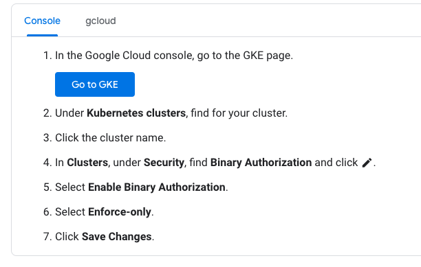

# TOPIC 4 - EHR Healthcare

https://www.examtopics.com/exams/google/professional-cloud-architect/view/3/

**Question 1**

- A. Verify EHR's product usage against the list of compliant products on the Google Cloud compliance page. Most Voted
- B. Advise EHR to execute a Business Associate Agreement (BAA) with Google Cloud.
- the Health Insurance Portability and Accountability Act (known as HIPAA)
- A - OK (Google Cloud compliance page will give list of products those are HIPAA compliant https://cloud.google.com/security/compliance/offerings?skip_cache=true#/regions=USA&industries=Healthcare_and_life_sciences&focusArea=Privacy)
- B - OK (BAA means HIPAA Business Associate amendment or Business Associate Agreement entered into between Google and Customer. With EHR being a leading provider of health record software, this agreement is required. https://cloud.google.com/files/gcp-hipaa-overview-guide.pdf?hl=en)

**Question 2**

- AD 40%
- A. Enable Binary Authorization on GKE, and sign containers as part of a CI/CD pipeline.
- D. Configure Container Registry to use vulnerability scanning to confirm that there are no vulnerabilities before deploying the workload.
- https://cloud.google.com/binary-authorization/docs/overview
- **What is Binary Authorization?**
- Binary Authorization is a Google Cloud product that you can use to implement software supply-chain security measures when
- You can use Binary Authorization to do the following:

- **Monitor**: You can configure continuous validation (CV) (Preview) to periodically monitor that container images associated with running Pods conform to a policy that you define. If images don't conform with the policy, CV produces log entries in Cloud Logging.

- **Enforce**: You can configure Binary Authorization enforcement to enforce that images that are being deployed to one of the supported container-based platforms conform with a policy that you define. Images that conform with the policy are allowed to be deployed; otherwise, they are disallowed from being deployed.

**Question 3**

- A. Add a new Dedicated Interconnect connection.
- https://cloud.google.com/network-connectivity/docs/interconnect/how-to/dedicated/modifying-interconnects
- **The following items can't be modified for existing Dedicated Interconnect connections:**

> The link type on a Dedicated Interconnect connection. For example, changing the circuit from 10 Gpbs to 100 Gbps. If you want to migrate to 100 Gbps, you must first provision a new 100‑Gbps Dedicated Interconnect connection alongside your existing 10‑Gbps connection, and then migrate the traffic onto the 100‑Gbps connection.

- B - it is not possible to change interconnect link type.
- C - more problematic and probably more expensive
- D - Google does not offer a service level agreement (SLA) with Carrier Peering

**Question 4**

D. Configure two Dedicated Interconnect connections in one metro (City) and two connections in another metro, and make sure the Interconnect connections are placed in different metro zones.

**Business requirements for this case:**

- Provide a minimum 99.9% availability for all customer-facing systems.
- Provide a secure and high-performance connection between on-premises systems and Google Cloud.

A. - builds us a 99.9% SLA partner interconnect, covering all business requirements.

B. - VPN is not suitable for the business requirements.

C. - Direct peering is used for workspace, instead of DMZ, again - not suitable.

D. - builds us a 99.99% SLA dedicated interconnect, covering all business requirements.

The answer to choosing A or D lies in the question, stating: "You want to follow Google's recommended practices for production-level applications."

Google recommends using the 99.99% SLA interconnect (dedicated or partner) for production-level applications as stated here:

- https://cloud.google.com/network-connectivity/docs/interconnect/tutorials/production-level-overview

**Question 5**

- C. Turn off Pub/Sub message batching.
- C - The cost of batching is latency for individual messages, which are queued in memory until their corresponding batch is filled and ready to be sent over the network. To minimize latency, batching should be turned off.
  https://cloud.google.com/pubsub/docs/publisher?hl=en#batching

- A incorrect. Application timeout because of publisher latency, nothing to do with timeout retry with publish request.
- D does not make sense at all.
- B is about receiver, not publisher.

**Question 6**

- A. Create an Organizational Policy with a constraint to allow external IP addresses only on the frontend Compute Engine instances. Most Voted

- https://cloud.google.com/compute/docs/ip-addresses/reserve-static-external-ip-address#disableexternalip

**Question 7**

- A 61%, C 39%
- A. Use a private cluster with a private endpoint with master authorized networks configured.

- A: https://cloud.google.com/kubernetes-engine/docs/concepts/private-cluster-concept

  - A private cluster is a type of VPC-native cluster that only depends on internal IP addresses. Nodes, Pods, and Services in a private cluster require unique subnet IP address ranges.

- (victory108)A: Private clusters run nodes without external IP addresses, and optionally run their cluster control plane without a publicly-reachable endpoint. Additionally, private clusters do not allow Google Cloud IP addresses to access the control plane endpoint by default. Using private clusters with authorized networks makes your control plane reachable only by the allowed CIDRs, by nodes within your cluster's VPC, and by Google's internal production jobs that manage your control plane.

- Public endpoint access disabled: This is the most secure option as it prevents all internet access to the control plane. This is a good choice if you have configured your on-premises network to connect to Google Cloud using Cloud Interconnect or Cloud VPN.
