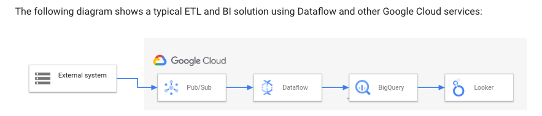

# Topic 9 - TerramEarth

**Question 1**

- C. Create a BigQuery time-partitioned table for the European data, and set the partition expiration period to 36 months. For Cloud Storage, use gsutil to enable lifecycle management using a DELETE action with an Age condition of 36 months.
- Ref: https://cloud.google.com/bigquery/docs/partitioned-tables#ingestion_time
- Ref: https://cloud.google.com/bigquery/docs/managing-partitioned-tables#partition-expiration

**Question 2**
A. Create a Cloud Storage lifecycle rule with Age: ג€30ג€, Storage Class: ג€Standardג€, and Action: ג€Set to Coldlineג€, and create a second GCS life-cycle rule with Age: ג€365ג€, Storage Class: ג€Coldlineג€, and Action: ג€Deleteג€. Most Voted

**Question 3**
A. Replace the existing data warehouse with BigQuery. Use table partitioning. 88%

**Question 4**

- D. Use Cloud Dataprep and configure the BigQuery tables as the source. Schedule a daily job to clean the data. 85%

- Ans is D. Please refer to this example: https://medium.com/google-cloud/how-to-schedule-a-bigquery-etl-job-with-dataprep-b1c314883ab9

- Dataflow is for data elaboration. Dataprep is for data preparation (and cleaning).

- Option D, as data needs to be cleaned ..Dataprep has the capabilities to clean dirty data

**Question 5**

- A. Use BigQuery as the data warehouse. Connect all vehicles to the network and stream data into BigQuery using Cloud Pub/Sub and Cloud Dataflow. Use Google Data Studio for analysis and reporting. 100%

- Once all the vehicle are connected to network, there is no need to use FTP; data can be ingested directly to BQ using Pub/Sub and DataFlow.

- https://cloud.google.com/dataflow/docs/overview

- **Dataflow**
  is a Google Cloud service that provides unified stream and batch data processing at scale. Use Dataflow to create data pipelines that read from one or more sources, transform the data, and write the data to a destination.

- ETL (extract-transform-load) workflows that ingest data into a data warehouse such as BigQuery.

1. Pub/Sub ingests data from an external system.
2. Dataflow reads the data from Pub/Sub and writes it to BigQuery. During this stage, Dataflow might transform or aggregate the data.
3. BigQuery acts as a data warehouse, allowing data analysts to run ad hoc queries on the data.
4. Looker provides real-time BI insights from the data stored in BigQuery.

- https://cloud.google.com/dataflow/docs/quickstarts/create-streaming-pipeline-template

**Question 6**

- B. Cloud IoT Core with public/private key pairs. 100%
- https://cloud.google.com/iot-core/
- https://cloud.google.com/architecture/connected-devices
