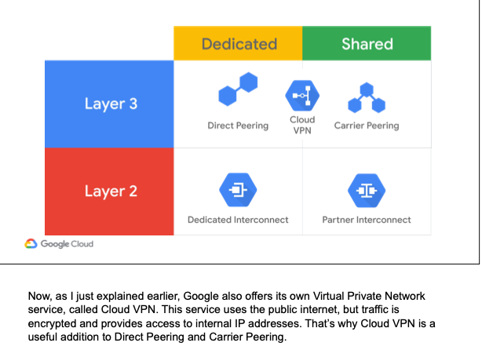
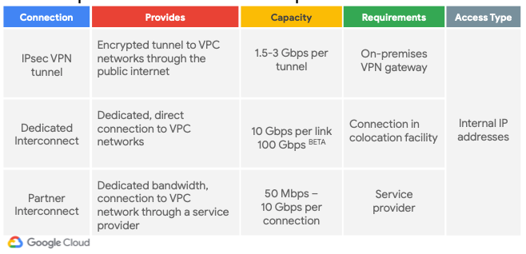
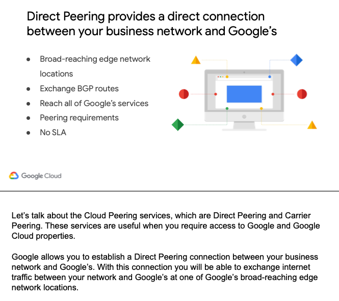
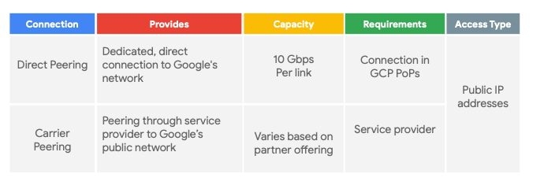
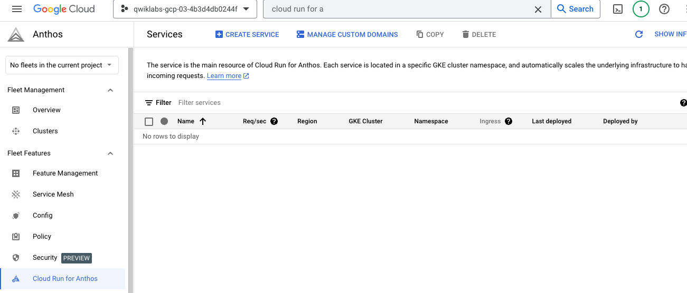
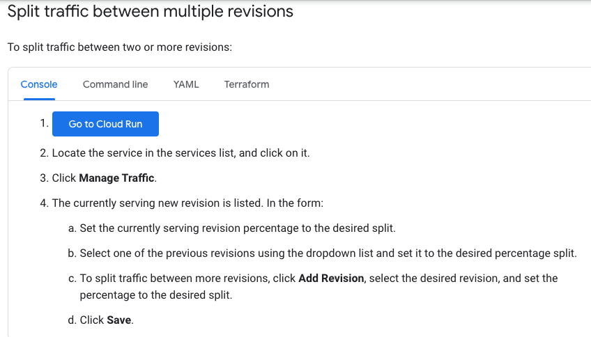
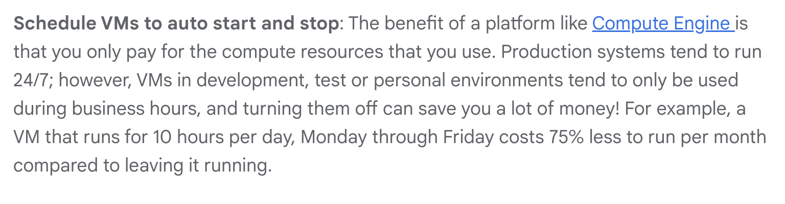

# Practice Test 3

**Question 1**
**Question 93**

- A. Use the Horizontal Pod Autoscaler and enable cluster autoscaling. Use an Ingress resource to load-balance the HTTPS traffic.
- Explanation
  To load-balance the HTTPS traffic, we should use an Ingress resource, which acts as a reverse proxy to route traffic to different services based on the HTTP(S) header or the hostname. We can use the GKE Ingress controller to manage the Ingress resource, which will automatically create and manage a Google Cloud Load Balancer to distribute traffic to the pods running the application

- https://cloud.google.com/kubernetes-engine/docs/how-to/scaling-apps#autoscaling-deployments

  > kubectl autoscale creates a HorizontalPodAutoscaler (or HPA) object that targets a specified resource (called the scale target) and scales it as needed.

  ```
  kubectl autoscale deployment my-app --max 6 --min 4 --cpu-percent 50
  ```

  **Creating an Ingress resource[1]**

Ingress is a Kubernetes resource that encapsulates a collection of rules and configuration for routing external HTTP(S) traffic to internal services.

- [1] https://cloud.google.com/kubernetes-engine/docs/tutorials/http-balancer#creating_an_ingress_resource

**Question 2**
**Question 94**

- B. Create an HTTPS load balancer with URL Maps. 100%
- https://cloud.google.com/load-balancing/docs/https/url-map
- Explanation
  An HTTPS load balancer is a type of load balancer that can distribute incoming HTTPS traffic to one or more back-end services, such as Compute Engine instances or Google Kubernetes Engine clusters. It can also provide SSL/TLS termination, enabling you to use your own SSL/TLS certificates and keys.

You can use URL Maps to configure the HTTPS load balancer to route traffic based on the URL path being requested. This allows you to set up different URL paths to be served by different back-end services, providing a high level of flexibility in your load balancing configuration.

**Question 3**
**Question 95**

- B. Implement retry logic using a truncated exponential backoff strategy.
- Explanation
  You should use exponential backoff to retry your requests when receiving errors with 5xx or 429 response codes from Cloud Storage.
  https://cloud.google.com/storage/docs/request-rate

**Question 4**
**Question 96**

- B. Use Deployment Manager to automate service provisioning. Use Stackdriver to monitor and debug your tests. 88%
- It is B, Google Best practice ---> never use scripts. They do not trust anyone else's code it seems. TarTar, from exam topic

**Question 5**
**Question 97**

- D. Save the files in multiple Multi-Regional Cloud Storage buckets, one bucket per multi-region.
- Explanation
  To reduce latency you need a bucket near your users and you can't setup multi-region with Asia/EU/America selected so A is out and we are left with D.

**Question 6**
**Question 98**

- C. Store the data in Cloud Storage and use lifecycle management to delete files when they expire. Most Voted
- Explanation
  To delete objects up to 4 years, you add an object lifecycle rule specifying the following form parameters:

Action = "Delete object" Object conditions = select ""Days since custom time" checkbox and specify 1460 days.

**Question 7**
**Question 99**

- A. Set the memcache service level to dedicated. Create a key from the hash of the query, and return database values from memcache before issuing a query to Cloud SQL. 100%
- Explanation
  Right Option - A. Set the memcache service level to dedicated. Create a key from the hash of the query, and return database values from memcache before issuing a query to Cloud SQL.

  A dedicated memcache is always better than shared until cost-effectiveness specify in the exam as objective. So, Option C and D are ruled out.

  From A and B, Option B is sending and updating query every minute which is over killing. So reasonable option left with A which balance performance and cost.

- https://cloud.google.com/appengine/docs/legacy/standard/php/memcache

**Question 8**
**Question 100**

- B. Using the Cron service provided by App Engine, publish messages to a Cloud Pub/Sub topic. Subscribe to that topic using a message-processing utility service running on Compute Engine instances. 88%
- B is correct. More appropriately: https://cloud.google.com/solutions/reliable-task-scheduling-compute-engine

- https://cloud.google.com/blog/products/gcp/reliable-task-scheduling-on-google-compute-engine
- A and C are out… messages are to be sent to pub sub and processed using a client. D is overkill for this purpose

**Question 9**
**Question 101**

- B. Lease a Transfer Appliance, upload archived files to it, and send it to Google to transfer archived data to Cloud Storage. Establish a connection with Google using a Dedicated Interconnect or Direct Peering connection and use it to upload files daily. 92%
- Agree B. 100Mbps connections for 10TB data transfer is takes too long. wk
- you can not use gsutil to load 10TB daily >>>and then continue loading 10 TB of data daily<<< it will take longer than 24hrs to upload using gsutil. zr79

- Explanation
  Dedicated interconnect will provide a private network with 10gbs. The internet limited to 100 mb is not possible to use cloud VPN ( it will use public internet so be limited for the daily)
- https://cloud.google.com/network-connectivity/docs/interconnect/concepts/dedicated-overview

**Question 10**
**Question 102**

- B. Cloud Pub/Sub to Cloud Dataflow. 62%
- I believe the answer is B. "Pub/Sub doesn't provide guarantees about the order of message delivery. Strict message ordering can be achieved with buffering, often using Dataflow." https://cloud.google.com/solutions/data-lifecycle-cloud-platform

- https://cloud.google.com/pubsub/docs/stream-messages-dataflow

**Question 11**
**Question 103**

- C. 1. Perform an assessment of virtual machines running in the current VMware environment. 2. Define a migration plan, prepare a Migrate for Compute Engine migration RunBook, and execute the migration. 95%
- Migrate for Compute Engine organizes groups of VMs into Waves. After understanding the dependencies of your applications, create runbooks that contain groups of VMs and begin your migration!
- https://cloud.google.com/migrate/compute-engine/docs/4.5/how-to/migrate-on-premises-to-gcp/overview

**Question 12**
**Question 104**

- D. Use an unmanaged instance group with an active and standby instance in different zones, use a regional persistent disk, and use a network load balancer in front of the instances.
- Correct Ans : D
  Since the Traffic is TCP, Ans A & C gets eliminated as HTTPS load balance is not supported.
  - B - File storage system is Cloud Firestore which do not give full control, hence eliminated.
  - D - Unmanaged instance group with network load balance with regional persistent disk for storage gives full control which is required for the migration.

**Question 13**

- Let’s talk about the Cloud Peering services, which are Direct Peering and Carrier Peering. These services are useful when you require access to Google and Google Cloud properties.
  
  
  
  

**Question 14**

- Cloud Run for Anthos allows you to deploy new revisions of your application with a specific percentage of traffic,
- https://cloud.google.com/anthos/run/docs/deploy-application
- Cloud Run for Anthos
- [Cloud Run: Split traffic between multiple revisions](https://cloud.google.com/run/docs/rollouts-rollbacks-traffic-migration#split-traffic)

- 
- 

**Question 15**

- you need to triage incidents quickly -> Alert
- between A and B, u don´t need to create a custom metric. I go with A
- **Explanation**
  An incident, also called an alert, is a record of the triggering of an alerting policy. Unless an alerting policy is snoozed or disabled, Cloud Monitoring opens an incident when a condition of an alerting policy is triggered.

**Question 16**

- **Explanation**
  Cloud SQL. If you use Cloud SQL, the fully managed Google Cloud MySQL database, you should enable automated backups and binary logging for your Cloud SQL instances. This allows you to perform a point-in-time recovery, which restores your database from a backup and recovers it to a fresh Cloud SQL instance

**Question 17**

- BigQuery

**Question 18**

- App Engine
- IaaS = Compute Engine. Hybrid = GKE (engineering heavy). PaaS = App Engine.

**Question 19**

- https://cloud.google.com/blog/topics/cost-management/best-practices-for-optimizing-your-cloud-costs
  

**Question 20**

- Note: If you're migrating an entire database from a supported database server (on-premises, in AWS, or Cloud SQL) to a new Cloud SQL instance, you can use **Database Migration Service** instead of exporting and then importing files.
- [Database Migration Service](../../PCB/Qwiklab/MySQL/README.md)
- [Export and import using SQL dump files](https://cloud.google.com/sql/docs/mysql/import-export/import-export-sql)
- [Minimize the performance impact of exports](https://cloud.google.com/sql/docs/mysql/import-export#serverless)

**Question 21**

- [Restrict external IP addresses to specific VMs](https://cloud.google.com/compute/docs/ip-addresses/reserve-static-external-ip-address#disableexternalip)
- **Explanation**
  Set an Organization Policy with a constraint on constraints/compute.vmExternalIpAccess. List the approved instances in the allowedValues list.

```
constraints/compute.vmExternalIpAccess
```

**Question 22**
**Question 23**
**Question 24**
**Question 25**
**Question 26**
**Question 27**
**Question 28**
**Question 29**
**Question 30**

**Question 31**
**Question 32**
**Question 33**
**Question 34**
**Question 35**
**Question 36**
**Question 37**
**Question 38**
**Question 39**
**Question 40**

**Question 41**

**Question 42**

**Question 43**

**Question 44**

**Question 45**


