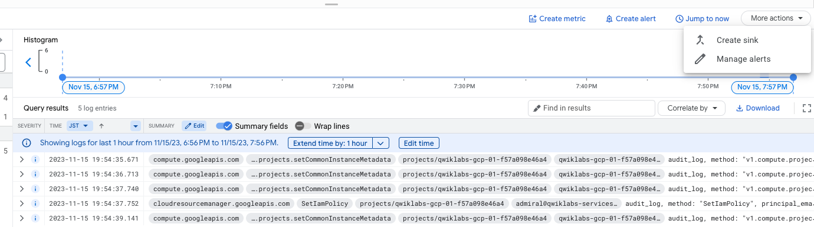

# Practice Test 3

**Question 1**
**Question 93**

- A. Use the Horizontal Pod Autoscaler and enable cluster autoscaling. Use an Ingress resource to load-balance the HTTPS traffic.
- Explanation
  To load-balance the HTTPS traffic, we should use an Ingress resource, which acts as a reverse proxy to route traffic to different services based on the HTTP(S) header or the hostname. We can use the GKE Ingress controller to manage the Ingress resource, which will automatically create and manage a Google Cloud Load Balancer to distribute traffic to the pods running the application

- https://cloud.google.com/kubernetes-engine/docs/how-to/scaling-apps#autoscaling-deployments

  > kubectl autoscale creates a HorizontalPodAutoscaler (or HPA) object that targets a specified resource (called the scale target) and scales it as needed.

  ```
  kubectl autoscale deployment my-app --max 6 --min 4 --cpu-percent 50
  ```

  **Creating an Ingress resource[1]**

Ingress is a Kubernetes resource that encapsulates a collection of rules and configuration for routing external HTTP(S) traffic to internal services.

- [1] https://cloud.google.com/kubernetes-engine/docs/tutorials/http-balancer#creating_an_ingress_resource

**Question 2**
**Question 94**

- B. Create an HTTPS load balancer with URL Maps. 100%
- https://cloud.google.com/load-balancing/docs/https/url-map
- Explanation
  An HTTPS load balancer is a type of load balancer that can distribute incoming HTTPS traffic to one or more back-end services, such as Compute Engine instances or Google Kubernetes Engine clusters. It can also provide SSL/TLS termination, enabling you to use your own SSL/TLS certificates and keys.

You can use URL Maps to configure the HTTPS load balancer to route traffic based on the URL path being requested. This allows you to set up different URL paths to be served by different back-end services, providing a high level of flexibility in your load balancing configuration.

**Question 3**
**Question 95**

- B. Implement retry logic using a truncated exponential backoff strategy.
- Explanation
  You should use exponential backoff to retry your requests when receiving errors with 5xx or 429 response codes from Cloud Storage.
  https://cloud.google.com/storage/docs/request-rate

**Question 4**
**Question 96**

- B. Use Deployment Manager to automate service provisioning. Use Stackdriver to monitor and debug your tests. 88%
- It is B, Google Best practice ---> never use scripts. They do not trust anyone else's code it seems. TarTar, from exam topic

**Question 5**
**Question 97**

- D. Save the files in multiple Multi-Regional Cloud Storage buckets, one bucket per multi-region.
- Explanation
  To reduce latency you need a bucket near your users and you can't setup multi-region with Asia/EU/America selected so A is out and we are left with D.

**Question 6**
**Question 98**

- C. Store the data in Cloud Storage and use lifecycle management to delete files when they expire. Most Voted
- Explanation
  To delete objects up to 4 years, you add an object lifecycle rule specifying the following form parameters:

Action = "Delete object" Object conditions = select ""Days since custom time" checkbox and specify 1460 days.

**Question 7**
**Question 99**

- A. Set the memcache service level to dedicated. Create a key from the hash of the query, and return database values from memcache before issuing a query to Cloud SQL. 100%
- Explanation
  Right Option - A. Set the memcache service level to dedicated. Create a key from the hash of the query, and return database values from memcache before issuing a query to Cloud SQL.

  A dedicated memcache is always better than shared until cost-effectiveness specify in the exam as objective. So, Option C and D are ruled out.

  From A and B, Option B is sending and updating query every minute which is over killing. So reasonable option left with A which balance performance and cost.

- https://cloud.google.com/appengine/docs/legacy/standard/php/memcache

**Question 8**
**Question 100**

- B. Using the Cron service provided by App Engine, publish messages to a Cloud Pub/Sub topic. Subscribe to that topic using a message-processing utility service running on Compute Engine instances. 88%
- B is correct. More appropriately: https://cloud.google.com/solutions/reliable-task-scheduling-compute-engine

- https://cloud.google.com/blog/products/gcp/reliable-task-scheduling-on-google-compute-engine
- A and C are out… messages are to be sent to pub sub and processed using a client. D is overkill for this purpose

**Question 9**
**Question 101**

- B. Lease a Transfer Appliance, upload archived files to it, and send it to Google to transfer archived data to Cloud Storage. Establish a connection with Google using a Dedicated Interconnect or Direct Peering connection and use it to upload files daily. 92%
- Agree B. 100Mbps connections for 10TB data transfer is takes too long. wk
- you can not use gsutil to load 10TB daily >>>and then continue loading 10 TB of data daily<<< it will take longer than 24hrs to upload using gsutil. zr79

- Explanation
  Dedicated interconnect will provide a private network with 10gbs. The internet limited to 100 mb is not possible to use cloud VPN ( it will use public internet so be limited for the daily)
- https://cloud.google.com/network-connectivity/docs/interconnect/concepts/dedicated-overview

**Question 10**
**Question 102**

- B. Cloud Pub/Sub to Cloud Dataflow. 62%
- I believe the answer is B. "Pub/Sub doesn't provide guarantees about the order of message delivery. Strict message ordering can be achieved with buffering, often using Dataflow." https://cloud.google.com/solutions/data-lifecycle-cloud-platform

- https://cloud.google.com/pubsub/docs/stream-messages-dataflow

**Question 11**
**Question 103**

- C. 1. Perform an assessment of virtual machines running in the current VMware environment. 2. Define a migration plan, prepare a Migrate for Compute Engine migration RunBook, and execute the migration. 95%
- Migrate for Compute Engine organizes groups of VMs into Waves. After understanding the dependencies of your applications, create runbooks that contain groups of VMs and begin your migration!
- https://cloud.google.com/migrate/compute-engine/docs/4.5/how-to/migrate-on-premises-to-gcp/overview

**Question 12**
**Question 104**

- D. Use an unmanaged instance group with an active and standby instance in different zones, use a regional persistent disk, and use a network load balancer in front of the instances.
- Correct Ans : D
  Since the Traffic is TCP, Ans A & C gets eliminated as HTTPS load balance is not supported.
  - B - File storage system is Cloud Firestore which do not give full control, hence eliminated.
  - D - Unmanaged instance group with network load balance with regional persistent disk for storage gives full control which is required for the migration.

**Question 13**

- Let’s talk about the Cloud Peering services, which are Direct Peering and Carrier Peering. These services are useful when you require access to Google and Google Cloud properties.

**Question 14**

- Cloud Run for Anthos allows you to deploy new revisions of your application with a specific percentage of traffic,
- https://cloud.google.com/anthos/run/docs/deploy-application
- Cloud Run for Anthos
- [Cloud Run: Split traffic between multiple revisions](https://cloud.google.com/run/docs/rollouts-rollbacks-traffic-migration#split-traffic)

**Question 15**

- you need to triage incidents quickly -> Alert
- between A and B, u don´t need to create a custom metric. I go with A
- **Explanation**
  An incident, also called an alert, is a record of the triggering of an alerting policy. Unless an alerting policy is snoozed or disabled, Cloud Monitoring opens an incident when a condition of an alerting policy is triggered.

**Question 16**

- **Explanation**
  Cloud SQL. If you use Cloud SQL, the fully managed Google Cloud MySQL database, you should enable automated backups and binary logging for your Cloud SQL instances. This allows you to perform a point-in-time recovery, which restores your database from a backup and recovers it to a fresh Cloud SQL instance

**Question 17**

- BigQuery

**Question 18**

- App Engine
- IaaS = Compute Engine. Hybrid = GKE (engineering heavy). PaaS = App Engine.

**Question 19**

- https://cloud.google.com/blog/topics/cost-management/best-practices-for-optimizing-your-cloud-costs

**Question 20**

- Note: If you're migrating an entire database from a supported database server (on-premises, in AWS, or Cloud SQL) to a new Cloud SQL instance, you can use **Database Migration Service** instead of exporting and then importing files.
- [Database Migration Service](../../PCB/Qwiklab/MySQL/README.md)
- [Export and import using SQL dump files](https://cloud.google.com/sql/docs/mysql/import-export/import-export-sql)
- [Minimize the performance impact of exports](https://cloud.google.com/sql/docs/mysql/import-export#serverless)

**Question 21**

- [Restrict external IP addresses to specific VMs](https://cloud.google.com/compute/docs/ip-addresses/reserve-static-external-ip-address#disableexternalip)
- **Explanation**
  Set an Organization Policy with a constraint on constraints/compute.vmExternalIpAccess. List the approved instances in the allowedValues list.

```
constraints/compute.vmExternalIpAccess
```

**Question 22**

- [View and understand Firewall Insights](https://cloud.google.com/network-intelligence-center/docs/firewall-insights/how-to/view-understand-insights#enabling-fw-rules-logging)
- Insights for overly permissive rules and deny rules are generated based on data collected for the duration when Firewall Rules Logging is enabled.

**Question 23**

- VPC Service Controls
- The following diagram shows a service perimeter that allows communication between a VPC project and Cloud Storage bucket inside the perimeter but blocks all communication across the perimeter:
  
- **Explanation**
  For all Google Cloud services secured with VPC Service Controls, you can ensure that: Resources within a perimeter are accessed only from clients within authorized VPC networks using Private Google Access with either Google Cloud or on-premises.
- https://cloud.google.com/vpc-service-controls/docs/overview

**Question 24**

- [Automatically apply VM configuration updates in a MIG](https://cloud.google.com/compute/docs/instance-groups/rolling-out-updates-to-managed-instance-groups)
-
- https://cloud.google.com/compute/docs/instance-groups/rolling-out-updates-to-managed-instance-groups#type

- **Update type**
  Managed instance groups support two types of update:

  - Automatic, or **proactive**, updates
  - Selective, or **opportunistic**, updates

  If you want to apply updates automatically, set the type to proactive.
  Alternatively, if an automated update is potentially too disruptive, you can choose to perform an opportunistic update.

- https://cloud.google.com/compute/docs/instance-groups/rolling-out-updates-to-managed-instance-groups#type

- MIGs -> update a MIG template -> opportunistic updates

**Question 25**

- B. Configure the Compute Engine instances with an instance template for the application, and use a regional persistent disk for the application data. Whenever a zonal outage occurs, use the instance template to spin up the application in **another zone in the same region**. Use the regional persistent disk for the application data. 100%
- [Build HA services using regional Persistent Disk](https://cloud.google.com/compute/docs/disks/high-availability-regional-persistent-disk)
- Regional Persistent Disk is a storage option that enables you to implement high availability (HA) services in Compute Engine.

**Question 26**

- You can't use Cloud NAT according to this documentation: https://cloud.google.com/nat/docs/troubleshooting#overlapping-ip-addresses

  - **Q:Can I use Cloud NAT to connect a VPC network to another network to work around overlapping IP addresses?**
  - No, Cloud NAT cannot apply to any custom route whose next hop is not the default internet gateway. For example, Cloud NAT cannot apply to traffic sent to a next hop Cloud VPN tunnel, even if the destination is a publicly routable IP address."

- **BigfoodPanda**

  - Could not be B, as Cloud NAT only apply on route targeting default gateway.
  - Could not be C : if you block route advertisement, then you will have no route to your datacenter, and you will be unable to connect your datacenter
  - Could not be D : blocking using firewall the overlapping IP space will not provide connectivity to these ressource

  So answer could only be A : user should update its IP space so it does not overlap

**Question 27**

- [Migrating Hadoop Jobs from On-Premises to Dataproc](https://cloud.google.com/architecture/hadoop/hadoop-gcp-migration-jobs)

  - This guide describes how to move your Apache Hadoop jobs to Google Cloud (by using Dataproc.

- Should be B, you want to minimize costs.
  https://cloud.google.com/dataproc/docs/concepts/compute/secondary-vms#preemptible_and_non-preemptible_secondary_workers

- The Apache® Hadoop® project develops open-source software for reliable, scalable, distributed computing.

- The Apache Hadoop software library is a framework that allows for the distributed processing of large data sets across clusters of computers using simple programming models.

**Question 28**

- https://cloud.google.com/compute/docs/images/os-details#debian

**Question 29**

- [GKE](https://github.com/hirokoymj/gcp-study-note/blob/master/ACE/study-app/README.md#gke)
- Cluster -> Nodes(VM) -> Pod(container), Pod(container), Pod(container), https://cloud.google.com/kubernetes-engine/docs/concepts/cluster-architecture
- https://cloud.google.com/blog/products/management-tools/using-logging-your-apps-running-kubernetes-engine
- https://cloud.google.com/stackdriver/docs/solutions/gke/installing#installing

**Question 30**

- **Limitations**
  While Cloud Storage FUSE has a file system interface, it is not like an NFS or CIFS file system on the backend. Additionally, Cloud Storage FUSE is not POSIX compliant. For a POSIX file system product in Google Cloud, see Filestore.
  https://cloud.google.com/storage/docs/gcs-fuse#differences-and-limitations
- Firestore is POSIX
- **Explanation**
  FUSE can be used, but it comes with latency. Question states, huge workload like 100 MB/sec writes, then FUSE is not a god choice. Filestore is much better solution.

**Question 31**

- **Explanation** The Anthos Service Mesh pages in the Google Cloud Console provide both summary and in-depth metrics, charts, and graphs that enable you to observe service behavior.
- https://cloud.google.com/service-mesh/docs/observability/explore-dashboard
  Anthos Service Mesh provides observability into the health and performance of your services

**Question 32**

- [Retention policies](https://cloud.google.com/storage/docs/bucket-lock#retention-policy)

**Question 33**

- **Explanation**
  "Any code change that has been pushed to the remote develop branch on your GitHub repository should be built" >> this excludes A and B since both happen locally before a push.

Answer 'D' only performs security scanning (not test) and is not automatically deployed which is requested.

**Question 34**

- **Explanation**
  In order to prioritize the availability on production environment (as per question), first we need to increase the number of max instances in the instance group, then, for sure we can investigate and restart application process.

**Question 35**

- **Explanation**
  Cloud Run is a serverless compute platform that allows for automatic scaling and provides a low-cost option for applications with unpredictable or variable traffic patterns.

  Cloud Bigtable is a NoSQL database that is designed for high-throughput, low-latency workloads and can handle large amounts of data. It is also fully managed, so it does not require significant administration overhead.

**Question 36**

- GKE
- each microservice with a specific number of replicas = Deployment
- internal to the cluster = Service
- **Explanation**
  B is incorrect. Ingress comes with a HTTP(S) LB with external IP hence is not needed for communications within the cluster internally.

  Microservice as Deployment - used to create replicas as per this request

  DNS name - used as an alias service name for External name which is user for internal requests

**Question 37**

- **Explanation**
  It talks about managing all network resources in a company. Google always recommends having a shared VPC to maintain network resources in an organization. The separation of roles adds to the favor of having a shared VPC.
- https://cloud.google.com/vpc/docs/shared-vpc

  When you use Shared VPC, you designate a project as a host project and attach one or more other service projects to it. The VPC networks in the host project are called Shared VPC networks. Eligible resources from service projects can use subnets in the Shared VPC network.

  Shared VPC lets organization administrators delegate administrative responsibilities, such as creating and managing instances, to Service Project Admins while maintaining centralized control over network resources like subnets, routes, and firewalls.

**Question 38**

- **Explanation**
  Store static content such as HTML and images in a Cloud Storage bucket. Use Cloud Functions to host the APIs and save the user data in Firestore

**Question 39**

- Explanation
  Pub/Sub & Cloud Function serves the purpose
  

  <hr />

  

**Question 40**

- VM, no public IP, no VPN, connect SSH from outside GCP.
- Identity-Aware Proxy(IAP)
- https://cloud.google.com/iap/#
  - Use identity and context to guard access to your applications and VMs
  - Control access to your cloud-based and on-premises applications and VMs running on Google Cloud
  - Verify user identity and use context to determine if a user should be granted access
  - Work from untrusted networks without the use of a VPN

**Question 41**

- Organization -> Finance/Shopping folder
- The development team: Google Group + Project Owner under Org.
- Prevent the development team from creating resources in projects in the Finance folder
- C. Assign the development team group the Project Owner role on the Shopping folder, and remove the development team group Project Owner role from the Organization.
- https://cloud.google.com/resource-manager/docs/creating-managing-folders

**Question 42**

- Istio fault injection is to test the resiliency of your application.
- https://istio.io/latest/docs/tasks/traffic-management/fault-injection/
- Fault Injection - This task shows you how to inject faults to test the resiliency of your application.

```
$ kubectl apply -f samples/bookinfo/networking/virtual-service-ratings-test-delay.yaml
```

- **Injecting an HTTP delay fault**
  To test the Bookinfo application microservices for resiliency, inject a 7s delay between the reviews:v2 and ratings microservices for user jason. This test will uncover a bug that was intentionally introduced into the Bookinfo app.

```
kubectl apply -f samples/bookinfo/networking/virtual-service-ratings-test-delay.yaml
```

```
apiVersion: networking.istio.io/v1beta1
kind: VirtualService
...
spec:
  hosts:
  - ratings
  http:
  - fault:
      delay:
        fixedDelay: 7s
        percentage:
          value: 100
    match:
    - headers:
        end-user:
          exact: jason
    route:
    - destination:
        host: ratings
        subset: v1
  - route:
    - destination:
        host: ratings
        subset: v1
```

**Question 43**

- just building code without having to create and maintain the underlying infrastructure. -> serverless -> App Engine

**Question 44**

https://istio.io/latest/docs/tasks/traffic-management/fault-injection/

- This task shows you how to inject faults to test the resiliency of your application.

- **Explanation**
  A versioning strategy for the APIs that increases the version number on every backward-incompatible change is the best way to ensure stability for your customers in case the API makes backward-incompatible changes. This will allow you to track the changes that have been made to the API and allow your customers to easily identify the latest version of the API.

**Question 45**

- You are comparing wrong things. Monolithic application need to be compared against Micro Services. In monolithic application; you deploy all the features/api end-points in a single EAR/WAR file; i.e. single JVM. In micro-services they are deployed in multiple JVMs. Note that in Monolithic architecture also you have multiple REST end points exposed.

3 tier, or 2 tier or N tier architectures is a different concept. It says how many subsystems/modules your application is divided like database layer, client layer, application logic layer. Hence, monolithic as well microservices both can be n tier applications.
