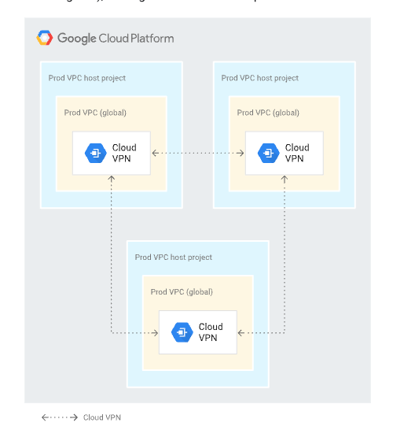
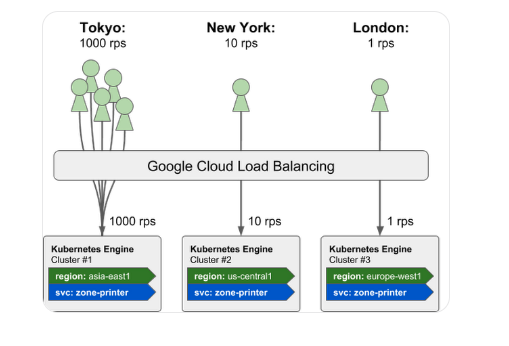
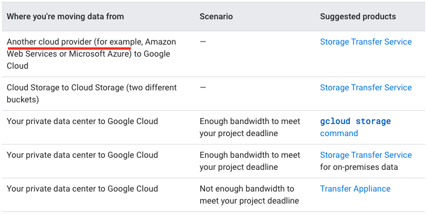
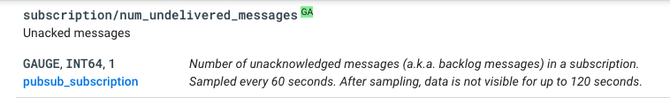

# Practice Test 4

**Question 1**

- D. 1. Create a managed instance group with Compute Engine instances. 2. Create a global load balancer and configure it with two backends: ג—‹ Managed instance group ג—‹ Cloud Storage bucket 3. Enable Cloud CDN on the bucket backend. M

**Explanation**

- This solution will improve the performance of the application by: Automatically scaling the number of Compute Engine instances to meet demand.
- Distributing traffic across multiple instances to reduce load on each instance. Caching popular songs in memory to reduce the number of times that they need to be loaded from Cloud Storage.

- Using a global load balancer to distribute traffic evenly across all regions. Using Cloud CDN to deliver files to users from a location that is closer to them. This solution is the most efficient and cost-effective way to improve the performance of the application.

- [Set up CDN](https://cloud.google.com/cdn/docs/using-cdn)
  > Cloud CDN works with the global external Application Load Balancer and the classic Application Load Balancer to deliver content to your users
- [Cloud CDN overview](https://cloud.google.com/cdn/docs/overview)
  > Cloud CDN (Content Delivery Network) uses Google's global edge network to serve content closer to users,


<hr />

**Question 2**

- D. 1. Append metadata to file body 2. Compress individual files 3. Name files with a random prefix pattern 4. Save files to one bucket Most Voted
- https://cloud.google.com/storage/docs/request-rate#naming-convention

> Auto-scaling of an index range can be slowed when using sequential names, such as object keys based on a sequence of numbers or timestamp. This occurs because requests are constantly shifting to a new index range, making redistributing the load harder and less effective.

> In order to maintain a high request rate, avoid using sequential names. Using completely random object names gives you the best load distribution

```
my-bucket/2016-05-10-12-00-00/file1
my-bucket/2016-05-10-12-00-00/file2
my-bucket/2016-05-10-12-00-01/file3
```

```
my-bucket/2fa764-2016-05-10-12-00-00/file1
my-bucket/5ca42c-2016-05-10-12-00-00/file2
my-bucket/6e9b84-2016-05-10-12-00-01/file3
```

<hr />

**Question 3**

- B. Use source code security analyzers as part of the CI/CD pipeline Most Voted
- E. Run a vulnerability security scanner as part of your continuous-integration /continuous-delivery (CI/CD) pipeline Most VotedMost Voted
- https://cloud.google.com/kubernetes-engine/docs/concepts/best-practices-continuous-integration-delivery-kubernetes
- continuous integration and continuous delivery (CI/CD)
- Continuous integration (CI) is a practice in which developers integrate all their code changes back into a main branch as often as possible.
- Continuous delivery (CD) lets you release code at any time.

<hr />

**Question 4**

- D. 1. Use gsutil -m to upload the files to Cloud Storage. 2. Use gsutil hash -c FILE_NAME to generate CRC32C hashes of all on-premises files. 3. Use gsutil ls -L gs://[YOUR_BUCKET_NAME] to collect CRC32C hashes of the uploaded files. 4. Compare the hashes. Most Voted

- Explanation
  Calculate hashes on local files, which can be used to compare with gsutil ls -L output. If a specific hash option is not provided, this command calculates all gsutil-supported hashes for the files. Note that gsutil automatically performs hash validation when uploading or downloading files, so this command is only needed if you want to write a script that separately checks the hash. If you calculate a CRC32c hash for files without a precompiled crcmod installation, hashing will be very slow. See gsutil help crcmod for details.

- https://cloud.google.com/storage/docs/gsutil/commands/hash
- https://cloud.google.com/storage/docs/uploading-objects#gsutil
- https://cloud.google.com/storage/docs/gsutil/commands/cp

- If you have a large number of files to transfer, you can perform a parallel multi-threaded/multi-processing copy using the top-level gsutil -m option (see gsutil help options):

```
gsutil -m
gsutil hash -c FILE_NAME
```

<hr />

**Question 5**

- A. Use Google Cloud Shell in the Google Cloud Console to interact with Google Cloud. Most Voted
- https://cloud.google.com/sdk/gcloud

<hr />

**Question 6**

- C. Digitally sign each timestamp and log entry and store the signature
- https://stackoverflow.com/questions/3829546/how-can-i-digitally-sign-logs-to-ensure-that-they-have-not-been-modified

**Explanation**

C (Correct answer) - Digitally sign each timestamp and log entry and store the signature. Answer A, B, and D don’t have any added value to verify the authenticity of your logs. Besides, Logs are mostly suitable for exporting to Cloud storage, BigQuery, and PubSub. SQL database is not the best way to be exported to nor store log data.

More Explanation: To verify the authenticity of your logs if they are tampered with or forged, you can use a certain algorithm to generate digest by hashing each timestamp or log entry and then digitally sign the digest with a private key to generate a signature. Anybody with your public key can verify that signature to confirm that it was made with your private key and they can tell if the timestamp or log entry was modified. You can put the signature files into a folder separate from the log files. This separation enables you to enforce granular security policies.

<hr />

**Question 7**

- B. Use the Data Transfer appliance to perform an offline migration. 48%
- D. Compress the data and upload it with gsutil -m to enable multi-threaded copy 43%
- Answer is B. Transfer appliance
- According to https://cloud.google.com/architecture/migration-to-google-cloud-transferring-your-large-datasets
  > The expected turnaround time for a network appliance to be shipped, loaded with your data, shipped back, and rehydrated on Google Cloud is 20 days. If your online transfer timeframe is calculated to be substantially more than this timeframe, consider Transfer Appliance.
- [Transfer Appliance for larger transfers](https://cloud.google.com/architecture/migration-to-google-cloud-transferring-your-large-datasets#transfer_appliance_for_larger_transfers)
- For large-scale transfers (especially transfers with limited network bandwidth), Transfer Appliance is an excellent option

<hr />

**Question 8**

- C. Set up a Cloud VPN gateway in each Shared VPC and peer Cloud VPNs.79%
- looks like the following best practice: https://cloud.google.com/architecture/best-practices-vpc-design#shared-service

  Cloud VPN is another alternative. Because Cloud VPN establishes reachability through managed IPsec tunnels, it doesn't have the aggregate limits of VPC Network Peering. Cloud VPN uses a VPN Gateway for connectivity and doesn't consider the aggregate resource use of the IPsec peer. The drawbacks of Cloud VPN include increased costs (VPN tunnels and traffic egress), management overhead required to maintain tunnels, and the performance overhead of IPsec.



<hr />

**Question 9**

- C. Configure VPC Service Controls and configure Private Google Access. 100%
- C is the recommended one https://cloud.google.com/vpc-service-controls/docs/overview

**Explanation**

To secure data from exfiltration by malicious insiders, compromised code or accidental oversharing, we use VPC Service controls

https://cloud.google.com/vpc-service-controls/docs/overview

For private access options, connect to services in VPC networks we use private service endpoints or VPC network peering.

https://cloud.google.com/vpc/docs/private-access-options#connect-services

<hr />

**Question 10**

- B. Develop the application for App Engine standard environment. 100%
- https://cloud.google.com/appengine/docs/the-appengine-environments#compare_high-level_features
- Standard environment, Scale to zero, YES
- Flexible environment, Scale to zero, NO

<hr />

**Question 11**

- C. Create a second GKE cluster in asia-southeast1, and use kubemci to create a global HTTP(s) load balancer. 76%
- https://cloud.google.com/blog/products/gcp/how-to-deploy-geographically-distributed-services-on-kubernetes-engine-with-kubemci
- used kubemci to create a single GCLB instance to stitch the services together.
- Multi cluster Ingress(MCI)
  

<hr />

**Question 12**

- D. Create a snapshot of the root disk, create an image file in Google Cloud Storage from the snapshot, and create a new virtual machine instance in the US-East region using the image file the root disk. 67%
- https://cloud.google.com/compute/docs/instances/copy-vm-between-projects
- snapshot -> image

```
gcloud compute snapshots create SNAPSHOT_NAME \
    --source-disk SOURCE_DISK \
    --snapshot-type SNAPSHOT_TYPE \
    --source-disk-zone SOURCE_DISK_ZONE
```

```
gcloud compute images create IMAGE_NAME \
    --source-snapshot=SOURCE_SNAPSHOT \
    [--storage-location=LOCATION]
```

<hr />

**Question 13**

- B. Mount a Local SSD volume as the backup location. After the backup is complete, use gsutil to move the backup to Google Cloud Storage. 76%

**Ans: B**

Persistent Disk snapshot not required: "They need to take backups of a specific database at regular intervals."

"The backup activity needs to complete as quickly as possible and cannot be allowed to impact disk performance."

This can be achieved by using both Local SSD & GCS Fuse (mounting GCS as directory), but as the question stats needs to complete as quickly as possible.

General Rule: Any addition of components introduce a latency. I could not get write throughput of GCS & Local SSD, even if we consider both provides same throughput, streaming data through network to GCS Bucket introduce latency. Attached Local SSD has advantage in this case, since there is no network involved.

From **Local SSD to GCS bucket** - copy job does not impact the mysql data disk.

<hr />

**Question 14**

- B. Google Kubernetes Engine with containers 65%
- C. Google App Engine Standard Environment
- I would go with B&C - Cloud-native, less-ops and auto-scaling all get addressed

**BC :**
No-ops means you cannot use Compute Engines as they are simple VMs.

Kubernetes is nearly no-ops (remains some operations like nodes updates, but all-in-all Google manages nearly all the operations)
App Engine is truely no-ops

<hr />

**Question 15**

- B. Create a key with Cloud Key Management Service (KMS). Set the encryption key on the bucket to the Cloud KMS key. 83%

- [Key rotation](https://cloud.google.com/storage/docs/encryption/customer-managed-keys#key-rotation)

- Cloud KMS supports both automatic and manual key rotation to a new version.

<hr />

**Question 16**

- B. Use the Storage Transfer Service to move the data. 100%(my answer too)
- 10 TB of data in an object storage service from a third-party provider -> source might be AWS/Azur -> so B.



<hr />

**Question 17**

- B. Google Compute Engine managed instance groups with auto-scaling. 100%
- B, https://cloud.google.com/compute/docs/autoscaler/
- Changing the tests as little as possible rules out C & D. Test takes several hours and you need to improve perfromace. Autocaling with MIG will do it, Unmanaged group cannot autosacle. Load balancer will not improve perfromance

<hr />

**Question 18**

- C. Review your RowKey strategy and ensure that keys are evenly spread across the alphabet. 100%
- [Schema design best practices - Rowkey](https://cloud.google.com/bigtable/docs/schema-design#row-keys)

  > Design your row key based on the queries you will use to retrieve the data. Well-designed row keys get the best performance out of Bigtable. The most efficient Bigtable queries retrieve data using one of the following:

- The RowKey is used to sort data within a Cloud Bigtable cluster.

<hr />

**Question 19**

- C. 1. Create folders under the Organization resource named Development and Production. 2. Grant all developers the Project Creator IAM role on the Development folder. 3. Move the developer projects into the Development folder. 4. Set the policies for all projects on the Organization. 5. Additionally, set the production policies on the Production folder. 97%

- C, because managing multiple organizations is not a Google best practice.

<hr />

**Question 20**

- C. Update the existing Kubernetes Engine cluster with the following command: gcloud alpha container clusters update mycluster - -enable- autoscaling - -min-nodes=1 - -max-nodes=10. 100%

- [Enabling autoscaling for an existing node pool](https://cloud.google.com/kubernetes-engine/docs/how-to/cluster-autoscaler#enable_autoscaling)

```
gcloud container clusters update cluster-name --enable-autoscaling \
--min-nodes 1 --max-nodes 10 --zone compute-zone --node-pool default-pool
```

- Cluster is already running so use update instead of create new cluster.

<hr />

**Question 21**

- A. Use a load testing tool to simulate the expected number of concurrent users and total requests to your application, and inspect the results. 84%
- It is A. You want to TEST the deployment, not changing anything (yet).
- A load testing tool can be used to simulate the expected number of concurrent users and total requests to your application. This will allow you to test how your application handles the expected load and to identify any potential problems.

- Enabling autoscaling on the GKE cluster and enabling horizontal pod autoscaling on your application deployments will not help you to test the latency of your application. This will only help to ensure that your application can handle the expected load.

<hr />

**Question 22**

- C. 1. Attach a regional SSD persistent disk to the first instance. 2. In case of a zone outage, force-attach the disk to the other instance. 90%

- [Manage failures for regional Persistent Disk](https://cloud.google.com/compute/docs/disks/repd-failover)
  Regional Persistent Disk is a storage option that provides synchronous replication of data between two zones in a region. You can use regional Persistent Disk as a building block when you implement high availability (HA) services in Compute Engine.

<hr />

**Question 23**

- A. Set up a filter in Cloud Logging and a Cloud Storage bucket as an export target for the logs you want to save. 100%

- [Create a sink](https://cloud.google.com/logging/docs/export/configure_export_v2#creating_sink)
  - **Cloud Logging bucket**: Select or create a Logging bucket.
  - **BigQuery table**: Select or create the particular dataset to receive the routed logs. You also have the option to use partitioned tables.
  - **Cloud Storage bucket**: Select or create the particular Cloud Storage bucket to receive the routed logs.
  - **Pub/Sub topic**: Select or create the particular topic to receive the routed logs.
  - **Splunk**: Select the Pub/Sub topic for your Splunk service.
  - **Other project**: Populate the Sink destination field as described in Destination path formats.

<hr />

**Question 24**

- B. Org viewer, project viewer. 100%
- A is not correct because Project owner is too broad. The security team does not need to be able to make changes to projects.
- B is correct because: Org viewer grants the security team permissions to view the organization's display name.
  Project viewer grants the security team permissions to see the resources within projects.
- C is not correct because Org admin is too broad. The security team does not need to be able to make changes to the organization.
- D is not correct because Project owner is too broad. The security team does not need to be able to make changes to projects.

<hr />

**Question 25**

- C. Meet with the cloud operations team and the engineer to discuss load balancer options. 100%
- [LB - WebSocket support](https://cloud.google.com/load-balancing/docs/https#websocket_support)
- Google Cloud HTTP(S)-based load balancers have native support for the WebSocket protocol when you use HTTP or HTTPS as the protocol to the backend.

<hr />

**Question 26**

- D. Store the data in a Cloud Storage bucket. Design the processing pipelines to retrieve the data from the bucket. 100%
- D, store RAW unstructured data as-is in Cloud Storage, and then define how to process it.
  Classical Data Lake ELT (Extract -> Load -> Transform )
- https://cloud.google.com/architecture/big-data-analytics/analytics-lakehouse

<hr />

**Question 27**

- C. Set up a Cloud Monitoring sink that triggers the Cloud Function after an instance removal log message arrives in Cloud Logging. 79%
- https://cloud.google.com/compute/docs/shutdownscript#limitations
  Compute Engine executes shutdown scripts only on a best-effort basis.

- In this scenario, you want to ensure that the commands in the shutdown script are run reliably every time an instance is shut down. One way to do this is by setting up a Cloud Monitoring sink that triggers a Cloud Function after an instance removal log message arrives in Cloud Logging. This will allow you to use the Cloud Function to perform the necessary tasks (such as removing database entries) when an instance is shut down, and it will ensure that these tasks are performed reliably and consistently.

- Option A: Modifying the shutdown script to wait for 30 seconds before triggering the Cloud Function is not a reliable solution, as it relies on the shutdown script being able to run for at least 30 seconds before the instance is shut down.

<hr />

**Question 28**

- D. Import a key in Cloud KMS. Create a dataset in BigQuery using the customer-supplied key option and select the created key. 100%
- The answer is easy. It says keys must be left outside of Google Cloud.
  This automatically eliminates A / B.
  Now the C option says decrypts before storing it in BigQuery which the point is to encrypt the data while been in BigQuery, D is the only possible answer.
- https://cloud.google.com/kms/docs
- Cloud Key Management Service allows you to create, import, and manage cryptographic keys and perform cryptographic operations in a single centralized cloud service. You can use these keys and perform these operations by using Cloud KMS directly, by using Cloud HSM or Cloud External Key Manager, or by using Customer-Managed Encryption Keys (CMEK) integrations within other Google Cloud services.

<hr />

**Question 29**

- D. Configure a Kubernetes autoscaling deployment based on the subscription/num_undelivered_messages metric. 100%
- [Cloud Pub/Sub - Monitor message backlog](https://cloud.google.com/pubsub/docs/monitoring#monitoring_the_backlog)

  To ensure that your subscribers are keeping up with the flow of messages, create a dashboard. The dashboard can show the following backlog metrics, aggregated by resource, for all your subscriptions:

- subscription/num_undelivered_message



<hr />

**Question 30**

- D. Create a Compute Engine instance with CPU and memory options similar to your application's current on-premises virtual machine. Install the Cloud Monitoring agent, and deploy the third-party application. Run a load test with normal traffic levels on the application, and follow the Rightsizing Recommendations in the Cloud Console. 70%

- [Cloud instance rightsizing](https://cloud.google.com/migrate/compute-engine/docs/4.9/concepts/planning-a-migration/cloud-instance-rightsizing?hl=en)

**Rightsizing provides two types of recommendations:**

1. Performance-based recommendations: Recommends Compute Engine instances based on the CPU and RAM currently allocated to the on-premises VM. This recommendation is the default.

2. Cost-based recommendations: Recommends Compute Engine instances based on:
   **The current CPU and RAM configuration of the on-premises VM.**

<hr />

**Question 31**

- A. Configure an organization policy to restrict identities by domain.100%
- https://cloud.google.com/resource-manager/docs/organization-policy/restricting-domains

<hr />

**Question 32**

- A. Inspect the logs and metrics from the instances in Cloud Logging and Cloud Monitoring. 100%
- First thing to do is to inspect logs and monitoring to see what is happening

<hr />

**Question 33**

- A. Use Google App Engine to serve the website and Google Cloud Datastore to store user data. 100%
- C. Use a managed instance group to serve the website and Google Cloud Bigtable to store user data. 100%
- Data is unstructured... Datastore and BigTable should be used. So it is A and C

<hr />

**Question 34**

- C. 1. Create a dataset for the data science team. 2. Create views of tables that you want to share, excluding PII. 3. Assign an appropriate project-level IAM role to the members of the data science team. 4. Assign access controls to the dataset that contains the view. 5. Authorize the view to access the source dataset. 57%
- A. 36%
- C: view in a different dataset (https://cloud.google.com/bigquery/docs/share-access-views: "Authorized views should be created in a different dataset from the source data. That way, data owners can give users access to the authorized view without simultaneously granting access to the underlying data.")

<hr />

**Question 35**

- D. Configure serverless VPC access. 90%
- https://cloud.google.com/vpc/docs/private-access-options
  You can use a **Serverless VPC Access connector** to let Cloud Run, App Engine standard, and Cloud Functions environments send packets to the internal IPv4 addresses of resources in a VPC network. Serverless VPC Access also supports sending packets to other networks connected to the selected VPC network.

<hr />

**Question 36**

- A. 1. Install a Cloud Logging agent on all instances. 2. Create a sink to export logs into a regional Cloud Storage bucket. 3. Create an Object Lifecycle rule to move files into a Coldline Cloud Storage bucket after one month. 4. Configure a retention policy at the bucket level using bucket lock. 97%
- This approach would allow you to use Cloud Logging to collect and export the logs from the Compute Engine instances into a Cloud Storage bucket. You can then use an Object Lifecycle rule to automatically move the logs from the regional bucket to a Coldline bucket after one month, which will reduce storage costs for logs that are not actively being queried. By configuring a retention policy using bucket lock, you can ensure that the logs are retained for at least two years for audit purposes. This approach follows Google-recommended practices for storing logs and minimizing costs.

<hr />

**Question 37**

- D. Use node affinity labels based on the node name when creating Compute Engine instances in order to host each workload on the correct node. 100%

- Answer is D. The question is about aligning EACH client to their dedicated nodes (D), not to a node group (C).
- [Default affinity labels](https://cloud.google.com/compute/docs/nodes/sole-tenant-nodes#default_affinity_labels)
- The above reference clearly articulates the default affinity label for node group and node name. Unless we're thinking about growing each client to their own dedicated node groups (not in the current requirement), then the answer is not C, rather D.
- [Sole-tenancy overview](https://cloud.google.com/compute/docs/nodes/sole-tenant-nodes)

  > Sole-tenancy lets you have exclusive access to a sole-tenant node, which is a physical Compute Engine server that is dedicated to hosting only your project's VMs.

  > Use sole-tenant nodes to keep your VMs physically separated from VMs in other projects,

  > VMs running on sole-tenant nodes can use the same Compute Engine features as other VMs, including transparent scheduling and block storage, but with an added layer of hardware isolation

<hr />

**Question 38**

- A. Create an aggregated export on the Production folder. Set the log sink to be a Cloud Storage bucket in an operations project. 98%
- https://cloud.google.com/logging/docs/export/aggregated_sinks

  Aggregated sinks combine and route log entries from the Google Cloud resources contained by an organization or folder. For instance, you might aggregate and route audit log entries from all the folders contained by an organization to a Cloud Storage bucket.

<hr />

**Question 39**

- AEF 100%(ET) or ABF(udemy/Me)
- A. Ensure that the load tests validate the performance of Cloud Bigtable.
- B. Create a separate Google Cloud project to use for the load-testing environment.
- E. Instrument the production services to record every transaction for replay by the load-testing tool.
- F. Instrument the load-testing tool and the target services with detailed logging and metrics collection.
- As Q is to test the scalability, so A is important. Also, B is "best-practice" and not a requirement for load testing.

<hr />

**Question 40**

- C. In the Logging section of the console, specify GCE Network as the logging section. Search for the Create Insert entry. 100%
- https://stackoverflow.com/questions/72716412/what-logs-can-i-use-to-diagnose-connectivity-issues-on-a-gce-network

1. Navigation Menu > Logging > Log Explorer
2. On the right upper part of your GCP console, click Resource.
3. Scroll down and choose **GCE Network**.
4. Once you click GCE Network, it will show you the Network ID of your VPC network
5. Then choose where your VM instance is located then click “apply”.

<hr />

**Question 41**

- C. Configure binary authorization policies for the development, staging, and production clusters. - Create attestations as part of the continuous integration pipeline. 100%
- https://cloud.google.com/binary-authorization/docs/overview
- Binary authorization is a feature of Google Kubernetes Engine that allows you to enforce policies on the images that are deployed to your clusters. By configuring binary authorization policies for the development, staging, and production clusters, you can ensure that only images that have been attested by an authorized entity are allowed to be deployed to those clusters. You can create the attestations as part of the continuous integration pipeline, which will allow you to verify that the image has been tested before it is deployed to the next environment.

<hr />

**Question 42**

- B. Create a Google Group per department and add all department members to their respective groups. Create a folder per department and grant the respective group the required IAM permissions at the folder level. Add the projects under the respective folders. 100%
- https://cloud.google.com/resource-manager/docs/access-control-folders#best-practices-folders-iam
  Use groups whenever possible to manage principals.

- https://cloud.google.com/resource-manager/docs/creating-managing-folders
  A folder can contain projects, other folders, or a combination of both. Organizations can use folders to group projects under the organization node in a hierarchy. For example, your organization might contain multiple departments, each with its own set of Google Cloud resources. Folders allow you to group these resources on a per-department basis.

<hr />

**Question 43**

- A. Create a Dataflow pipeline to retrieve the data from the external sources. As part of the pipeline, use the Cloud Data Loss Prevention (Cloud DLP) API to remove any PII data. Store the result in BigQuery. 74%

- PII -> Cloud DLP. So that narrows the choices down to A or C. C says "Ask the external partners to upload all data on Cloud Storage" which is not generally a feasible or recommended practice. Also, we cannot store PII anywhere, including in GCS. Answer is A.

<hr />

**Question 44**

- C. Make the container tag match the source code commit hash. 100%
- [Tagging using the Git commit hash](https://cloud.google.com/architecture/best-practices-for-building-containers#tagging_using_the_git_commit_hash)
- You can use this commit hash as a version number for your software, but also as a tag for the Docker image built from this specific version of your software. Doing so makes Docker images traceable: because in this case the image tag is immutable, you instantly know which specific version of your software is running inside a given container.

<hr />

**Question 45**

- A. Configure the GKE cluster as a private cluster. 98%
- [Workloads on private GKE clusters unable to access internet](https://cloud.google.com/kubernetes-engine/docs/how-to/private-clusters#workloads_on_private_clusters_unable_to_access_internet)
  Ensure you configure the Cloud NAT gateway to apply at least the following subnet IP address ranges for the subnet that your cluster uses:
- Cloud NAT allows the resources in private subnet to access the internet—for updates, patching, config management, and more—in a controlled and efficient manner.
