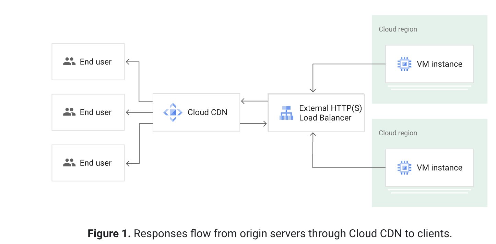

# Practice Test 3

**Question 1**

- D. 1. Create a managed instance group with Compute Engine instances. 2. Create a global load balancer and configure it with two backends: ג—‹ Managed instance group ג—‹ Cloud Storage bucket 3. Enable Cloud CDN on the bucket backend. M

**Explanation**

- This solution will improve the performance of the application by: Automatically scaling the number of Compute Engine instances to meet demand.
- Distributing traffic across multiple instances to reduce load on each instance. Caching popular songs in memory to reduce the number of times that they need to be loaded from Cloud Storage.

- Using a global load balancer to distribute traffic evenly across all regions. Using Cloud CDN to deliver files to users from a location that is closer to them. This solution is the most efficient and cost-effective way to improve the performance of the application.

- [Set up CDN](https://cloud.google.com/cdn/docs/using-cdn)
  > Cloud CDN works with the global external Application Load Balancer and the classic Application Load Balancer to deliver content to your users
- [Cloud CDN overview](https://cloud.google.com/cdn/docs/overview)
  > Cloud CDN (Content Delivery Network) uses Google's global edge network to serve content closer to users,



<hr />

**Question 2**

- D. 1. Append metadata to file body 2. Compress individual files 3. Name files with a random prefix pattern 4. Save files to one bucket Most Voted
- https://cloud.google.com/storage/docs/request-rate#naming-convention

> Auto-scaling of an index range can be slowed when using sequential names, such as object keys based on a sequence of numbers or timestamp. This occurs because requests are constantly shifting to a new index range, making redistributing the load harder and less effective.

> In order to maintain a high request rate, avoid using sequential names. Using completely random object names gives you the best load distribution

```
my-bucket/2016-05-10-12-00-00/file1
my-bucket/2016-05-10-12-00-00/file2
my-bucket/2016-05-10-12-00-01/file3
```

```
my-bucket/2fa764-2016-05-10-12-00-00/file1
my-bucket/5ca42c-2016-05-10-12-00-00/file2
my-bucket/6e9b84-2016-05-10-12-00-01/file3
```

<hr />

**Question 3**

- B. Use source code security analyzers as part of the CI/CD pipeline Most Voted
- E. Run a vulnerability security scanner as part of your continuous-integration /continuous-delivery (CI/CD) pipeline Most VotedMost Voted

<hr />

**Question 4**

- D. 1. Use gsutil -m to upload the files to Cloud Storage. 2. Use gsutil hash -c FILE_NAME to generate CRC32C hashes of all on-premises files. 3. Use gsutil ls -L gs://[YOUR_BUCKET_NAME] to collect CRC32C hashes of the uploaded files. 4. Compare the hashes. Most Voted

- Explanation
  Calculate hashes on local files, which can be used to compare with gsutil ls -L output. If a specific hash option is not provided, this command calculates all gsutil-supported hashes for the files. Note that gsutil automatically performs hash validation when uploading or downloading files, so this command is only needed if you want to write a script that separately checks the hash. If you calculate a CRC32c hash for files without a precompiled crcmod installation, hashing will be very slow. See gsutil help crcmod for details.

- https://cloud.google.com/storage/docs/gsutil/commands/hash
- https://cloud.google.com/storage/docs/uploading-objects#gsutil
- https://cloud.google.com/storage/docs/gsutil/commands/cp

- If you have a large number of files to transfer, you can perform a parallel multi-threaded/multi-processing copy using the top-level gsutil -m option (see gsutil help options):

```
gsutil -m
gsutil hash -c FILE_NAME
```

<hr />

**Question 5**

- A. Use Google Cloud Shell in the Google Cloud Console to interact with Google Cloud. Most Voted
- https://cloud.google.com/sdk/gcloud

<hr />

**Question 6**

- C. Digitally sign each timestamp and log entry and store the signature

**Explanation**

C (Correct answer) - Digitally sign each timestamp and log entry and store the signature. Answer A, B, and D don’t have any added value to verify the authenticity of your logs. Besides, Logs are mostly suitable for exporting to Cloud storage, BigQuery, and PubSub. SQL database is not the best way to be exported to nor store log data.

More Explanation: To verify the authenticity of your logs if they are tampered with or forged, you can use a certain algorithm to generate digest by hashing each timestamp or log entry and then digitally sign the digest with a private key to generate a signature. Anybody with your public key can verify that signature to confirm that it was made with your private key and they can tell if the timestamp or log entry was modified. You can put the signature files into a folder separate from the log files. This separation enables you to enforce granular security policies.

<hr />

**Question 7**

- D. Compress the data and upload it with gsutil -m to enable multi-threaded copy
- This is pretty simple.
  Time to transfer using Transfer Appliance: 1-3 weeks (I've used it twice and had a 2-3 week turnaround total)
  Time to transfer using 1Gbps : 30 hours (https://cloud.google.com/architecture/migration-to-google-cloud-transferring-your-large-datasets)

  Answer is D, using gsutil

**Explanation**

Time to transfer using Transfer Appliance is around 1-3 weeks.

Time to transfer using 1Gbps : 30 hours (https://cloud.google.com/architecture/migration-to-google-cloud-transferring-your-large-datasets)

<hr />

**Question 8**

- C. Set up a Cloud VPN gateway in each Shared VPC and peer Cloud VPNs.79%
- looks like the following best practice: https://cloud.google.com/architecture/best-practices-vpc-design#shared-service

  Cloud VPN is another alternative. Because Cloud VPN establishes reachability through managed IPsec tunnels, it doesn't have the aggregate limits of VPC Network Peering. Cloud VPN uses a VPN Gateway for connectivity and doesn't consider the aggregate resource use of the IPsec peer. The drawbacks of Cloud VPN include increased costs (VPN tunnels and traffic egress), management overhead required to maintain tunnels, and the performance overhead of IPsec.

**Explanation**

VPC peering cannot be established between VPCs if there is IP range overlap. C is ok since you can establish VPN across these VPCs and only include the applications required IP ranges as its mentioned that they do not overlap

<hr />

**Question 9**

- C. Configure VPC Service Controls and configure Private Google Access. 100%
- C is the recommended one https://cloud.google.com/vpc-service-controls/docs/overview

**Explanation**

To secure data from exfiltration by malicious insiders, compromised code or accidental oversharing, we use VPC Service controls

https://cloud.google.com/vpc-service-controls/docs/overview

For private access options, connect to services in VPC networks we use private service endpoints or VPC network peering.

https://cloud.google.com/vpc/docs/private-access-options#connect-services

<hr />

**Question 10**

- B. Develop the application for App Engine standard environment. 100%

**Explanation**

App Engine standard has autoscaling out of the box, supports Go 1.12 and can scale down to 0 to save money

<hr />

**Question 11**

- C. Create a second GKE cluster in asia-southeast1, and use kubemci to create a global HTTP(s) load balancer. 76%

**Explanation**

C is ok .

https://cloud.google.com/blog/products/gcp/how-to-deploy-geographically-distributed-services-on-kubernetes-engine-with-kubemci

MCI – Multi cluster Ingress.

<hr />

**Question 12**

- D. Create a snapshot of the root disk, create an image file in Google Cloud Storage from the snapshot, and create a new virtual machine instance in the US-East region using the image file the root disk. 67%

**Explanation**
D is correct. A and B are talking about appending the file system to a new VM, not setting it at the root in a new VM set. Option C is not offered within the GCP because the image must be on the GCP platform to run the gcloud of Google Console instructions to create a VM with the image.

<hr />

**Question 13**

- B. Mount a Local SSD volume as the backup location. After the backup is complete, use gsutil to move the backup to Google Cloud Storage. 76%

**Explanation**

If you use a tool like GCFUSE it will write immediately to GCS which is a cost benefit because you don't need intermediate storage. However, "Quickly as possible" key for understanding. GCFUSE will write to GCS which is much slower than writing directly to an added SSD. During the write to GCS, it would also execute reads for a longer period on the production database.

Therefore, writing to the extra SSD would be recommended solution. Offloading from the SSD to GCS would not impact the running database because the data is already separated.

<hr />

**Question 14**

- B. Google Kubernetes Engine with containers 65%
- C. Google App Engine Standard Environment
- I would go with B&C
  Cloud-native, less-ops and auto-scaling all get addressed

**Explanation**

Option B, Google Kubernetes Engine (GKE) with containers, is a managed Kubernetes service that automatically manages and scales containerized applications. GKE handles cluster management tasks like scaling, upgrades, and security patches, allowing you to focus on the application itself.Option C, Google App Engine Standard Environment, is a fully managed platform for building and deploying applications. It automatically scales applications based on demand and provides a no-ops experience. With App Engine Standard Environment, you don't need to worry about infrastructure management, as Google handles it for you.

<hr />

**Question 15**

- B. Create a key with Cloud Key Management Service (KMS). Set the encryption key on the bucket to the Cloud KMS key. 83%
- B is OK
  https://cloud.google.com/storage/docs/encryption/using-customer-managed-keys#add-object-key

**Explanation**

To rotate the encryption key used to encrypt data in a Cloud Storage bucket, it is recommended to use Cloud KMS. You can create a new key version, set it as the primary version, and update the bucket's default KMS key to the new key version. This allows you to rotate the encryption key while still allowing access to the data. You can then process the data in Dataproc while the encryption key is being rotated. This approach provides security and compliance with regulations, as well as easy key rotation without disrupting access to data.

<hr />

**Question 16**

- B. Use the Storage Transfer Service to move the data.
- Very Tricky and don't have enough details to answer the question. Use this Guide (https://cloud.google.com/architecture/migration-to-google-cloud-transferring-your-large-datasets#transfer-options) and let's try to eliminate options.

A. Use the gsutil mv command to move the data. (We have 10TB, hence rejected)
B. Use the Storage Transfer Service to move the data. (Source might not be Cloud provider. Hence rejecting it. If source is AWS/Azure then this is the answer)
C. Download the data to a Transfer Appliance, and ship it to Google. (I don't think we can use Transfer Appliance at Third party service providers DC. Assuming this 3rd party is not a cloud provider)
D. Download the data to the on-premises data center, and upload it to the Cloud Storage bucket. (This seems better assuming DC has good bandwidth such as 1 Gbbs)

**Explanation**
Trick - Current storage is object store so mostly a cloud provider… thus storage transfer service. C is right.

<hr />

**Question 17**

- B. Google Compute Engine managed instance groups with auto-scaling. 100%
- B, https://cloud.google.com/compute/docs/autoscaler/
- Changing the tests as little as possible rules out C & D.
  Test takes several hours and you need to improve perfromace. Autocaling with MIG will do it
  Unmanaged group cannot autosacle. Load balancer will not improve perfromance

**Explanation**

Changing the tests as little as possible rules out C & D. Test takes several hours and you need to improve perfromace. Autocaling with MIG will do it Unmanaged group cannot autosacle. Load balancer will not improve performance

<hr />

**Question 18**

- C. Review your RowKey strategy and ensure that keys are evenly spread across the alphabet. 100%
- Option-C is correct: https://cloud.google.com/bigtable/docs/schema-design#row-keys

**Explanation**

C. Review your RowKey strategy and ensure that keys are evenly spread across the alphabet.

The RowKey is used to sort data within a Cloud Bigtable cluster. If the keys are not evenly spread across the alphabet, it can result in a hotspot and slow down queries. To prevent this from happening in the future, you should review your RowKey strategy and ensure that keys are evenly spread across the alphabet. This will help to distribute the data evenly across the cluster and improve query performance. Other potential solutions to consider include adding more nodes to the cluster or optimizing your query patterns. However, deleting records older than 30 days or advising clients to use HBase APIs instead of NodeJS APIs would not address the issue of a hotspot in the cluster.

<hr />

**Question 19**

- C. 1. Create folders under the Organization resource named Development and Production. 2. Grant all developers the Project Creator IAM role on the Development folder. 3. Move the developer projects into the Development folder. 4. Set the policies for all projects on the Organization. 5. Additionally, set the production policies on the Production folder. 97%

- the requirement is "...You want to manage policies for all projects centrally..." With multiple organizations that wont be possible as you would have to set policies on multiple organizations. Therefore I opt for "C".

**Explanation**
Answer is C

A - you only want to create and Organization structure not Google Workspace B - best practice is to move your projects to a folders D - developers are allowed to create projects

<hr />

**Question 20**

- C. Update the existing Kubernetes Engine cluster with the following command: gcloud alpha container clusters update mycluster - -enable- autoscaling - -min-nodes=1 - -max-nodes=10. 100%

- To enable autoscaling for an existing node pool, run the following command:

```
gcloud container clusters update cluster-name --enable-autoscaling \
--min-nodes 1 --max-nodes 10 --zone compute-zone --node-pool default-pool
```

- https://cloud.google.com/kubernetes-engine/docs/how-to/cluster-autoscaler

**Explanation**

Cluster is already running so use update instead of create new cluster.

<hr />

**Question 21**

<hr />**Question 22**
<hr />**Question 23**
<hr />**Question 24**
<hr />**Question 25**
<hr />**Question 26**
<hr />**Question 27**
<hr />**Question 28**
<hr />**Question 29**
<hr />**Question 30**

<hr />**Question 31**
<hr />**Question 32**
<hr />**Question 33**
<hr />**Question 34**
<hr />**Question 35**
<hr />**Question 36**
<hr />**Question 37**
<hr />**Question 38**
<hr />**Question 39**
<hr />**Question 40**

<hr />**Question 41**
<hr />**Question 42**
<hr />**Question 43**
<hr />**Question 44**
<hr />**Question 45**
