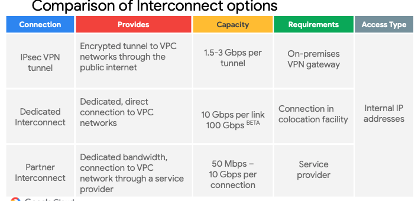

# Udemy Test 5

**Question 1**

- C. Use the gcloud recommender command to list the idle virtual machine instances. 100%
- [View and apply idle VM recommendations](https://cloud.google.com/compute/docs/instances/viewing-and-applying-idle-vm-recommendations)
- how you can use idle VM recommendations to identify and stop idle VM instances to reduce waste of resources and reduce your compute bill on your projects.

```
gcloud recommender recommendations list \
--project=PROJECT_ID \
--location=ZONE \
--recommender=google.compute.instance.IdleResourceRecommender \
--format=yaml
```

<hr />

**Question 2**

- C. Use BigQuery for its scalability and ability to add columns to a schema. Partition race data based on season.

<hr />

**Question 3**

- A. Set up a network peering between vpc-a and vpc-b.
- https://cloud.google.com/vpc/docs/vpc-peering
- Google Cloud VPC Network Peering allows internal IP address connectivity across two Virtual Private Cloud (VPC) networks regardless of whether they belong to the same project or the same organization.
- https://cloud.google.com/vpc/docs/vpc-peering#networking-features-scenarios

<hr />

**Question 4**

- C. Total visits, error rates, and latency from Asia
- Total visits" covers the business requirements: - Optimize for capacity during peak periods and value during off-peak periods. - Expand services into Asia.

- "Error rates" covers business requirement: - Guarantee service availability and support. \*\* if service is unavailable, errors are reported!

- "Latency" covers technical requirement: - Decrease latency in Asia.

<hr />

**Question 5**

- B. Cloud Dataflow, Cloud Storage, Cloud Pub/Sub, and BigQuery. 100%
- A real time requires Stream / Messaging so Pub/Sub, Analytics by Big Query. Ingest millions of streaming events per second from anywhere in the world with Cloud Pub/Sub, powered by Google's unique, high-speed private network. Process the streams with Cloud Dataflow to ensure reliable, exactly-once, low-latency data transformation. Stream the transformed data into BigQuery, the cloud-native data warehousing service, for immediate analysis via SQL or popular visualization tools

<hr />

**Question 6**

- AB (55%), BC (19%)
- A. Store as much analytics and game activity data as financially feasible today so it can be used to train machine learning models to predict user behavior in the future.
- B. Begin packaging their game backend artifacts in container images and running them on Google Kubernetes Engine to improve the ability to scale up or down based on game activity.
- A+Bn =>

  - "as well as other metrics that provide deeper insight into usage patterns so we can adapt the game to target users."

  - environment that provides autoscaling, low latency load balancing, and frees us up from managing physical servers.

<hr />

**Question 7**

- C. Configure the deployment job to notify a Pub/Sub queue that triggers a Cloud Function. 82%
- Answer C seems to be ok. Triggering Pub/Sub to invoke Cloud Functions seems to be relevant. Cloud Storage doesn't make any sense. It would have been straight forward if Cloud Scheduler is mentioned in Option C instead of Deployment Job. But if you make a bit of research on deployment jobs, it's pointing me to cron jobs which is making perfect sense.
  https://cloud.google.com/appengine/docs/flexible/nodejs/scheduling-jobs-with-cron-yaml
  https://cloud.google.com/scheduler/docs/tut-pub-sub

- Answer C seems to be right. There are 2 requirements here,

1. Run every time it is released on Tuesday
2. Set Airwolf to run weekly
   Since a new version of the predictive capability application is released every tuesday evening at 3.00 am, the deployment job would run every time its released which is every week recurring. So both the requirements above are satisfied

<hr />

**Question 8**

- A. Upload your mobile app to the Firebase Test Lab, and test the mobile app on Android and iOS devices. 100%
- The Firebase Test Lab is a cloud-based testing service that allows you to test your mobile app on a variety of physical devices running Android and iOS. It provides a range of options for testing your app, including testing on different device models, screen sizes, and operating system versions.
- A should be correct
- B false - not really feasable
- C false - cannot run Android or IOS on GKE
- D false since that is what A is built to do

<hr />

**Question 9**

- A. Use a private cluster with a private endpoint with master authorized networks configured. 61%
- Using a private cluster with a private endpoint and master authorized networks configured is the best way to reduce the attack surface in Google Kubernetes Engine (GKE). A private cluster ensures that the nodes have private IP addresses, which are not accessible from the internet. The private endpoint allows access to the GKE API server only within the same VPC or through a secure connection (e.g., VPN or VPC peering). Configuring master authorized networks restricts access to the GKE control plane to specific CIDR blocks, further securing the environment and adhering to EHR Healthcare's business and technical requirements.
- https://cloud.google.com/kubernetes-engine/docs/concepts/private-cluster-concept
- A private cluster is a type of VPC-native cluster that only depends on internal IP addresses. Nodes, Pods, and Services in a private cluster require unique subnet IP address ranges.

<hr />

**Question 10**

- B. Use gsutil to batch copy the files in parallel. 100%
- Batch Copying in Parallel Saves time and an efficient option to use ( -m)
- https://cloud.google.com/storage/docs/gsutil/commands/cp
  If you have a large number of files to transfer, you can perform a parallel multi-threaded/multi-processing copy using the top-level gsutil -m option.

```
gsutil -m cp -r dir gs://my-bucket
```

<hr />

**Question 11 - Mountkirk Games**

- A. Tests should scale well beyond the prior approaches.65%
- D. Tests should include directly testing the Google Cloud Platform (GCP) infrastructure. 35%/Me/tartar
- It is D. New to GCP, migrated to GCP.... time to test if it works or not.
- " had problems scaling their global audience, application servers MySQL databases, and analytics tools."

<hr />

**Question 12 - JencoMart**

- C. Provision service account keys for the on-premises infrastructure and use Google Cloud Platform (GCP) managed keys for the VMs. 100%

- Answer: C.

  Migrating data to Google Cloud Platform
  Let's say that you have some data processing that happens on another cloud provider and you want to transfer the processed data to Google Cloud Platform. You can use a service account from the virtual machines on the external cloud to push the data to Google Cloud Platform.

  To do this, **you must create and download a service account key when you create the service account and then use that key from the external process to call the Cloud Platform APIs.**

<hr />

**Question 13 - HRL**

- A. Use Explainable AI. 100%
- Answer A
- AI Explanations helps you understand your model's outputs for classification and regression tasks. Whenever you request a prediction on AI Platform, AI Explanations tells you how much each feature in the data contributed to the predicted result. You can then use this information to verify that the model is behaving as expected, recognize bias in your models, and get ideas for ways to improve your model and your training data.
- https://cloud.google.com/ai-platform/prediction/docs/ai-explanations/overview

<hr />

**Question 14- Mountkirk Games**

- D. Create a global load balancer with managed instance groups and autoscaling policies. Use non-preemptible Compute Engine instances. 100%
- D => KPI game stability = Use non-preemptible
- Agree "D". Preemptible VM is suitable for app which is fault-tolerant. Termination of preemptive VM might affect gaming experience, so it is not a good choice.

<hr />

**Question 15- JencoMart**

- C. Create a single G Suite account to manage users with each stage of each application in its own project. 90%

- Here are the correct answers:
  https://cloud.google.com/resource-manager/docs/creating-managing-folders
  Refer to the diagram on top, different envs are created at the project level.

- https://cloud.google.com/docs/enterprise/best-practices-for-enterprise-organizations
  "A general recommendation is to have one project per application per environment. For example, if you have two applications, "app1" and "app2", each with a development and production environment, you would have four projects: app1-dev, app1-prod, app2-dev, app2-prod. This isolates the environments from each other, so changes to the development project do not accidentally impact production, and gives you better access control, since you can (for example) grant all developers access to development projects but restrict production access to your CI/CD pipeline." The answer is C.

<hr />

**Question 16- Mountkirk Games**

- A. Create a scalable environment in GCP for simulating production load. 100%
- From scenario: Requirements for Game Backend Platform

  1. Dynamically scale up or down based on game activity
  2. Connect to a managed NoSQL database service
  3. Run customize Linux distro

<hr />

**Question 17- Mountkirk Games**

- AB 53%
- A. Store as much analytics and game activity data as financially feasible today so it can be used to train machine learning models to predict user behavior in the future. Most Voted
- B. Begin packaging their game backend artifacts in container images and running them on Google Kubernetes Engine to improve the ability to scale up or down based on game activity.
- A = ML = future stuff
- B = containers = portability (since current platform runs on VM's)

<hr />

**Question 18- Mountkirk Games**

- A. Configure an organizational policy which constrains where resources can be deployed. 88%
- You can limit the physical location of a new resource with the Organization Policy Service resource locations constraint.
- https://cloud.google.com/resource-manager/docs/organization-policy/defining-locations

```
constraint: constraints/gcp.resourceLocations
listPolicy:
    deniedValues:
    - in:us-east1-locations
    - in:northamerica-northeast1-locations
```

<hr />

**Question 19- JencoMart**

- D. Google Cloud Datastore 54%
- A. Cloud Spanner 38%/ME
- Oracle (relational) + global => Spanner
- Cloud Spanner is a fully managed, scalable, and globally distributed relational database service. It provides strong consistency, high availability, and low-latency capabilities, which would be suitable for JencoMart's User Profiles database requirements.

<hr />

**Question 20**

- D. Configure Ingress for Anthos with a global load balancer and Google Kubernetes Engine. 50%
- C. Configure a global load balancer with Google Kubernetes Engine. 25%/Me
- For me is C.
  There is no necessity of Anthos or hybrid connectivity cluster. GKE and Global LB is enought
- C.
  The reason for choosing C is that configuring a global load balancer with Google Kubernetes Engine (GKE) meets the business and technical requirements of Mountkirk Games. A global load balancer automatically routes players to the nearest regional game instances, reducing latency and providing high performance. Moreover, GKE allows dynamic scaling based on game activity and takes advantage of Google Cloud's managed services and resource pooling to minimize costs.
- D.
  Configuring Ingress for Anthos with a global load balancer and Google Kubernetes Engine is more suitable for multi-cluster environments. In this scenario, deploying game instances in multiple regions is required, but a multi-cluster setup is not necessary. Therefore, option C is the best solution.

<hr />

**Question 21**

- C. Change the filter to metric.label.state = 'used' AND metric.label.state = 'buffered' AND metric.label.state = 'cached' AND metric.label.state = 'slab'. 53%
- https://cloud.google.com/compute/docs/autoscaler/scaling-cloud-monitoring-metrics#autoscale_based_on_memory_usage

A. Change the Target type to DELTA_PER_MINUTE. (in this case the utlization tagret need to be in minutes which is not the case its percentage % and not time based.
B. Change the Metric identifier to agent.googleapis.com/memory/bytes_used. (not applicable)
C. Change the filter to metric.label.state = 'used' AND metric.label.state = 'buffered' AND metric.label.state = 'cached' AND metric.label.state = 'slab'. (this gives total memory used)
D. Change the filter to metric.label.state = 'free' and the Target utilization to 20. (you would still need to change the the percent_used to percent_free)

https://stackoverflow.com/questions/69267526/what-is-disk-data-cached-in-the-memory-usage-chart-metrics-of-gcp-compute-in

https://cloud.google.com/compute/docs/autoscaler/scaling-cloud-monitoring-metrics

<hr />

**Question 22 - EHR Healthcare**

- AB 100%
- A. Verify EHR's product usage against the list of compliant products on the Google Cloud compliance page.
- B. Advise EHR to execute a Business Associate Agreement (BAA) with Google Cloud.
- A - OK, Google Cloud compliance page will give list of products those are HIPAA compliant.
  [HIPAA](https://cloud.google.com/security/compliance/hipaa-compliance?skip_cache=true)
- B - OK (BAA means HIPAA Business Associate amendment or Business Associate Agreement entered into between Google and Customer. With EHR being a leading provider of health record software, this agreement is required. https://cloud.google.com/files/gcp-hipaa-overview-guide.pdf?hl=en)
- C - Eliminated (Firebase authentication provides backend services, easy-to-use SDKs and ready-made libraries to users on App. https://firebase.google.com/docs/auth)
- D - Eliminated (more of an observability platform)
- E - Eliminated (Running distributed services in GKE private clusters gives enterprises both secure and reliable services. Not sure how this may help with Private Compliance Audit)

<hr />

**Question 23**

- AB 100%
- A. Evaluate the impact of migrating their current batch ETL code to Cloud Dataflow. Most Voted
- B. Write a schema migration plan to denormalize data for better performance in BigQuery.
- Cloud Dataflow -> Stream data (mobile devices)
- BigQuery -> Intensive Analytics + historic data
- Both are FULLY MANAGED services.

<hr />

**Question 24**

- A. Configure Workload Identity and service accounts to be used by the application platform. 100%
- A. Because Mountkrik Game is going to use GKE clusters for its new deployment and so work load identity is the preferred way to connect the apps running on GKE
- Workload Identity is the recommended way to access Google Cloud services from applications running within GKE due to its improved security properties and manageability. For information about alternative ways to access Google Cloud APIs from GKE, refer to the alternatives section below.
  https://cloud.google.com/kubernetes-engine/docs/how-to/workload-identity

<hr />

**Question 25 - JencoMart**

- CDF 100%
- C. Take a snapshot of the disk and connect to a new machine to investigate
- D. Check inbound firewall rules for the network the machine is connected to
- F. Print the Serial Console output for the instance for troubleshooting, activate the interactive console, and investigate
- migrate user db to Google. Shut down old server and new db stop SSH connection.

Assumption:- VM in production environment, cannot be taken down.

based on above, A/B are out. E causes downtime to remove the VM from the old network and connect it to a new network for testing.

Only leaves CDF

- C - Snapshotting is fine, it will reduce the performance for a short duration, but the database will still be up
- D - Obvious place to check for firewall rules (if ssh ports are open or not)
- F - Easy to see server messages on console (without downtime)

<hr />

**Question 26**

- C. Create a service account (SA) in the legacy game's Google Cloud project, add this SA in the new game's IAM page, and then give it the Firebase Admin role in both projects. 100%

- I think it should not simply give out the Organization admin role so A and B is out. We should not migrate the new game to the lagacy game's project and thus D is out. So remain C is the only choice.

<hr />

**Question 27**

- C. Google Kubernetes Registry, Google Container Engine, Google HTTP(S) Load Balancer. 100%

<hr />

**Question 28**

- C. Configure a HorizontalPodAutoscaler for all stateless workloads and for all compatible stateful workloads. Configure the cluster to use node auto scaling. 100%
- A: Is not necessary because you can have multiple node pools with different configurations.
- B: Optimizes resource usage of CPU/memory in your existing node pool but does not necessarily improve cost - still an option that should be considered.
- C: This looks really good. Autoscaling workloads and the node pools makes your whole infrastructure more elastic and gives you the option to rely on the same node pool.
- D: This might not be a good option for every type of workload. Batch and stateless workloads can often handle this quite well, but stateful workloads are not well-suited for operation on preemptible VMs.

<hr />

**Question 29**

- A. Cloud Bigtable. 100%
- Cloud Bigtable for Storing time series data in Cloud Bigtable https://cloud.google.com/bigtable/docs/schema-design-time-series

<hr />

**Question 30**

- B. Encrypt the card data with a deterministic algorithm stored in Firestore using Datastore mode. 97%

- https://cloud.google.com/community/tutorials/pci-tokenizer

  > Deterministic output means that a given set of inputs (card number, expiration, and userID) will always generate the same token. This is useful if you want to rely on the token value to deduplicate your token stores. You can simply match a newly generated token to your existing catalog of tokens to determine whether the card has been previously stored. Depending on your application architecture, this can be a very useful feature. However, this could also be accomplished using a salted hash of the input values.

- https://cloud.google.com/architecture/tokenizing-sensitive-cardholder-data-for-pci-dss

  > Firestore is the next major version of Datastore. Firestore can run in Datastore mode, which uses the same API as Datastore and scales to millions of writes per second

  <hr />

**Question 31**

- A. Configure liveness and readiness probes in the Pod specification. 100%

- B: With GKE, you do not deal with MIGs.
- C: Does not use GKE tools and is therefore not the best option.
- D: Does alert you but does not prevent the outage.
- Types of health check
- **Readiness** - Readiness probes are designed to let Kubernetes know when your app is ready to serve traffic.
- **Liveness** - Liveness probes let Kubernetes know if your app is alive or dead.
- https://cloud.google.com/blog/products/containers-kubernetes/kubernetes-best-practices-setting-up-health-checks-with-readiness-and-liveness-probes

<hr />

**Question 32 - EHR**

- D. Configure two Dedicated Interconnect connections in one metro (City) and two connections in another metro, and make sure the Interconnect connections are placed in different metro zones
- Answer : D (based on the requirement of secure and high-performance connection between on-premises systems to Google Cloud)
- https://cloud.google.com/network-connectivity/docs/interconnect/tutorials/dedicated-creating-9999-availability
- https://cloud.google.com/network-connectivity/docs/interconnect/tutorials/production-level-overview
- 

<hr />

**Question 33**

- B. Object Versioning
- allows you to store multiple versions of an object in Cloud Storage
- https://cloud.google.com/storage/docs/object-versioning

<hr />

**Question 34 - Mountkirk Games**

- C. Create an instance template for the backend. For every region, deploy it on a multi-zone managed instance group. Use an L7 load balancer. Most Voted
- Multi-zone makes it high available. L7 balances load for e.g. HTTP traffic. So the answer is C. Why not A? L4 works at the network protocol (TCP/UDP) which is not suitable for REST APIs.

<hr />

**Question 35**

- A. Add a new Dedicated Interconnect connection. 100%
- I will go A cause note in https://cloud.google.com/network-connectivity/docs/interconnect/how-to/dedicated/modifying-interconnects [1] says
  " It is not possible to change the link type on an Interconnect connection circuit from 10 Gbps to 100 Gbps. If you want to migrate to 100 Gbps, you must first provision a new 100-Gbps Interconnect connection alongside your existing 10-Gbps connection, and then migrate the traffic onto the 100-Gbps connection."
- The following items can't be modified for existing Dedicated Interconnect connections:[1]
- https://cloud.google.com/network-connectivity/docs/interconnect/concepts/dedicated-overview

<hr />

**Question 36 - Mountkirk Games**

- A. Deploy failure injection software to the game analytics platform that can inject additional latency to mobile client analytics traffic. 67%
- resilience: the power or ability of a material to return to its original form.(回復力)
- A is most likely correct: Istio (which is now Anthos Service Mesh on GCP) is capable of injecting delays: https://istio.io/latest/docs/tasks/traffic-management/fault-injection/#injecting-an-http-delay-fault

<hr />

**Question 37 - Mountkirk Games**

- D. Create one project for development, a second for staging and a third for production. 50%
- deploying isolated application environments.
- https://cloud.google.com/appengine/docs/standard/php/creating-separate-dev-environments

<hr />

**Question 38**

- B. 1. Create a Cloud Logging sink to export BigQuery data access logs to BigQuery. 2. Perform a BigQuery query on the generated table to extract the information you need. 73%
- option B allows you to monitor queries in real-time by exporting BigQuery data access logs directly to another BigQuery table, enabling you to analyze the costliest queries and user expenses as they happen

<hr />

**Question 39 - Mountkirk Games**

- B. Verify that the project quota hasn't been exceeded Most Voted
- B is the correct answer Error code starting like 5xx is something related to server 503 UNAVAILABLE Service unavailable. Typically, the server is down.

<hr />

**Question 40**

- AD 41%
- A. Enable Binary Authorization on GKE, and sign containers as part of a CI/CD pipeline.
- D. Configure Container Registry to use vulnerability scanning to confirm that there are no vulnerabilities before deploying the workload.
- https://cloud.google.com/binary-authorization/docs/overview
  To ensure deployment are secure and and consistent, automatically scan images for vulnerabilities with container analysis
- binary athorization and vun checks

<hr />**Question 41**

A. Create an Organizational Policy with a constraint to allow external IP addresses only on the frontend Compute Engine instances.

https://cloud.google.com/blog/topics/developers-practitioners/limiting-public-ips-google-cloud

<hr />**Question 42**

- C. Turn off Pub/Sub message batching. 73%
- C - The cost of batching is latency for individual messages, which are queued in memory until their corresponding batch is filled and ready to be sent over the network. To minimize latency, batching should be turned off.
- https://cloud.google.com/pubsub/docs/publisher?hl=en#batching
- https://cloud.google.com/pubsub/docs/publish-best-practices?hl=en#configure-batch

<hr />

**Question 43**

- C. Create Request Latency and Error Rate as service level indicators. 95%
- CPU utilization doesn't tell us about the user experience except perhaps if it hits 100%. The errors & latency (driven party by CPU ) are much better indicators

<hr />

**Question 44 - Mountkirk Games**

- D. Use Cloud Bigtable for time series data, use Cloud Spanner for transactional data, and use BigQuery for historical data queries. 83%
- Storing time-series data in Cloud Bigtable is a natural fit, Cloud Spanner scales horizontally and serves data with low latency while maintaining transactional consistency and industry-leading 99.999% (five 9s) availability - 10x less downtime than four nines (<5 minutes per year). Cloud Spanner helps future-proof your database backend. After you load your data into BigQuery, you can query the data in your tables. BigQuery supports two types of queries: Interactive queries, Batch queries

<hr />

**Question 45 - JencoMart**

- ACF 50%
  A. A single VPN tunnel, which limits throughput
  C. A copy command that is not suited to operate over long distances
  F. Complicated internet connectivity between the on-premises infrastructure and GCP

<hr />

**Question 46 - TerramEarth**

- A. Use Google App Engine with Google Cloud Endpoints. Focus on an API for dealers and partners.
- With Endpoints Frameworks, you don't have to deploy a third-party web server (such as Apache Tomcat or Gunicorn) with your application. You annotate or decorate the code and deploy your application as you normally would to the App Engine standard environment.

<hr />
