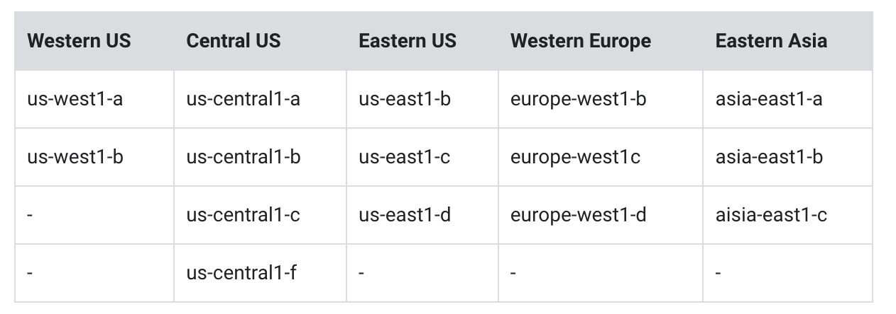

# Getting Started with Cloud Shell and gcloud

## Understanding regions and zones

1. Set the region to `gcloud config set compute/region`
2. To view the project region setting - `gcloud config get-value compute/region`
3. Set the zone to `gcloud config set compute/zone`
4. To view the project zone setting `gcloud config get-value compute/zone`
5. To view the project id, `gcloud config get-value project`

6. Creating a virtual machine with the gcloud tool,`gcloud compute instances create gcelab2 --machine-type e2-medium --zone $ZONE`

7. To open help for the create command, `gcloud compute instances create --help`

## Task 2. Filtering command-line output

gcloud compute instances list
gcloud compute instances list --filter="name=('gcelab2')"

gcloud compute firewall-rules list
gcloud compute firewall-rules list --filter="network='default'"

## Task 3. Connecting to your VM instance

gcloud compute ssh gcelab2 --zone $ZONE

# Set Up Network and HTTP Load Balancers

- I couldn't understand the command line based LB creation.
- https://cloud.google.com/load-balancing/docs/https

- [Lab - Configuring an HTTP Load Balancer with Autoscaling](https://www.cloudskillsboost.google/course_sessions/1596976/labs/314780)
- [Lab:review - Configuring an HTTP Load Balancer with Autoscaling](https://www.youtube.com/watch?v=gjw1eaRn9U0)

- [Google doc- Set up a classic Application Load Balancer with a managed instance group backend](https://cloud.google.com/load-balancing/docs/https/ext-https-lb-simple#gcloud)

# Getting Started with MongoDB Atlas on Google Cloud

https://www.cloudskillsboost.google/focuses/50353?parent=catalog

## Task 1. Create an Atlas project and cluster

Create a databas, choose a provider, region, and spaces. (Google, asia-northeast, M0 Free)
Cluster name.(Workshop-Bakery)
Create a database and collection, insert data.

## Task 2. Configure a GraphQL API with Atlas App Services

## Task 3. Generate a schema

## Task 4. Obtain an API key and GraphQL endpoint from MongoDB Atlas:

## Task 5. Verify the lab in Google Cloud

