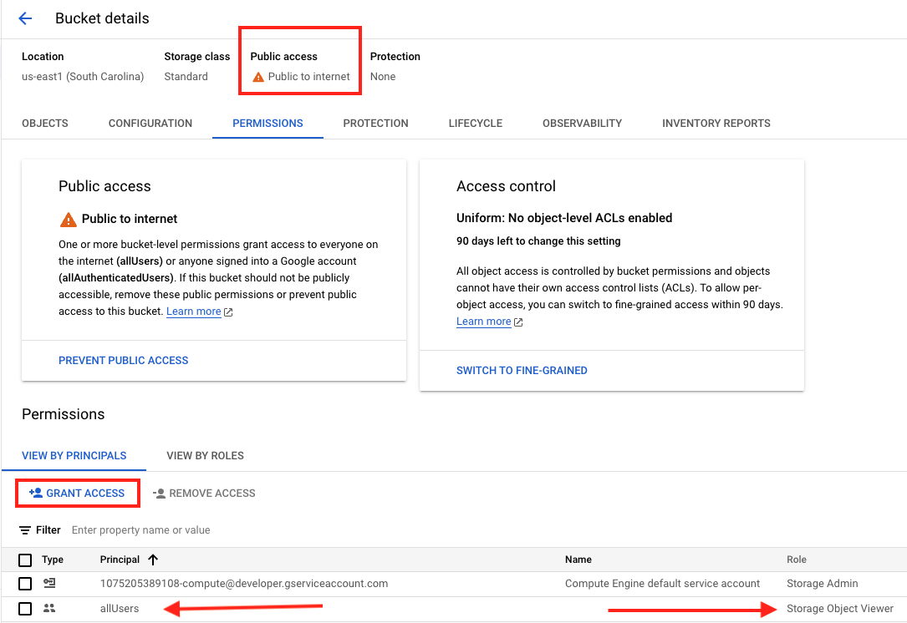

# Cloud Storage: Qwik Start - Cloud Console

## Task 3. Share a bucket publicly

1. Permissions tab
2. Click Grant Access to view the Add principals pane.
3. New principals -> **allUsers**
4. Cloud Storage > **Storage Object Viewer**
5. Click Save.



# Cloud Storage: Qwik Start - CLI/SDK

## Task 1. Create a bucket

```
gsutil mb gs://<YOUR-BUCKET-NAME>
```

## Task 2. Upload an object into your bucket

```
gsutil cp ada.jpg gs://YOUR-BUCKET-NAME
```

## Task 3. Download an object from your bucket

```
gsutil cp -r gs://YOUR-BUCKET-NAME/ada.jpg . <---The dot is your current directory.
```

## Task 4. Copy an object to a folder in the bucket

```
gsutil cp gs://YOUR-BUCKET-NAME/ada.jpg gs://YOUR-BUCKET-NAME/image-folder/
```

## Task 5. List contents of a bucket or folder

```
gsutil ls gs://YOUR-BUCKET-NAME
```

## Task 6. List details for an object

```
gsutil ls -l gs://YOUR-BUCKET-NAME/ada.jpg
```
