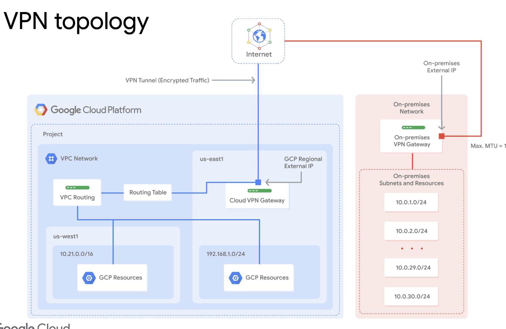

# Elastic Google Cloud Infrastructure: Scaling and Automation

## Labs

- Virtual Private Networks (VPN)
  https://www.cloudskillsboost.google/course_sessions/1596976/labs/314764

- Configuring an HTTP Load Balancer with Autoscaling
  https://www.cloudskillsboost.google/course_sessions/1596976/labs/314780

- Configuring an Internal Load Balancer
  https://www.cloudskillsboost.google/course_sessions/1596976/labs/314787

- Automating the Deployment of Infrastructure Using Terraform
  https://www.cloudskillsboost.google/course_sessions/1596976/labs/314795

- Demo: Dataproc
  https://www.cloudskillsboost.google/course_sessions/1596976/video/314806

## Keywords

### Cloud VPN

- Cloud VPN connection between your VPC and on-premises network
- on-premises <-> GCP
- Cloud VPN gateway, on-rpremises VPN gateway, two VPN tunnels
- Cloud VPN gateway == a regional external IP
- Static/Dynamic routes
- 99.9% SLA
