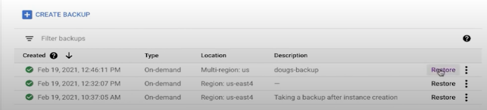
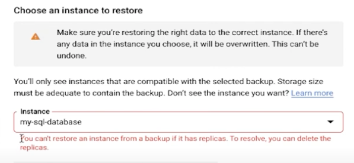
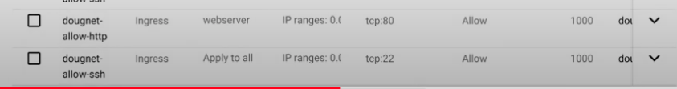
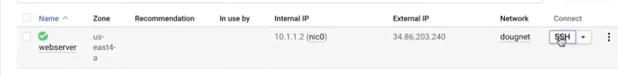
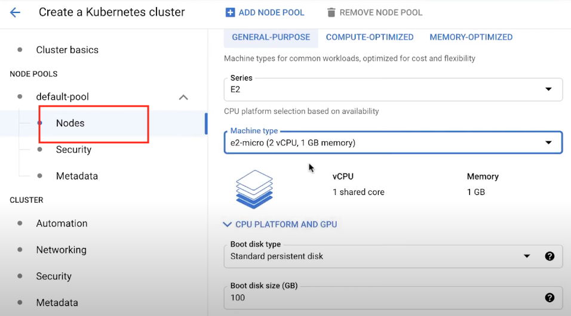
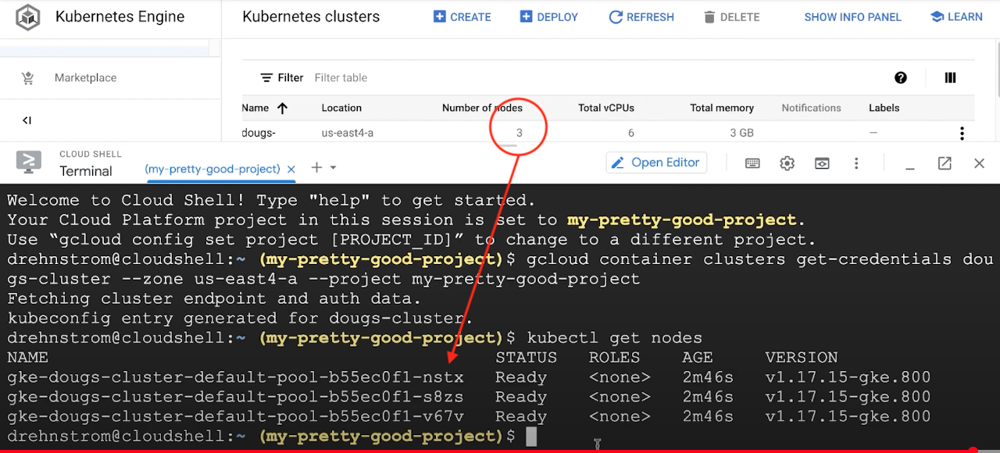
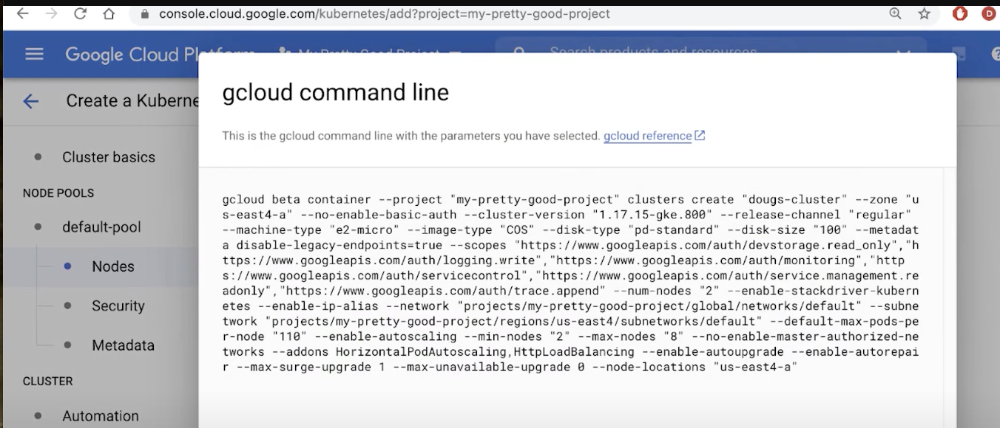

# ROI demo

https://www.youtube.com/playlist?list=PLuJRcdtonlDAN73rZsRk_eiJ0NU9h1Cms

## 10. Creating VM Images

1. space-invader-webapp
2. test 35.221.2.79
3. stop the app 1
4. create an image (space-invaders-image, source disk: the app 1)
5. create another instance based on the image (another-space invaders,Custom Image: space-invaders-image)


- https://cloud.google.com/compute/docs/images/create-custom#disable_the_auto-delete_option_for_the_disk
- Before creating an image from a disk, disable auto-delete to ensure that the disk is not automatically deleted when you delete the VM.

## 41. Backups and Restores for Cloud SQL Databases

1. Cloud SQL -> backups
2. CREATE BACKUP
3. Restore -> <span style="color:red">You can't restore an instance from a backup if it has replica. To resolve, you can delete the replicas.</span>.
4. Go to Instances -> delete the replica




## 15. Creating Firewall Rules

1. VPC network -> Firewall
2. dougnet-allow-http, doughnet, Ingress, Allow, Tags: webserver, 0.0.0.0/0, tpc:80 -> Create
3. Compute Engine -> VM with Network: dougnet




## 16. Creating GKE clusters

1. Kubernates Engine -> Create Cluster
2. dougs-cluster, us-central1-c, Number of nodes:3, Enable autoscaling: 1, 30
3. Nodes (like Compute Engine, E2, e2micro(2 CPU 1GB memory)) -> Create
4.

```
## Connect to clusters
gcloud container clusters get-credentials dougs-cluster --zone us-east4-a --project xxx

## interact with the cluster
kuberctl get notes
```





## 17. Creating GKE Clusters using the CLI

- minimum command

```
gcloud container clusters create dougs-cluster --zone=us-east4
```

- GCP-> Kubernates Engine -> Create a Kubernetes cluster -> select
  - dougs-cluster
  - us-central1-c
  - 2 nodes
  - Enable autoscaling (min:2, max:8)
  - Nodes: machine: E2, e2-micro(2 CPU 1GB memory)
- Click on Commandline link -> generating gcloud command -> copy &paste the command on Cloud Shell.



## 7. Adding a disk to VM | Google Cloud Quick Tutorials

1. VM (server1, us-east4-a, 10.150.0.2, xxx)
2. Compute Engine -> Disk -> Create Disk(server1-disk-2, )
3. types:
   - Balanced persistant disk(middle)
   - SSD persistant disk(Fastest, expensive)
   - Standard persistant disk (cheapest)
4. Region/zone (select same as the disk attached) ==> **CREATE**
5. Select server1 and **EDIT**
6. Boot disk: server1 -> Attached existing disk
