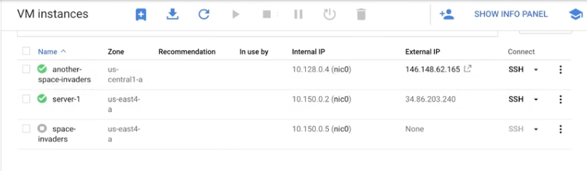

# ROI demo

https://www.youtube.com/playlist?list=PLuJRcdtonlDAN73rZsRk_eiJ0NU9h1Cms

# 10. Creating VM Images

1. space-invader-webapp
2. test 35.221.2.79
3. stop the app 1
4. create an image (space-invaders-image, source disk: the app 1)
5. create another instance based on the image (another-space invaders,Custom Image: space-invaders-image)

- https://cloud.google.com/compute/docs/images/create-custom#disable_the_auto-delete_option_for_the_disk
- Before creating an image from a disk, disable auto-delete to ensure that the disk is not automatically deleted when you delete the VM.
