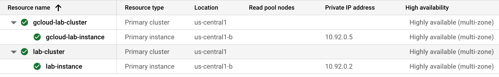

# AlloyDB - Database Fundamentals

## Task 1. Create a cluster and instance

- Databases -> AlloyDB for PostgreSQL
- Highly Available, Cluster ID, PW, NW-> Private IP

## Task 2. Create tables and insert data in your database

- Go to vm

  ```
  psql -h $ALLOYDB-privateIP -U postgres

  ```

## Task 3. Use the Google Cloud CLI with AlloyDB

- Create a cluster

```
gcloud beta alloydb clusters create gcloud-lab-cluster \
    --password=Change3Me \
    --network=peering-network \
    --region=Default Region \
    --project=Project ID
```

- Then, create an instance for the cluster

```
gcloud beta alloydb instances create gcloud-lab-instance\
    --instance-type=PRIMARY \
    --cpu-count=2 \
    --region=Default Region  \
    --cluster=gcloud-lab-cluster \
    --project=Project ID
```



- List the AlloyDB clusters instances

```
gcloud beta alloydb clusters list

$ gcloud beta alloydb clusters list
NAME: projects/qwiklabs-gcp-00-aef8a1da1564/locations/us-central1/clusters/lab-cluster
NETWORK: projects/348161538065/global/networks/peering-network
STATUS: READY
```

## Task 4. Deleting a cluster

```
gcloud beta alloydb clusters delete gcloud-lab-cluster \
    --force \
    --region=Default Region \
    --project=Project ID
```

# Migrating to AlloyDB from PostgreSQL Using Database Migration Service


- **Migration job name**: vm-to-cloudsql
- **Source database engine**: PostgreSQL
- **Destination database engine**: Cloud SQL for PostgreSQL
- **Type**: Continuous
- **Connection profile name**: postgres-vm
- **Hostname:Port**: 10.128.0.2:5432
- **data dump options**: Auto-generated dump
- **Destination instance ID**: postgresql-cloudsql
- **Region**: us-central1
- **Connectivity method**: VPN peering
