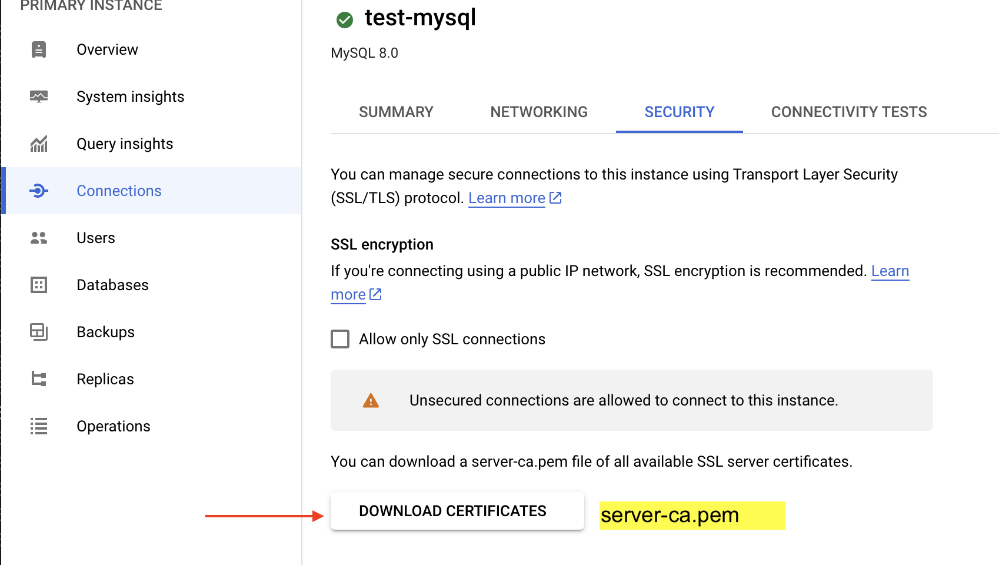
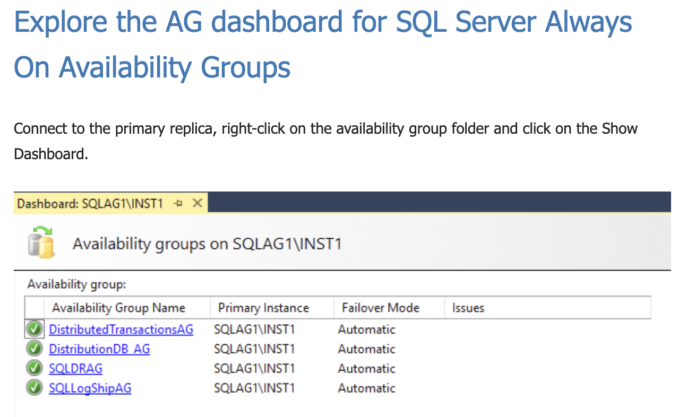

# Questions

- Listed the wrong answered questions only.

## Q11

- principle of least privilege (PoLP)
- Cloud Spanner Backup Writer
  - spanner.backups.create
- Cloud Spanner Backup Admin
  - spanner.backups.create
  - spanner.backups.delete

## Q12

- The question is about which factors determine the cost of running Spanner. They include region vs. multi-region, compute unit (nodes or processing units), how much storage and how much backup space.
- Parent-child table relationships: table interleaving and foreign keys.
- Using interleaved tables can help speed up queries
- https://cloud.google.com/spanner/docs/schema-and-data-model#parent-child
- https://cloud.google.com/spanner/docs/autoscaling-overview

## Q15

- High Cardinality vs Low Cardinality
- Low Cardinality: a gender, three distinct(male, female or other)
- High Cardinality: email (a large number of distinct values (one for each person in the table)
- Bit-reverse sequential values
- https://cloud.google.com/spanner/docs/schema-design#bit_reverse_primary_key

## Q18

- You have 2 problems. Replication lag and slow report performance.
- Since excessive load is mentioned in the question, creating additional read replicas and spreading the analytics workload around makes B correct.
- Cloud SQL enables single threaded replication by default, so it stands to reason enabling parallel replication would help the lag.
- Basic steps to change parallel replication flags
  1. On a read replica, disable replication.
  2. On the read replica, set the flags for parallel replication. Use the gcloud command to set the flags.
- https://cloud.google.com/sql/docs/mysql/replication/manage-replicas#configuring-parallel-replication

## Q20

- MySQL on-premises with read replica
- backups and maintenance are issue
- Wants to migrate to GCP with minimum downtime
- Create an external replica, and use Cloud SQL to synchronize the data to the replica.(GOOD)
- Use the mysqldump utility to take a backup of the existing on-premises database, and then import it into Cloud SQL.(BAD)
- https://cloud.google.com/sql/docs/mysql/replication/configure-replication-from-external#mysql

## Q22

- Adding more storage would increase IOPS, but there’s no indication network throughput is an issue, so that eliminates C.
- A microservice architecture is supposed to use a separate database for each microservice, rather than one big database.
- https://cloud.google.com/sql/docs/mysql/best-practices#data-arch

## Q23

- Cloud SQL, serverless export
- Serverless export

  1. Cloud SQL creates a separate, temporary instance to offload the export operation.

  2. Offloading the export operation allows databases on the primary instance to continue to serve queries and perform operations at the usual performance rate.
  3. When the data export is complete, the temporary instance is deleted automatically.
  4. Use the Google Cloud Console, gcloud with the offload flag, to perform a serverless export operation.

  ```
  gcloud sql export sql INSTANCE_NAME gs://BUCKET_NAME/sqldumpfile.gz \
  --database=DATABASE_NAME \
  --offload
  ```

- A serverless export takes longer to do than a standard export, because it takes time to create the temporary instance.
- https://cloud.google.com/sql/docs/mysql/import-export#serverless
- https://cloud.google.com/sql/docs/mysql/import-export/import-export-sql#gcloud

## Q24

- PosgresSQL, load balancer btw primary instance and read replica
- For read-heavy workloads, add read replicas to offload traffic from the primary instance. Optionally, you can use a load balancer such as HAProxy to manage traffic to the replicas.
- PgBouncer as a connection pooler
- https://cloud.google.com/sql/docs/postgres/best-practices#admin
- https://cloud.google.com/architecture/migrating-postgresql-to-gcp

## Q27

- **External read replicas** are external MySQL instances that replicate from a Cloud SQL primary instance. For example, **a MySQL instance running on Compute Engine** is considered an external instance.
- https://cloud.google.com/sql/docs/mysql/replication#external-read-replicas

## Q28

- you wouldn’t use a read replica as a source anyway
- A is Database Migration Service to migrate the databases with CDC
- C is Replication from an external server is used to Migration Database to Cloud

# Q35

- https://firebase.google.com/docs/firestore
- Realtime updates Like Realtime Database, Cloud Firestore uses data synchronization to update data on any connected device. However, it's also designed to make simple, one-time fetch queries efficiently.

## Q36

- Spanner, ways to recover data
- To **recover a portion of the database**, perform a stale read specifying a query-condition and timestamp in the past, and then write the results back into the live database. This is typically used for surgical operations on a live database. For example, if you accidentally delete a particular row or incorrectly update a subset of data, you can recover it with this method.
- To **recover the entire database**, backup or export the database specifying a timestamp in the past and then restore or import it to a new database. This is typically used to recover from data corruption issues when you have to revert the database to a point-in-time before the corruption occurred.
- https://cloud.google.com/spanner/docs/pitr#ways-to-recover

## Q37

- Cloud SQL MySQL
- Google’s own documention says close unused operations and re-start the instance. This is the best way to ensure maximum resources for the import operation.
- Too many active connections can **interfere with** import operations.
- A restart:
  1. Closes all connections.
  2. Ends any tasks that may be consuming resources.
- https://cloud.google.com/sql/docs/mysql/import-export#troubleshooting

## Q39

- Spanner, export
- **Cloud Spanner to Cloud Storage Avro in the Dataflow** documentation.
- The export process uses Dataflow and writes data to a folder in a Cloud Storage bucket. The resulting folder contains a set of Avro files and JSON manifest files.
- https://cloud.google.com/spanner/docs/export

## Q40

- sub-millisecond latency
- To meet demands of low latency at increased scale and reduced cost you need an in-memory datastore. Redis and Memchaced are among the most popular.
- https://cloud.google.com/blog/topics/developers-practitioners/what-memorystore/

## Q41

- D is wrong since the IOPS would not improve based upon the edition of SQL Server. IOPS increases with the amount of storage,
- When creating a Cloud SQL for SQL Server instance, you have several machine configurations to choose from based on your vCPU and memory requirements.
- Lightweight
  - 1 vCPU, 3.75 GB
  - 2 vCPUs, 3.75 GB
  - 4 vCPUs, 3.75 GB
- Standard
  - 1 vCPU, 3.75 GB
  - 2 vCPUs, 7.50 GB
  - 4 vCPUs, 15 GB
- High Memory

  - 4 vCPUs, 26 GB
  - 8 vCPUs, 52 GB
  - 16 vCPUs, 104 GB

- https://cloud.google.com/sql/docs/sqlserver/create-instance#expandable-3

## Q47

- Cloud Spanner
- Avoiding user disruption if a regional failure occurs means you need to pick a multi-region service.

## Q48

- Read replica

- If replication is interrupted for a few hours, for example by a network or server outage, the replica falls behind the primary. The replica catches up once it reconnects to the primary and starts replicating again.
- https://cloud.google.com/sql/docs/mysql/replication#:~:text=If%20replication%20is,a%20new%20one
- https://cloud.google.com/sql/docs/mysql/replication#replication_use_cases

## Q51

- Cloud SQL instance with Cloud SQL Auth proxy
- The Cloud SQL Auth proxy is a Cloud SQL connector that provides secure access to your instances without a need for Authorized networks or for configuring SSL.
- https://cloud.google.com/sql/docs/mysql/sql-proxy#using-a-service-account

## Q55

- Cloud Run, Cloud SQL
- For private IP paths, your application will connect directly to your instance through Serverless VPC Access. This method uses TCP to connect directly to the Cloud SQL instance without using the Cloud SQL Auth proxy.
- https://cloud.google.com/sql/docs/mysql/connect-run#public-ip-default

## Q60

- Cloud SQL, Primary instance, Standby instance, Read replica instance.
- Cloud SQL is a regional service so the primary and standby instances must be in the same region. A recommended practice would have them in different zones.
- HA standby instance can't be located in different region, and Google recommends to use different zones for all three.
- https://cloud.google.com/sql/docs/postgres/high-availability#failover-overview

## Q62

- Cloud SQL, CMEK
- When creating a Cloud SQL instance you get to choose the encryption method at the instance level, which would include databases.
- https://cloud.google.com/sql/docs/postgres/configure-cmek#createcmekinstance

## Q65

- Sqlcommenter, Query Insights
- Cloud Trace doesn’t support Cloud SQL.
- Cloud SQL recommenders for overprovisioned instances would tell you about Cloud SQL instances which are too large for their workload.
- Cloud SQL recommender is a service on Google Cloud that provides usage recommendations for Google Cloud resources.
- Monitoring CPU utilization wouldn’t tell you why microservice calls are failing.
- SQLcommenter integrates with Query Insights.
- https://cloud.google.com/blog/topics/developers-practitioners/introducing-sqlcommenter-open-source-orm-auto-instrumentation-library
- https://cloud.google.com/recommender/docs/recommenders
- https://cloud.google.com/recommender/docs/recommenders

## Q66

- SQL-compliant database
- spanner supports
- Cloud Spanner supports GoogleSQL and PostgreSQL.That’s not the same thing as a natively open source database.
- https://cloud.google.com/spanner

## Q68

- HA and can recover without data loss during a zonal or a regional failure.
- MySQL read replicas use **asynchronous replication**.
- https://cloud.google.com/sql/faq

## Q70

- Spanner, Autoscaler
- Autoscaler has 3 scaling methods. Stepwise, linear and direct.
  1. Stepwise - Stepwise scaling is useful for workloads that have small or multiple peaks.
  2. Linear - Linear scaling is best used with load patterns that change more gradually or have a few large peaks.
  3. Direct - Direct scaling provides an immediate increase in capacity.
- https://cloud.google.com/spanner/docs/autoscaling-overview
- https://cloud.google.com/spanner/docs/autoscaling-overview#different_scaling_methods_for_different_workloads

## Q72

- BigTable, performance issue->troubleshooting
- First step of performance troubleshooting is to use Key Visualizer.
- B might be of interest, but is not the primary tool to diagnose Bigtable performance problems.
  > B.Check the Cloud Monitoring table/bytes_used metric from Bigtable.
- https://cloud.google.com/bigtable/docs/performance#troubleshooting

## Q77

- Cloud SQL, backup
  -By default, for each instance, Cloud SQL retains seven automated backups, in addition to on-demand backups. You can configure how many automated backups to retain (from 1 to 365). We charge a lower rate for backup storage than for other types of instances.
- https://cloud.google.com/sql/docs/mysql/backup-recovery/backups

## Q78

- Query Insights, troubleshooting
- First you need to add query tags to help identify application SQL. D is therefore correct.
- To troubleshoot an application, you must first add tags to your SQL queries.
- https://cloud.google.com/sql/docs/postgres/using-query-insights#filter_by_query_tags

## Q79

- Cloud SQL or Spanner
- Given the final objective is a massive user base on a global scale, it suggests Spanner. Therefore, starting with Cloud SQL then migrating to Cloud Spanner doesn’t seem like a smart move.
- "You plan to start with a small pilot in one country" == small spanner ==> regional.

## Q80

- Migration Oracle
- Oracle is not licensed or supported in GCE.

## Q82

- HA, test failover
- Since primary instance is HA, it can failover between it's two intances

## Q84

- Replicate some tables in Cloud SQL for MySQL into BigQuery
- Anytime you see words like “develop” or “manually” be **suspicious** given this is cloud and everything is supposed to be automated and point-and-click easy. Eliminate A.
- Federated queries are SQL queries initiated FROM BigQuery to Cloud Spanner or Cloud SQL databases. So B doesn’t make sense.
- The Database Migration Service does not support BigQuery as a destination database engine. Eliminate C.
- Datastream is a serverless and easy-to-use Change Data Capture (CDC) and replication service that allows you to synchronize data across heterogeneous databases, storage systems, and applications reliably and with minimal latency.

## Q85

- An app in Intermittment connectivity
- Intermittment connectivity -> Firestore
- To use offline persistence, you don't need to make any changes to the code that you use to access Cloud Firestore data. With offline persistence enabled, the Cloud Firestore client library automatically manages online and offline data access and synchronizes local data when the device is back online.
- An app with intermitted internet access meaning it does not HAVE to sync with the live data source must mean Firestore in Datastore mode.

## Q87

- Migration
- I don’t think you can physically move your own equipment into a Google DC. Eliminate B.

## Q89

- Bare Metal Solution for Oracle, backups
- Answer B:D=50%:50%
- I choose D.

## Q92

- Select db
- Cloud SQL could not scale to 100s of TBs. Eliminate A. Neither Big Query nor Bigtable are relational (although BigQuery does support SQL). Eliminate B and D. That leaves C.
- Cloud SQL has a double-digit TB storage limit so it's Cloud Spanner.
- Big query is data warehouse not a relational database.

## Q93

- write workloads faster in a multi-regional instance
- For optimal write latency, place compute resources for write-heavy workloads within or close to the default leader region.
- https://cloud.google.com/spanner/docs/instance-configurations#multi-region-best-practices

## Q94

- cost-effective backup, Oracle
- A doesn’t make sense. Oracle is neither licensed nor supported in GCE. Eliminate D. Standard storage is more expensive that Nearline storage. Eliminate C. That leaves B as the most cost effective solution.

## Q96 \*\*\*

- Failover, DB-1(primary), DB-2, DB-3(two cross-region read replicas), A failover happened and promote DB-2 as
- A. Bring DB-1 back online.
- B. Delete DB-1, and re-create DB-1 as a read replica in the same region as DB-1.
- C. Delete DB-2 so that DB-1 automatically reverts to the primary instance.

**Answer: A**

- B. Delete DB-1, and re-create DB-1 as a read replica in the same region as DB-1.
  > still will be a read replica
- C. Delete DB-2 so that DB-1 automatically reverts to the primary instance.
  > DB-1 wont be automatically reverts to the primary instance. As soon as you start DB-1 it will be the primary instance from DB-3, but it is manual
- D. Create DB-4 as a read replica in the same region as DB-1, and promote DB-4 to primary.
  > If you do that DB-2 and DB-3 needs to be rebuild
- A- Bring DB-1 online.
  > DB-3 is still a read replica of DB-1 and you only need to recreate DB-2

**Answer: B**

- B: Delete DB-1, and re-create DB-1 as a read replica in the same region as DB-1.
  After a failover, the instance that received the failover continues to be the primary instance, even after the original instance comes back online. After the zone or instance that experienced an outage becomes available again, the original primary instance is destroyed and recreated.
- https://cloud.google.com/sql/docs/mysql/high-availability#:~:text=After%20a%20failover,Initiating%20failover.

- https://cloud.google.com/sql/docs/postgres/replication/cross-region-replicas#disaster_recovery

  > If the primary instance (db-a-0) becomes unavailable, you can promote the replica in region B to become the primary. To again have additional replicas in regions A and C, delete the old instances (the former primary instance in A, and the replica in C), and create new read replicas from the new primary instance in B.

## Q100

```
gcloud sql instances create REGIONAL_INSTANCE_NAME \
--availability-type=REGIONAL \
--database-version=DATABASE_VERSION \
--tier=MACHINE_TYPE \
--enable-bin-log
```

## Q101

- Backups reside in the region where the database is created
- C. Disable automated backups, and create an on-demand backup routine to a regional Cloud Storage bucket.
  You cannot configure a custom location for automatic backups. A is wrong. The default option for automatic backups is multi-region. B is wrong. The question specifically mentions backups not exports, so eliminate D. That leaves C which involves manual effort, but it does keep the data in the correct region.

## Q106

- Recommender
- This is a cost question, so eliminate anything that doesn’t address cost. Eliminate A, B and C. The right answer is to use Recommender.
- https://cloud.google.com/recommender/docs/overview

## Q107

- If you are using ext4, use the resize2fs command to extend the file system
- https://cloud.google.com/compute/docs/disks/resize-persistent-disk#resize_partitions

## Q108

- Migrating on-premise PostgresSQL to VM.
- The Database Migration Service migrates PostgreSQL to Cloud SQL or AlloyDB for PostgreSQL (Preview as of 3/16/23 which means it won’t be on the exam - yet).
- **Pgbouncer** is a connection pooler used to minimize application downtime.
- https://cloud.google.com/architecture/migrating-postgresql-to-gcp

## Q109

- Bigtable, cluster, multi-region
- The default app profile does not change when you add or remove clusters. You must manually update the default app profile to change its settings. However, as a best practice you should create and use a new app profile instead of changing the default app profile.
- https://cloud.google.com/bigtable/docs/app-profiles#how-they-work

**Create an app profile**

- https://cloud.google.com/bigtable/docs/configuring-app-profiles#creating-app-profile

https://drive.google.com/drive/folders/1-1FhPg3mtbIzoOYBb_4yQegfCBgj63Sh

https://drive.google.com/file/d/11MAjHX9GmHt08XG42bhbey-AdyCeEI5E/view?usp=drive_link
https://drive.google.com/file/d/11NXd80hNwuke0J4WTKFpEswnfJ_Fx5oN/view?usp=drive_link

## Q113

- HA
- https://cloud.google.com/sql/docs/mysql/high-availability#HA-configuration

  > The HA configuration provides data **redundancy**.

  > all **writes** made to the primary instance are replicated to disks in both zones before a transaction is reported as committed.

## Q121

- Restore, failover
- No need for restores if you have a read replica which you can promote to be the new primary.
- Failovers do not happen automatically to read replicas. You have to promote them.
  https://cloud.google.com/sql/docs/postgres/replication/cross-region-replicas#disaster_recovery

**Disaster recovery**

> Cross-region replicas can be used as part of a disaster recovery procedure. You can promote a cross-region replica to fail over to another region should the primary's region become unavailable for an extended period of time.

https://drive.google.com/file/d/11feWdqJZ-cHznPiWqzgI8xFoUcPIytzF/view?usp=drive_link

## Q122

- Cloud SQL Server certificates
- Vaid for 10 yrs
- Cloud SQL -> Overview -> Connections -> Security -> Download CERTIFICATES
- Download server-ca.pem files

  ```
  gcloud beta sql ssl server-ca-certs list \
  --instance=INSTANCE_NAME
  ```

- Update all of your clients to use the new information by copying the downloaded file to your client host machines, replacing the existing server-ca.pem files.



## Q127

- SQL Server Always On Availability Group
- Note, you cannot create a read replica in Cloud SQL for SQL Server unless you use an Enterprise Edition. Which is also a requirement for configuring SQL Server AG. That's not a coincidence. That's how Cloud SQL for SQL Server creates SQL Server read replicas. To find out about the replication, use the AG Dashboard in SSMS.
  https://cloud.google.com/sql/docs/sqlserver/replication/manage-replicas#promote-replica

- Creating a read replica is only only available for Cloud SQL for SQL Server:
  - SQL Server 2017 Enterprise
  - SQL Server 2019 Enterprise
- https://cloud.google.com/sql/docs/sqlserver/replication/create-replica

- 
