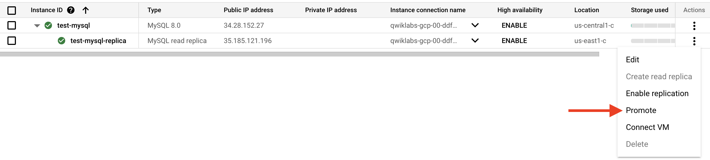

# Read replica

- Cloud SQL is a regional service with read replicas allowed in other regions.
- HA replica === multiple zones(HA)
- you wouldn’t use a read replica as a source anyway for a migration.
- Native DB replication
- https://cloud.google.com/sql/docs/mysql/replication/external-server
- 20, 27, 28, 49, 68, 82, 96, 121
- a managed service (Cloud SQL)
- The question says backups and maintenance are an issue, so moving to a managed service (Cloud SQL) would be the right thing to do.
- https://cloud.google.com/sql/docs/mysql/replication/manage-replicas#promote-replica
- HA (ADD) -> HA(Enabled) -> For testing, go a primary and Failover
- Read replica --> promote
  
- MySQL read replicas use asynchronous replication.
- zonal failure > enable HA to recover

# backups

- You cannot configure a custom location for automatic backups. A is wrong. The default option for automatic backups is multi-region. B is wrong.
- 101

# BT

- Key Visualizer

# Cloud SQL

- Cloud SQL could not scale to multiple regions.
- Cloud SQL is a regional service so cannot scale to multiple regions.

# Cloud SQL for PostgreSQL

- open source, SQL-compliant database.

# Query Insights

- Sqlcommenter

# Memorystore (Redis)

- sub-millisecond query latency
