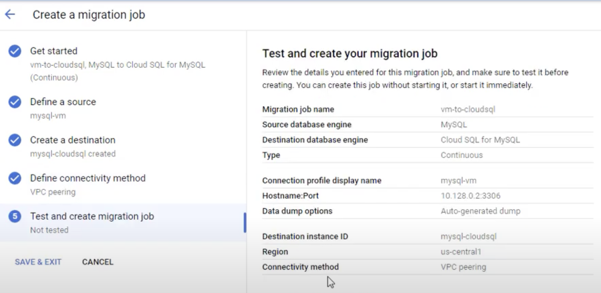

# Cloud SQL for MySQL: Qwik Start

## Task 1. Create a Cloud SQL instance

- SQL -> MySQL -> Instance ID

## Task 2. Connect to your instance using the mysql client in Cloud Shell

```
gcloud sql connect myinstance --user=root
```

## Task 3. Create a database and upload data

```
CREATE DATABASE guestbook;
USE guestbook;
```

# Migrating On-premises MySQL Using a Continuous Database Migration Service Job

## Task 1. Get the connectivity information for the MySQL source instance

- Compute Engine > VM instances
- Internal IP (e.g., 10.128.0.2).

## Task 2. Create a new connection profile for the MySQL source instance

- Database Migration > Connection profiles.
- Source database engine:MySQL

## Task 3. Create and start a continuous migration job

## Task 4. Review the status of the continuous migration job

- **Migration job name**: vm-to-cloudsql
- **Source database engine**: MySQL
- **Destination database engine**: Cloud SQL for MySQL
- **Type**: Continuous
- **Conneciton profile display name**:mysql-vm
- **Hostname:Port**:10.128.1.2:3306
- **Data dump options**: Auto-generated dump
- **Destination instance ID**:mysql-cloudsql
- **Region**:us-central1
- **Connectivity method**: VPC-peering



**Status**

- Not started
- Running Full Dump
- Running CDC in progress

## Task 5. Confirm the data in Cloud SQL for MySQL

- Databases > SQL.
- Replica Instance menu, click Databases.

```
gcloud sql connect mysql-cloudsql --user=root --quiet
```

## Task 6. Test the continuous migration of data from the source to the destination instance

- Compute Engine > VM instances.
- Insert two rows in customers table.
- There are now 5,032 records
- Databases > SQL
- select count(\*) from customers;
- There are now 5,032 records

## Task 7. Promote Cloud SQL to be a standalone instance for reading and writing data

- Database Migration > Migration jobs.
- Click Promote.
- Databases > SQL.
- mysql-cloudsql is now a standalone instance
  

**youtube**

- https://www.youtube.com/watch?v=bK9xunQmmYs

# Migrate MySQL Data to Cloud SQL using Database Migration Service: Challenge Lab

## Task 1. Configure a Database Migration Service connection profile for a stand-alone MySQL database

- configure a connection profile

## Task 2. Perform a one-time migration of a stand-alone MySQL database to Cloud SQL

- migrate this compute instance based MySQL database to a Cloud SQL

## Task 3. Create a continuous Database Migration Service migration job to migrate a stand-alone MySQL database to Cloud SQL

- create a continuous Database Migration Service
- VPC peering
- Wait until the job is in the Running state

## Task 4. Test that the continuous Database Migration Service job replicates updated source data

- modify the source database
- use customers_data;
  update customers set gender = 'FEMALE' where addressKey = 934;

## Task 5. Promote the destination Cloud SQL for MySQL database to a stand-alone database

- promote the Cloud SQL for MySQL instance to a stand-alone database for reading and writing data.
