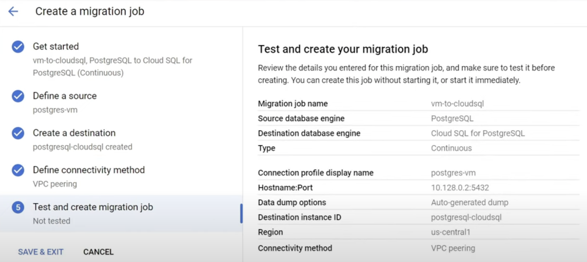
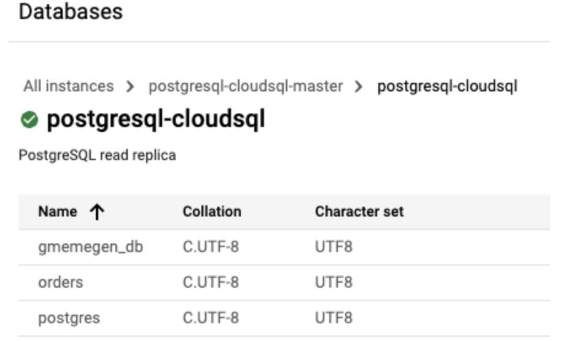

# Migrate to Cloud SQL for PostgreSQL using Database Migration Service

## Task 1. Prepare the source database for migration

- Installing and configuring the **pglogical database extension**.

- Configuring the stand-alone PostgreSQL database to allow access from Cloud Shell and Cloud SQL.

- Adding the pglogical database extension to the postgres, orders and gmemegen_db databases on the stand-alone server.

- Creating a migration_admin user (with Replication permissions) for database migration and granting the required permissions to schemata and relations to that user.

## Task 2. Create a Database Migration Service connection profile for a stand-alone PostgreSQL database

## Task 3. Create and start a continuous migration job

- **Migration job name**: vm-to-cloudsql
- **Source database engine**: PostgreSQL
- **Destination database engine**: Cloud SQL for PostgreSQL
- **Type**: Continueous
- **Conneciton profile display name**:postgre-vm
- **Hostname:Port**:10.128.0.2:5432
- **Data dump options**: Auto-generated dump
- **Destination instance ID**:postgresql-cloudsql
- **Region**:us-central1
- **Connectivity method**: VPC-peering

## Task 4. Confirm the data in Cloud SQL for PostgreSQL

- Database -> SQL -> postgresql-instance ID -> Replica Instance menu -> click Databases
- Notice that the databases called postgres, orders and gmemegen_db have been migrated to Cloud SQL.

## Task 5. Promote Cloud SQL to be a stand-alone instance for reading and writing data

- Migration > Migration jobs -> Click Promote

**youtube**

- https://www.youtube.com/watch?v=PntWoNXrQmo

# psql commands

- https://hasura.io/blog/top-psql-commands-and-flags-you-need-to-know-postgresql/
- https://www.geeksforgeeks.org/postgresql-psql-commands/

| Description                | command                            |
| -------------------------- | ---------------------------------- |
| Connect to a database      | psql -d <db-name> -U <username> -W |
| List all databases         | \l                                 |
| Switch to another database | \c <db-name>                       |
| List database tables       | \dt                                |
| Describe a table           | \d <table-name>                    |
| Quit psql                  | \q                                 |
|                            |                                    |
