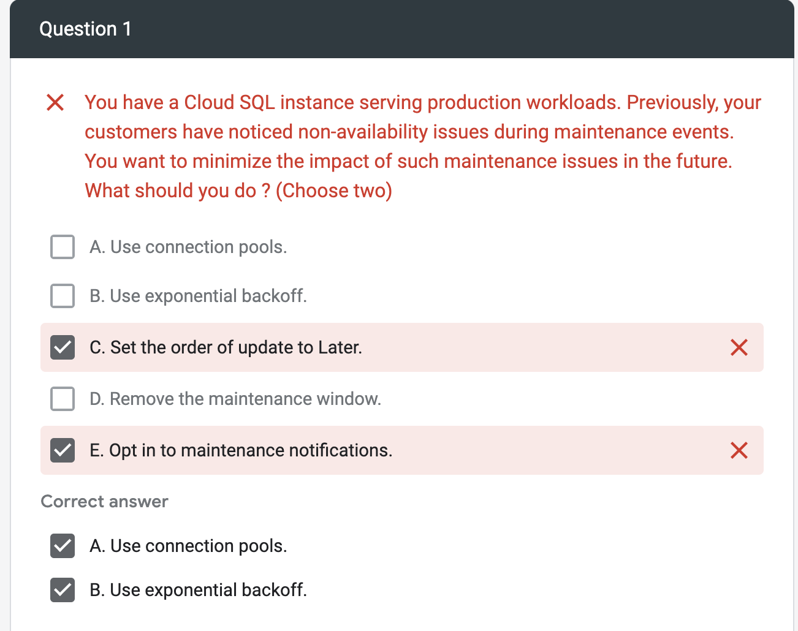
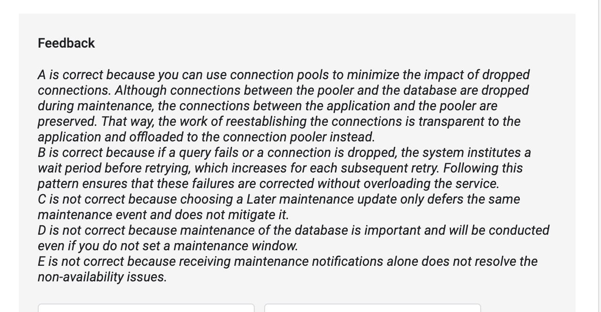
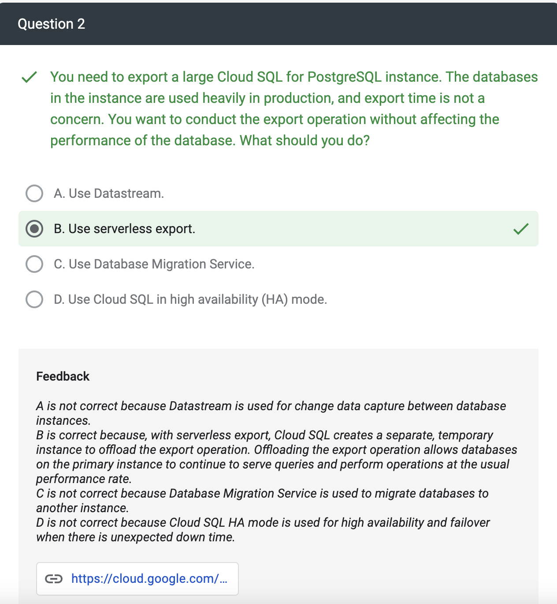

# Migrating On-premises MySQL Using a Continuous Database Migration Service Job

In this lab, you migrate an on-premises MySQL database (running on a virtual machine) to Cloud SQL for MySQL using a **continuous Database Migration Service job** and **VPC peering** for connectivity. After you create and run the migration job, you confirm that an initial copy of your database has been successfully migrated to your Cloud SQL for MySQL instance. Then, you explore how continuous migration jobs continue to apply data updates from your source database to your Cloud SQL instance until you choose to complete the job. To conclude the migration job, you promote the Cloud SQL instance to be **a new standalone database** for reading and writing data.

## Task 1. Get the connectivity information for the MySQL source instance

- Compute Engine > VM instances
- Internal IP (e.g., 10.128.0.2).

## Task 2. Create a new connection profile for the MySQL source instance

- A connection profile stores information about the source database instance (e.g., on-premises MySQL)
- Database Migration > Connection profiles.
- Source database engine, select MySQL.

## Task 3. Create and start a continuous migration job

- When you create a new migration job, you first define the source database instance using a previously created connection **profile**. Then you create **a new destination database instance** and configure **connectivity** between the source and destination instances.

## Task 4. Review the status of the continuous migration job

- Database Migration > Migration jobs.
- Review the migration job status.
- Running Full Dump
- Running CDC in progress -> proceed to the next task
- Note: Continuous migration jobs remain in a running status to ensure that the destination database continues to receive data updates from the source.

## Task 5. Confirm the data in Cloud SQL for MySQL

- Databases > SQL.
- Replica Instance menu, click Databases.
- gcloud sql connect mysql-cloudsql --user=root --quiet

## Task 6. Test the continuous migration of data from the source to the destination instance

- Compute Engine > VM instances.
- Insert two rows in customers table.
- There are now 5,032 records
- Databases > SQL
- select count(\*) from customers;
- There are now 5,032 records

## Task 7. Promote Cloud SQL to be a standalone instance for reading and writing data

- Database Migration > Migration jobs.
- Click Promote.
- Databases > SQL.
- mysql-cloudsql is now a standalone instance

# Migrate MySQL Data to Cloud SQL using Database Migration Service: Challenge Lab

## Task 1. Configure a Database Migration Service connection profile for a stand-alone MySQL database

- configure a connection profile

## Task 2. Perform a one-time migration of a stand-alone MySQL database to Cloud SQL

- migrate this compute instance based MySQL database to a Cloud SQL

## Task 3. Create a continuous Database Migration Service migration job to migrate a stand-alone MySQL database to Cloud SQL

- create a continuous Database Migration Service
- VPC peering
- Wait until the job is in the Running state

## Task 4. Test that the continuous Database Migration Service job replicates updated source data

- modify the source database
- use customers_data;
  update customers set gender = 'FEMALE' where addressKey = 934;

## Task 5. Promote the destination Cloud SQL for MySQL database to a stand-alone database

- promote the Cloud SQL for MySQL instance to a stand-alone database for reading and writing data.

# Migrate to Cloud SQL for PostgreSQL using Database Migration Service

## Objectives

- Prepare the source database for migration.

- Create a profile for a source connection to a PostgreSQL instance (e.g., stand-alone PostgreSQL).

- Configure connectivity between the source and destination database instances using VPC peering.

- Configure firewall and database access rules to allow access to the source database for migration.

- Create, run, and verify a continuous migration job using Database Migration Service.

- Promote the destination instance (Cloud SQL for PostgreSQL) to be a stand-alone database for reading and writing data.

# Lab3: Migrate to Cloud SQL for PostgreSQL using Database Migration Service

## Objective

- Prepare the source database for migration.
- Create a profile for a source connection to a PostgreSQL instance (e.g., stand-alone PostgreSQL).
- Configure connectivity between the source and destination database instances using VPC peering.
- Configure firewall and database access rules to allow access to the source database for migration.
- Create, run, and verify a continuous migration job using Database Migration Service.
- Promote the destination instance (Cloud SQL for PostgreSQL) to be a stand-alone database for reading and writing data.

## Task 1. Prepare the source database for migration

- Installing and configuring the pglogical database extension.

  ```
  sudo apt update
  sudo apt install postgresql-13-pglogical
  sudo nano /etc/postgresql/13/main/postgresql.conf
  # Alt + /
  # Add settings for extensions here
  ```

wal*level = logical # minimal, replica, or logical
max_worker_processes = 10 # one per database needed on provider node # one per node needed on subscriber node
max_replication_slots = 10 # one per node needed on provider node
max_wal_senders = 10 # one per node needed on provider node
shared_preload_libraries = 'pglogical'
max_wal_size = 1GB
min_wal_size = 80MB
listen_addresses = '*' # what IP address(es) to listen on, '\_' is all

sudo nano /etc/postgresql/13/main/pg_hba.conf
host all all 0.0.0.0/0 md5
sudo systemctl restart postgresql@13-main
sudo su - postgres
psql
\c postgres;
CREATE EXTENSION pglogical;
\c orders;
CREATE EXTENSION pglogical;
\l

```

- Creating a migration_admin user (with Replication permissions) for database migration and granting the required permissions to schemata and relations to that user.

```

psql
CREATE USER migration_admin PASSWORD 'DMS_1s_cool!';
ALTER DATABASE orders OWNER TO migration_admin;
ALTER ROLE migration_admin WITH REPLICATION;

```

```

\c postgres;
GRANT USAGE ON SCHEMA pglogical TO migration_admin;
GRANT ALL ON SCHEMA pglogical TO migration_admin;
GRANT SELECT ON pglogical.tables TO migration_admin;
GRANT SELECT ON pglogical.depend TO migration_admin;
GRANT SELECT ON pglogical.local_node TO migration_admin;
GRANT SELECT ON pglogical.local_sync_status TO migration_admin;
GRANT SELECT ON pglogical.node TO migration_admin;
GRANT SELECT ON pglogical.node_interface TO migration_admin;
GRANT SELECT ON pglogical.queue TO migration_admin;
GRANT SELECT ON pglogical.replication_set TO migration_admin;
GRANT SELECT ON pglogical.replication_set_seq TO migration_admin;
GRANT SELECT ON pglogical.replication_set_table TO migration_admin;
GRANT SELECT ON pglogical.sequence_state TO migration_admin;
GRANT SELECT ON pglogical.subscription TO migration_admin;

```

```

\c orders;
GRANT USAGE ON SCHEMA pglogical TO migration_admin;
GRANT ALL ON SCHEMA pglogical TO migration_admin;
GRANT SELECT ON pglogical.tables TO migration_admin;
GRANT SELECT ON pglogical.depend TO migration_admin;
GRANT SELECT ON pglogical.local_node TO migration_admin;
GRANT SELECT ON pglogical.local_sync_status TO migration_admin;
GRANT SELECT ON pglogical.node TO migration_admin;
GRANT SELECT ON pglogical.node_interface TO migration_admin;
GRANT SELECT ON pglogical.queue TO migration_admin;
GRANT SELECT ON pglogical.replication_set TO migration_admin;
GRANT SELECT ON pglogical.replication_set_seq TO migration_admin;
GRANT SELECT ON pglogical.replication_set_table TO migration_admin;
GRANT SELECT ON pglogical.sequence_state TO migration_admin;
GRANT SELECT ON pglogical.subscription TO migration_admin;
GRANT USAGE ON SCHEMA public TO migration_admin;
GRANT ALL ON SCHEMA public TO migration_admin;
GRANT SELECT ON public.distribution_centers TO migration_admin;
GRANT SELECT ON public.inventory_items TO migration_admin;
GRANT SELECT ON public.order_items TO migration_admin;
GRANT SELECT ON public.products TO migration_admin;
GRANT SELECT ON public.users TO migration_admin;

```

```

\c orders;
\dt
ALTER TABLE public.distribution_centers OWNER TO migration_admin;
ALTER TABLE public.inventory_items OWNER TO migration_admin;
ALTER TABLE public.order_items OWNER TO migration_admin;
ALTER TABLE public.products OWNER TO migration_admin;
ALTER TABLE public.users OWNER TO migration_admin;
\dt

```

ALTER TABLE inventory_items ADD CONSTRAINT inventory_items_pkey PRIMARY KEY (id);

# psql commands

- https://hasura.io/blog/top-psql-commands-and-flags-you-need-to-know-postgresql/
- https://www.geeksforgeeks.org/postgresql-psql-commands/

| Description                | command                            |
| -------------------------- | ---------------------------------- |
| Connect to a database      | psql -d <db-name> -U <username> -W |
| List all databases         | \l                                 |
| Switch to another database | \c <db-name>                       |
| List database tables       | \dt                                |
| Describe a table           | \d <table-name>                    |
| Quit psql                  | \q                                 |
|                            |                                    |
```

# Creating and Populating a Bigtable Instance

- Create a Bigtable instance and a Bigtable table with column families.
- Use a Dataflow template to load SequenceFile files from Cloud Storage into Bigtable.
- Verify the data loaded into Bigtable.
- Delete the Bigtable table and instance.

## Task 1. Create a Bigtable instance

- Console

## Task 2. Create a new Bigtable table

- Console

## Task 3. Load data files from Cloud Storage using a Dataflow template

- Console

## Task 4. Verify data loaded into Bigtable

- To connect to Bigtable using cbt CLI commands, you first need to update the .cbtrc configuration file with your project ID and your Bigtable instance ID using Cloud Shell.

```
echo project = `gcloud config get-value project`  >> ~/.cbtrc

echo instance = personalized-sales  >> ~/.cbtrc

cat ~/.cbtrc
project = <project-id>
instance = personalized-sales

//To see the data for the first ten rows of the table
cbt read UserSessions count=10
```

## Task 5. Delete a Bigtable table and instance

- Console






