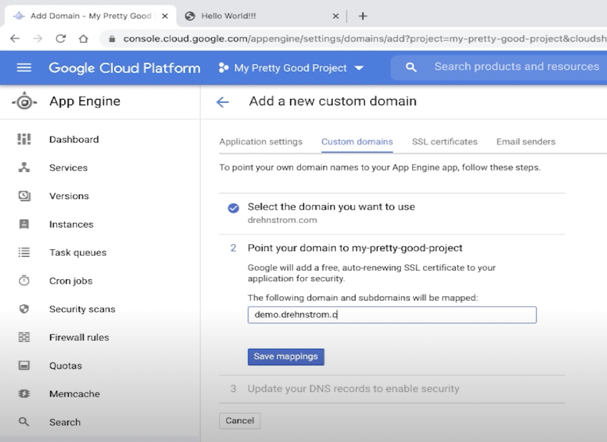
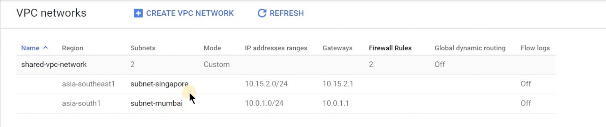

# App Engine Flex

**App Engine Overview**

- https://cloud.google.com/appengine

**App Engine Flexible Environment Overview**

- This doc gives an overview of GAE Flex and is helpful to understand basic features.
- https://cloud.google.com/appengine/docs/flexible

**Choosing an App Engine environment**

- This doc explains the differences between GAE Standard and GAE Flex and is helpful to understand basic features.

**Flexible environment pricing**

- In this doc, you'll learn how GAE Flex usage is charged.
- https://cloud.google.com/appengine/pricing#flexible-environment-pricing

## Structuring Web Services in App Engine

- This page helps you understand how to structure the services and related resources of your app for App Engine.
- [Structuring web services in App Engine](https://cloud.google.com/appengine/docs/flexible/configuration-files)
- [Microservices (Instagram API Live Demo) - Episode 1.4 | Google Cloud ~ App Engine](https://www.youtube.com/watch?v=HCHXZAowMQg&list=PL42xwJRIG3xCtmOrJAQFR5sIJFKIJ9MEn&index=6)

  - 06:22 - start coding
  - 12:08 - app.yaml
  - 13:11 - deploy
  - 17:03 - two services

- [An Overview of App Engine](https://cloud.google.com/appengine/docs/legacy/standard/python/an-overview-of-app-engine#components_of_an_application)


## Handling Requests

- This doc describes how your App Engine application receives requests and sends responses.
- [How requests are handled](https://cloud.google.com/appengine/docs/flexible/how-requests-are-handled?tab=node.js#top)

**Handling requests**

```
const express = require('express');

const app = express();

app.get('/', (req, res) => {
  res.status(200).send('Hello, world!').end();
});

// Start the server
const PORT = parseInt(process.env.PORT) || 8080;
app.listen(PORT, () => {
  console.log(`App listening on port ${PORT}`);
  console.log('Press Ctrl+C to quit.');
});
```

**Handling asynchronous background work**

- For long-running jobs, we recommend using Cloud Tasks. With Cloud Tasks, HTTP requests are long-lived and return a response only after any asynchronous work ends.

## Routing Requests

- This page describes how HTTP requests from users reach the appropriate version of a service.
- [How requests are routed](https://cloud.google.com/appengine/docs/flexible/how-requests-are-routed)

**Default service URLs**

- `https://PROJECT_ID.REGION_ID.r.appspot.com`
- This URL sends requests to your app's default service at the version that you have configured to receive traffic.

**URLs for services and versions**

- `VERSION-dot-SERVICE-dot-PROJECT_ID.REGION_ID.r.appspot.com`

**Overview of App Security**

- This page describes features to ensure that your App Engine app is secure.
- https://cloud.google.com/appengine/docs/flexible/application-security

**Writing and Viewing Logs**

- This page describes the logs that are available for App Engine apps, and how to write and view log entries.
- https://cloud.google.com/appengine/docs/flexible/writing-application-logs?tab=node.js

## Serving Static Files

- The page explains how to serve static files in GAE Flex.
- https://cloud.google.com/appengine/docs/flexible/serving-static-files?tab=node.js

- https://github.com/GoogleCloudPlatform/nodejs-docs-samples/blob/HEAD/appengine/static-files/app.js

- https://github.com/GoogleCloudPlatform/nodejs-docs-samples/tree/5790b3eb6c57cf885de0fc1043408b25dedd0e32/appengine/storage/flexible

## Authenticating Users

- The page provides basic ideas for user authentication.
- https://cloud.google.com/appengine/docs/flexible/authenticating-users
- Firebase Authentication

## Mapping Custom Domains

- The page illustrates necessary steps to set up a custom domain.
- https://cloud.google.com/appengine/docs/flexible/mapping-custom-domains
- [49. Using Custom Domains with App Engine | Google Quick Tutorials](https://www.youtube.com/watch?v=CvSR_8pxcGk&list=PLuJRcdtonlDAN73rZsRk_eiJ0NU9h1Cms&index=50)
  

## Securing Custom Domains with SSL

- The page help you use and set up SSL certs for your custom domain.
- https://cloud.google.com/appengine/docs/flexible/securing-custom-domains-with-ssl

**Verify a managed certificate**

- After you set up your custom domain and update the DNS records, a managed SSL certificate is automatically provided within a few minutes.

1. In the Google Cloud console, go to App Engine > Settings > Custom Domains:
2. The SSL security displays as Google-managed.

## GAE Flex Quickstarts (Node.js)

- Going through this quickstart will help you grasp the basic features and deployment process.
- [Create a Node.js app in the App Engine flexible environment](https://cloud.google.com/appengine/docs/flexible/nodejs/create-app)

## [Lab] Qwiklabs

- [Node.js Google Cloud Storage sample for Google App Engine](https://github.com/GoogleCloudPlatform/nodejs-docs-samples/tree/main/appengine/storage/flexible)

## Configuring your App with app.yaml

- This doc explains how to customize resource, health-check, and scaling settings. Adjust these parameters and get familiar with resource settings.
- [app.yaml Configuration File](https://cloud.google.com/appengine/docs/flexible/reference/app-yaml?tab=node.js#top)
- [Configuring your app with app.yaml - Node.js](https://cloud.google.com/appengine/docs/flexible/nodejs/configuring-your-app-with-app-yaml)

**app.yaml example**

- This sample incurs costs to run on the App Engine flexible environment.
- The settings below are to reduce costs during testing.

```
runtime: nodejs
env: flex
manual_scaling:
  instances: 1
resources:
  cpu: 1
  memory_gb: 0.5
  disk_size_gb: 10
```

```
gcloud app deploy service-name-app.yaml
gcloud app deploy app.flexible.yaml
```

**Automatic scaling**

The default is automatic scaling.

```
automatic_scaling:
  min_num_instances: 1
  max_num_instances: 15
  cool_down_period_sec: 180
  cpu_utilization:
    target_utilization: 0.6
  target_concurrent_requests: 100
```

- min_num_instances

  > The minimum number of instances given to your service. When a service is deployed, it is given this many instances and scales according to traffic. Must be 1 or greater, default is 2 to reduce latency.

- max_num_instances
  > The maximum number of instances that your service can scale up to. The maximum number of instances in your project is limited by your project's resource quota. Default is 20.

**Manual scaling**

```
manual_scaling:
  instances: 5
```

**Controlling Access with Firewalls**

- This doc explains how customers can manage user access based on IPs. Read through the page, and try "Creating firewall rules" section.
- https://cloud.google.com/appengine/docs/flexible/creating-firewalls

**App Engine Flex || Kubernetes Engine — ? - Google Cloud - Community - Medium**

- This article will help you understand similarities and differences with GAE Flex and GKE, with example logs and screenshots.
- https://medium.com/google-cloud/app-engine-flex-container-engine-946fbc2fe00a

**Building Custom Runtimes**

- This doc explains how to create a custom runtime and deploy it in GAE Flex.
- https://cloud.google.com/appengine/docs/flexible/custom-runtimes/build

# Advanced

## Debugging and Instance

https://cloud.google.com/appengine/docs/flexible/debugging-an-instance

You can enable debug mode for a VM. In debug mode, principals who have the Owner, Editor, and App Engine Admin roles on the project have root access to the VM

```
gcloud app --project PROJECT-ID instances enable-debug
gcloud app --project PROJECT-ID instances disable-debug
```

**SSH**

1. Go to the instance page
2. Click SSH
3. `sudo docker ps`
   List containers
   https://docs.docker.com/engine/reference/commandline/ps/

## Troubleshooting deploys

```
gcloud app deploy --verbosity debug
```

## HTTPS Load Balancer Playbook

broken link

## Troubleshooting Firewall issues

This page helps you check if your requests are accepted or rejected based on L2 GFE logs

## Compute Engine Playbook

GAE Flex uses GCE machines.

- https://stackoverflow.com/questions/48982216/does-google-app-engine-flexible-environment-use-only-one-container-on-one-vm-ins

> Google App Engine (GAE) Flexible runs only one container per VM and does not support multiple containers at the moment. There was a feature request issued and for now it is not on a roadmap of Google's engineering team. You can track and star this issue here.

The reason for this is that GAE Flexible is intended to be an automatized environment so that you can focus on actual coding while it takes care of scaling and load-balancing in the background for you. If you want to use more than one container you can deploy it as a separate service in the same app. More advanced control and customization can be done using Kubernetes Engine:

- [Google App Engine Comparison — Standard vs Flexible Environment](https://medium.com/10decoders/how-to-choose-app-engine-environment-standard-flexible-9f4c26a723b0)

**GAE flex Advantages:**

- SSH access and support for docker . This is a key difference which opens a lot of possibilities.

## Autoscaler Playbook

Dremel query in the page is also useful to check GAE scaling activities.

[Dremel](<https://en.wikipedia.org/wiki/Dremel_(software)>)

- Dremel is a distributed system developed at Google for interactively querying large datasets.
- Dremel is the query engine used in Google's BigQuery service.[1]

## Using the App Engine flexible environment on a Shared VPC network

- [Using the App Engine flexible environment on a Shared VPC network](https://cloud.google.com/appengine/docs/flexible/using-shared-vpc)
- [YouTube](https://www.youtube.com/watch?v=0spXlh_VLxg)
- [Provision Shared VPC](https://cloud.google.com/vpc/docs/provisioning-shared-vpc)

**Add Firewall rule in HOST PROJECT**

| FW item                     | values                        |
| --------------------------- | ----------------------------- |
| Network: shared-vpc-network |                               |
| Direction:                  | Ingress                       |
| Action on match:            | Allow                         |
| Targets:                    | target tags                   |
| Target tags:                | aef-instance                  |
| Source filter:              | IP ranges                     |
| Source IP ranges:           | 35.191.0.0/16, 130.211.0.0/22 |
| Protocols and ports:        | tcp: 8443, 10402              |

**Setting up permission**

1. Host-Project: a host project in a Shared VPC
2. Service-Project-B: Deploying GAE flex
3. Add below two service accounts in Service-Project-B in a HOST PROJECT and added `Compute Network User` role.

- <service-project-B-project-num>@cloudservices.gserviceaccount.com
- service-<service-project-B-project-num>@gae-api-prod.google.com.iam.gserviceaccount.com

**Configuring and deploying your service**

1. Add the network setting in app.yaml

```
network:
  name: projects/HOST_PROJECT_ID/global/networks/NETWORK_NAME
  subnetwork_name: SUBNETWORK_NAME
```

2. Deploy app
   ```
   gcloud app deploy
   ```


