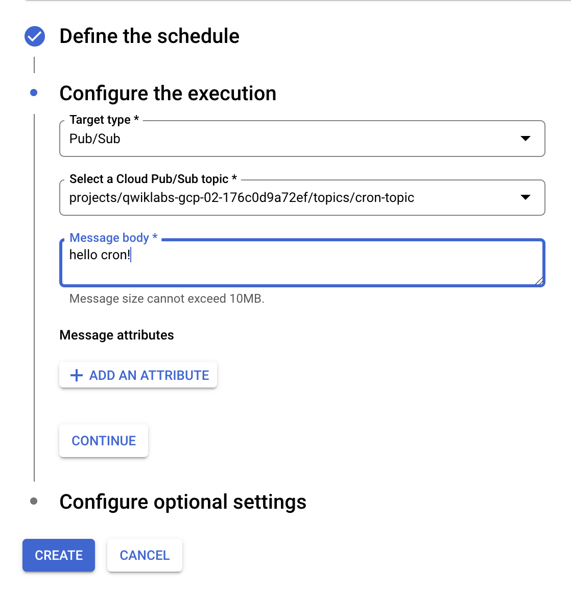
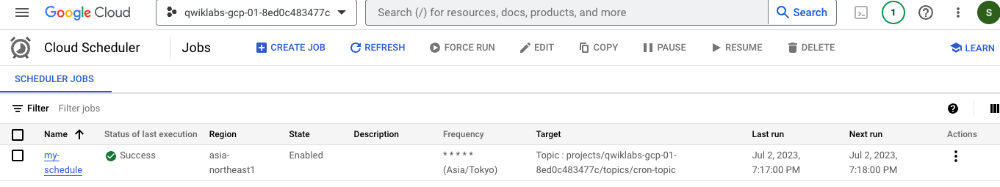
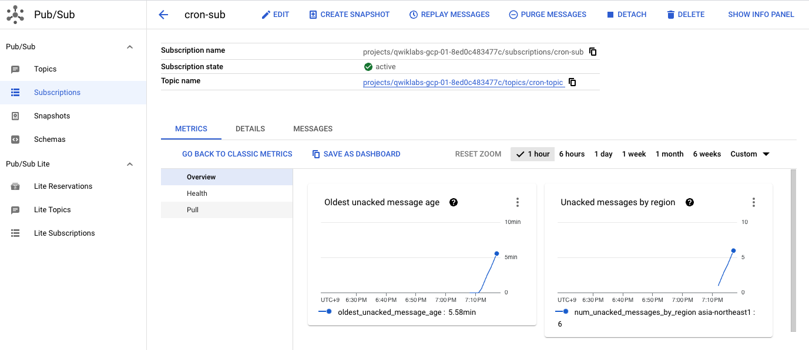

# Cloud Scheduler: Qwik Start

- [QwikLab](https://www.cloudskillsboost.google/focuses/3556?catalog_rank=%7B%22rank%22%3A1%2C%22num_filters%22%3A0%2C%22has_search%22%3Atrue%7D&parent=catalog&search_id=24533552)

## Overview

Cloud Scheduler lets you set up scheduled units of work to be executed at defined times or regular intervals. These work units are commonly known as cron jobs. Typical use cases might include sending out a report email on a daily basis, updating cached data every 10 minutes, or updating summary information once an hour. You can automate everything, including retries in case of failure to reduce manual intervention.

Each cron job created using Cloud Scheduler is sent to a target, where the work for the task is accomplished. The target must be one of the following types:

Publicly available HTTP/S endpoints
Pub/Sub topics
App Engine HTTP/S applications

## Task 1. Enable Cloud Scheduler API

- Click on APIs & services > Library > in the search bar, type in scheduler > Enable Cloud Scueculer API

## Task 2. Set up Cloud Pub/Sub

```js
//1.  Create a Pub/Sub topic to use as a target for your cron job:
gcloud pubsub topics create cron-topic
//2. Create a Cloud Pub/Sub subscription:
gcloud pubsub subscriptions create cron-sub --topic cron-topic
```



## Task 3. Create a job

Cloud Scheduler page

Specify the frequency for your job, using the unix-cron format for "every minute":

```
* * * * *
```

## Task 4. Verify the results in Cloud Pub/Sub

```
gcloud pubsub subscriptions pull cron-sub --limit 5
```

**Scheduler job to run every minute**


**Subscription Metrics**

