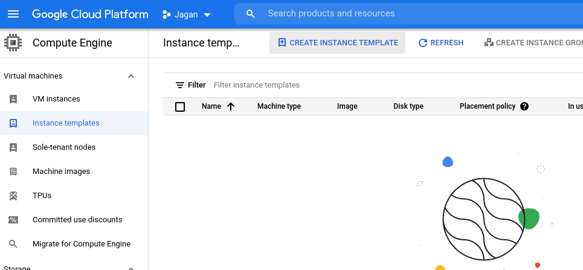
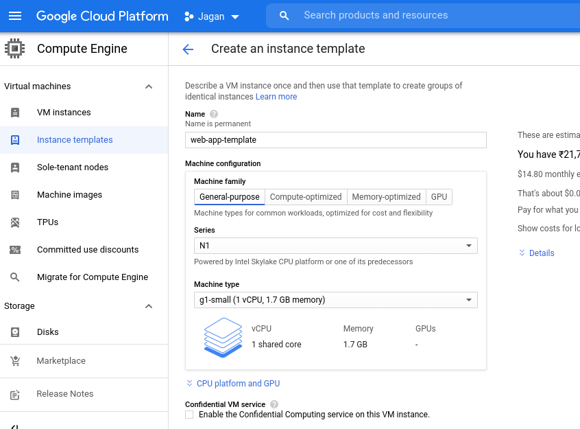
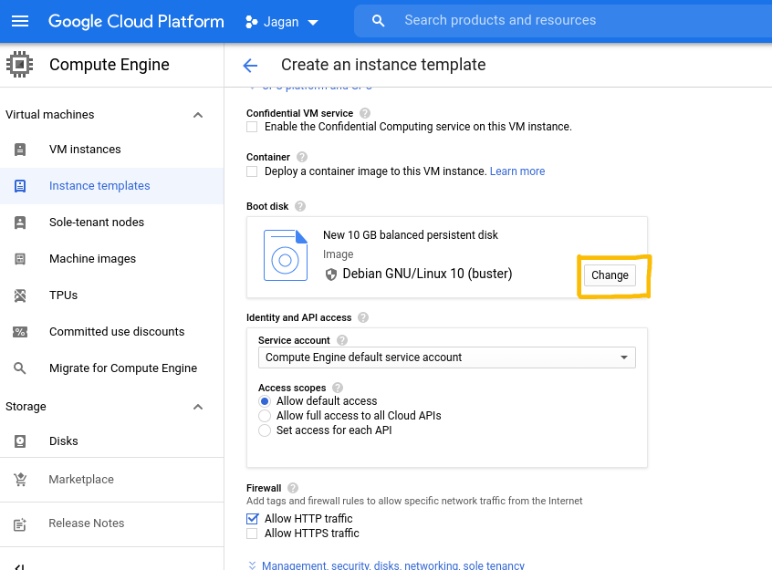
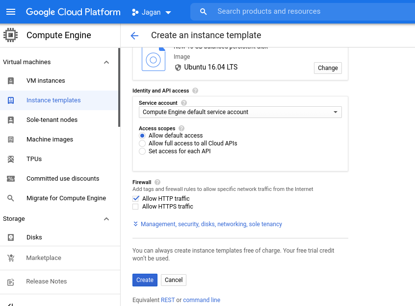

## Compute Engine - Lab

**HOW TO CREATE INSTANCE GROUPS IN COMPUTE ENGINE?**

### What is Instance Group?

Instance group is nothing but a group of virtual machine instances managed as a single entity. You can manage groups of similar VMs having a similar life cycle as one unit and you can create two types of Instance group in Compute Engine.

- Managed instance group
- Unmanaged Instance group

Instance group is the basis for Autoscaling group, Load balancers and Autohealing.

**Creating a instance template**

The first step for instance groups is to create an instance template by specifying the machine types, Boot disk, configuring the network and enabling the firewall.

After clicking on the create button you will get the screen below for entering the specifications for an instance.

In the below screen you need to click on the change button to select an image or snapshot to create a new boot disk or you can attach an existing disk to the instance.

create a boot disk and also you can select the version as well as the size of the disk type.

