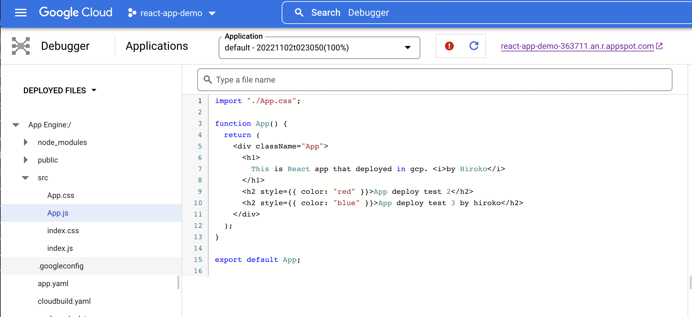
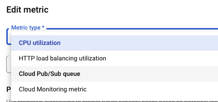
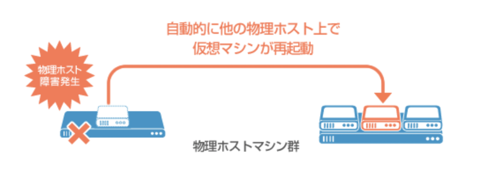
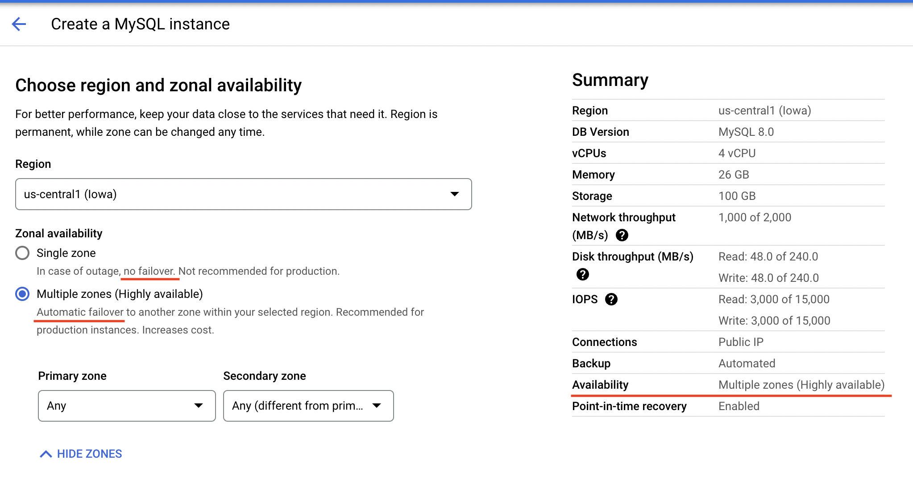
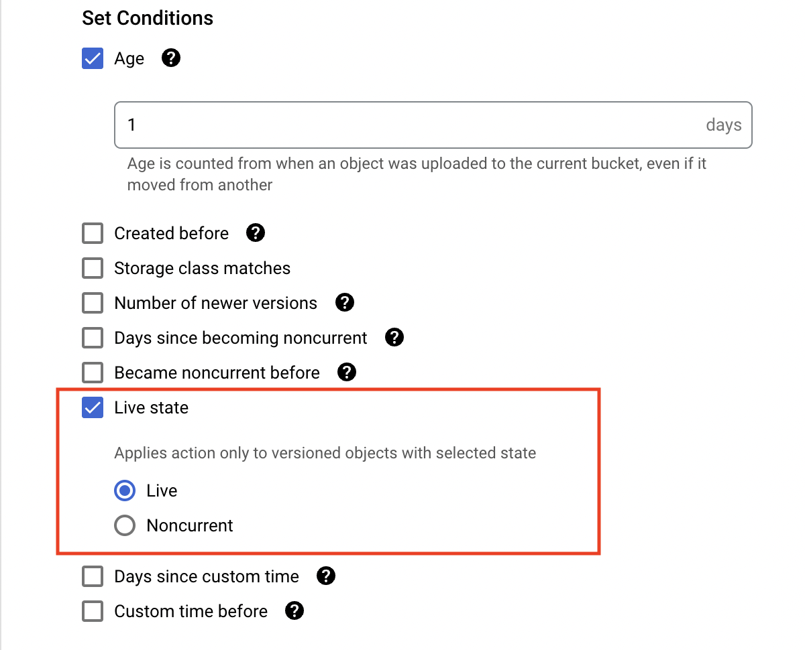

# GCP EXAM QUESTIONS -1

https://gcp-examquestions.com/gcp-associate-cloud-engineer-practice-exam-part-1/

Q11. You have an application server running on Compute Engine in the europe-west1-d zone. You need to ensure high availability and replicate the server to the europe-west2-c zone using the fewest steps possible. What should you do?

- A. Create a snapshot from the disk. Create a disk from the snapshot in the europe-west2-c zone. Create a new VM with that disk.
- B. Create a snapshot from the disk. Create a disk from the snapshot in the europe-west1-d zone and then move the disk to europe-west2-c. Create a new VM with that disk.
- C. Use “gcloud” to copy the disk to the europe-west2-c zone. Create a new VM with that disk.
- D. Use “gcloud compute instances move” with parameter “–destination-zone europe-west2-c” to move the instance to the new zone.

Reveal
Answer: A is correct because this makes sure the VM gets replicated in the new zone.

<hr />

Q15. You have created a Kubernetes deployment, called Deployment-A, with 3 replicas on your cluster. Another deployment, called Deployment-B, needs access to Deployment-A. You cannot expose Deployment-A outside of the cluster. What should you do?

- A. Create a Service of type NodePort for Deployment A and an Ingress Resource for that Service. Have Deployment B use the Ingress IP address.
- B. Create a Service of type LoadBalancer for Deployment A. Have Deployment B use the Service IP address.
- C. Create a Service of type LoadBalancer for Deployment A and an Ingress Resource for that Service. Have Deployment B use the Ingress IP address.
- D. Create a Service of type ClusterIP for Deployment A. Have Deployment B use the Service IP address.

Reveal
Answer: D is correct because this exposes the service on a cluster-internal IP address. Choosing this method makes the service reachable only from within the cluster.

**Links:**

1. https://cloud.google.com/kubernetes-engine/docs/concepts/service

**Service**

- There are different types of Services, which you can use to group a set of Pod endpoints into a single resource.[1]

**What is a Kubernetes Service?**

- The idea of a Service is to group a set of Pod endpoints into a single resource. You can configure various ways to access the grouping. By default, you get a stable cluster IP
- A Service identifies its member Pods with a selector.

  ```
  apiVersion: v1
  kind: Service
  metadata:
  name: my-service
  spec:
  selector: // A Service identifies its member Pods with a selector
    app: metrics
    department: engineering
  ports:

  ```

**Why use a Kubernetes Service?**

- In a Kubernetes cluster, each Pod has an internal IP address. But the Pods in a Deployment come and go, and their IP addresses change. So it doesn't make sense to use Pod IP addresses directly. With a Service, you get a stable IP address that lasts for the life of the Service

**Types of Kubernetes Services**

- **ClusterIP** (default): Internal clients send requests to a stable internal IP address.

- **NodePort**: Clients send requests to the IP address of a node on one or more nodePort values that are specified by the Service.

- **LoadBalancer**: Clients send requests to the IP address of a network load balancer.

**Services of type ClusterIP**

- When you create a Service of type ClusterIP, Kubernetes creates a stable IP address that is accessible from nodes in the cluster.

```
apiVersion: v1
kind: Service
metadata:
  name: my-cip-service
spec:
  selector:
    app: metrics
    department: sales
  type: ClusterIP
  ports:
  - protocol: TCP
    port: 80
    targetPort: 8080
```

- You can create the Service by using kubectl apply -f [MANIFEST_FILE]. After you create the Service, you can use kubectl get service to see the stable IP address:

```
kubectl apply -f [MANIFEST_FILE]
```

```
NAME             TYPE        CLUSTER-IP      EXTERNAL-IP   PORT(S)
my-cip-service   ClusterIP   10.11.247.213   none          80/TCP
```

  <hr />

Q25. Which of the following products will allow you to perform live debugging without stopping your application?

- A. App Engine Active Debugger (AEAD)
- B. Stackdriver Debugger A
- C. Code Inspector
- D. Pause IT

Answer: B
https://cloud.google.com/debugger/docs/



<hr />

Q36. Which of the following is not helpful for mitigating the impact of an unexpected failure or reboot?

- A. Use persistent disks
- B. Configure tags and labels
- C. Use startup scripts to re-configure the system as needed
- D. Back up your data

Answer: B

**Unexpected single VM failure**

- Unexpected single VM failures can be due to hardware or system failure. You can mitigate these events by using persistent disks and startup scripts to save your data and re-enable software after you restart the VM.

1. https://cloud.google.com/compute/docs/tutorials/robustsystems#typesoffailures

<hr />
Q41. What type of firewall rule(s) does Google Cloud’s networking support?

- A. deny
- B. allow, deny & filtered
- C. allow
- D. allow & deny

Reveal
Answer: A(D is correct)

- VPC firewall rules let you allow or deny connections to or from your virtual machine (VM) instances based on a configuration that you specify.[3]

Links:

1. https://cloud.google.com/compute/docs/networking
2. https://www.examtopics.com/discussions/google/view/19714-exam-professional-cloud-architect-topic-9-question-22/
3. https://cloud.google.com/vpc/docs/firewalls

<hr />

Q43. Which of the following is not a valid metric for triggering autoscaling?

- A. Google Cloud Pub/Sub queuing
- B. Average CPU utilization
- C. Stackdriver Monitoring metrics
- D. App Engine Task Queues

Reveal
Answer: D
https://cloud.google.com/compute/docs/autoscaler/



<hr />

Q45. What option does Cloud SQL offer to help with high availability?

- A. Point-in-time recovery
- B. The AlwaysOn setting
- C. Snapshots
- D. Failover replicas

Reveal
Answer: D
https://cloud.google.com/sql/docs/configure-ha#test

- 障害迂回 ◆ 主にコンピューターシステムで、エラーが起きたときにそのエラーをやり過ごす（何もなかったかのように振る舞う）ための機能。例えばサーバーなら、エラー時にすぐ別のサーバーに自動的に切り替わるようにしておく。
- high availability (HA)
- 
- 

**Links:**

1. https://cloud.google.com/sql/docs/mysql/high-availability#failover-overview
2. https://cloud.google.com/sql/docs/mysql/configure-ha#verify_an_instance_has

<hr />

Q46. Regarding Compute Engine: when executing a startup script on a Linux server which user does the instance execute the script as?

- A. ubuntu
- B. The Google provided “gceinstance” user
- C. Whatever user you specify in the console
- D. root

Reveal
Answer: D

**Startup Script Overview**

- A startup script is a file that contains commands that run when a virtual machine (VM) instance boots. Compute Engine provides support for running startup scripts on Linux VMs and Windows VMs.[2]
- For Linux VMs, by using the root user.[1]
- For Windows VMs, by using the System account.[1]

**Links:**

1. https://cloud.google.com/compute/docs/shutdownscript
2. https://cloud.google.com/compute/docs/startupscript

<hr />

Q47. Which of the follow methods will not cause a shutdown script to be executed?

- A. When an instance shuts down through a request to the guest operating system
- B. A preemptible instance being terminated
- C. An instances.reset API call
- D. Shutting down via the cloud console

Reveal
Answer: C

- Create and run shutdown scripts that execute commands right before a virtual machine (VM) instance is stopped or restarted. This is useful if you rely on automated scripts to start up and shut down instances, allowing instances time to clean up or perform tasks, such as exporting logs, or syncing with other systems.

**Links:**

1. https://cloud.google.com/compute/docs/shutdownscript
2. https://cloud.google.com/compute/docs/startupscript

<hr />

Q52. Which is the fastest instance storage option that will still be available when an instance is stopped?

A. Local SSD
B. Standard Persistent Disk
C. SSD Persistent Disk
D. RAM disk

Reveal
Answer: C
https://cloud.google.com/compute/docs/disks/

> Local SSDs and RAM disks disappear when you stop an instance. Standard Persistent Disks and SSD Persistent Disks both survive when you stop an instance, but SSD Persistent Disks have up to 4 times the throughput and up to 40 times the I/O operations per second of a Standard Persistent Disk.
> Reference: https://cloud.google.com/compute/docs/disks/

**Persistent disks**

- Persistent disks are durable network storage devices that your instances can access like physical disks in a desktop or a server. The data on each persistent disk is distributed across several physical disks. Compute Engine manages the physical disks and the data distribution for you to ensure redundancy and optimal performance.

- Persistent disks are located independently from your virtual machine (VM) instances, so you can detach or move persistent disks to keep your data even after you delete your instances.

- Persistent disk performance scales automatically with size, so you can resize your existing persistent disks or add more persistent disks to an instance to meet your performance and storage space requirements.

**Disk types**

- Standard persistent disks (pd-standard)
- Balanced persistent disks (pd-balanced)
- Performance (SSD) persistent disks (pd-ssd)
  > Suitable for enterprise applications and high-performance databases that require lower latency and more IOPS than standard persistent disks provide.

**Local SSDs**

- Local SSDs are physically attached to the server that hosts your VM instance. Local SSDs have higher throughput and lower latency than standard persistent disks or SSD persistent disks

**Links:**

1. https://cloud.google.com/compute/docs/disks/#pdspecs
2. https://cloud.google.com/compute/docs/disks/#localssds

<hr />

Q65. Suppose you have a web server that is working properly, but you can’t connect to its instance VM over SSH. Which of these troubleshooting methods can you use without disrupting production traffic? (Select 3 answers.)

- A. Create a snapshot of the disk and use it to create a new disk; then attach the new disk to a new instance
- B. Use netcat to try to connect to port 22
- C. Access the serial console output
- D. Create a startup script to collect information.

<hr />

Q66. To configure Stackdriver to monitor a web server and let you know if it goes down, what steps do you need to take? (Select 2 answers.)

- A. Install the Stackdriver Logging Agent on the web server
- B. Create an alerting policy
- C. Install the Stackdriver Monitoring Agent on the web server
- D. Create an uptime check

Reveal
Answer: B D

<hr />

Q68. What are two of the actions you can take to troubleshoot a virtual machine instance that won’t start up at all? (Select 2 answers.)

- A. Increase the CPU and memory on the instance by changing the machine type.
- B. Validate that your disk has a valid file system.
- C. Examine your virtual machine instance’s serial port output.
- D. Connect to your virtual machine instance using SSH.

Reveal
Answer: B C
https://cloud.google.com/compute/docs/troubleshooting#pdboot

<hr />

Q70. Which of these statements about resilience testing are true? (Select 2 answers.)

- A. In a resilience test, your application should keep running with little or no downtime.
- B. To test the resilience of an autoscaling instance group, you can terminate a random instance within that group.
- C. In order for an application to survive instance failures, it should not be stateless.
- D. Resilience testing is the same as disaster recovery testing.

Reveal
Answer: A B
https://cloudacademy.com/google/managing-your-google-cloud-infrastructure-course/testing.html

<hr />

Q71. Which combination of Stackdriver services will alert you about errors generated by your applications and help you locate the root cause in the code?

A. Monitoring, Trace, and Debugger
B. Monitoring and Error Reporting
C. Debugger and Error Reporting
D. Alerts and Debugger

Reveal
Answer: C
https://cloud.google.com/products/

- **Error Reporting** keeps track of errors in your applications and can be configured to alert you when an error occurs.
- **Debugger** lets you inspect the state of an application at any code location. If you click on an error displayed in Error Reporting, it will put you into the associated application's source code in the Debugger so you can diagnose the problem.
- **Monitoring** gives real-time updates on performance metrics and uptime, not application errors. There is no service called Stackdriver Alerts, although alerting is a capability of Stackdriver Monitoring.
- **Trace** collects latency data from your applications. It is useful for locating performance bottlenecks, not application errors.

<hr />

Q72. If you have configured Stackdriver Logging to export logs to BigQuery, but logs entries are not getting exported to BigQuery, what is the most likely cause?

- A. The Cloud Data Transfer Service has not been enabled.
- B. There isn’t a firewall rule allowing traffic between Stackdriver and BigQuery.
- C. Stackdriver Logging does not have permission to write to the BigQuery dataset.
- D. The size of the Stackdriver log entries being exported exceeds the maximum capacity of the BigQuery dataset.

Reveal
Answer: C
https://cloud.google.com/logging/docs/export/configure_export_v2#errors_exporting_to_bigquery

- When you create a sink, Stackdriver Logging creates a new service account for the sink, called a unique writer identity.
  In order to write logs to a BigQuery dataset, you must grant the sink's writer identity either Can edit permission or the Writer role.
  It is not necessary to create a firewall rule to allow traffic between Stackdriver and BigQuery.
  The Cloud Data Transfer Service is for importing data to Google Cloud Platform from an external source.
  BigQuery can easily handle any volume of Stackdriver logs.
  Reference: https://cloud.google.com/logging/docs/export/configure_export_v2#errors_exporting_to_bigquery

<hr />

Q73. You can use Stackdriver to monitor virtual machines on which cloud platforms?

- A. Google Cloud Platform, Microsoft Azure
- B. Google Cloud Platform
- C. Google Cloud Platform, Microsoft Azure, Amazon Web Services
- D. Google Cloud Platform, Amazon Web Services

Reveal
Answer: D
https://cloud.google.com/stackdriver/

<hr />

Q74. To minimize the risk of someone changing your log files to hide their activities, which of the following principles would help? (Select 3 answers.)

- A. Restrict usage of the owner role for projects and log buckets.
- B. Require two people to inspect the logs.
- C. Implement object versioning on the log-buckets.
- D. Encrypt the logs using Cloud KMS.

Reveal
Answer: A B C
https://cloud.google.com/docs/enterprise/best-practices-for-enterprise-organizations#prevent_unwanted_changes_to_logs

<hr />

Q75. If network traffic between one Google Compute Engine instance and another instance is being dropped, what is the most likely cause?

- A. The instances are on a network with low bandwidth.
- B. The TCP keep-alive setting is too short.
- C. The instances are on a default network with no additional firewall rules.
- D. A firewall rule was deleted.

Reveal
Answer: D
https://cloud.google.com/compute/docs/troubleshooting#networktraffic

<hr />

76. Which of the following practices can help you develop more secure software? (Select 3 answers.)

- A. Penetration tests 侵入
- B. Integrating static code analysis tools into your CI/CD pipeline
- C. Encrypting your source code
- D. Peer review of code

Reveal
Answer: A B D

<hr />

Q77. Which two places hold information you can use to monitor the effects of a Cloud Storage lifecycle policy on specific objects? (Select 2 answers.)

- A. Cloud Storage Lifecycle Monitoring
- B. Expiration time metadata
- C. Access logs
- D. Lifecycle config file

Reveal
Answer: BC
https://cloud.google.com/storage/docs/lifecycle#expirationtime

**Expiration time metadata**

- If a Delete action is specified for a bucket with the age condition (and no other conditions besides matchesStorageClass), then some objects might be tagged with expiration time metadata.

**Options for tracking Lifecycle actions**

- To track the lifecycle management actions that Cloud Storage takes, use one of the following options:

- Use Cloud Storage usage logs. This feature logs both the action and who performed the action. A value of GCS Lifecycle Management in the cs_user_agent field of the log entry indicates the action was taken by Cloud Storage in accordance with a lifecycle configuration.

- Enable Pub/Sub Notifications for Cloud Storage for your bucket. This feature sends notifications to a Pub/Sub topic of your choice when specified actions occur. Note that this feature does not record who performed the actions.

<hr />

Q78. If you have object versioning enabled on a multi-regional bucket, what will the following lifecycle config file do?

```
If you have object versioning enabled on a multi-regional bucket, what will the following lifecycle config file do?
{"lifecycle": {
"rule": [ {
"action": {"type": "Delete"},
"condition": {
"age": 30,
"isLive": true } },
{ "action": {
"type": "SetStorageClass",
"storageClass": "COLDLINE"},
"condition": {
"age": 365,
"matchesStorageClass": ["MULTI_REGIONAL"] } } ] } }
```

- A. Archive objects older than 30 days (the second rule doesn’t do anything)
- B. Delete objects older than 30 days (the second rule doesn’t do anything)
- C. Archive objects older than 30 days and move objects to Coldline Storage after 365 days
- D. Delete objects older than 30 days and move objects to Coldline Storage after 365 days

Answer: D(C is correct.)

1. Deletions always take precedence over SetStorage (so if any objects meet both rules when this is created - it will delete).
2. The bucket has object versioning enabled. A deletion of a versioned object with isLive:true, simply removes the live object and creates a noncurrent version -which is essentially an archived version of the object.
3. These noncurrent versions (considered archived) - are now moved to ColdLine Storage after 365 days

So reading C “Archive objects older than 30 days and move objects to Coldline Storage after 365 days” - makes most sense

**isLive**

- The isLive condition is typically only used in conjunction with Object Versioning. When set to **false**, this condition is satisfied for any **noncurrent version** of an object. When set to true, this condition is satisfied **for the live version of an object**. If you don't use versioning, all your objects are considered live and match when isLive is true.

Links:

1. https://cloud.google.com/storage/docs/lifecycle#islive



<hr />

Q79. Which of the following statements about Stackdriver Trace are true? (Select 2 answers.)

- A. Stackdriver Trace tracks the performance of the virtual machines running the application.
- B. Stackdriver Trace tracks the latency of incoming requests.
- C. Applications in App Engine automatically submit traces to Stackdriver Trace. Applications outside of App Engine need to use the Trace SDK or Trace API.
- D. To make an application work with Stackdriver Trace, you need to add instrumentation code using the Trace SDK or Trace API, even if the application is in App

Suggested Answer: BC

- The Cloud Trace API lets you send latency data to, and retrieve latency data from, Cloud Trace.[1]

**Tracing system**

- Displays data in near real–time
- Latency reporting
- Per-URL latency sampling

**Collects latency data**

- App Engine
- Google HTTP(S) load balancers
- Applications instrumented with the Cloud Trace SDKs
  > Cloud Trace automatically analyzes all of your application's traces to generate in-depth latency reports that surface performance degradations and can capture traces from App Engine, HTTP(S) load balancers, and applications instrumented with the Cloud Trace API.

1. https://cloud.google.com/trace/docs/reference
2. textbook

<hr />
