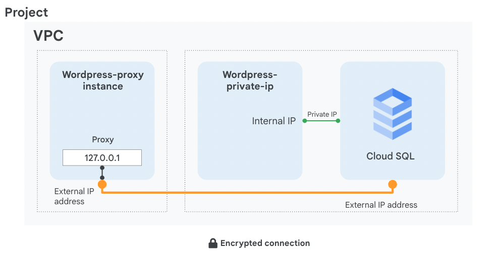

# QuickStart: Connect to MySQL instance using Cloud Shell

[Quickstart: Connect to Cloud SQL for MySQL from Cloud Shell](https://cloud.google.com/sql/docs/mysql/connect-instance-cloud-shell)

1. Create a MySQL instance in Cloud console

   - Instance Name: `myinstance`
   - Password for root user

2. Connect to MySQL instance

```
gcloud sql connect myinstance --user=root
```

```
CREATE DATABASE guestbook;
```

```sql
USE guestbook;
CREATE TABLE entries (guestName VARCHAR(255), content VARCHAR(255),
    entryID INT NOT NULL AUTO_INCREMENT, PRIMARY KEY(entryID));
INSERT INTO entries (guestName, content) values ("first guest", "I got here!");
INSERT INTO entries (guestName, content) values ("second guest", "Me too!");
```

```sql
SELECT * FROM entries;
```

```js
+--------------+-------------------+---------+
| guestName    | content           | entryID |
+--------------+-------------------+---------+
| first guest  | I got here!       |       1 |
| second guest | Me too!           |       2 |
+--------------+-------------------+---------+
2 rows in set (0.00 sec)
mysql>
```

**Create MySQL instance**

```
gcloud sql instances create myinstance \
--database-version=MYSQL_8_0 \
--cpu=2 \
--memory=7680MB \
--region=us-central1

gcloud sql connect myinstance --user=root
```

**Create Postgres instance and connect Postgres db**

```
gcloud sql instances create flights \
    --database-version=POSTGRES_13 --cpu=2 --memory=8GiB \
    --region=us-west1 --root-password=Passw0rd

gcloud sql connect flights --user=postgres
```

```
gcloud sql instances create myinstance \
--database-version=MYSQL_8_0 \
--cpu=2 \
--memory=7680MB \
--region=us-central1
```

### Links

https://cloud.google.com/sql/docs/mysql/create-instance#gcloud

<hr />

# Quickstart: Connect from Compute Engine

https://cloud.google.com/sql/docs/mysql/connect-instance-compute-engine#node.js

```
// Enable Cloud APIs
gcloud services enable sqladmin.googleapis.com

//Create a Cloud SQL instance
gcloud sql instances create quickstart-instance --database-version=MYSQL_8_0 --cpu=1 --memory=4GB --region=us-central1 --root-password=root

// Create a db
gcloud sql databases create quickstart_db --instance=quickstart-instance


// Create a user
gcloud sql users create quickstart-user --instance=quickstart-instance --password=PASSWORD


// Config a CE SA
gcloud iam service-accounts create quickstart-service-account --description="DESCRIPTION" --display-name="quickstart-service-account"

// Grant the SA to Cloud SQL Client roll and Storage Object Viewer role
gcloud projects add-iam-policy-binding PROJECT_ID --member="serviceAccount:quickstart-service-account@PROJECT_ID.iam.gserviceaccount.com" --role="roles/cloudsql.client" --role="roles/storage.objectViewer"

// Create a CM
gcloud compute instances create quickstart-vm-instance --image-family=debian-10 --image-project=debian-cloud  --machine-type=e2-medium --service-account=quickstart-service-account@YOUR_PROJECT_ID.iam.gserviceaccount.com --scopes=https://www.googleapis.com/auth/cloud-platform --tags=http-server --zone=us-central1-a

//(SSH) Connect to VM instance
gcloud compute ssh --project=YOUR_PROJECT_ID --zone=us-central1-a quickstart-vm-instance

// Install Git
sudo apt-get install git

// Clone the sample app and change the directory
git clone https://github.com/GoogleCloudPlatform/nodejs-docs-samples
cd nodejs-docs-samples/cloud-sql/mysql/mysql

//Public IP Cloud SQL Instance and Linux based Compute Engine VM
// Node.js
export INSTANCE_HOST='127.0.0.1'
export DB_PORT='3306'
export DB_NAME='quickstart_db'
export DB_USER='quickstart-user'
export DB_PASS='YOUR_DB_PASSWORD'

// Download the Cloud SQL Auth Proxy
curl -o cloud_sql_proxy https://dl.google.com/cloudsql/cloud_sql_proxy.linux.amd64
chmod +x cloud_sql_proxy


//Run the Cloud SQL Auth Proxy as a background process.
./cloud_sql_proxy -instances=INSTANCE_CONNECTION_NAME=tcp:3306 &


// Note: The process running the Cloud SQL Auth Proxy in the background can be stopped using the fg command in your Terminal window where you started the sample app. This should bring the running Cloud SQL Auth Proxy job to the terminal foreground. Then press the Ctrl + C keys to stop the proxy job.


// Installing Node.js package and start the app
npm install
npm start

// Get the Compute Engine VM instance's external IP
gcloud compute instances describe quickstart-vm-instance --format="value(networkInterfaces[0].accessConfigs[].natIP)"

// View the app in the browser
http://COMPUTE_ENGINE_VM_EXTERNAL_IP_ADDRESS:8080
```

# (Qwiklab)Implementing Cloud SQL

**Task 2. Configure a proxy on a virtual machine**

https://www.cloudskillsboost.google/course_sessions/1685040/labs/314477

