# Identity services

- IAM =>Identity access and management
- IAM => Members, Roles, Policy
- A service account represents the logical component of your application.
- A GCP project can have multiple service accounts.
- two types of Service accounts – google managed service account and user managed user account.

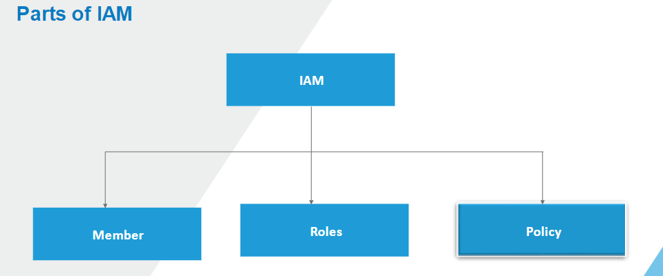
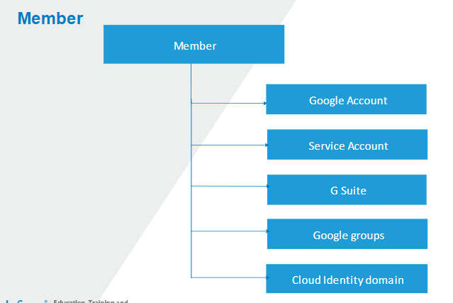
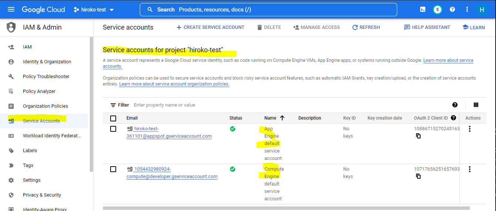
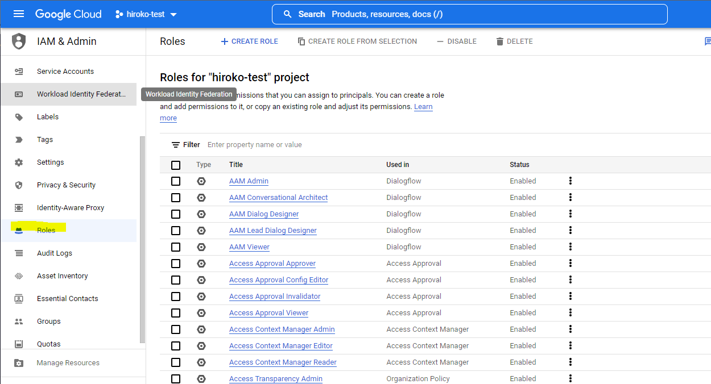
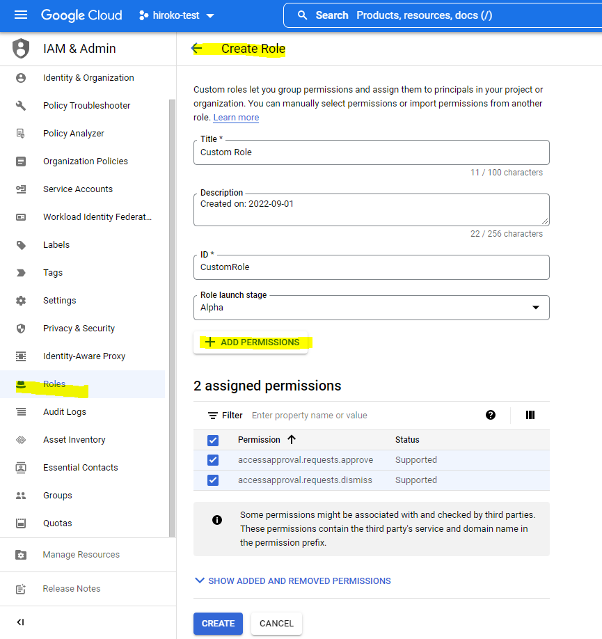
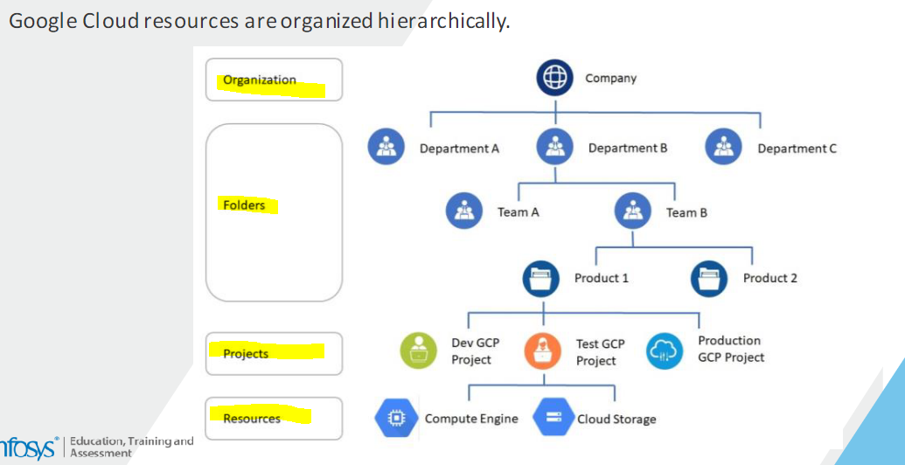

## Quiz

**Q1:** An organization wants to give read-only access to a group of developers. They shouldn’t be able to modify resources, but they should be able to list the resources at any moment. Which IAM role is most suitable for the developer group?

1. Owner
2. Editor
3. Viewer (Correct)
4. All of the above

<hr />

**Q2:** A group of testers want to test the application hosted on Google App engine. Though they have valid IAM roles, they are unable to access App Engine instances in the console. Choose the correct reason from below

1. Google App Engine can only be accessed by owner of the project
2. Google App Engine resource policy isn’t updated to grant them access (Correct)
3. Google App Engine doesn't allow IAM roles
4. Application hosted on Google App Engine can only be accessed by CLI

<hr />

# Management Manager

https://cloud.google.com/deployment-manager/docs/manage-cloud-resources-deployment

## Deploy the resources

```js
gcloud deployment-manager deployments create quickstart-deployment --config vm.yaml
```

- If the deployment is successful, you receive a message similar to the following example:

```js
Create operation operation-1432319707382-516afeb5d00f1-b864f0e7-b7103978 completed successfully.
NAME                    TYPE                STATE      ERRORS
quickstart-deployment   compute.v1.instance COMPLETED  -
```

## Delete deployment manager

```js
gcloud deployment-manager deployments delete quickstart-deployment
```

## Check on your new deployment

```js
gcloud deployment-manager deployments describe quickstart-deployment
```

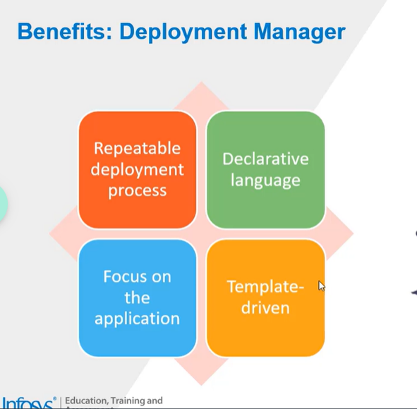
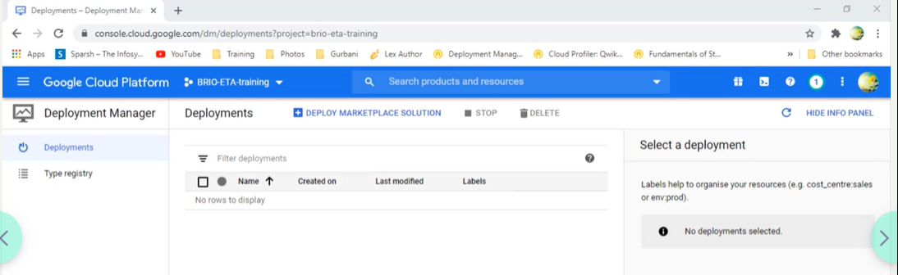
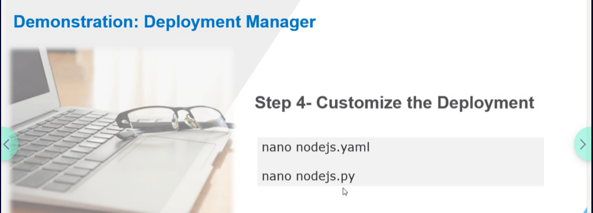
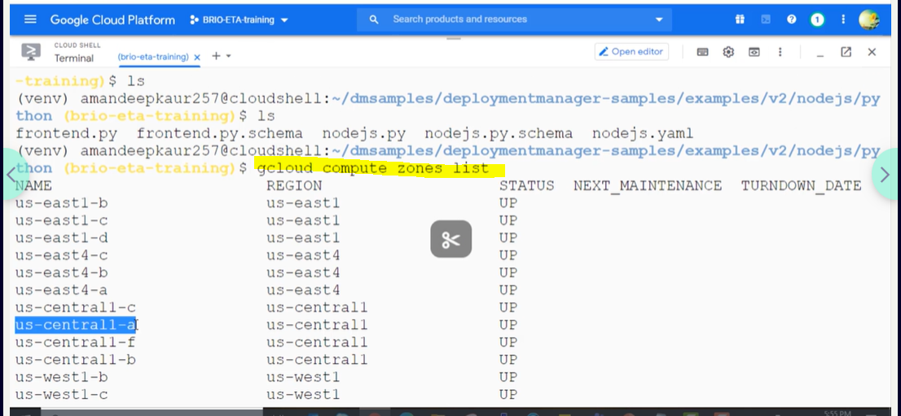
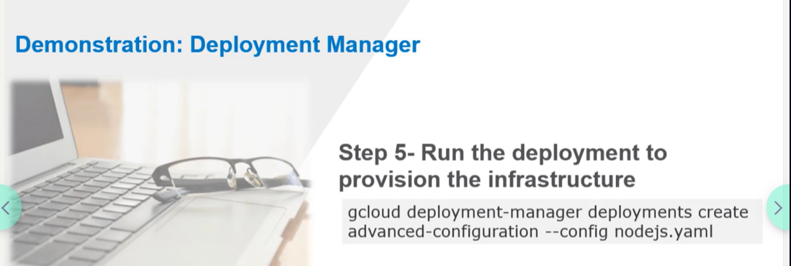

## Quiz

**Q1:** Which of the following statements relating to Deployment Manager are true?
Choose ONE or MORE options.

1. An infrastructure deployment service that automates the creation and management of GCP resources.
2. Specifies all the resources needed for application in a declarative format.
3. Deploys applications and infrastructure from configuration.
4. All of the above (correct)

<hr />

**Q2:** Which of the following can be deployed with Deployment Manager?
Choose ONE or MORE options.

1. Instance templates
2. Load balancers
3. Cloud Routers
4. All of the above (Correct)

# Operation reliability

End to End Stackdriver

https://cloud.google.com/products/operations#all-features

## Cloud Monitoring (Stackdriver)

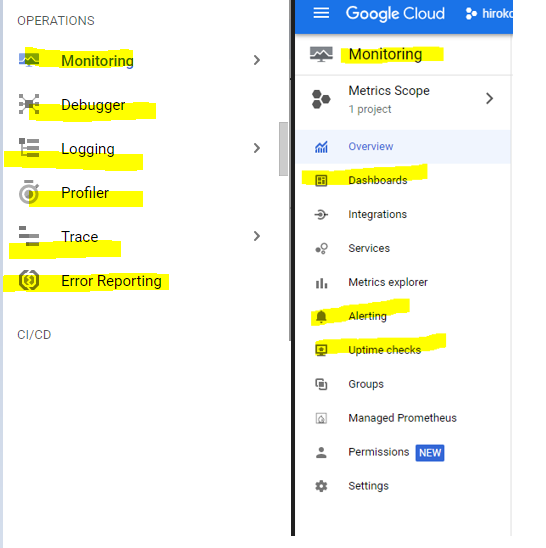
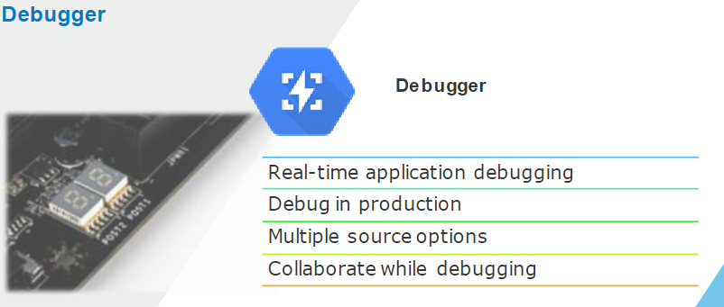


### Health check monitoring

- Cloud Monitoring provides uptime checks to web applications and other internet-accessible services running on your cloud environment. You can configure uptime checks associated with URLs, groups, or resources, such as instances and load balancers.

### Custom visualization

- Dashboards and charts

### Latency management

- Cloud Trace provides latency sampling and reporting for App Engine, including per-URL statistics and latency distributions.

### Performance and cost management

- **Cloud Profiler** provides continuous profiling of resource consumption in your production applications,


### Security management
- Cloud Audit Logs provides near real-time user activity visibility across Google Cloud.

## Quiz - Cloud Monitoring and Logging

Q1: Operations monitoring alerting policies notify users when specific conditions are met.

1. True (a)
2. False

> Alerts are set in Cloud Monitoring

<hr />

Q2: Which of the following statements are true w.r.t. Cloud Operations monitoring agent?
Choose ONE or MORE options.

1. Agents can be used on VM instances to transmit data for various application metric types.
2. Agents can be configured to monitor popular third-party applications. --(This is a feature of Cloud Monitoring )
3. Agents are available for services such as Compute Engine without Operations monitoring built in.
4. All of the above. (a)

<hr />

Q3: Which of the following statements are true with respect to Cloud Audit Log?
Select one or more options:

1. Audit logging enables cloud users to track who did what, where and when.
2. Google Cloud maintains audit logs for each project, folder, and organization.
3. Cloud audit logging maintains admin activity logs, system events logs, and data access logs.
4. All of the above. (Correct)
<hr />

## Quiz - Cloud Profiler and Cloud Tracing

**Q1:** Which of the following are the features of Trace operations? Select best two.

1. Latency reporting (a)
2. Per URL Latency sampling (a)
3. Continuous heap profiling
4. Conditional Snapshots

> Trace is for generating Latency report

**Q2:** Select the appropriate "Operations service" which helps in sampling the latency of App Engine applications and report Per-URL statistics.

1. Cloud Trace (a)
2. Cloud Profiler
3. Explanation :
