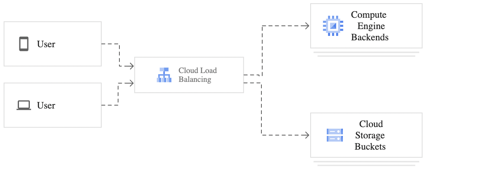
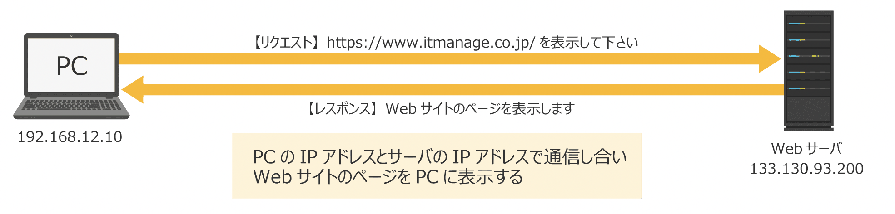
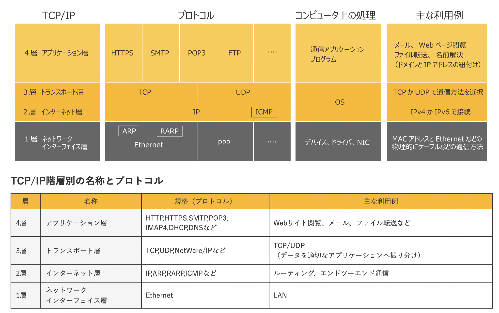

# Load Balance

### Cloud Load Balancing overview

A load balancer distributes user traffic across multiple instances of your applications. By spreading the load, load balancing reduces the risk that your applications experience performance issues.

### About Cloud Load Balancing

Cloud Load Balancing is a fully distributed, software-defined managed service. It isn't hardware-based, so you don't need to manage a physical load balancing infrastructure.

### Choosing a load balancer

you must first determine

- what traffic type your load balancers must handle
- whether you need global or regional load balancing, external or internal
- load balancing, and proxy or pass-through load balancing.

### External vs internal load balancing

- Google Cloud load balancers can be divided into external and internal load balancers:

- External load balancers distribute traffic coming from the internet to your Google Cloud Virtual Private Cloud (VPC) network. Global load balancing requires that you use the **Premium Tier** of Network Service Tiers. For regional load balancing, you can use **Standard Tier**.

- Internal load balancers distribute traffic to instances inside of Google Cloud

### Global vs regional load balancing

- Use global load balancing when your backends are distributed across **multiple regions,** your users need access to the same applications and content, and you want to provide access by using a single anycast IP address.

- Use regional load balancing when your backends are in **one region**, you only require IPv4 termination, or when you have jurisdictional compliance requirements for traffic to stay in a particular region

### External TCP Proxy Load Balancing

External TCP Proxy Load Balancing is intended for TCP traffic on specific well-known ports, such as port 25 for Simple Mail Transfer Protocol (SMTP).

## What is TCP/IP?

TCP/IP とは、インターネットを含む多くのコンピュータネットワークにおいて、世界標準的に利用されている通信プロトコルのこと

**TCP/IP Layer**
TCP/IP は 4 層に分かれた通信方法を定義しています。1 層のネットワークインターフェイス層は主に LAN などで用いられる通信方法です。2 層のインターネット層は IP アドレスを用いた通信方法です。3 層のトランスポート層は TCP と UDP で通信の品質が変わります。4 層のアプリケーション層ではメールや Web ページ閲覧など利用するアプリケーションによって通信方法は変わり多数存在します。

**TCP/IP Descriptions**

TCP/IP の階層は、上から「アプリケーション層」「トランスポート層」「インターネット層」「ネットワークインターフェイス層」の 4 層に分かれています。TCP/IP は 4 つの階層のプロトコルが正常に機能して初めて通信ができます。覚え方は上の層が人間が利用するアプリケーションに関係すること、中間層がアプリケーション通信をする際の補助的な役割を果たすもの、下層が電気信号などの物理的な信号に対して送られる暗号のようなものとして分けて考えると理解しやすいです。

**References:**

- https://cloud.google.com/load-balancing/docs/load-balancing-overview
- https://www.itmanage.co.jp/column/tcp-ip-protocol/
