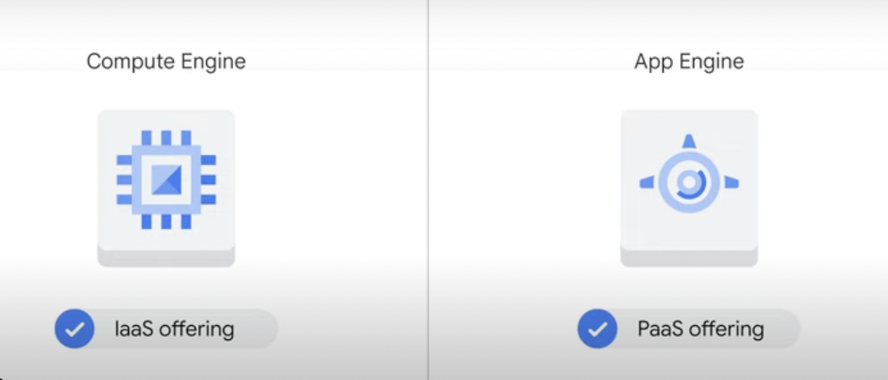
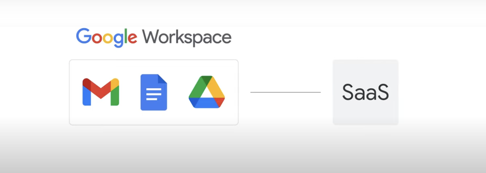

# Quiz: Applications in the Cloud

https://www.cloudskillsboost.google/course_sessions/1596805/quizzes/326684

Q:
What are the advantages of using App Engine’s flexible environment instead of its standard environment? (Select 3).

- Your application can write to the local disk.\*\*
- Google provides automatic in-place security patches.
- You can use SSH to connect to the virtual machines on which your application runs.\*\*
- Your application can execute code in background threads.
- You can install third-party binaries.\*\*

Q:
Which statements are true about App Engine? (Select 2).

- The daily billing for an App Engine application can drop to zero.\*\*
- App Engine charges you based on the resources you preallocate instead of the resources you use.
- App Engine manages the hardware and networking infrastructure required to run your code.
- Developers who write for App Engine do not need to code their applications in any particular way to use the service.
- App Engine requires you to supply or code your own application load balancing and logging services.\*\*

Q:
Cloud Run can only pull images from:

- Docker Hub
- GitHub
- Artifact Registry
- Self-hosted registries

# Quiz: Developing and Deploying in the Cloud

https://www.cloudskillsboost.google/course_sessions/1596805/quizzes/326688

- Your score: 50% Passing score: 75%

Q:
Why might a Google Cloud customer choose to use Cloud Functions?

- Cloud Functions is a free service for hosting compute operations.
- Their application contains event-driven code that they don't want to provision compute resources for.\*\*
- Cloud Functions is the primary way to run Node.js applications in Google Cloud.
- Their application has a legacy monolithic structure that they want to separate into microservices. X

# Quiz: Logging and Monitoring in the Cloud

- Your score: 60% Passing score: 75%

Q:There are “Four Golden Signals” that measure a system’s performance and reliability. What are they?

- Latency, traffic, saturation, errors
- KPIs, SLIs, SLOs, SLAs
- Availability, durability, scalability, resiliency x
- Get, post, put, delete

Q:Which definition best describes a service level indicator (SLI)?

- A percentage goal of a measure you intend your service to achieve X
- A key performance indicator; for example, clicks per session or customer signups X
- A time-bound measurable attribute of a service \*\*
- A contract with your customers regarding service performance X

# Quiz: Containers in the Cloud

- Your score: 57%, 71%, 85%, 100%

Q:What is a Kubernetes pod?

- A group of nodes X
- A group of containers \*\*
- A group of VMs X
- A group of clusters

https://cloud.google.com/kubernetes-engine/docs/deploy-app-cluster

> A cluster consists of at least one cluster control plane machine and multiple worker machines called nodes. Nodes are Compute Engine virtual machine (VM) instances that run the Kubernetes processes necessary to make them part of the cluster. You deploy applications to clusters, and the applications run on the nodes.

> Review the "Kubernetes" lecture.

Pods are the smallest, most basic deployable objects in Kubernetes. A Pod represents a single instance of a running process in your cluster. Pods contain one or more containers, such as Docker containers. When a Pod runs multiple containers, the containers are managed as a single entity and share the Pod's resources.

Q: Where do the resources used to build Google Kubernetes Engine clusters come from?

- Bare metal servers
- Compute Engine \*\*
- Cloud Storage
- App Engine

Q: What is a Kubernetes cluster?

- A group of pods that manage the administration of a Kubernetes application. X
- A group of machines where Kubernetes can schedule workloads. \*\*
- A group of containers that provide high availability for applications.

> Review the "Kubernetes" lecture.

Q: How do containers access an operating system?

- Containers use a shared base operating system stored in a Cloud Storage bucket. X
- Each container has its own instance of an operating system. X
- Containers use a shared base operating system stored in a shared runtime layer.X
- Containers use a shared base operating system stored in a shared kernel layer.

> Review the "Introduction to containers" lecture.

# Quiz: Storage in the Cloud

- Your score: 83% Passing score: 75%
- Your score: 100% Passing score: 75%

Q:Which database service can scale to higher database sizes?

- Bigtable X
- Cloud SQL
- Firestore
- Cloud Spanner\*\*

> Review the lectures in the "Storage in the Cloud" module.

Q:How are Firestore and Bigtable alike? (Select two answers.)

- They both have a free daily quota.
- They are both highly scalable. \*\*
- They both offer SQL-like queries.
- They are both NoSQL databases. \*\*

# Quiz: Virtual Machines and Networks in the Cloud

- Your score: 42%, Your score: 85%, Your score: 100%

Q: Select the true statement about Google’s VPC networks and subnets.

- Networks are regional, and subnets are zonal.X
- Networks are global, and subnets are zonal.
- Both networks and subnets are global.
- Networks are global, and subnets are regional.\*\*

Q:Which interconnect option is a service level agreement (SLA) available for?

- Direct Peering
- Carrier Peering
- Standard Network Tier X
- Dedicated Interconnect\*\*

> Review the lecture "Important VPC compatibilities."

Q: A Google Cloud customer wants to load-balance traffic among the backend VMs that form part of a multi-tier application. Which load-balancing option should this customer choose?

- The global HTTP(S) load balancer X
- The global TCP proxy
- The regional internal load balancer\*\*
- The regional load balancer
- The global SSL proxy
  > Review the lecture "Important VPC compatibilities."

Q: Which statement best describes how VPC routers and firewalls work?

- They are managed by Google in virtual machines and customers can tune or deactivate them.X
- They are managed by Google in virtual machines and customers cannot modify them.
- Customers provision virtual machines and run their routers and firewalls in them.X
- They are managed by Google as a built-in feature.\*\*

# Quiz: Resources and Access in Google Cloud

- Your score: 62% Passing score: 75%
- Your score: 100% Passing score: 75%

Q: Consider a single hierarchy of Google Cloud resources. Which of these situations is possible? (Choose 3 responses.)
Note: To get credit for a multiple-select question, you must select all of the correct options and none of the incorrect ones.

- There is an organization node, and there is at least one folder.\*\*
- There is an organization node, and there are no folders.
- There is no organization node, but there is at least one folder.\*\*
- There are two or more organization nodes.
- There is no organization node, and there are no folders.\*\*

Q: How does the resource hierarchy control how IAM policies are inherited?

- IAM policies are only implemented at the project level; they cannot be amended by lower levels of the resource hierarchy.
- IAM policies that are implemented by lower-level policies can override the policies defined at a higher level.\*\*
- IAM policies that are implemented higher in the resource hierarchy deny access that is granted by lower-level policies.
  Review the lecture "Google Cloud resource hierarchy."

Q: Your company has two Google Cloud projects and you want them to share policies. What is the least error-prone way to set this up?

- Define the new shared policy in the organization node.
- Create shared resource policies on the common resources that are used in both projects.
- Place both projects into a folder, and define the policies on that folder.\*\*
- Duplicate all the policies from one project onto the other.

# Quiz : Introducing Google Cloud

Your score: 50%,83%, 83%, 100%

Q: What cloud computing service provides raw compute, storage, and network resources that are organized similarly to physical data centers?

- Database as a service
- Platform as a service X
- Software as a service
- Infrastructure as a service\*\*
  

Q: What cloud computing service binds application code to libraries that give access to the infrastructure an application needs?

- Virtualized data centers
- Hybrid cloud
- Infrastructure as a service
- Software as a service X
- Platform as a service \*\*
  

  > Review the lecture "IaaS and PaaS”

Q: Who benefits the most from billing by the second for cloud resources, such as virtual machines?

- Customers who create virtual machines that run commercially licensed operating systems X
- Customers who create many virtual machines and leave them running for months X
- Customers who create too few virtual machines to get discounts X
- Customers who create and run many virtual machines
  > Review the lecture "Pricing and billing."
