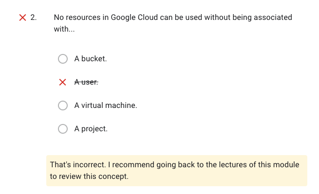

## 1-1. Google Cloud Platform Fundamentals: Core Infrastructure

[Quiz](./quiz-1-core-infra.md)

## 1-2. Essential Cloud Infrastructure: Foundation

[Quiz](./quiz-1-foundation.md)

| Title | Links                                                                                    |
| ----- | ---------------------------------------------------------------------------------------- |
| VN    | [Demo: Expand a Subnet ](./demo-expand-a-subnet.md)                                      |
|       | [Demo: Internal and external IP](./demo-Internal-and-external-IP.md)                     |
|       | [Lab: VPC Networking](./lab-vpc-networking.md)                                           |
|       | [Lab: Private Google Access and Cloud NAT](./lab-Private-Google-Access-and-Cloud-NAT.md) |
| VM    | [Demo: Create a VM](./demo-Create-a-VM.md)                                               |
|       | [Lab:Creating Virtual Machines](./lab-Creating-VM.md)                                    |
|       | [Lab:Working with Virtual Machines](./lab-Working-VM.md)                                 |

## 1-3. Essential Cloud Infrastructure: Core Services

[Quiz](./quiz-2-core-services.md)

| Title                | Links                                                                                  |
| -------------------- | -------------------------------------------------------------------------------------- |
| IAM                  | [Demo: Custom roles](./demo-Custom-roles.md)                                           |
|                      | [Lab Intro: Cloud IAM ](./lab-IAM.md)                                                  |
| Storage              | [Lab: Cloud Storage](./lab-Cloud-Storage.md)                                           |
|                      | [Lab: Intro: Cloud SQL](./lab-Cloud-SQL.md)                                            |
| Resource Management  | [Demo: Billing Administration](./demo-Billing-Administration.md)                       |
|                      | [Lab: Examining Billing data with BigQuery](./lab-Examining-Billing-data-with-BigQ.md) |
| Resource Monitorning | [Lab: Resource Monitoring](./lab-Resource-Monitoring.md)                               |
|                      | [Lab: Error Reporting and Debugging](./lab-Error-Reporting-and-Debugging.md)           |

## 1-4. Elastic Cloud Infrastructure: Scaling and Automation

| Title            | Links                                                                   |
| ---------------- | ----------------------------------------------------------------------- |
| Interconnecting  | [Lab: Cloud VPN](./lab-Cloud-VPN.md)                                    |
| LB               | [Lab: HTTP Load Balancer with Autoscaling](./lab-HTTP-Load-Balancer.md) |
|                  | [Lab: Internal Load Balancer](./lab-Internal-Load-Balancer.md)          |
| Infra Automation | [Lab: Terraform](./lab-Terraform.md)                                    |
|                  | [Demo: Google Cloud Marketplace](./demo-Marketplace.md)                 |

## Quiz

Resource Management:

