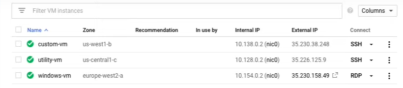

# Lab: Creating Virtual Machines

[Lab: Creating VMs](https://www.cloudskillsboost.google/course_sessions/1685038/labs/314358)

**Task 1. Create a utility virtual machine**

- n1-standard-4 (4 vCPUs, 15 GB memory).
- n1-standard-1 (1 vCPUs, 3.75 GB memory).

> Note: Normally the boot disk defaults to being deleted automatically when the instance is deleted. But sometimes you will want to override this behavior. This feature is very important because you cannot create an image from a boot disk when it is attached to a running instance.

> So you would need to disable Delete boot disk when instance is deleted to enable creating a system image from the boot disk.

> Note: You cannot convert a non-preemptible instance into a preemptible one. This choice must be made at VM creation. A preemptible instance can be interrupted at any time and is available at a lower cost.

**Task 2. Create a Windows virtual machine**

> Note: When the VM is running, notice that the connection option in the far right column is RDP, not SSH. RDP is the Remote Desktop Protocol. You would need the RDP client installed on your local machine to connect to the Windows desktop.

**Take 3. Custom VM**

- Machine type: Custom

