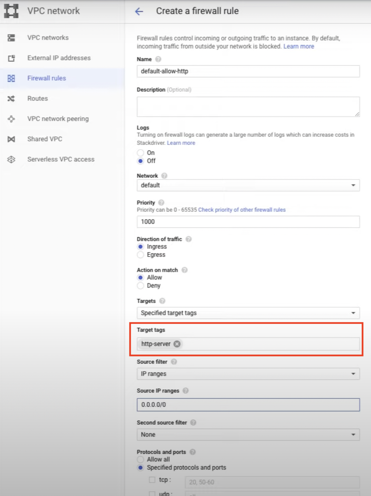
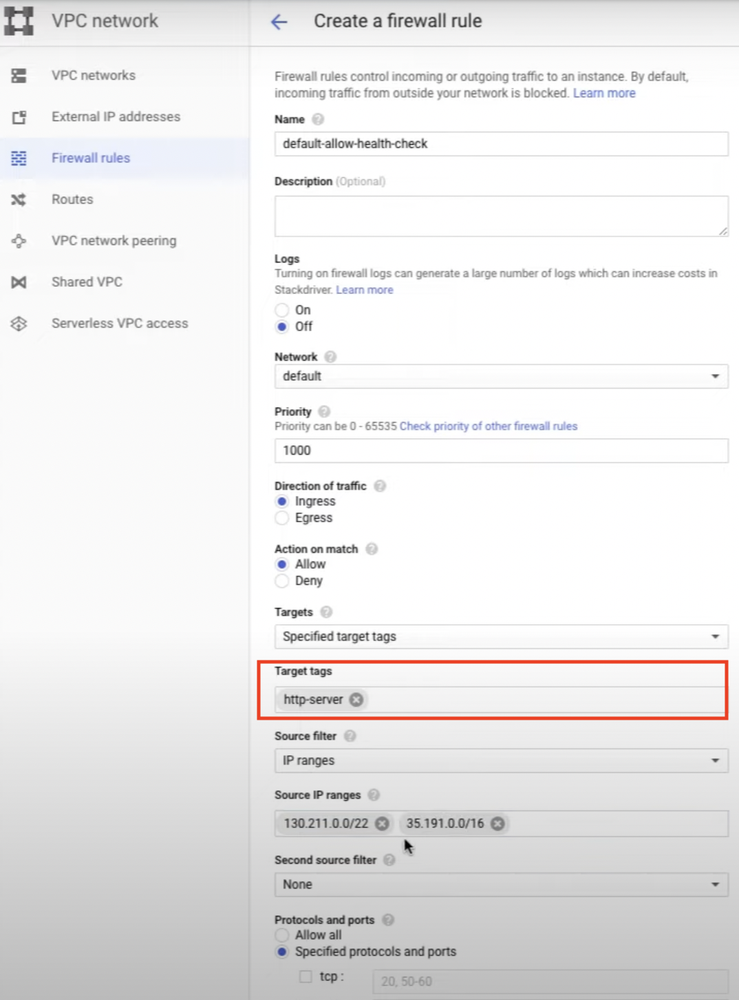
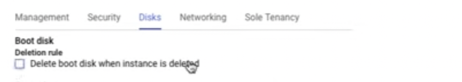
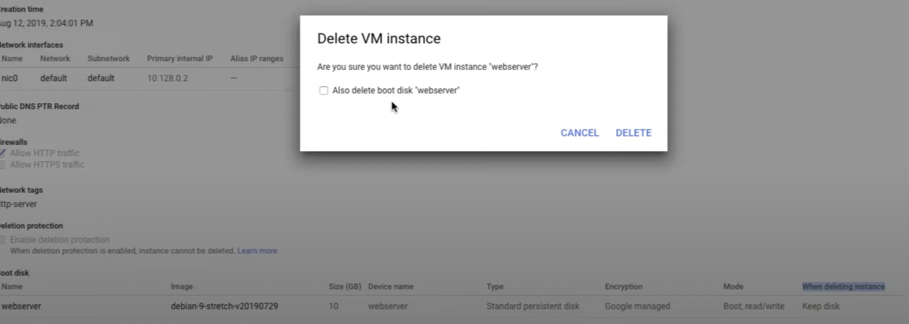
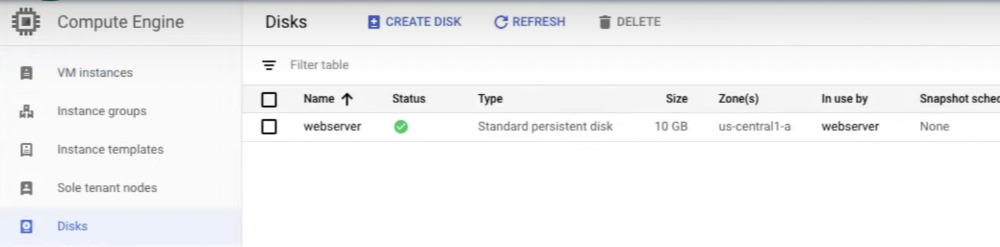
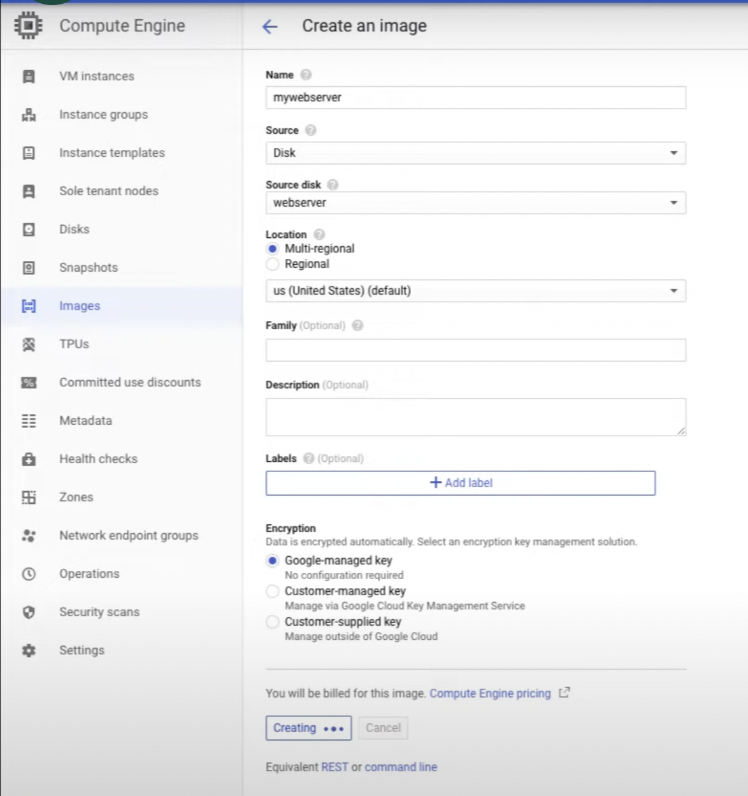
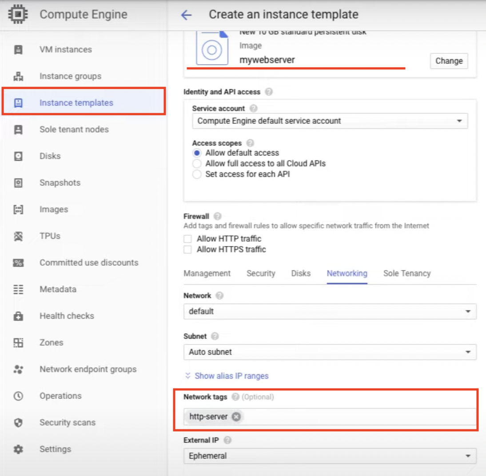
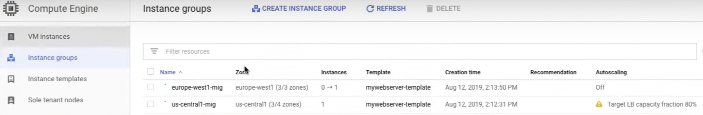
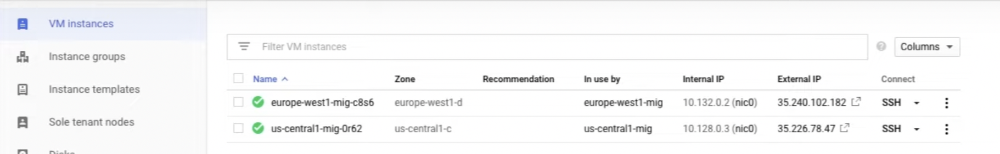

# MIGs and HTTP Load Balancer

[HTTP Load Balancer with Autoscaling](https://www.cloudskillsboost.google/course_sessions/1831826/labs/338562)

**Managed Instance Group**

> Managed instance groups can work with **load balancing services** to **distribute network traffic** to all of the instances in the group. If an instance in the group stops, crashes, or is deleted by an action other than the instance group’s commands, the managed instance group automatically recreates the instance so it can resume its processing tasks.

> The recreated instance uses the **same name** and the **same instance template** as the previous instance. Managed instance groups can automatically identify and recreate unhealthy instances in a group to ensure that all the instances are running optimally.


# Create MIGs

## Create a firewall rule to allow HTTP

- default-allow-http
- http-server
- 0.0.0.0/0
- tcp:80
- default



## Create a similar firewall rule for health checkers

- default-allow-health-check
- default
- http-server
- 130.211.0.0/22, 35.191.0.0/16
- tcp:all



## Create a VM and install Apache in SSH

**Create a VM**

- Go to Compute Engine
- Name: webserver
- Region: us-central1
- Zone: us-central1-a
- Boot disk: Debian GNU/Linux 10 (buster)
- For Deletion rule, select Keep boot disk.
- For Network tags: allow-health-checks.
- Network interfaces:default.
- External IPv4 IP: None



**Install Apache 2 in SSH**

- Click on external IP. Here, we can see the Apache 2 default page.
- In the webserver SSH terminal, set the service to start on boot:

```
sudo apt-get update
sudo apt-get install -y apache2
sudo service apache2 start
sudo update-rc.d apache2 enable
sudo service apache2 status
```

- Click Reset.
- Note: Reset will stop and reboot the machine. It keeps the same IPs and the same persistent boot disk, but memory is wiped. Therefore, if the Apache service is available after the reset, the update-rc command was successful.

## Prepare the disk to create a custom image

- Go to VM and check the deletion rule is "Keep boot disk".
- Delete VM
- Go to disks, you can see the disk.




## Create the custom image

- Name: mywebserver
- Source: Disk
- Source disk: webserver
- Note: You have created a custom image that multiple identical webservers can be started from. At this point, you could delete the webserver disk.



## Create an instance template

- Click Create Instance Template.
- Name: mywebserver-template.
- Machine type: f1-micro (1 vCPU).
- Boot disk: Click Custom images > Select Image: **mywebserver**.
- Click "Networking, Disks, Security, Management"
- Network: default
- Network tags: **http-server**
- Click Create.

  

## MIGs

- Name: us-central1-mig
- Region: us-central1
- Location: Multiple zones
- Instance template: mywebserver-template
- Autoscaling: ON

- Autoscaling metrics: HTTP load balancing usage
- Target HTTP load balancing usage: 80.
- Minimum instance: 1, Maximum: 5
- Cool down period: 60 seconds
- Create a health check
- Name: http-health-check
- TCP: 80
  and if there are two consecutive successes, it's successful. Three consecutive failures means it's a failure and it means it's unhealthy instance. So let me click save and continue on that
- There's this initial delay here. This is for the boot, so we're going to set that to 60 seconds. That's for the health check, and them I'm going to click create

**MIGs**


**VMs**


<hr />

## Health Check

- Check interval: 5 secs (how often to check)
- Timeout: 3 secs (how long to wait)
- Healthy threshold: 2 consecutive successes (how many successful attempt)
- Unhealthy threshold: 2 consecutive failures (how many failed attempt)


## Autoscaling policy

- CPU utilization
- Load balancing capacity
- Monitoring metrics
- Queue-based workload

## Choose LB


