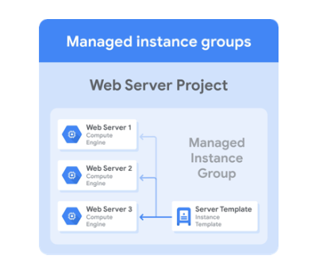

# HTTP Load Balancer with Autoscaling

[HTTP Load Balancer with Autoscaling](https://www.cloudskillsboost.google/course_sessions/1831826/labs/338562)

**Managed Instance Group**

> Managed instance groups can work with **load balancing services** to **distribute network traffic** to all of the instances in the group. If an instance in the group stops, crashes, or is deleted by an action other than the instance group’s commands, the managed instance group automatically recreates the instance so it can resume its processing tasks.

> The recreated instance uses the **same name** and the **same instance template** as the previous instance. Managed instance groups can automatically identify and recreate unhealthy instances in a group to ensure that all the instances are running optimally.

**Steps to create MIGs**

1. Create a custom image
2. Create an instance template based on a custom image
3. Migs
4. Feature - Auto scalling

**Autoscaling policy**

ex. vm1(100%) vm2(80%) --> vm1(60%), vm2(60%), vm3(65%)

- CPU utilizatin
- Load balancing capacity
- Monitoring metrics
- Queue-based workload

**Health Check**

- Check interval: 5 secs (how often to check)
- Timeout: 3 secs (how long to wait)
- Healthy threshold: 2 consecutive successes (how many successful attempt)
- Unhealthy threshold: 2 consecutive failures (how many failed attempt)

**Lab: HTTP Load Balancer with Autoscaling**

1. you create two managed instance groups that serve as backends in us-central1 and europe-west1.
2. Then, you create and stress test a load balancer to demonstrate global load balancing and autoscaling.

**Choose LB**

