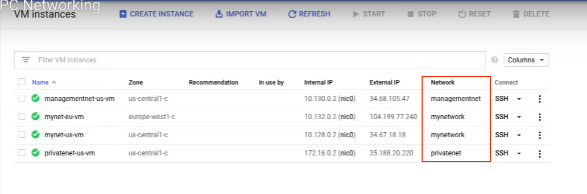
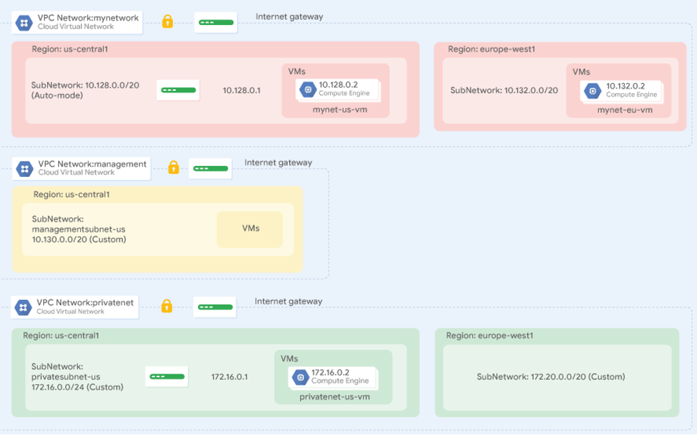

# Lab:VPC Networking

**Tutorials**

- https://www.youtube.com/watch?v=CmSBvw2SXUY
- https://youtu.be/TXco0dYF_zU

**Summary**

- Explore the default VPC network
- Create an auto mode network with firewall rules
- Convert an auto mode network to a custom mode network
- Create custom mode VPC networks with firewall rules
- Create VM instances using Compute Engine
- Explore the connectivity for VM instances across VPC networks

## Take1. Explore the default network

1. Delete the FW
2. Delete the default

   - all routes are gone.

3. Create auto mode VPC

   - mynetwork
   - automatic
   - Click all FW

4. Create VM in us-central1

   - name: mynet-us-vm
   - Region: us-central1
   - Zone: us-central1-c
   - Series: N1
   - Machine type n1-standard
   - Boot disk Devian GNU/Linux 10

5. Create a v, in europe-west1

   - mynet-eu-vm
   - europe-west1
   - europe-west1-c
   - N1
   - n1-standard-1
   - Devian GNU/Linux 10
   - FW Checked Allow HTTP trafic/ Allow HTTPS traffic

6. Check connectivity.

- ping -c 3 <IP>

```
$ ping -c 3 10.132.0.2
PING 10.132.0.2 (10.132.0.2) 56(84) bytes of data.
64 bytes from 10.132.0.2: icmp_seq=1 ttl=64 time=104 ms
64 bytes from 10.132.0.2: icmp_seq=2 ttl=64 time=103 ms
64 bytes from 10.132.0.2: icmp_seq=3 ttl=64 time=103 ms
```

## Take2. Create an auto mode network

- VPC-> mynetwork -> Create -> Select auto mode network

## Take3. Convert auto mode to custom mode

- VPC-> mynetwork -> Edit -> Change auto to custom
- [FW-mynetwork](https://drive.google.com/file/d/10K5cHRO2iiwHdDSl1GYDFKYsaqJlCpuh/view)

## Take3. Create custom mode networks (name: management)

7. Create the management network

   - VPC -> Name: management -> Subnet creation mode Custom,
   - Name: managementsubnet-us
   - Region: us-central1
   - IPv4 range: 10.130.0.0/20
   - Hit Create

```
gcloud compute networks create management --project=local-alignment-381806 --subnet-mode=custom --mtu=1460 --bgp-routing-mode=regional
gcloud compute networks subnets create managementsubnet-us --project=local-alignment-381806 --range=10.130.0.0/20 --stack-type=IPV4_ONLY --network=management --region=us-central1
```

## 8. Create a custom network (name: privatenet)

- A custom network name: privatenet
- two subnets: us-central1, europe-west1

```
// To create the **privatenet** network.
gcloud compute networks create privatenet --subnet-mode=custom

// To create the **privatesubnet-us** subnet, run the following command.
gcloud compute networks subnets create privatesubnet-us --network=privatenet --region=us-central1 --range=172.16.0.0/24

// To create the **privatesubnet-eu** subnet, run the following command
gcloud compute networks subnets create privatesubnet-eu --network=privatenet --region=europe-west1 --range=172.20.0.0/20

gcloud compute networks list
gcloud compute networks subnets list --sort-by=NETWORK

gcloud compute instances create privatenet-us-vm --zone=us-central1-c --machine-type=f1-micro --subnet=privatesubnet-us --image-family=debian-10 --image-project=debian-cloud --boot-disk-size=10GB --boot-disk-type=pd-standard --boot-disk-device-name=privatenet-us-vm

gcloud compute instances list --sort-by=ZONE
```

- [vpc-privatenet-subnets](https://drive.google.com/file/d/10L_4F8TEEFxOjaTPQ94z5gITo2W62p2S/view?usp=share_link)

## 9. Create FW

- management-allow-icmp-ssh-rdp
- Targets: All instances in the network
- Subnet filter: IP ranges
- Subnet IP range:0.0.0.0/0
- Protocol: other protocols: icmp
- Protocol: tcp: 22, 3389

```
gcloud compute --project=local-alignment-381806 firewall-rules create management-allow-icmp-ssh-rdp --direction=INGRESS --priority=1000 --network=management --action=ALLOW --rules=tcp:22,tcp:3389,icmp --source-ranges=0.0.0.0/0

gcloud compute --project=local-alignment-381806 firewall-rules create privatenet-allow-icmp-ssh-rdp --direction=INGRESS --priority=1000 --network=management --action=ALLOW --rules=tcp:22,tcp:3389,icmp --source-ranges=0.0.0.0/0
```

- gcloud compute firewall-rules list --sort-by=NETWORK

```
hiroko@cloudshell:~ (local-alignment-381806)$ gcloud compute networks create privatenet --subnet-mode=custom
Created [https://www.googleapis.com/compute/v1/projects/local-alignment-381806/global/networks/privatenet].
NAME: privatenet
SUBNET_MODE: CUSTOM
BGP_ROUTING_MODE: REGIONAL
IPV4_RANGE:
GATEWAY_IPV4:

Instances on this network will not be reachable until firewall rules
are created. As an example, you can allow all internal traffic between
instances as well as SSH, RDP, and ICMP by running:

$ gcloud compute firewall-rules create <FIREWALL_NAME> --network privatenet --allow tcp,udp,icmp --source-ranges <IP_RANGE>
$ gcloud compute firewall-rules create <FIREWALL_NAME> --network privatenet --allow tcp:22,tcp:3389,icmp

hiroko@cloudshell:~ (local-alignment-381806)$

hiroko@cloudshell:~ (local-alignment-381806)$ gcloud compute networks list
NAME        SUBNET_MODE  BGP_ROUTING_MODE  IPV4_RANGE  GATEWAY_IPV4
management  CUSTOM       REGIONAL
mynetwork   CUSTOM       REGIONAL
privatenet  CUSTOM       REGIONAL
hiroko@cloudshell:~ (local-alignment-381806)$


hiroko@cloudshell:~ (local-alignment-381806)$ gcloud compute networks subnets list --sort-by=NETWORK
NAME                 REGION                   NETWORK     RANGE          STACK_TYPE  IPV6_ACCESS_TYPE  INTERNAL_IPV6_PREFIX  EXTERNAL_IPV6_PREFIX
managementsubnet-us  us-central1              management  10.130.0.0/20  IPV4_ONLY
mynetwork            us-central1              mynetwork   10.128.0.0/20  IPV4_ONLY
mynetwork            europe-west1             mynetwork   10.132.0.0/20  IPV4_ONLY
mynetwork            us-west1                 mynetwork   10.138.0.0/20  IPV4_ONLY
----(...)---
privatesubnet-us     us-central1              privatenet  172.16.0.0/24  IPV4_ONLY
privatesubnet-eu     europe-west1             privatenet  172.20.0.0/20  IPV4_ONLY

hiroko@cloudshell:~ (local-alignment-381806)$ gcloud compute firewall-rules list --sort-by=NETWORK
NAME                           NETWORK     DIRECTION  PRIORITY  ALLOW                 DENY  DISABLED
management-allow-icmp-ssh-rdp  management  INGRESS    1000      tcp:22,tcp:3389,icmp        False
privatenet-allow-icmp-ssh-rdp  management  INGRESS    1000      tcp:22,tcp:3389,icmp        False
mynetwork-allow-custom         mynetwork   INGRESS    65534     all                         False
mynetwork-allow-icmp           mynetwork   INGRESS    65534     icmp                        False
mynetwork-allow-rdp            mynetwork   INGRESS    65534     tcp:3389                    False
mynetwork-allow-ssh            mynetwork   INGRESS    65534     tcp:22                      False

To show all fields of the firewall, please show in JSON format: --format=json
To show all fields in table format, please see the examples in --help.

hiroko@cloudshell:~ (local-alignment-381806)$
```

## Take4. Explore the connectivity accross networks

- management-us-vm
- Network interface: management:management-us-subnet

```
gcloud compute instances create privatenet-us-vm --zone=us-central1-c --machine-type=f1-micro --subnet=privatesubnet-us
```

```
gcloud compute instances list --sort-by=ZONE
```

## Take5. Review

https://www.youtube.com/watch?v=0UOu5XZlucg&t=245s

[Lab:VPC Networking](https://www.cloudskillsboost.google/course_sessions/1685038/labs/314345)




