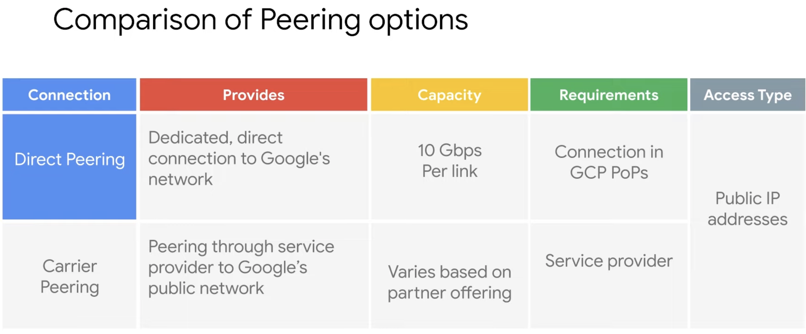
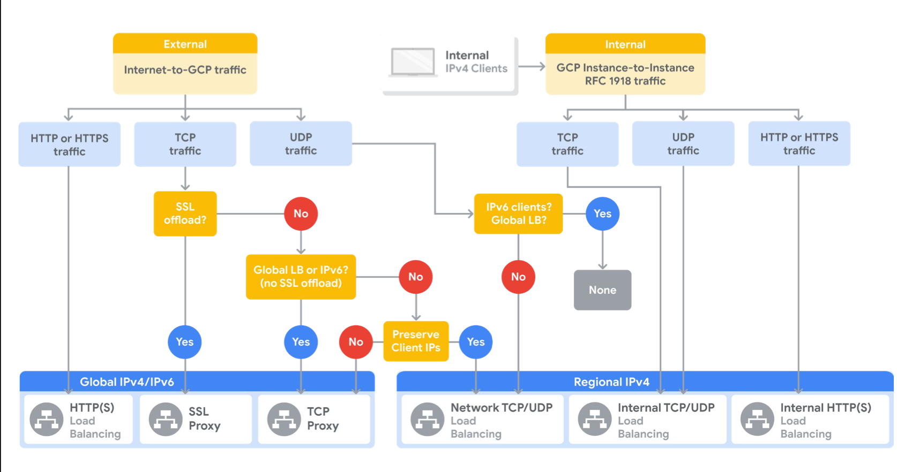
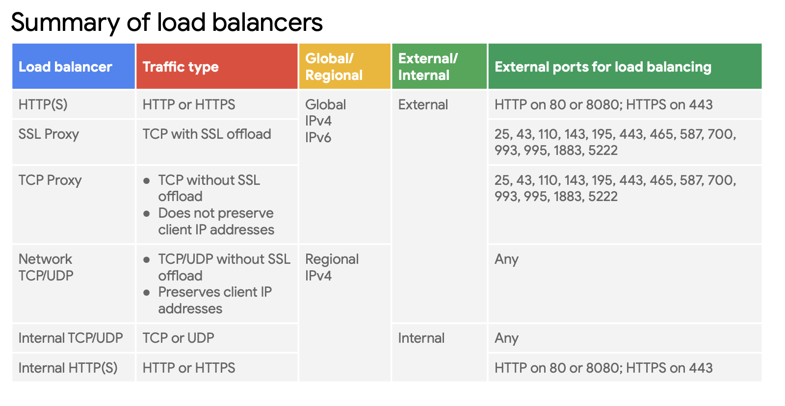

# Quiz: Interconnecting Networks

- 75%,100%

Q: If you cannot meet Google’s peering requirements, which network connection service should you choose to connect to Google Workspace and YouTube?

- Dedicated Interconnect
- Partner Interconnect
- Carrier Peering \*\*
- Direct Peering

> That’s correct! Carrier Peering allows you to connect to Google Workspace and YouTube without meeting Google’s peering requirements.
> 

> Correct! Dedicated Interconnect requires a connection in a Google Cloud colocation facility and provides 10 Gbps per link.

> Shared VPC is a centralized approach to multi-project networking, because security and network policy occurs in a single designated VPC network.

# Quiz: Load Balancing and Autoscaling

- 33%, 100%

Q: Which three Google Cloud load balancing services support IPv6 clients?

- Internal load balancing
- HTTP(S) load balancing\*\*
- TCP proxy load balancing\*\*
- Network load balancing
- SSL proxy load balancing\*\*

Q: Which of the following are applicable autoscaling policies for managed instance groups?

- CPU utilization \*\*
- Monitoring metrics\*\*
- Queue-based workload\*\*
- Load balancing capacity\*\*

# Quiz: Infrastructu-re Automation

Q: What’s the benefit of writing templates for your Terraform configuration?

- Allows you to hardcode properties for your resources X
- Allows you to run configuration management software.
- Allows you to abstract part of your configuration into individual building blocks that you can reuse \*\*

> Correct! After you create a template, you can reuse them across deployments as necessary. Similarly, if you find yourself rewriting configurations that share very similar properties, you can abstract the shared parts into templates.

# Quiz: Managed Services

-0%, 100%

Q: How are Managed Services useful?

- If you have an existing infrastructure service, Google will manage it for you if you purchase a Managed Services contract.

- Managed Services are more customizable than infrastructure solutions.
  check
- Managed Services may be an alternative to creating and managing infrastructure solutions. \*\*

- Managed Services are pay services offered by 3rd party vendors.

> That's correct! Managed Services are presented as a possible alternative to building your own infrastructure data processing solution.

Q: Which of the following is a feature of Dataproc?

- Dataproc billing occurs in 10-hour intervals.
- It typically takes less than 90 seconds to start a cluster. \*\*
- Dataproc allows full control over HDFS advanced settings.
- It doesn't integrate with Cloud Monitoring, but it has its own monitoring system.

> That's correct! Fast to start a cluster.
