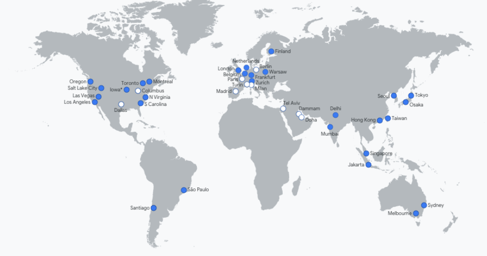
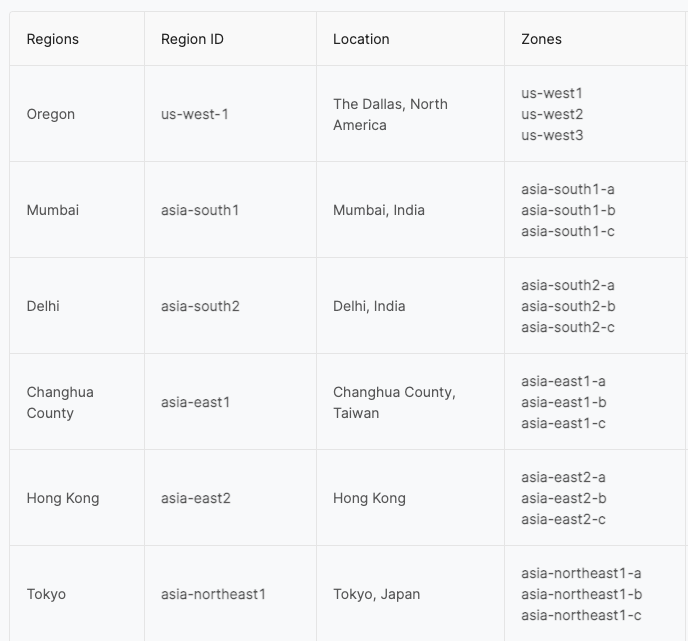
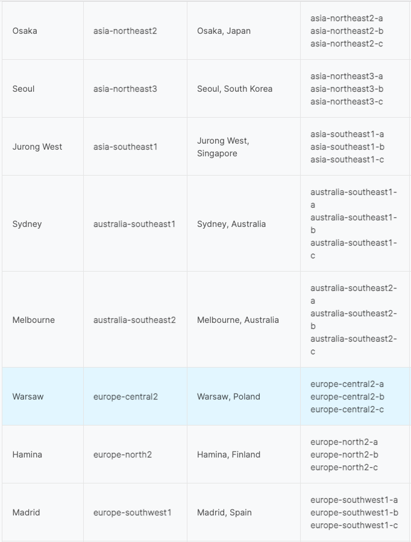
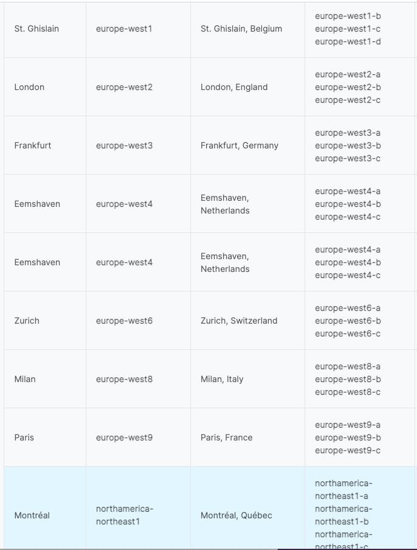
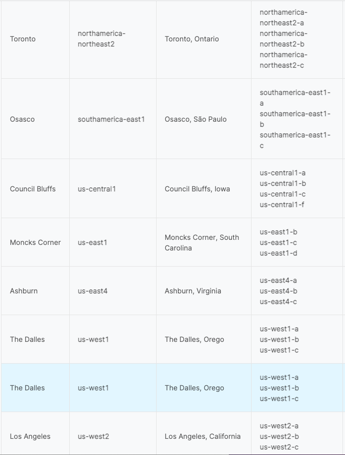
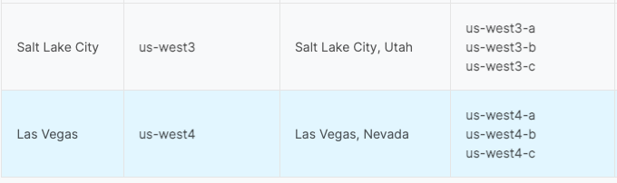

# Regions and Zones

**Main cities and zones**

- **Tokyo**: asia-northeast1 Tokyo, Japan
- **Sydney**: australia-southeast1 Sydney, Australia
- **Los Angeles**: us-west2 Los Angeles, California
- **Las Vegas**: us-west4 Las Vegas, Nevada
- **Toronto**: northamerica-northeast2 Toronto, Ontario
- **Singapore**: asia-southeast1

Reference:
https://www.economize.cloud/resources/regions-zones-map
