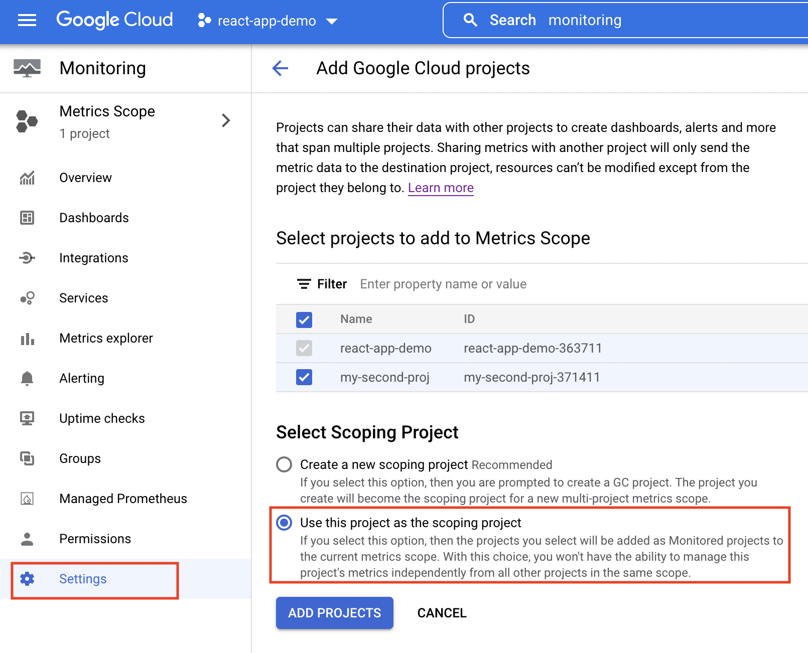
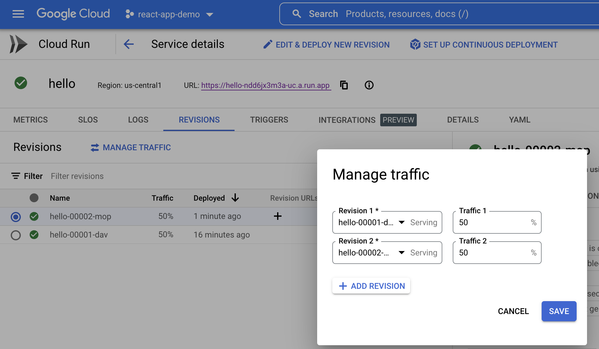
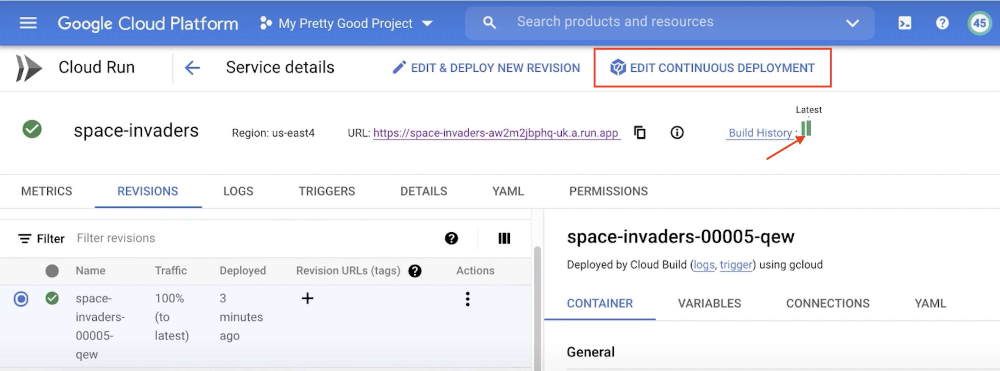
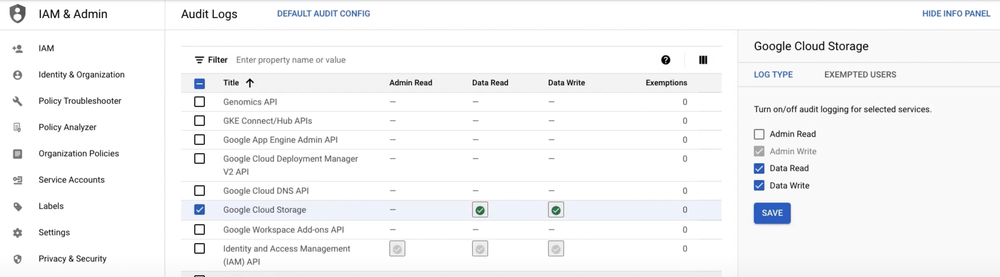
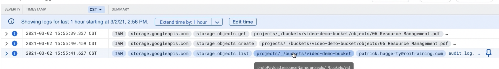

**Question 100**
You need to enable traffic between multiple groups of Compute Engine instances that are currently running two different GCP projects. Each group of Compute Engine instances is running in its own VPC. What should you do?

A: Verify that both projects are in a GCP Organization. Create a new VPC and add all instances.

B: Verify that both projects are in a GCP Organization. Share the VPC from one project and request that the Compute Engine instances in the other project use this shared VPC.

C: Verify that you are the Project Administrator of both projects. Create two new VPCs and add all instances.

D: Verify that you are the Project Administrator of both projects. Create a new VPC and add all instances.

Answer: B

- https://cloud.google.com/vpc/docs/shared-vpc
- Shared VPC

<hr />

**Question 101**
You want to add a new auditor to a Google Cloud Platform project. The auditor should be allowed to read, but not modify, all project items. How should you configure the auditor's permissions?

A: Create a custom role with view-only project permissions. Add the user's account to the custom role.

B: Create a custom role with view-only service permissions. Add the user's account to the custom role.

C: Select the built-in IAM project Viewer role. Add the user's account to this role.

D: Select the built-in IAM service Viewer role. Add the user's account to this role.

Answer: C

<hr />

**Question 102**
You are operating a Google Kubernetes Engine (GKE) cluster for your company where different teams can run non-production workloads. Your Machine Learning (ML) team needs access to Nvidia Tesla P100 GPUs to train their models. You want to minimize effort and cost. What should you do?

A: Ask your ML team to add the "accelerator: gpu" annotation to their pod specification.

B: Recreate all the nodes of the GKE cluster to enable GPUs on all of them.

C: Create your own Kubernetes cluster on top of Compute Engine with nodes that have GPUs. Dedicate this cluster to your ML team.

D: Add a new, GPU-enabled, node pool to the GKE cluster. Ask your ML team to add the cloud.google.com/gke -accelerator: nvidia-tesla-p100 nodeSelector to their pod specification.

Answer: D

- [GKE] -> [Cluster:node(vm), node(vm), node(vm)] -> [node(vm):pod(container),pod(container),pod(container)]
- To take the best, most cost-effective advantage of GPUs on GKE, and to take advantage of cluster autoscaling, we recommend creating separate GPU node pools in your clusters.[1]

**Links:**

1. https://cloud.google.com/kubernetes-engine/docs/how-to/gpus#create

<hr />

**Question 103**
Your VMs are running in a subnet that has a subnet mask of 255.255.255.240. The current subnet has no more free IP addresses and you require an additional 10 IP addresses for new VMs. The existing and new VMs should all be able to reach each other without additional routes. What should you do?

A: Use gcloud to expand the IP range of the current subnet.

B: Delete the subnet, and recreate it using a wider range of IP addresses.

C: Create a new project. Use Shared VPC to share the current network with the new project.

D: Create a new subnet with the same starting IP but a wider range to overwrite the current subnet.

Answer: A

<hr />

**Question 104**
Your organization uses G Suite for communication and collaboration. All users in your organization have a G Suite account. You want to grant some G Suite users access to your Cloud Platform project. What should you do?

A: Enable Cloud Identity in the GCP Console for your domain.

B: Grant them the required IAM roles using their G Suite email address.

C: Create a CSV sheet with all users' email addresses. Use the gcloud command line tool to convert them into Google Cloud Platform accounts.

D: In the G Suite console, add the users to a special group called cloud-console-users@yourdomain.com. Rely on the default behavior of the Cloud Platform to grant users access if they are members of this group.

Answer: B

- G Suite is now Google Workspace
- The Organization resource is closely associated with a Google Workspace or Cloud Identity account.

<hr />

**Question 105**
You have a Google Cloud Platform account with access to both production and development projects. You need to create an automated process to list all compute instances in development and production projects on a daily basis. What should you do?

A: Create two configurations using gcloud config. Write a script that sets configurations as active, individually. For each configuration, use gcloud compute instances list to get a list of compute resources.

B: Create two configurations using gsutil config. Write a script that sets configurations as active, individually. For each configuration, use gsutil compute instances list to get a list of compute resources.

C: Go to Cloud Shell and export this information to Cloud Storage on a daily basis.

D: Go to GCP Console and export this information to Cloud SQL on a daily basis.

Answer: A

<hr />

**Question 106**
You have a large 5-TB AVRO file stored in a Cloud Storage bucket. Your analysts are proficient only in SQL and need access to the data stored in this file. You want to find a cost-effective way to complete their request as soon as possible. What should you do?

A: Load data in Cloud Datastore and run a SQL query against it.

B: Create a BigQuery table and load data in BigQuery. Run a SQL query on this table and drop this table after you complete your request.

C: Create external tables in BigQuery that point to Cloud Storage buckets and run a SQL query on these external tables to complete your request.

D: Create a Hadoop cluster and copy the AVRO file to NDFS by compressing it. Load the file in a hive table and provide access to your analysts so that they can run SQL queries.

Answer: C

<hr />

**Question 107**
You need to verify that a Google Cloud Platform service account was created at a particular time. What should you do?

A: Filter the Activity log to view the Configuration category. Filter the Resource type to Service Account.

B: Filter the Activity log to view the Configuration category. Filter the Resource type to Google Project.

C: Filter the Activity log to view the Data Access category. Filter the Resource type to Service Account.

D: Filter the Activity log to view the Data Access category. Filter the Resource type to Google Project.

Answer: A

<hr />

**Question 108**
You deployed an LDAP server on Compute Engine that is reachable via TLS through port 636 using UDP. You want to make sure it is reachable by clients over that port. What should you do?

A: Add the network tag allow-udp-636 to the VM instance running the LDAP server.

B: Create a route called allow-udp-636 and set the next hop to be the VM instance running the LDAP server.

C: Add a network tag of your choice to the instance. Create a firewall rule to allow ingress on UDP port 636 for that network tag.

D: Add a network tag of your choice to the instance running the LDAP server. Create a firewall rule to allow egress on UDP port 636 for that network tag.

Answer: C

- Tags enable you to make firewall rules and routes applicable to specific VM instances.

https://cloud.google.com/vpc/docs/add-remove-network-tags

<hr />

**Question 109**
You need to set a budget alert for use of Compute Engineer services on one of the three Google Cloud Platform projects that you manage. All three projects are linked to a single billing account. What should you do?

A: Verify that you are the project billing administrator. Select the associated billing account and create a budget and alert for the appropriate project.

B: Verify that you are the project billing administrator. Select the associated billing account and create a budget and a custom alert.

C: Verify that you are the project administrator. Select the associated billing account and create a budget for the appropriate project.

D: Verify that you are project administrator. Select the associated billing account and create a budget and a custom alert.

Answer: A

**Create a budget**
https://cloud.google.com/billing/docs/how-to/budgets#create-budget

**Permissions**

- billing.budgets.create to create a new budget.
- billing.budgets.get and billing.budgets.list to view all budgets for the Cloud Billing account.

**IAM**

- Billing Account Administrator
- Billing Account Costs Manager

<hr />

**Question 110**
You are migrating a production-critical on-premises application that requires 96 vCPUs to perform its task. You want to make sure the application runs in a similar environment on GCP. What should you do?

A: When creating the VM, use machine type n1-standard-96.

B: When creating the VM, use Intel Skylake as the CPU platform.

C: Create the VM using Compute Engine default settings. Use gcloud to modify the running instance to have 96 vCPUs.

D: Start the VM using Compute Engine default settings, and adjust as you go based on Rightsizing Recommendations.

Answer: A

https://cloud.google.com/compute/docs/machine-resource#machine_type_comparison

<hr />

**Question 111**
You want to configure a solution for archiving data in a Cloud Storage bucket. The solution must be cost-effective. Data with multiple versions should be archived after 30 days. Previous versions are accessed once a month for reporting. This archive data is also occasionally updated at month-end. What should you do?

A: Add a bucket lifecycle rule that archives data with newer versions after 30 days to Coldline Storage.

B: Add a bucket lifecycle rule that archives data with newer versions after 30 days to Nearline Storage.

C: Add a bucket lifecycle rule that archives data from regional storage after 30 days to Coldline Storage.

D: Add a bucket lifecycle rule that archives data from regional storage after 30 days to Nearline Storage.

Answer: B

<hr />

**Question 112**
Your company's infrastructure is on-premises, but all machines are running at maximum capacity. You want to burst to Google Cloud. The workloads on Google Cloud must be able to directly communicate to the workloads on-premises using a private IP range. What should you do?

A: In Google Cloud, configure the VPC as a host for Shared VPC.

B: In Google Cloud, configure the VPC for VPC Network Peering.

C: Create bastion hosts both in your on-premises environment and on Google Cloud. Configure both as proxy servers using their public IP addresses.

D: Set up Cloud VPN between the infrastructure on-premises and Google Cloud.

Answer: D

<hr />

**Question 113**
You want to select and configure a solution for storing and archiving data on Google Cloud Platform. You need to support compliance objectives for data from one geographic location. This data is archived after 30 days and needs to be accessed annually. What should you do?

A: Select Multi-Regional Storage. Add a bucket lifecycle rule that archives data after 30 days to Coldline Storage.

B: Select Multi-Regional Storage. Add a bucket lifecycle rule that archives data after 30 days to Nearline Storage.

C: Select Regional Storage. Add a bucket lifecycle rule that archives data after 30 days to Nearline Storage.

D: Select Regional Storage. Add a bucket lifecycle rule that archives data after 30 days to Coldline Storage.

Answer: D

<hr />

**Question 114**
Your company uses BigQuery for data warehousing. Over time, many different business units in your company have created 1000+ datasets across hundreds of projects. Your CIO wants you to examine all datasets to find tables that contain an employee_ssn column. You want to minimize effort in performing this task.

What should you do?

A: Go to Data Catalog and search for employee_ssn in the search box.

B: Write a shell script that uses the bq command line tool to loop through all the projects in your organization.

C: Write a script that loops through all the projects in your organization and runs a query on INFORMATION_SCHEMA.COLUMNS view to find the employee_ssn column.

D: Write a Cloud Dataflow job that loops through all the projects in your organization and runs a query on INFORMATION_SCHEMA.COLUMNS view to find employee_ssn column.

Answer: A

<hr />

**Question 115**
You create a Deployment with 2 replicas in a Google Kubernetes Engine cluster that has a single preemptible node pool. After a few minutes, you use kubectl to examine the status of your Pod and observe that one of them is still in Pending status:

What is the most likely cause?

A: The pending Pod's resource requests are too large to fit on a single node of the cluster.

B: Too many Pods are already running in the cluster, and there are not enough resources left to schedule the pending Pod.

C: The node pool is configured with a service account that does not have permission to pull the container image used by the pending Pod.

D: The pending Pod was originally scheduled on a node that has been preempted between the creation of the Deployment and your verification of the Pods' status. It is currently being rescheduled on a new node.

Answer: B

<hr />

**Question 116**
You want to find out when users were added to Cloud Spanner Identity Access Management (IAM) roles on your Google Cloud Platform (GCP) project. What should you do in the GCP Console?

A: Open the Cloud Spanner console to review configurations.

B: Open the IAM & admin console to review IAM policies for Cloud Spanner roles.

C: Go to the Stackdriver Monitoring console and review information for Cloud Spanner.

D: Go to the Stackdriver Logging console, review admin activity logs, and filter them for Cloud Spanner IAM roles.

Answer: D

<hr />

**Question 117**
Your company implemented BigQuery as an enterprise data warehouse. Users from multiple business units run queries on this data warehouse. However, you notice that query costs for BigQuery are very high, and you need to control costs. Which two methods should you use? (Choose two.)

A: Split the users from business units to multiple projects.

B: Apply a user- or project-level custom query quota for BigQuery data warehouse.

C: Create separate copies of your BigQuery data warehouse for each business unit.

D: Split your BigQuery data warehouse into multiple data warehouses for each business unit.

E: Change your BigQuery query model from on-demand to flat rate. Apply the appropriate number of slots to each Project.

Answer: B, E

Explanation
For E, flat rate is always a more cost-effective billing plan. (if you use a lot)

And B, Creating a custom quota on query data to control costs at the project-level or at the user-level.

Reference Links
https://cloud.google.com/bigquery/docs/custom-quotas

<hr />

**Question 118**
You are building a product on top of Google Kubernetes Engine (GKE). You have a single GKE cluster. For each of your customers, a Pod is running in that cluster, and your customers can run arbitrary code inside their Pod. You want to maximize the isolation between your customers' Pods. What should you do?

A: Use Binary Authorization and whitelist only the container images used by your customers' Pods.

B: Use the Container Analysis API to detect vulnerabilities in the containers used by your customers Pods.

C: Create a GKE node pool with a sandbox type configured to gvisor. Add the parameter runtimeClassName: gvisor to the specification of your customers' Pods.

D: Use the cos_containerd image for your GKE nodes. Add a nodeSelector with the value cloud.google.com/gke-os-distribution: cos_containerd to the specification of your customers Pods.

Answer: C

<hr />

**Question 119**
Your customer has implemented a solution that uses Cloud Spanner and notices some read latency-related performance issues on one table. This table is accessed only by their users using a primary key. The table schema is shown below.

You want to resolve the issue. What should you do?

A: Remove the profile_picture field from the table.

B: Add a secondary index on the person_id column.

C: Change the primary key to not have monotonically increasing values.

D: Create a secondary index using the following Data Definition Language (DDL): CREATE INDEX person_id_ix ON Persons (person_id, firstname, lastname ) STORING ( profile_picture )

Answer: D

<hr />

**Question 120**
Your finance team wants to view the billing report for your projects. You want to make sure that the finance team does not get additional permissions to the project. What should you do?

A: Add the group for the finance team to roles/billing user role.

B: Add the group for the finance team to roles/billing admin role.

C: Add the group for the finance team to roles/billing viewer role.

D: Add the group for the finance team to roles/billing project/Manager role.

Answer: C

- roles/billing.user: Link projects to billing accounts.
- roles/billing.admin: Manage billing accounts (but not create them)
- roles/billing.projectManager:Link/unlink the project to/from a billing account.
- roles/billing.viewer : View billing account cost and pricing information, transactions, and billing
<hr />

**Question 121**
Your organization has strict requirements to control access to Google Cloud projects. You need to enable your Site Reliability Engineers (SREs) to approve requests from the Google Cloud support team when an SRE opens a support case. You want to follow Google-recommended practices. What should you do?

A: Add your SREs to roles/iam.roleAdmin role.

B: Add your SREs to roles/accessapproval.approver role.

C: Add your SREs to a group and then add this group to roles/iam.roleAdmin.role.

D: Add your SREs to a group and then add this group to roles/accessapproval.approver role.

Answer: D

<hr />

**Question 122**
You need to host an application on a Compute Engine instance in a project shared with other teams. You want to prevent the other teams from accidentally causing downtime on that application. Which feature should you use?

A: Use a Shielded VM.

B: Use a Preemptible VM.

C: Use a sole-tenant node.

D: Enable deletion protection on the instance.

Answer: D

<hr />

**Question 123**
Your organization needs to grant users access to query datasets in BigQuery but prevent them from accidentally deleting the datasets. You want a solution that follows Google-recommended practices. What should you do?

A: Add users to roles/bigquery user role only, instead of roles/bigquery dataOwner.

B: Add users to roles/bigquery dataEditor role only, instead of roles/bigquery dataOwner.

C: Create a custom role by removing delete permissions, and add users to that role only.

D: Create a custom role by removing delete permissions. Add users to the group, and then add the group to the custom role.

Answer: A

<hr />

**Question 124**
You have a developer laptop with the Cloud SDK installed on Ubuntu. The Cloud SDK was installed from the Google Cloud Ubuntu package repository. You want to test your application locally on your laptop with Cloud Datastore. What should you do?

A: Export Cloud Datastore data using gcloud datastore export.

B: Create a Cloud Datastore index using gcloud datastore indexes create.

C: Install the google-cloud-sdk-datastore-emulator component using the apt get install command.

D: Install the cloud-datastore-emulator component using the gcloud components install command.

Answer: D

<hr />

**Question 125**
Your company set up a complex organizational structure on Google Cloud. The structure includes hundreds of folders and projects. Only a few team members should be able to view the hierarchical structure. You need to assign minimum permissions to these team members, and you want to follow Google-recommended practices. What should you do?

A: Add the users to roles/browser role.

B: Add the users to roles/iam.roleViewer role.

C: Add the users to a group, and add this group to roles/browser.

D: Add the users to a group, and add this group to roles/iam.roleViewer role.

Answer: C

<hr />

Question 126
Your company has a single sign-on (SSO) identity provider that supports Security Assertion Markup Language (SAML) integration with service providers. Your company has users in Cloud Identity. You would like users to authenticate using your company's SSO provider. What should you do?

A: In Cloud Identity, set up SSO with Google as an identity provider to access custom SAML apps.

B: In Cloud Identity, set up SSO with a third-party identity provider with Google as a service provider.

C: Obtain OAuth 2.0 credentials, configure the user consent screen, and set up OAuth 2.0 for Mobile & Desktop Apps.

D: Obtain OAuth 2.0 credentials, configure the user consent screen, and set up OAuth 2.0 for Web Server Applications.

Answer: A

<hr />

Question 127
Your organization has a dedicated person who creates and manages all service accounts for Google Cloud projects. You need to assign this person the minimum role for projects. What should you do?

A: Add the user to roles/iam.roleAdmin role.

B: Add the user to roles/iam.securityAdmin role.

C: Add the user to roles/iam.serviceAccountUser role.

D: Add the user to roles/iam.serviceAccountAdmin role.

Answer: D

**Service Account User (roles/iam.serviceAccountUser)**

- Run operations as the service account.

**Service Account Admin (roles/iam.serviceAccountAdmin)**

- To fully manage (view, create, update, disable, enable, delete, undelete, and manage access to) service accounts:

**Links:**

1. https://cloud.google.com/iam/docs/understanding-roles#service-accounts-roles
2. https://cloud.google.com/iam/docs/creating-managing-service-accounts

<hr />

Question 128
You are building an archival solution for your data warehouse and have selected Cloud Storage to archive your data. Your users need to be able to access this archived data once a quarter for some regulatory requirements. You want to select a cost-efficient option. Which storage option should you use?

A: Cold Storage

B: Nearline Storage

C: Regional Storage

D: Multi-Regional Storage

Answer: A

<hr />

Question 129
A team of data scientists infrequently needs to use a Google Kubernetes Engine (GKE) cluster that you manage. They require GPUs for some long-running, non- restartable jobs. You want to minimize cost. What should you do?

A: Enable node auto-provisioning on the GKE cluster.

B: Create a VerticalPodAutscaler for those workloads.

C: Create a node pool with preemptible VMs and GPUs attached to those VMs.

D: Create a node pool of instances with GPUs, and enable autoscaling on this node pool with a minimum size of 1.

Answer: D

- Creating an autoscaling GPU node pool
  To take the best, most cost-effective advantage of GPUs on GKE, and to take advantage of cluster autoscaling, we recommend creating separate GPU node pools in your clusters.

**Links:**

https://cloud.google.com/kubernetes-engine/docs/how-to/gpus#gpu_pool

<hr />

**Question 130:**
Your organization has user identities in Active Directory. Your organization wants to use Active Directory as their source of truth for identities. Your organization wants to have full control over the Google accounts used by employees for all Google services, including your Google Cloud Platform (GCP) organization. What should you do?

A: Use Google Cloud Directory Sync (GCDS) to synchronize users into Cloud Identity.

B: Use the cloud Identity APIs and write a script to synchronize users to Cloud Identity.

C: Export users from Active Directory as a CSV and import them to Cloud Identity via the Admin Console.

D: Ask each employee to create a Google account using self signup. Require that each employee use their company email address and password.

Answer: A

https://cloud.google.com/architecture/identity/federating-gcp-with-active-directory-synchronizing-user-accounts

- A - correct. Best practice is to create a new project for each environment, such as production and testing. There are no routes between VPCs in these projects by default, so that satisfies the requirement by the security team.
- B. Nope. not best practice and allows communication.
- C. While this is best practice to create a new project for a different environment, it explicitly breaks the security team's rule of having no path between environments by nature of the shared VPC. The shared VPC allows entities in both VPCs to communicate as if they were in the same VPC. That's definitely wrong.
- D. One - not best practice to replicate in the setup in that project. Two - why do they suddenly need the project editor rule? Just a bad answer. Wrong.

<hr />

Question 131
You have successfully created a development environment in a project for an application. This application uses Compute Engine and Cloud SQL. Now you need to create a production environment for this application. The security team has forbidden the existence of network routes between these 2 environments and has asked you to follow Google-recommended practices. What should you do?

A: Create a new project, enable the Compute Engine and Cloud SQL APIs in that project, and replicate the setup you have created in the development environment.

B: Create a new production subnet in the existing VPC and a new production Cloud SQL instance in your existing project, and deploy your application using those resources.

C: Create a new project, modify your existing VPC to be a Shared VPC, share that VPC with your new project, and replicate the setup you have in the development environment in that new project in the Shared VPC.

D: Ask the security team to grant you the Project Editor role in an existing production project used by another division of your company. Once they grant you that role, replicate the setup you have in the development environment in that project.

Answer: A

<hr />

**Question 132:**
Your management has asked an external auditor to review all the resources in a specific project. The security team has enabled the Organization Policy called Domain Restricted Sharing on the organization node by specifying only your Cloud Identity domain. You want the auditor to only be able to view, but not modify, the resources in that project. What should you do?

A: Ask the auditor for their Google account, and give them the Viewer role on the project.

B: Ask the auditor for their Google account, and give them the Security Reviewer role on the project.

C: Create a temporary account for the auditor in Cloud Identity, and give that account the Viewer role on the project.

D: Create a temporary account for the auditor in Cloud Identity, and give that account the Security Reviewer role on the project.

Answer: C

https://cloud.google.com/iam/docs/job-functions/auditing#scenario_external_auditors

<hr />

**Question 133:**
You have a workload running on Compute Engine that is critical to your business. You want to ensure that the data on the boot disk of this workload is backed up regularly. You need to be able to restore a backup as quickly as possible in case of disaster. You also want older backups to be cleaned automatically to save on cost. You want to follow Google-recommended practices. What should you do?

A: Create a Cloud Function to create an instance template.

B: Create a snapshot schedule for the disk using the desired interval.

C: Create a cron job to create a new disk from the disk using gcloud.

D: Create a Cloud Task to create an image and export it to Cloud Storage.

Answer: B

<hr />

**Question 134:**
You need to assign a Cloud Identity and Access Management (Cloud IAM) role to an external auditor. The auditor needs to have permissions to review your Google Cloud Platform (GCP) Audit Logs and also to review your Data Access logs. What should you do?

A: Assign the auditor the IAM role roles/logging.privateLogViewer. Perform the export of logs to Cloud Storage.

B: Assign the auditor the IAM role roles/logging.privateLogViewer. Direct the auditor to also review the logs for changes to Cloud IAM policy.

C: Assign the auditor's IAM user to a custom role that has logging.privateLogEntries.list permission. Perform the export of logs to Cloud Storage.

D: Assign the auditor's IAM user to a custom role that has logging.privateLogEntries.list permission. Direct the auditor to also review the logs for changes to Cloud IAM policy.

Answer: B

- Data Access audit logs-- except for BigQuery Data Access audit logs-- are disabled by default because audit logs can be quite large.

**Links:**
https://cloud.google.com/logging/docs/audit

<hr />

**Question 135:**
You are managing several Google Cloud Platform (GCP) projects and need access to all logs for the past 60 days. You want to be able to explore and quickly analyze the log contents. You want to follow Google-recommended practices to obtain the combined logs for all projects. What should you do?

A: Navigate to Stackdriver Logging and select resource.labels.project_id="\*"

B: Create a Stackdriver Logging Export with a Sink destination to a BigQuery dataset. Configure the table expiration to 60 days.

C: Create a Stackdriver Logging Export with a Sink destination to Cloud Storage. Create a lifecycle rule to delete objects after 60 days.

D: Configure a Cloud Scheduler job to read from Stackdriver and store the logs in BigQuery. Configure the table expiration to 60 days.

Answer: B

<hr />

Question 136
You need to reduce GCP service costs for a division of your company using the fewest possible steps. You need to turn off all configured services in an existing GCP project. What should you do?

A: 1. Verify that you are assigned the Project Owners IAM role for this project. 2. Locate the project in the GCP console, click Shut down and then enter the project ID.

B: 1. Verify that you are assigned the Project Owners IAM role for this project. 2. Switch to the project in the GCP console, locate the resources and delete them.

C: 1. Verify that you are assigned the Organizational Administrator IAM role for this project. 2. Locate the project in the GCP console, enter the project ID and then click Shut down.

D: 1. Verify that you are assigned the Organizational Administrators IAM role for this project. 2. Switch to the project in the GCP console, locate the resources and delete them.

Answer: A

<hr />

Question 137
You are configuring service accounts for an application that spans multiple projects. Virtual machines (VMs) running in the web-applications project need access to BigQuery datasets in crm-databases-proj. You want to follow Google-recommended practices to give access to the service account in the web-applications project. What should you do?

A: Give "project owner" for web-applications appropriate roles to crm-databases-proj.

B: Give "project owner" role to crm-databases-proj and the web-applications project.

C: Give "project owner" role to crm-databases-proj and bigquery.dataViewer role to web-applications.

D: Give bigquery.dataViewer role to crm-databases-proj and appropriate roles to web-applications.

Answer: D

<hr />

Question 138
An employee was terminated, but their access to Google Cloud Platform (GCP) was not removed until 2 weeks later. You need to find out this employee accessed any sensitive customer information after their termination. What should you do?

A: View System Event Logs in Stackdriver. Search for the user's email as the principal.

B: View System Event Logs in Stackdriver. Search for the service account associated with the user.

C: View Data Access audit logs in Stackdriver. Search for the user's email as the principal.

D: View the Admin Activity log in Stackdriver. Search for the service account associated with the user.

Answer: C

<hr />

Question 139
You need to create a custom IAM role for use with a GCP service. All permissions in the role must be suitable for production use. You also want to clearly share with your organization the status of the custom role. This will be the first version of the custom role. What should you do?

A: Use permissions in your role that use the supported support level for role permissions. Set the role stage to ALPHA while testing the role permissions.

B: Use permissions in your role that use the supported support level for role permissions. Set the role stage to BETA while testing the role permissions.

C: Use permissions in your role that use the testing support level for role permissions. Set the role stage to ALPHA while testing the role permissions.

D: Use permissions in your role that use the testing support level for role permissions. Set the role stage to BETA while testing the role permissions.

Answer: A

- ALPHA: The role is still being developed or tested, or it includes permissions for Google Cloud services or features that are not yet public. It is not ready for widespread use.
- BETA: The role has been tested on a limited basis, or it includes permissions for Google Cloud services or features that are not generally available.
- GA: The role has been widely tested, and all of its permissions are for Google Cloud services or features that are generally available.

**Links:**
https://cloud.google.com/iam/docs/understanding-custom-roles#testing_and_deploying

<hr />

Question 140
Your company has a large quantity of unstructured data in different file formats. You want to perform ETL transformations on the data. You need to make the data accessible on Google Cloud so it can be processed by a Dataflow job. What should you do?

A: Upload the data to BigQuery using the bq command line tool.

B: Upload the data to Cloud Storage using the gsutil command line tool.

C: Upload the data into Cloud SQL using the import function in the console.

D: Upload the data into Cloud Spanner using the import function in the console.

Answer: B

<hr />

Question 141
You need to manage multiple Google Cloud projects in the fewest steps possible. You want to configure the Google Cloud SDK command line interface (CLI) so that you can easily manage multiple projects. What should you do?

A: 1. Create a configuration for each project you need to manage. 2. Activate the appropriate configuration when you work with each of your assigned Google Cloud projects.

B: 1. Create a configuration for each project you need to manage. 2. Use gcloud init to update the configuration values when you need to work with a non-default project

C: 1. Use the default configuration for one project you need to manage. 2. Activate the appropriate configuration when you work with each of your assigned Google Cloud projects.

D: 1. Use the default configuration for one project you need to manage. 2. Use gcloud init to update the configuration values when you need to work with a non-default project.

Answer: A

```
// Create a configuration file
gcloud config configurations create my-config --project=my-proj-A

//To activate an existing configuration named my-config, run:
gcloud config configurations activate my-config
```

```
$gcloud config configurations list
NAME: cloudshell-30453 ##--- default config
IS_ACTIVE: False
ACCOUNT:
PROJECT: react-app-demo-363711
COMPUTE_DEFAULT_ZONE: europe-west1-d
COMPUTE_DEFAULT_REGION:

NAME: my-config ##--My config
IS_ACTIVE: True
ACCOUNT:
PROJECT:
COMPUTE_DEFAULT_ZONE:
COMPUTE_DEFAULT_REGION:
hiroko@cloudshell:~$
```

<hr />

Question 142
Your managed instance group raised an alert stating that new instance creation has failed to create new instances. You need to maintain the number of running instances specified by the template to be able to process expected application traffic. What should you do?

A: Create an instance template that contains valid syntax which will be used by the instance group. Delete any persistent disks with the same name as instance names.

B: Create an instance template that contains valid syntax that will be used by the instance group. Verify that the instance name and persistent disk name values are not the same in the template.

C: Verify that the instance template being used by the instance group contains valid syntax. Delete any persistent disks with the same name as instance names. Set the disks.autoDelete property to true in the instance template.

D: Delete the current instance template and replace it with a new instance template. Verify that the instance name and persistent disk name values are not the same in the template. Set the disks.autoDelete property to true in the instance template.

Answer: C

<hr />

Question 143
Your company is moving from an on-premises environment to Google Cloud. You have multiple development teams that use Cassandra environments as backend databases. They all need a development environment that is isolated from other Cassandra instances. You want to move to Google Cloud quickly and with minimal support effort. What should you do?

A: 1. Build an instruction guide to install Cassandra on Google Cloud. 2. Make the instruction guide accessible to your developers.

B: 1. Advise your developers to go to Cloud Marketplace. 2. Ask the developers to launch a Cassandra image for their development work.

C: 1. Build a Cassandra Compute Engine instance and take a snapshot of it. 2. Use the snapshot to create instances for your developers.

D: 1. Build a Cassandra Compute Engine instance and take a snapshot of it. 2. Upload the snapshot to Cloud Storage and make it accessible to your developers. 3. Build instructions to create a Compute Engine instance from the snapshot so that developers can do it themselves.

Answer: B

<hr />

Question 144
You have a Compute Engine instance hosting a production application. You want to receive an email if the instance consumes more than 90% of its CPU resources for more than 15 minutes. You want to use Google services. What should you do?

A: 1. Create a consumer Gmail account. 2. Write a script that monitors the CPU usage. 3. When the CPU usage exceeds the threshold, have that script send an email using the Gmail account and smtp.gmail.com on port 25 as SMTP server.

B: 1. Create a Stackdriver Workspace, and associate your Google Cloud Platform (GCP) project with it. 2. Create an Alerting Policy in Stackdriver that uses the threshold as a trigger condition. 3. Configure your email address in the notification channel.

C: 1. Create a Stackdriver Workspace, and associate your GCP project with it. 2. Write a script that monitors the CPU usage and sends it as a custom metric to Stackdriver. 3. Create an uptime check for the instance in Stackdriver.

D: 1. In Stackdriver Logging, create a logs-based metric to extract the CPU usage by using this regular expression: CPU Usage: ([0-9] {1,3})% 2. In Stackdriver Monitoring, create an Alerting Policy based on this metric. 3. Configure your email address in the notification channel.

Answer: B

<hr />

Question 145
You have an application that uses Cloud Spanner as a backend database. The application has a very predictable traffic pattern. You want to automatically scale up or down the number of Spanner nodes depending on traffic. What should you do?

A: Create a cron job that runs on a scheduled basis to review Cloud Monitoring metrics, and then resize the Spanner instance accordingly.

B: Create a Cloud Monitoring alerting policy to send an alert to oncall SRE emails when Cloud Spanner CPU exceeds the threshold. SREs would scale resources up or down accordingly.

C: Create a Cloud Monitoring alerting policy to send an alert to Google Cloud Support email when Cloud Spanner CPU exceeds your threshold. Google support would scale resources up or down accordingly.

D: Create a Cloud Monitoring alerting policy to send an alert to webhook when Cloud Spanner CPU is over or under your threshold. Create a Cloud Function that listens to HTTP and resizes Spanner resources accordingly.

Answer: A

<hr />

Question 146
Your company publishes large files on an Apache web server that runs on a Compute Engine instance. The Apache web server is not the only application running in the project. You want to receive an email when the egress network costs for the server exceed 100 dollars for the current month as measured by Google Cloud. What should you do?

A: Set up a budget alert on the project with an amount of 100 dollars, a threshold of 100%, and notification type of "email."

B: Set up a budget alert on the billing account with an amount of 100 dollars, a threshold of 100%, and notification type of "email."

C: Export the billing data to BigQuery. Create a Cloud Function that uses BigQuery to sum the egress network costs of the exported billing data for the Apache web server for the current month and sends an email if it is over 100 dollars. Schedule the Cloud Function using Cloud Scheduler to run hourly.

D: Use the Cloud Logging Agent to export the Apache web server logs to Cloud Logging. Create a Cloud Function that uses BigQuery to parse the HTTP response log data in Cloud Logging for the current month and sends an email if the size of all HTTP responses, multiplied by current Google Cloud egress prices, totals over 100 dollars. Schedule the Cloud Function using Cloud Scheduler to run hourly.

Answer: C

<hr />

Question 147
You have designed a solution on Google Cloud that uses multiple Google Cloud products. Your company has asked you to estimate the costs of the solution. You need to provide estimates for the monthly total cost. What should you do?

A: For each Google Cloud product in the solution, review the pricing details on the products pricing page. Use the pricing calculator to total the monthly costs for each Google Cloud product.

B: For each Google Cloud product in the solution, review the pricing details on the products pricing page. Create a Google Sheet that summarizes the expected monthly costs for each product.

C: Provision the solution on Google Cloud. Leave the solution provisioned for 1 week. Navigate to the Billing Report page in the Cloud Console. Multiply the 1 week cost to determine the monthly costs.

D: Provision the solution on Google Cloud. Leave the solution provisioned for 1 week. Use Cloud Monitoring to determine the provisioned and used resource amounts. Multiply the 1 week cost to determine the monthly costs.

Answer: A

<hr />

Question 148
You have an application that receives SSL-encrypted TCP traffic on port 443. Clients for this application are located all over the world. You want to minimize latency for the clients. Which load balancing option should you use?

A: HTTPS Load Balancer

B: Network Load Balancer

C: SSL Proxy Load Balancer

D: Internal TCP/UDP Load Balancer. Add a firewall rule allowing ingress traffic from 0.0.0.0/0 on the target instances.

Answer: C

<hr />

Question 149
You have an application on a general-purpose Compute Engine instance that is experiencing excessive disk read throttling on its Zonal SSD Persistent Disk. The application primarily reads large files from disk. The disk size is currently 350 GB. You want to provide the maximum amount of throughput while minimizing costs. What should you do?

A: Increase the size of the disk to 1 TB.

B: Increase the allocated CPU to the instance.

C: Migrate to use a Local SSD on the instance.

D: Migrate to use a Regional SSD on the instance.

Answer: C

<hr />

Question 150
Your Dataproc cluster runs in a single Virtual Private Cloud (VPC) network in a single subnet with range 172.16.20.128/25. There are no private IP addresses available in the VPC network. You want to add new VMs to communicate with your cluster using the minimum number of steps. What should you do?

A: Modify the existing subnet range to 172.16.20.0/24.

B: Create a new Secondary IP Range in the VPC and configure the VMs to use that range.

C: Create a new VPC network for the VMs. Enable VPC Peering between the VMs' VPC network and the Dataproc cluster VPC network.

D: Create a new VPC network for the VMs with a subnet of 172.32.0.0/16. Enable VPC network Peering between the Dataproc VPC network and the VMs VPC network. Configure a custom Route exchange.

Answer: A

<hr />

Question 151
You manage an App Engine Service that aggregates and visualizes data from BigQuery. The application is deployed with the default App Engine Service account. The data that needs to be visualized resides in a different project managed by another team. You do not have access to this project, but you want your application to be able to read data from the BigQuery dataset. What should you do?

A: Ask the other team to grant your default App Engine Service account the role of BigQuery Job User.

B: Ask the other team to grant your default App Engine Service account the role of BigQuery Data Viewer.

C: In Cloud IAM of your project, ensure that the default App Engine service account has the role of BigQuery Data Viewer.

D: In Cloud IAM of your project, grant a newly created service account from the other team the role of BigQuery Job User in your project.

Answer: B

<hr />

Question 152
You need to create a copy of a custom Compute Engine virtual machine (VM) to facilitate an expected increase in application traffic due to a business acquisition. What should you do?

A: Create a Compute Engine snapshot of your base VM. Create your images from that snapshot.

B: Create a Compute Engine snapshot of your base VM. Create your instances from that snapshot.

C: Create a custom Compute Engine image from a snapshot. Create your images from that image.

D: Create a custom Compute Engine image from a snapshot. Create your instances from that image.

Answer: A (D is correct.)

- D is the correct answer,
  you need to create an image before you create a similar instance, this will automate the creation of new instances from the image, when there is a increase in traffic. This is the concept used in MIGs for scaling up and down the instances.
- snapshot --> image -----> creating our instance from image that we got from snapshot

**Create the image from the following sources**

- A persistent disk, even while that disk is attached to a VM (disk -> image --> create VM from the image)
- A snapshot of a persistent disk (snapshot --> image --> create VM from the image)
- Another image in your project (another image --> create VM from another image)

**Links:**

1. https://cloud.google.com/compute/docs/images/create-custom#prepare_instance_for_image
2. https://cloud.google.com/compute/docs/images/create-custom#create_image

<hr />

Question 153
You have deployed an application on a single Compute Engine instance. The application writes logs to disk. Users start reporting errors with the application. You want to diagnose the problem. What should you do?

A: Navigate to Cloud Logging and view the application logs.

B: Connect to the instance's serial console and read the application logs.

C: Configure a Health Check on the instance and set a Low Healthy Threshold value.

D: Install and configure the Cloud Logging Agent and view the logs from Cloud Logging.

Answer: D

<hr />

Question 154
An application generates daily reports in a Compute Engine virtual machine (VM). The VM is in the project corp-iot-insights. Your team operates only in the project corp-aggregate-reports and needs a copy of the daily exports in the bucket corp-aggregate-reports-storage. You want to configure access so that the daily reports from the VM are available in the bucket corp-aggregate-reports-storage and use as few steps as possible while following Google-recommended practices. What should you do?

A: Move both projects under the same folder.

B: Grant the VM Service Account the role Storage Object Creator on corp-aggregate-reports-storage.

C: Create a Shared VPC network between both projects. Grant the VM Service Account the role Storage Object Creator on corp-iot-insights.

D: Make corp-aggregate-reports-storage public and create a folder with a pseudo-randomized suffix name. Share the folder with the IoT team.

Answer: C

<hr />

Question 155
You built an application on your development laptop that uses Google Cloud services. Your application uses Application Default Credentials for authentication and works fine on your development laptop. You want to migrate this application to a Compute Engine virtual machine (VM) and set up authentication using Google- recommended practices and minimal changes. What should you do?

A: Assign appropriate access for Google services to the service account used by the Compute Engine VM.

B: Create a service account with appropriate access for Google services, and configure the application to use this account.

C: Store credentials for service accounts with appropriate access for Google services in a config file, and deploy this config file with your application.

D: Store credentials for your user account with appropriate access for Google services in a config file, and deploy this config file with your application.

Answer: A

<hr />
Question 156
You need to create a Compute Engine instance in a new project that doesn't exist yet. What should you do?

A: Using the Cloud SDK, create a new project, enable the Compute Engine API in that project, and then create the instance specifying your new project.

B: Enable the Compute Engine API in the Cloud Console, use the Cloud SDK to create the instance, and then use the --project flag to specify a new project.

C: Using the Cloud SDK, create the new instance, and use the --project flag to specify the new project. Answer yes when prompted by Cloud SDK to enable the Compute Engine API.

D: Enable the Compute Engine API in the Cloud Console. Go to the Compute Engine section of the Console to create a new instance, and look for the Create In A New Project option in the creation form.

Answer: A

<hr />

**Question 157**
Your company runs one batch process in an on-premises server that takes around 30 hours to complete. The task runs monthly, can be performed offline, and must be restarted if interrupted. You want to migrate this workload to the cloud while minimizing cost. What should you do?

A: Migrate the workload to a Compute Engine Preemptible VM.

B: Migrate the workload to a Google Kubernetes Engine cluster with Preemptible nodes.

C: Migrate the workload to a Compute Engine VM. Start and stop the instance as needed.

D: Create an Instance Template with Preemptible VMs On. Create a Managed Instance Group from the template and adjust Target CPU Utilization. Migrate the workload.

Answer: C

- Compute Engine always stops preemptible instances after they run for 24 hours. Certain actions reset this 24-hour counter.[1]

- I agree with C. You can't risk running a processes that take 30 hours on a preemptible VM (Compute Engine always stops preemptible instances after they run for 24 hours). They are good for "short-lived" batch jobs. The scenario is NOT fault tolerant as the whole process restarts if interrupted.

**Links:**

1. https://cloud.google.com/compute/docs/instances/preemptible

<hr />

**Question 158**
You are developing a new application and are looking for a Jenkins installation to build and deploy your source code. You want to automate the installation as quickly and easily as possible. What should you do?

A: Deploy Jenkins through the Google Cloud Marketplace.

B: Create a new Compute Engine instance. Run the Jenkins executable.

C: Create a new Kubernetes Engine cluster. Create a deployment for the Jenkins image.

D: Create an instance template with the Jenkins executable. Create a managed instance group with this template.

Answer: A

<hr />

**Question 159**
You have downloaded and installed the gcloud command line interface (CLI) and have authenticated with your Google Account. Most of your Compute Engine instances in your project run in the europe-west1-d zone. You want to avoid having to specify this zone with each CLI command when managing these instances. What should you do?

A: Set the europe-west1-d zone as the default zone using the gcloud config subcommand.

B: In the Settings page for Compute Engine under Default location, set the zone to europe""west1-d.

C: In the CLI installation directory, create a file called default.conf containing zone=europe""west1""d.

D: Create a Metadata entry on the Compute Engine page with key compute/zone and value europe""west1""d.

Answer: A

gcloud config set compute/zone ZONE_NAME

```
$ gcloud config set compute/zone europe-west1-d
Updated property [compute/zone].
$ gcloud config list
[accessibility]
screen_reader = True
[component_manager]
disable_update_check = True
[compute]
gce_metadata_read_timeout_sec = 30
zone = europe-west1-d
[core]
account = hiroko@hirokoymj.com
disable_usage_reporting = True
project = react-app-demo-363711
[metrics]
environment = devshell
```

**Links:**
https://cloud.google.com/sdk/gcloud/reference/config/set

<hr />

**Question 160**
The core business of your company is to rent out construction equipment at large scale. All the equipment that is being rented out has been equipped with multiple sensors that send event information every few seconds. These signals can vary from engine status, distance traveled, fuel level, and more. Customers are billed based on the consumption monitored by these sensors. You expect high throughput "" up to thousands of events per hour per device "" and need to retrieve consistent data based on the time of the event. Storing and retrieving individual signals should be atomic. What should you do?

A: Create a file in Cloud Storage per device and append new data to that file.

B: Create a file in Cloud Filestore per device and append new data to that file.

C: Ingest the data into Datastore. Store data in an entity group based on the device.

D: Ingest the data into Cloud Bigtable. Create a row key based on the event timestamp.

Answer: D

Keyword need to look for

- "High Throughput",
- "Consistent",
- "Property based data insert/fetch like ngine status, distance traveled, fuel level, and more." which can be designed in column,
- "Large Scale Customer Base + Each Customer has multiple sensor which send event in seconds" This will go for pera bytes situation,
- Export data based on the time of the event.
- Atomic

- BigTable will fit all requirement.
- DataStore is not fully Atomic
- CloudStorage is not a option where we can export data based on time of event. We need another solution to do that
- FireStore can be used with MobileSDK.

**Links:**
https://cloud.google.com/bigtable/docs/overview

<hr />

**Question 161**
You are asked to set up application performance monitoring on Google Cloud projects A, B, and C as a single pane of glass. You want to monitor CPU, memory, and disk. What should you do?

A: Enable API and then share charts from project A, B, and C.

B: Enable API and then give the metrics.reader role to projects A, B, and C.

C: Enable API and then use default dashboards to view all projects in sequence.

D: Enable API, create a workspace under project A, and then add projects B and C.

Answer: D

- Keep Project A as host project in workspace and Project B and C as Service Project, and monitor the metrics of the Project A for a centralized view.
- Monitoring -> Setting -> Add GCP Projects -> Use this project as scoping project [2]



**Links:**

1. https://www.youtube.com/watch?v=_FKdug6B5FM&t=195s
2. https://cloud.google.com/monitoring/settings/multiple-projects#add-monitored-project

<hr />

**Question 162**

You created several resources in multiple Google Cloud projects. All projects are linked to different billing accounts. To better estimate future charges, you want to have a single visual representation of all costs incurred. You want to include new cost data as soon as possible. What should you do?

A: Configure Billing Data Export to BigQuery and visualize the data in Data Studio.

B: Visit the Cost Table page to get a CSV export and visualize it using Data Studio.

C: Fill all resources in the Pricing Calculator to get an estimate of the monthly cost.

D: Use the Reports view in the Cloud Billing Console to view the desired cost information.

Answer: A

<hr />

**Question 163**
Your company has workloads running on Compute Engine and on-premises. The Google Cloud Virtual Private Cloud (VPC) is connected to your WAN over a Virtual Private Network (VPN). You need to deploy a new Compute Engine instance and ensure that no public Internet traffic can be routed to it. What should you do?

A: Create the instance without a public IP address.

B: Create the instance with Private Google Access enabled.

C: Create a deny-all egress firewall rule on the VPC network.

D: Create a route on the VPC to route all traffic to the instance over the VPN tunnel.

Answer: A

<hr />

**Question 164**
Your team maintains the infrastructure for your organization. The current infrastructure requires changes. You need to share your proposed changes with the rest of the team. You want to follow Google's recommended best practices. What should you do?

A: Use Deployment Manager templates to describe the proposed changes and store them in a Cloud Storage bucket.

B: Use Deployment Manager templates to describe the proposed changes and store them in Cloud Source Repositories.

C: Apply the changes in a development environment, run gcloud compute instances list, and then save the output in a shared Storage bucket.

D: Apply the changes in a development environment, run gcloud compute instances list, and then save the output in Cloud Source Repositories.

Answer: B

<hr />

**Question 165**
You have a Compute Engine instance hosting an application used between 9 AM and 6 PM on weekdays. You want to back up this instance daily for disaster recovery purposes. You want to keep the backups for 30 days. You want the Google-recommended solution with the least management overhead and the least number of services. What should you do?

A: 1. Update your instances' metadata to add the following value: snapshot""schedule: 0 1 \* \* \* 2. Update your instances' metadata to add the following value: snapshot""retention: 30

B: 1. In the Cloud Console, go to the Compute Engine Disks page and select your instance's disk. 2. In the Snapshot Schedule section, select Create Schedule and configure the following parameters: - Schedule frequency: Daily - Start time: 1:00 AM "" 2:00 AM - Autodelete snapshots after: 30 days

C: 1. Create a Cloud Function that creates a snapshot of your instance's disk. 2. Create a Cloud Function that deletes snapshots that are older than 30 days. 3. Use Cloud Scheduler to trigger both Cloud Functions daily at 1:00 AM.

D: 1. Create a bash script in the instance that copies the content of the disk to Cloud Storage. 2. Create a bash script in the instance that deletes data older than 30 days in the backup Cloud Storage bucket. 3. Configure the instance's crontab to execute these scripts daily at 1:00 AM.

Answer: B

<hr />

**Question 166**
Your existing application running in Google Kubernetes Engine (GKE) consists of multiple pods running on four GKE n1""standard""2 nodes. You need to deploy additional pods requiring n2""highmem""16 nodes without any downtime. What should you do?

A: Use gcloud container clusters upgrade. Deploy the new services.

B: Create a new Node Pool and specify machine type n2""highmem""16. Deploy the new pods.

C: Create a new cluster with n2""highmem""16 nodes. Redeploy the pods and delete the old cluster.

D: Create a new cluster with both n1""standard""2 and n2""highmem""16 nodes. Redeploy the pods and delete the old cluster.

Answer: B

<hr />
**Question 167**
You have an application that uses Cloud Spanner as a database backend to keep current state information about users. Cloud Bigtable logs all events triggered by users. You export Cloud Spanner data to Cloud Storage during daily backups. One of your analysts asks you to join data from Cloud Spanner and Cloud Bigtable for specific users. You want to complete this ad hoc request as efficiently as possible. What should you do?

A: Create a dataflow job that copies data from Cloud Bigtable and Cloud Storage for specific users.

B: Create a dataflow job that copies data from Cloud Bigtable and Cloud Spanner for specific users.

C: Create a Cloud Dataproc cluster that runs a Spark job to extract data from Cloud Bigtable and Cloud Storage for specific users.

D: Create two separate BigQuery external tables on Cloud Storage and Cloud Bigtable. Use the BigQuery console to join these tables through user fields, and apply appropriate filters.

Answer: D

<hr />

**Question 168**
You are hosting an application from Compute Engine virtual machines (VMs) in us""central1""a. You want to adjust your design to support the failure of a single Compute Engine zone, eliminate downtime, and minimize cost. What should you do?

A: "" Create Compute Engine resources in us""central1""b. "" Balance the load across both us""central1""a and us""central1""b.

B: "" Create a Managed Instance Group and specify us""central1""a as the zone. "" Configure the Health Check with a short Health Interval.

C: "" Create an HTTP(S) Load Balancer. "" Create one or more global forwarding rules to direct traffic to your VMs.

D: "" Perform regular backups of your application. "" Create a Cloud Monitoring Alert and be notified if your application becomes unavailable. "" Restore from backups when notified.

Answer: A

<hr />

**Question 169**
A colleague handed over a Google Cloud Platform project for you to maintain. As part of a security checkup, you want to review who has been granted the Project Owner role. What should you do?

A: In the console, validate which SSH keys have been stored as project-wide keys.

B: Navigate to Identity-Aware Proxy and check the permissions for these resources.

C: Enable Audit Logs on the IAM & admin page for all resources, and validate the results.

D: Use the command gcloud projects get-iam-policy to view the current role assignments.

Answer: D

```
// list service accounts
gcloud iam service-accounts list

//list members of roles for the project
gcloud projects get-iam-policy [project]
```

```
gcloud projects get-iam-policy react-app-demo-363711 --format=json
    {
      "condition": {
        "expression": "request.time < timestamp(\"2022-10-10T07:54:30.354Z\")",
        "title": "cloudbuild-github-enterprise-setup"
      },
      "members": [
        "serviceAccount:hello-service@react-app-demo-363711.iam.gserviceaccount.com"
      ],
      "role": "roles/iam.serviceAccountUser"
    },
    {
      "members": [
        "user:hiroko@hirokoymj.com"
      ],
      "role": "roles/owner"
    },
```

**Links:**

1. https://cloud.google.com/sdk/gcloud/reference/projects/get-iam-policy
2. https://stackoverflow.com/questions/44746358/how-do-i-list-all-iam-users-for-my-google-cloud-project

<hr />

**Question 170**
You are running multiple VPC-native Google Kubernetes Engine clusters in the same subnet. The IPs available for the nodes are exhausted, and you want to ensure that the clusters can grow in nodes when needed. What should you do?

A: Create a new subnet in the same region as the subnet being used.

B: Add an alias IP range to the subnet used by the GKE clusters.

C: Create a new VPC, and set up VPC peering with the existing VPC.

D: Expand the CIDR range of the relevant subnet for the cluster.

Answer: D

<hr />

**Question 171**
You have a batch workload that runs every night and uses a large number of virtual machines (VMs). It is fault-tolerant and can tolerate some of the VMs being terminated. The current cost of VMs is too high. What should you do?

A: Run a test using simulated maintenance events. If the test is successful, use preemptible N1 Standard VMs when running future jobs.

B: Run a test using simulated maintenance events. If the test is successful, use N1 Standard VMs when running future jobs.

C: Run a test using a managed instance group. If the test is successful, use N1 Standard VMs in the managed instance group when running future jobs.

D: Run a test using N1 standard VMs instead of N2. If the test is successful, use N1 Standard VMs when running future jobs.

Answer: A

- **Fault tolerance** is the property that enables a system to continue operating properly in the event of the failure of one or more faults
- Preemptible VMs always stop after 24 hours. Preemptible VMs are recommended only for fault-tolerant applications[1]

**Links:**

1. https://cloud.google.com/compute/docs/instances/create-use-preemptible
<hr />

**Question 172**
You are working with a user to set up an application in a new VPC behind a firewall. The user is concerned about data egress. You want to configure the fewest open egress ports. What should you do?

A: Set up a low-priority (65534) rule that blocks all egress and a high-priority rule (1000) that allows only the appropriate ports.

B: Set up a high-priority (1000) rule that pairs both ingress and egress ports.

C: Set up a high-priority (1000) rule that blocks all egress and a low-priority (65534) rule that allows only the appropriate ports.

D: Set up a high-priority (1000) rule to allow the appropriate ports.

Answer: A

**Implied rules**

- Every VPC network has two implied IPv4 firewall rules
- Implied IPv4 firewall rules are present in all VPC networks, regardless of how the networks are created, and whether they are auto mode or custom mode VPC networks. The default network has the same implied rules.
- allow egress rule.
- deny ingress rule.
- Answer will not be D, because Egress traffic is Allowed by default. You will have to explicitly set the rule blocking outbound traffic.

**Links:**

1. https://cloud.google.com/vpc/docs/firewalls#default_firewall_rules

<hr />

**Question 173**
Your company runs its Linux workloads on Compute Engine instances. Your company will be working with a new operations partner that does not use Google Accounts. You need to grant access to the instances to your operations partner so they can maintain the installed tooling. What should you do?

A: Enable Cloud IAP for the Compute Engine instances, and add the operations partner as a Cloud IAP Tunnel User.

B: Tag all the instances with the same network tag. Create a firewall rule in the VPC to grant TCP access on port 22 for traffic from the operations partner to instances with the network tag.

C: Set up Cloud VPN between your Google Cloud VPC and the internal network of the operations partner.

D: Ask the operations partner to generate SSH key pairs, and add the public keys to the VM instances.

Answer: D

<hr />

**Question 174**
You have created a code snippet that should be triggered whenever a new file is uploaded to a Cloud Storage bucket. You want to deploy this code snippet. What should you do?

A: Use App Engine and configure Cloud Scheduler to trigger the application using Pub/Sub.

B: Use Cloud Functions and configure the bucket as a trigger resource.

C: Use Google Kubernetes Engine and configure a CronJob to trigger the application using Pub/Sub.

D: Use Dataflow as a batch job, and configure the bucket as a data source.

Answer: B

```
gcloud functions deploy HelloGet --triger-http
gcloud functions deploy HelloTopic --trigger-topic=TRIGGER_TOPIC
```

https://cloud.google.com/sdk/gcloud/reference/functions/deploy

<hr />

**Question 175**
You have been asked to set up Object Lifecycle Management for objects stored in storage buckets. The objects are written once and accessed frequently for 30 days. After 30 days, the objects are not read again unless there is a special need. The objects should be kept for three years, and you need to minimize cost. What should you do?

A: Set up a policy that uses Nearline storage for 30 days and then moves to Archive storage for three years.

B: Set up a policy that uses Standard storage for 30 days and then moves to Archive storage for three years.

C: Set up a policy that uses Nearline storage for 30 days, then moves the Coldline for one year, and then moves to Archive storage for two years.

D: Set up a policy that uses Standard storage for 30 days, then moves to Coldline for one year, and then moves to Archive storage for two years.

Answer: B

<hr />

**Question 176**
You are storing sensitive information in a Cloud Storage bucket. For legal reasons, you need to be able to record all requests that read any of the stored data. You want to make sure you comply with these requirements. What should you do?

A: Enable the Identity Aware Proxy API on the project.

B: Scan the bucket using the Data Loss Prevention API.

C: Allow only a single Service Account access to read the data.

D: Enable Data Access audit logs for the Cloud Storage API.

Answer: D

<hr />

**Question 177**
You are the team lead of a group of 10 developers. You provided each developer with an individual Google Cloud Project that they can use as their personal sandbox to experiment with different Google Cloud solutions. You want to be notified if any of the developers are spending above $500 per month on their sandbox environment. What should you do?

A: Create a single budget for all projects and configure budget alerts on this budget.

B: Create a separate billing account per sandbox project and enable BigQuery billing exports. Create a Data Studio dashboard to plot the spending per billing account.

C: Create a budget per project and configure budget alerts on all of these budgets.

D: Create a single billing account for all sandbox projects and enable BigQuery billing exports. Create a Data Studio dashboard to plot the spending per project.

Answer: C

- is C, not A
  with A, i guess if you create a single budget for all projects, together they can easily beat the $500 mark and you need to know if "one deveoper' did it.
  so one budget per project is the solution.
- Key is anyone goes above $500 means it requires project level
- **Links:**

1. https://www.examtopics.com/discussions/google/view/28436-exam-associate-cloud-engineer-topic-1-question-156/
2. https://cloud.google.com/billing/docs/how-to/budgets

<hr />

**Question 178**
You are deploying a production application on Compute Engine. You want to prevent anyone from accidentally destroying the instance by clicking the wrong button. What should you do?

A: Disable the flag "Delete boot disk when instance is deleted."

B: Enable delete protection on the instance.

C: Disable Automatic restart on the instance.

D: Enable Preemptibility on the instance.

Answer: B

<hr />

**Question 179**
Your company uses a large number of Google Cloud services centralized in a single project. All teams have specific projects for testing and development. The DevOps team needs access to all of the production services in order to perform their job. You want to prevent Google Cloud product changes from broadening their permissions in the future. You want to follow Google-recommended practices. What should you do?

A: Grant all members of the DevOps team the role of Project Editor on the organization level.

B: Grant all members of the DevOps team the role of Project Editor on the production project.

C: Create a custom role that combines the required permissions. Grant the DevOps team the custom role on the production project.

D: Create a custom role that combines the required permissions. Grant the DevOps team the custom role on the organization level.

Answer: C

<hr />

**Question 180**
You are building an application that processes data files uploaded from thousands of suppliers. Your primary goals for the application are data security and the expiration of aged data. You need to design the application to:

- Restrict access so that suppliers can access only their own data.

- Give suppliers write access to data only for 30 minutes.

- Delete data that is over 45 days old. You have a very short development cycle, and you need to make sure that the application requires minimal maintenance.

Which two strategies should you use? (Choose two.)

A: Build a lifecycle policy to delete Cloud Storage objects after 45 days.

B: Use signed URLs to allow suppliers limited time access to store their objects.

C: Set up an SFTP server for your application, and create a separate user for each supplier.

D: Build a Cloud function that triggers a timer of 45 days to delete objects that have expired.

E: Develop a script that loops through all Cloud Storage buckets and deletes any buckets that are older than 45 days.

Answer: A, B

<hr />

**Question 181**
Your company wants to standardize the creation and management of multiple Google Cloud resources using Infrastructure as Code. You want to minimize the amount of repetitive code needed to manage the environment.

What should you do?

A: Develop templates for the environment using Cloud Deployment Manager.

B: Use curl in a terminal to send a REST request to the relevant Google API for each individual resource.

C: Use the Cloud Console interface to provision and manage all related resources.

D: Create a bash script that contains all requirement steps as gcloud commands.

Answer: A

-
-
- <hr />

**Question 182**
You are performing a monthly security check of your Google Cloud environment and want to know who has access to view data stored in your Google Cloud Project.

What should you?

A: Enable Audit Logs for all APIs that are related to data storage.

B: Review the IAM permissions for any role that allows for data access.

C: Review the Identity-Aware Proxy settings for each resource.

D: Create a Data Loss Prevention job.

Answer: B (Correct is B not A - "who has access to view data")

- Please read the question really carefully. The audit logs will show you who really **accessed** the data, yes! But it will not show you who has possible access to it. Therefore, you need to look into IAM permissions, which leads to answer B.

<hr />

**Question 183**
Your company has embraced a hybrid cloud strategy where some of the applications are deployed on Google Cloud. A Virtual Private Network (VPN) tunnel connects your Virtual Private Cloud (VPC) in Google Cloud with your company's on-premises network. Multiple applications in Google Cloud need to connect to an on-premises database server, and you want to avoid having to change the IP configuration in all of your applications when the IP of the database changes.

What should you do?

A: Configure Cloud NAT for all subnets of your VPC to be used when egressing from the VM instances.

B: Create a private zone on Cloud DNS, and configure the applications with the DNS name.

C: Configure the IP of the database as custom metadata for each instance, and query the metadata server.

D: Query the Compute Engine internal DNS from the applications to retrieve the IP of the database.

Answer: D (Correct is B)

> Forwarding zones
> Cloud DNS forwarding zones let you configure target name servers for specific private zones. Using a forwarding zone is one way to implement outbound DNS forwarding from your VPC network.

> A Cloud DNS forwarding zone is a special type of Cloud DNS private zone. Instead of creating records within the zone, you specify a set of forwarding targets. Each forwarding target is an IP address of a DNS server, located in your VPC network, or in an on-premises network connected to your VPC network by Cloud VPN or Cloud Interconnect.

- A does not apply, that is to provide internet access to resources
- C, does not apply
- D, I don't get it

- Cloud DNS offers DNS forwarding zones and DNS server policies to allow lookups of DNS names between your on-premises and Google Cloud environment.[1]

Links:

1. https://cloud.google.com/dns/docs/best-practices#best_practices_for_dns_forwarding_zones_and_server_policies

<hr />

**Question 184**
You have developed a containerized web application that will serve internal colleagues during business hours. You want to ensure that no costs are incurred outside of the hours the application is used. You have just created a new Google Cloud project and want to deploy the application. What should you do?

A: Deploy the container on Cloud Run for Anthos, and set the minimum number of instances to zero.

B: Deploy the container on Cloud Run (fully managed), and set the minimum number of instances to zero.

C: Deploy the container on App Engine flexible environment with autoscaling, and set the value min_instances to zero in the app.yaml.

D: Deploy the container on App Engine flexible environment with manual scaling, and set the value instances to zero in the app.yaml.

Answer: C(Correct is B)

- I think that is B the correct answer, because Cloud Run can scale to 0:
  And App Engine Flexible can't scale to 0, the minimum instance number is 1:
- When a revision does not receive any traffic, by default it is scaled in to zero container instances.[1]
- No, minimum 1 instance[2]
  **Links:**

1. https://cloud.google.com/run/docs/about-instance-autoscaling
2. https://cloud.google.com/appengine/docs/the-appengine-environments#comparing_high-level_features

<hr />

**Question 185**
You have experimented with Google Cloud using your own credit card and expensed the costs to your company. Your company wants to streamline the billing process and charge the costs of your projects to their monthly invoice. What should you do?

A: Grant the financial team the IAM role of "Billing Account User" on the billing account linked to your credit card.

B: Set up BigQuery billing export and grant your financial department IAM access to query the data.

C: Create a ticket with Google Billing Support to ask them to send the invoice to your company.

D: Change the billing account of your projects to the billing account of your company.

Answer: D

<hr />

**Question 186**

You are running a data warehouse on BigQuery. A partner company is offering a recommendation engine based on the data in your data warehouse. The partner company is also running their application on Google Cloud. They manage the resources in their own project, but they need access to the BigQuery dataset in your project. You want to provide the partner company with access to the dataset.

What should you do?

A: Create a Service Account in your own project, and grant this Service Account access to BigQuery in your project.

B: Create a Service Account in your own project, and ask the partner to grant this Service Account access to BigQuery in their project.

C: Ask the partner to create a Service Account in their project, and have them give the Service Account access to BigQuery in their project.

D: Ask the partner to create a Service Account in their project, and grant their Service Account access to the BigQuery dataset in your project.

Answer: D

https://www.examtopics.com/discussions/google/view/46746-exam-associate-cloud-engineer-topic-1-question-165/

<hr />

**Question 187**
Your web application has been running successfully on Cloud Run for Anthos. You want to evaluate an updated version of the application with a specific percentage of your production users (canary deployment).

What should you do?

A: Create a new service with the new version of the application. Split traffic between this version and the version that is currently running.

B: Create a new revision with the new version of the application. Split traffic between this version and the version that is currently running.

C: Create a new service with the new version of the application. Add HTTP Load Balancer in front of both services.

D: Create a new revision with the new version of the application. Add HTTP Load Balancer in front of both revisions.

Answer: B

- Canary deployments are a method of releasing software to a subset of users or servers. The plan is to deliver the update to a small selection of servers first, test it, and then roll it out to the other servers.

So it's a Revision or new update or a new version, not a service.

- This document shows you how to implement a deployment pipeline for Cloud Run that implements progression of code from developer branches to production with automated canary testing and percentage-based traffic management. It is intended for platform administrators who are responsible for creating and managing CI/CD pipelines
- **Links:**

1. https://cloud.google.com/architecture/implementing-cloud-run-canary-deployments-git-branches-cloud-build

2. https://www.youtube.com/watch?v=1gBOB5HrX64&list=PLuJRcdtonlDAN73rZsRk_eiJ0NU9h1Cms&index=28




<hr />

**Question 188**
Your company developed a mobile game that is deployed on Google Cloud. Gamers are connecting to the game with their personal phones over the Internet. The game sends UDP packets to update the servers about the gamers actions while they are playing in multiplayer mode. Your game backend can scale over multiple virtual machines (VMs), and you want to expose the VMs over a single IP address.

What should you do?

A: Configure an SSL Proxy load balancer in front of the application servers.

B: Configure an Internal UDP load balancer in front of the application servers.

C: Configure an External HTTP(s) load balancer in front of the application servers.

D: Configure an External Network load balancer in front of the application servers.

Answer: D (correct)

- Answer is D, cell phones are sending UDP packets and the only that can receive that type of traffic is a External Network TCP/UDP
  https://cloud.google.com/load-balancing/docs/network

Links:

https://cloud.google.com/load-balancing/docs/load-balancing-overview#about

<hr />

**Question 189**
Your auditor wants to view your organization's use of data in Google Cloud. The auditor is most interested in auditing who accessed data in Cloud Storage buckets. You need to help the auditor access the data they need. What should you do?

A: Turn on Data Access Logs for the buckets they want to audit, and then build a query in the log viewer that filters on Cloud Storage.

B: Assign the appropriate permissions, and then create a Data Studio report on Admin Activity Audit Logs.

C: Assign the appropriate permissions, and the use Cloud Monitoring to review metrics.

D: Use the export logs API to provide the Admin Activity Audit Logs in the format they want.

Answer: A




<hr />

**Question 190**
You received a JSON file that contained a private key of a Service Account in order to get access to several resources in a Google Cloud project. You downloaded and installed the Cloud SDK and want to use this private key for authentication and authorization when performing gcloud commands. What should you do?

A: Use the command gcloud auth login and point it to the private key.

B: Use the command gcloud auth activate-service-account and point it to the private key.

C: Place the private key file in the installation directory of the Cloud SDK and rename it to "credentials.json".

D: Place the private key file in your home directory and rename it to "GOOGLE_APPLICATION_CREDENTIALS".

Answer: B

```
gcloud auth activate-service-account SERVICE_ACCOUNT@DOMAIN.COM --key-file=/path/key.json --project=PROJECT_ID
```

**Links:**

https://cloud.google.com/sdk/gcloud/reference/auth/activate-service-account

<hr />

**Question 191**
You are working with a Cloud SQL MySQL database at your company. You need to retain a month-end copy of the database for three years for audit purposes.

What should you do?

A: Set up an export job for the first of the month. Write the export file to an Archive class Cloud Storage bucket.

B: Save the automatic first-of-the-month backup for three years. Store the backup file in an Archive class Cloud Storage bucket.

C: Set up an on-demand backup for the first of the month. Write the backup to an Archive class Cloud Storage bucket.

D: Convert the automatic first-of-the-month backup to an export file. Write the export file to a Coldline class Cloud Storage bucket.

Answer: B

<hr />

**Question 192**
You are monitoring an application and receive user feedback that a specific error is spiking. You notice that the error is caused by a Service Account having insufficient permissions. You are able to solve the problem but want to be notified if the problem recurs. What should you do?

A: In the Log Viewer, filter the logs on severity'Error' and the name of the Service Account.

B: Create a sink to BigQuery to export all the logs. Create a Data Studio dashboard on the exported logs.

C: Create a custom log-based metric for the specific error to be used in an Alerting Policy.

D: Grant Project Owner access to the Service Account.

Answer: C

<hr />

**Question 193**
You are developing a financial trading application that will be used globally. Data is stored and queried using a relational structure, and clients from all over the world should get the exact identical state of the data. The application will be deployed in multiple regions to provide the lowest latency to end users. You need to select a storage option for the application data while minimizing latency. What should you do?

A: Use Cloud Bigtable for data storage.

B: Use Cloud SQL for data storage.

C: Use Cloud Spanner for data storage.

D: Use Firestore for data storage.

Answer: C

- C, Cloud Spanner, keywords are globally, relational structure and lastly "clients from all over the world should get the exact identical state of the data" which implies strong consistency is needed.
- C is correct - Relational and Global
- Fully managed relational database with unlimited scale, strong consistency, and up to 99.999% availability.[1]

**Links:**

1. https://cloud.google.com/spanner
2. https://cloud.google.com/blog/topics/developers-practitioners/your-google-cloud-database-options-explained

<hr />

**Question 194**
You are about to deploy a new Enterprise Resource Planning (ERP) system on Google Cloud. The application holds the full database in-memory for fast data access, and you need to configure the most appropriate resources on Google Cloud for this application. What should you do?

A: Provision preemptible Compute Engine instances.

B: Provision Compute Engine instances with GPUs attached.

C: Provision Compute Engine instances with local SSDs attached.

D: Provision Compute Engine instances with M1 machine type.

Answer: C

<hr />

**Question 195**
You have developed an application that consists of multiple microservices, with each microservice packaged in its own Docker container image. You want to deploy the entire application on Google Kubernetes Engine so that each microservice can be scaled individually. What should you do?

A: Create and deploy a Custom Resource Definition per microservice.

B: Create and deploy a Docker Compose File.

C: Create and deploy a Job per microservice.

D: Create and deploy a Deployment per microservice.

Answer: D

<hr />

**Question 196**
You will have several applications running on different Compute Engine instances in the same project. You want to specify at a more granular level the service account each instance uses when calling Google Cloud APIs. What should you do?

A: When creating the instances, specify a Service Account for each instance.

B: When creating the instances, assign the name of each Service Account as instance metadata.

C: After starting the instances, use gcloud compute instances update to specify a Service Account for each instance.

D: After starting the instances, use gcloud compute instances update to assign the name of the relevant Service Account as instance metadata.

Answer: A

<hr />

**Question 197**
You are creating an application that will run on Google Kubernetes Engine. You have identified MongoDB as the most suitable database system for your application and want to deploy a managed MongoDB environment that provides a support SLA. What should you do?

A: Create a Cloud Bigtable cluster, and use the HBase API.

B: Deploy MongoDB Atlas from the Google Cloud Marketplace.

C: Download a MongoDB installation package, and run it on Compute Engine instances.

D: Download a MongoDB installation package, and run it on a Managed Instance Group.

Answer: B

<hr />

**Question 198**
You are managing a project for the Business Intelligence (BI) department in your company. A data pipeline ingests data into BigQuery via streaming. You want the users in the BI department to be able to run the custom SQL queries against the latest data in BigQuery. What should you do?

A: Create a Data Studio dashboard that uses the related BigQuery tables as a source and give the BI team view access to the Data Studio dashboard.

B: Create a Service Account for the BI team and distribute a new private key to each member of the BI team.

C: Use Cloud Scheduler to schedule a batch Dataflow job to copy the data from BigQuery to the BI team's internal data warehouse.

D: Assign the IAM role of BigQuery User to a Google Group that contains the members of the BI team.

Answer: D

<hr />

**Question 199**
Your company is moving its entire workload to Compute Engine. Some servers should be accessible through the Internet, and other servers should only be accessible over the internal network. All servers need to be able to talk to each other over specific ports and protocols. The current on-premises network relies on a demilitarized zone (DMZ) for the public servers and a Local Area Network (LAN) for the private servers. You need to design the networking infrastructure on Google Cloud to match these requirements. What should you do?

A: 1. Create a single VPC with a subnet for the DMZ and a subnet for the LAN. 2. Set up firewall rules to open up relevant traffic between the DMZ and the LAN subnets, and another firewall rule to allow public ingress traffic for the DMZ.

B: 1. Create a single VPC with a subnet for the DMZ and a subnet for the LAN. 2. Set up firewall rules to open up relevant traffic between the DMZ and the LAN subnets, and another firewall rule to allow public egress traffic for the DMZ.

C: 1. Create a VPC with a subnet for the DMZ and another VPC with a subnet for the LAN. 2. Set up firewall rules to open up relevant traffic between the DMZ and the LAN subnets, and another firewall rule to allow public ingress traffic for the DMZ.

D: 1. Create a VPC with a subnet for the DMZ and another VPC with a subnet for the LAN. 2. Set up firewall rules to open up relevant traffic between the DMZ and the LAN subnets, and another firewall rule to allow public egress traffic for the DMZ.

Answer: A

<hr />
<hr />
