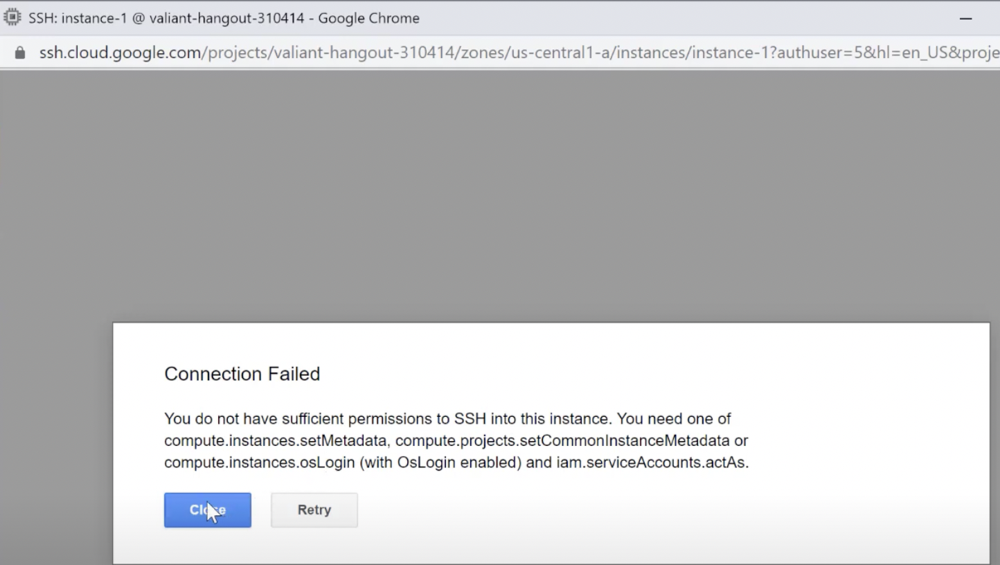
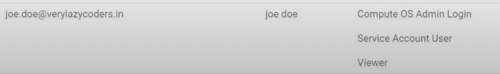
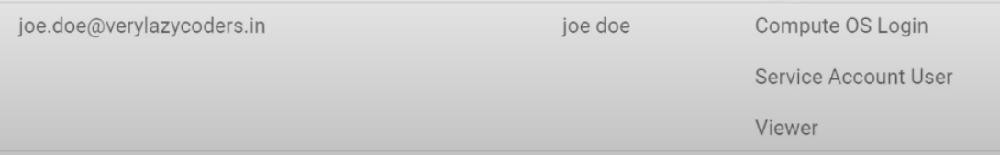
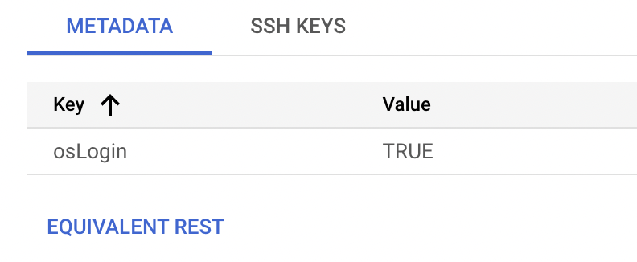
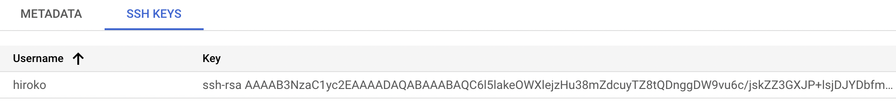
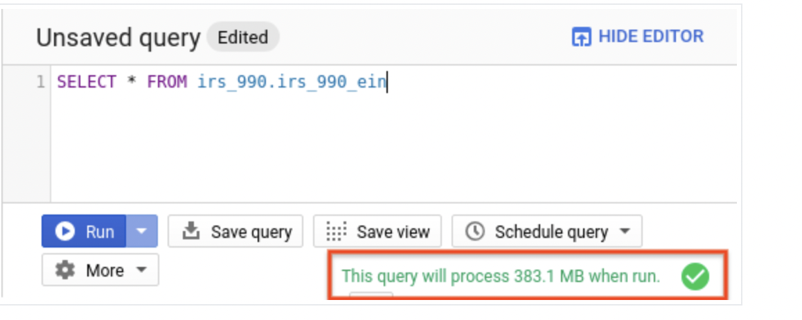
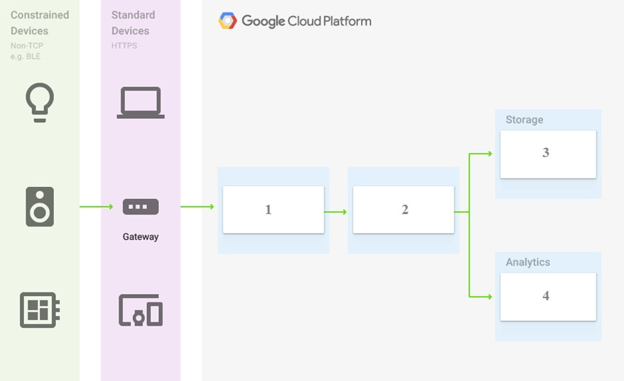

**Question 1** Every employee of your company has a Google account. Your operational team needs to manage a large number of instances on Compute Engine. Each member of this team needs only administrative access to the servers. Your security team wants to ensure that the deployment of credentials is operationally efficient and must be able to determine who accessed a given instance.

What should you do?

A: Generate a new SSH key pair. Give the private key to each member of your team. Configure the public key in the metadata of each instance.

B: Ask each member of the team to generate a new SSH key pair and to send you their public key. Use a configuration management tool to deploy those keys on each instance.

C: Ask each member of the team to generate a new SSH key pair and to add the public key to their Google account. Grant the "compute.osAdminLogin" role to the Google group corresponding to this team.

D: Generate a new SSH key pair. Give the private key to each member of your team. Configure the public key as a project-wide public SSH key in your Cloud Platform project and allow project-wide public SSH keys on each instance.

Answer: C

**There are two ways to enable OS login.**

**(1)Enable OS Login using Metadata:**

1. Go to Compute Engine -> Metadata and create key and value.

```
Key: enable-oslogin
Value: TRUE
```

2. Go to IAM and grant **roles/compute.osLogin** or **roles/compute.osAdminLogin**.

**(2)Enable OS Login using SSH key:**

1. Generate SSH key using below command.

```
// Generate SSH key
ssh-keygen -t rsa -f ~/.ssh/hiroko-ssh -C hiroko -b 2048

// ssh-keygen saves your private key file to ~/.ssh/KEY_FILENAME and your public key file to ~/.ssh/KEY_FILENAME.pub.
hiroko@owners-MacBook-Pro ~ % cd .ssh
hiroko@owners-MacBook-Pro .ssh % ls
-rw-------   1 hiroko  staff  1856 Dec  9 22:00 hiroko-ssh     # my private key
-rw-r--r--   1 hiroko  staff   388 Dec  9 22:00 hiroko-ssh.pub # my public key
// View public ssh key
cat hiroko-ssh.pub
ssh-rsa AAAZHu+Sf3B3x0/2e6si3+IHbAlHIFEvNHrqtvPGE5rIuGL1Yf9OEcAJVNri2fdTj3YVn9ALWG887oJK9 hiroko
```

2. Go to Compute Engine -> Metadata. Then click on SSH KEYS tab. and add your public key.

**Links:**

1. https://www.youtube.com/watch?v=pGIR9Cq3-Kk
2. https://cloud.google.com/compute/docs/connect/create-ssh-keys#create_an_ssh_key_pair
3. https://cloud.google.com/compute/docs/oslogin/set-up-oslogin#configure_users
4. https://cloud.google.com/compute/docs/oslogin/set-up-oslogin#enable_os_login







<hr />

**Question 2** You need to create a custom VPC with a single subnet. The subnet's range must be as large as possible. Which range should you use?

A: 0.0.0.0/0

B: 10.0.0.0/8

C: 172.16.0.0/12

D: 192.168.0.0/16

Answer: B

**Explanation**

- https://cloud.google.com/vpc/docs/vpc#restricted-ranges

**VPC (A Virtual Private Cloud)**

- VPC networks, including their associated routes and firewall rules.
- Subnets are regional resources.
- Each subnet defines a range of IPv4 addresses. Subnets in custom mode VPC networks can also have a range of IPv6 addresses.
- default, auto, custom
- When an auto mode VPC network is created, one subnet from each region is automatically created within it. These automatically created subnets use a set of predefined IPv4 ranges that fit within the 10.128.0.0/9 CIDR block.
- When a custom mode VPC network is created, no subnets are automatically created.

Links:

- 0.0.0.0/0 is a restricted range
- https://cloud.google.com/vpc/docs/vpc#valid-ranges

<hr />

**Question 3** You are a project owner and need your co-worker to deploy a new version of your application to App Engine. You want to follow Google’s recommended practices. Which IAM roles should you grant your co-worker?

A: Project Editor

B: App Engine Service Admin

C: App Engine Deployer

D: App Engine Code Viewer

Answer: C

**Explanation**

- A is not correct because this access is too wide, and Google recommends least-privilege. Also Google recommends predefined roles instead of primitive roles like Project Editor.
- B is not correct because although it gives write access to module-level and version-level settings, users cannot deploy a new version.
- C is correct because this gives write access only to create a new version.
- D is not correct because this is read-only access.¥
- https://cloud.google.com/iam/docs/understanding-roles

<hr />

**Question 4** You are a project owner and need your co-worker to deploy a new version of your application to App Engine. You want to follow Google’s recommended practices. Which IAM roles should you grant your co-worker?

A: Project Editor

B: App Engine Service Admin

C: App Engine Deployer

D: App Engine Code Viewer

Answer: C

**Explanation**

- A is not correct because this access is too wide, and Google recommends least-privilege. Also Google recommends predefined roles instead of primitive roles like Project Editor.
- B is not correct because although it gives write access to module-level and version-level settings, users cannot deploy a new version.
- C is correct because this gives write access only to create a new version.
- D is not correct because this is read-only access.

- https://cloud.google.com/iam/docs/understanding-roles

<hr />

**Question 5** You have a project using BigQuery. You want to list all BigQuery jobs for that project. You want to set this project as the default for the bq command-line tool. What should you do?

A: Use "gcloud config set project" to set the default project.

B: Use "bq config set project" to set the default project.

C: Use "gcloud generate config-url" to generate a URL to the Google Cloud Platform Console to set the default project.

D: Use "bq generate config-url" to generate a URL to the Google Cloud Platform Console to set the default project.
C
Answer: A

**Explanation**
A is correct because you need to use gcloud to manage the config/defaults.

B is not correct because the bq command-line tool assumes the gcloud configuration settings and can’t be set through BigQuery.

C is not correct because entering this command will not achieve the desired result and will generate an error.

D is not correct because entering this command will not achieve the desired result and will generate an error.

```
bq ls
bq ls coffee
$ bq cp coffee.coffee_dataset coffee.coffee_dataset_copy2
bq query 'select * from coffee.coffee_dataset'
bq mk sport_dataset
bq load --autodetect sports_dataaset.superbowls gs://doug-rehnstrom-public/superbowls-clean.csv
bq ls sports_dataset.superbowls
bq query 'select count(Game) as Win from sports_dataset.superbowls'
bq rm -f sports_dataset.superbowls
bq rm -f sports_dataset
```

**Links:**

- https://www.youtube.com/watch?v=SIE7Zpwk8zw&list=PLuJRcdtonlDAN73rZsRk_eiJ0NU9h1Cms&index=84
- https://www.youtube.com/watch?v=Lz1PZdtsJiM
- https://www.kaggle.com/datasets/psycon/daily-coffee-price

<hr />

**Question 6** Your project has all its Compute Engine resources in the europe-west1 region. You want to set europe-west1 as the default region for gcloud commands. What should you do?

A: Use Cloud Shell instead of the command line interface of your device. Launch Cloud Shell after you navigate to a resource in the europe-west1 region. The europe-west1 region will automatically become the default region.

B: Use "gcloud config set compute/region europe-west1" to set the default region for future gcloud commands.

C: Use "gcloud config set compute/zone europe-west1" to set the default region for future gcloud commands.

D: Create a VPN from on-premises to a subnet in europe-west1, and use that connection when executing gcloud commands.

Answer: B

**Explanation**

- A is not correct because Cloud Shell will not default to the location that it’s launched from.
- B is correct because this will ensure that the relevant region is used when not overwritten by a command parameter.
- C is not correct because this command should be used to set a zone, not a region.
- D is not correct because a VPN to a specific subnet does not have any effect on the gcloud command region.

<hr />

**Question 7** You developed a new application for App Engine and are ready to deploy it to production. You need to estimate the costs of running your application on Google Cloud Platform as accurately as possible. What should you do?

A: Create a YAML file with the expected usage. Pass this file to the "gcloud app estimate" command to get an accurate estimation.

B: Multiply the costs of your application when it was in development by the number of expected users to get an accurate estimation.

C: Use the pricing calculator for App Engine to get an accurate estimation of the expected charges.

D: Create a ticket with Google Cloud Billing Support to get an accurate estimation.

Answer: C

**Explanation**

A is not correct because that command will generate an error and not give you an estimation on workloads.

B is not correct because this does not result in an accurate estimation.

C is correct because this is the proper way to estimate charges.

D is not correct because billing support is available to help you set up billing and understand invoices, not to make estimations.

<hr />

**Question 8**

Your company processes high volumes of IoT data that are time-stamped. The total data volume can be several petabytes. The data needs to be written and changed at a high speed. You want to use the most performant storage option for your data. Which product should you use?

A: Cloud Datastore

B: Cloud Storage

C: Cloud Bigtable

D: BigQuery

Answer: C

**Explanation**
A is not correct because Cloud Bigtable is more performant in frequent writes, and lookup is based on timestamp key.

B is not correct because Cloud Storage stores blobs, which cannot be queried.

C is correct because Cloud Bigtable is the most performant storage option to work with IoT and time series data.

D is not correct because although it can store the data, BigQuery is very slow at changing data.

<hr />

**Question 9**

Your application has a large international audience and runs stateless virtual machines within a managed instance group across multiple locations. One feature of the application lets users upload files and share them with other users. Files must be available for 30 days; after that, they are removed from the system entirely. Which storage solution should you choose?

A: A Cloud Datastore database.

B: A multi-regional Cloud Storage bucket.

C: Persistent SSD on virtual machine instances.

D: A managed instance group of Filestore servers.

Answer: B

**Explanation**
A is not correct because a Datastore database is not designed for file storage

B is correct because buckets can be multi-regional and have lifecycle management

C is not correct because disks are generally ephemeral for virtual machines in managed instance groups

D is not correct because content would be restricted to a single region for all international users

<hr />

**Question 10**

You have a definition for an instance template that contains a web application. You are asked to deploy the application so that it can scale based on the HTTP traffic it receives. What should you do?

A: Create a VM from the instance template. Create a custom image from the VM’s disk. Export the image to Cloud Storage. Create an HTTP load balancer and add the Cloud Storage bucket as its backend service.

B: Create a VM from the instance template. Create an App Engine application in Automatic Scaling mode that forwards all traffic to the VM.

C: Create a managed instance group based on the instance template. Configure autoscaling based on HTTP traffic and configure the instance group as the backend service of an HTTP load balancer.

D: Create the necessary amount of instances required for peak user traffic based on the instance template. Create an unmanaged instance group and add the instances to that instance group. Configure the instance group as the Backend Service of an HTTP load balancer.

Answer: C is correct because a managed instance group can use an instance template to scale based on HTTP traffic.

Links:

1. https://cloud.google.com/compute/docs/instance-groups/#managed_instance_groups_and_autoscaling

<hr />

**Question 11**

You are creating a Kubernetes Engine cluster to deploy multiple pods inside the cluster. All container logs must be stored in BigQuery for later analysis. You want to follow Google-recommended practices. Which two approaches can you take?

A: Turn on Stackdriver Logging during the Kubernetes Engine cluster creation.

B: Turn on Stackdriver Monitoring during the Kubernetes Engine cluster creation.

C: Develop a custom add-on that uses Cloud Logging API and BigQuery API. Deploy the add-on to your Kubernetes Engine cluster.

D: Use the Stackdriver Logging export feature to create a sink to Cloud Storage. Create a Cloud Dataflow job that imports log files from Cloud Storage to BigQuery.

E: Use the Stackdriver Logging export feature to create a sink to BigQuery. Specify a filter expression to export log records related to your Kubernetes Engine cluster only.

Answer: A, E

**Explanation**
A Is correct because creating a cluster with Stackdriver Logging option will enable all the container logs to be stored in Stackdriver Logging.

B Is not correct because creating a cluster with Stackdriver Monitoring option will enable monitoring metrics to be gathered, but it has nothing to do with logging

C is not correct, because even if you can develop a Kubernetes addon that will send logs to BigQuery, this is not a Google-recommended practice.

D is incorrect because this is not a Google recommended practice.

E Is correct because Stackdriver Logging support exporting logs to BigQuery by creating sinks (documentation)

<hr />

**Question 12**

You need to create a new Kubernetes Cluster on Google Cloud Platform that can autoscale the number of worker nodes. What should you do?

A: Create a cluster on Kubernetes Engine and enable autoscaling on Kubernetes Engine.

B: Create a cluster on Kubernetes Engine and enable autoscaling on the instance group of the cluster.

C: Configure a Compute Engine instance as a worker and add it to an unmanaged instance group. Add a load balancer to the instance group and rely on the load balancer to create additional Compute Engine instances when needed.

D: Create Compute Engine instances for the workers and the master, and install Kubernetes. Rely on Kubernetes to create additional Compute Engine instances when needed.

Answer: A

**Explanation**
A is correct because this is the way to set up an autoscaling Kubernetes cluster.

B is not correct because you should not manage the scaling of Kubernetes through the MIG.

C is not correct because an UMIG cannot scale based on a load balancer and this is not the correct way to set up Kubernetes.

D is not correct because Kubernetes will not create additional instances when deployed on Compute Engine.

<hr />

**Question 13**

You have an application server running on Compute Engine in the europe-west1-d zone. You need to ensure high availability and replicate the server to the europe-west2-c zone using the fewest steps possible. What should you do?

A: Create a snapshot from the disk. Create a disk from the snapshot in the europe-west2-c zone. Create a new VM with that disk.

B: Create a snapshot from the disk. Create a disk from the snapshot in the europe-west1-d zone and then move the disk to europe-west2-c. Create a new VM with that disk.

C: Use "gcloud" to copy the disk to the europe-west2-c zone. Create a new VM with that disk.

D: Use "gcloud compute instances move" with parameter "--destination-zone europe-west2-c" to move the instance to the new zone.

Answer: A

**Explanation**
A is correct because this makes sure the VM gets replicated in the new zone.

B is not correct because this takes more steps than A.

C is not correct because this will generate an error, because gcloud cannot copy disks.

D is not correct because the original VM will be moved, not replicated.

<hr />

**Question 14**

Your company has a mission-critical application that serves users globally. You need to select a transactional, relational data storage system for this application. Which two products should you choose?

A: BigQuery

B: Cloud SQL

C: Cloud Spanner

D: Cloud Bigtable

E: Cloud Datastore

Answer: B, C

**Explanation**
A is not correct because BigQuery is not a transactional system.

B is correct because Cloud SQL is a relational and transactional database in the list.

C Is correct because Spanner is a relational and transactional database in the list.

D is not correct because Cloud Bigtable provides transactional support but it’s not relational.

E Is not correct because Datastore is not a relational data storage system.

<hr />

**Question 15**

You have a Kubernetes cluster with 1 node-pool. The cluster receives a lot of traffic and needs to grow. You decide to add a node. What should you do?

A: Use "gcloud container clusters resize" with the desired number of nodes.

B: Use "kubectl container clusters resize" with the desired number of nodes.

C: Edit the managed instance group of the cluster and increase the number of VMs by 1.

D: Edit the managed instance group of the cluster and enable autoscaling.

Answer: A

**Explanation**
A is correct because this resizes the cluster to the desired number of nodes.

B is not correct because you need to use gcloud, not kubectl.

C is not correct because you should not manually manage the MIG behind a cluster.

D is not correct because you should not manually manage the MIG behind a cluster.

<hr />

**Question 16**

You created an update for your application on App Engine. You want to deploy the update without impacting your users. You want to be able to roll back as quickly as possible if it fails. What should you do?

A: Delete the current version of your application. Deploy the update using the same version identifier as the deleted version.

B: Notify your users of an upcoming maintenance window. Deploy the update in that maintenance window.

C: Deploy the update as the same version that is currently running.

D: Deploy the update as a new version. Migrate traffic from the current version to the new version.

Answer: D

**Explanation**
And B are not correct because this will make the application temporarily unavailable to users.

C is not correct because to roll back, you’ll need to redeploy the previous deployment because the app was overwritten with the same version number. Therefore this takes longer than a rollback using method D.

D is correct because this makes sure there is no downtime and you can roll back the fastest.

<hr />

**Question 17**

You have created a Kubernetes deployment, called Deployment-A, with 3 replicas on your cluster. Another deployment, called Deployment-B, needs access to Deployment-A. You cannot expose Deployment-A outside of the cluster. What should you do?

A: Create a Service of type NodePort for Deployment A and an Ingress Resource for that Service. Have Deployment B use the Ingress IP address.

B: Create a Service of type LoadBalancer for Deployment Have Deployment B use the Service IP address.

C: Create a Service of type LoadBalancer for Deployment A and an Ingress Resource for that Service. Have Deployment B use the Ingress IP address.

D: Create a Service of type ClusterIP for Deployment Have Deployment B use the Service IP address.

Answer: D

**Explanation**
A is not correct because this exposes Deployment A over the public internet.

B is not correct because LoadBalancer will expose the service publicly.

C is not correct because this exposes the service externally using a cloud provider’s load balancer, and Ingress can work only with nodeport, not clusterIP.

D is correct because this exposes the service on a cluster-internal IP address. Choosing this method makes the service reachable only from within the cluster.

<hr />

**Question 18**

You need to estimate the annual cost of running a Bigquery query that is scheduled to run nightly. What should you do?

A: Use "gcloud query --dry_run" to determine the number of bytes read by the query. Use this number in the Pricing Calculator.

B: Use "bq query --dry_run" to determine the number of bytes read by the query. Use this number in the Pricing Calculator.

C: Use "gcloud estimate" to determine the amount billed for a single query. Multiply this amount by 365.

D: Use "bq estimate" to determine the amount billed for a single query. Multiply this amount by 365.

Answer: B

```
 bq query \
--use_legacy_sql=false \
--dry_run \
'SELECT * from coffee.coffee_dataset'
// Result
Query successfully validated. Assuming the tables are not modified, running this query will process 304538 bytes of data.
```

**Links:**

https://cloud.google.com/bigquery/docs/dry-run-queries

<hr />

**Question 19**

You want to find out who in your organization has Owner access to a project called "my-project".What should you do?

A: In the Google Cloud Platform Console, go to the IAM page for your organization and apply the filter "Role:Owner".

B: In the Google Cloud Platform Console, go to the IAM page for your project and apply the filter "Role:Owner".

C: Use "gcloud iam list-grantable-role --project my-project" from your Terminal.

D: Use "gcloud iam list-grantable-role" from Cloud Shell on the project page.

Answer: B

**Explanation**
A is not correct because it will give the org-wide owners, but you are interested in the project owners, which could be different.

B is correct because this shows you the Owners of the project.

C is not correct because this command is to list grantable roles for a resource, but does not return who has a specific role.

D is not correct because this command is to list grantable roles for a resource, but does not return who has a specific role.

<hr />

**Question 20**

You want to create a new role for your colleagues that will apply to all current and future projects created in your organization. The role should have the permissions of the BigQuery Job User and Cloud Bigtable User roles. You want to follow Google’s recommended practices. How should you create the new role?

A: Use "gcloud iam combine-roles --global" to combine the 2 roles into a new custom role.

B: For one of your projects, in the Google Cloud Platform Console under Roles, select both roles and combine them into a new custom role. Use "gcloud iam promote-role" to promote the role from a project role to an organization role.

C: For all projects, in the Google Cloud Platform Console under Roles, select both roles and combine them into a new custom role.

D: For your organization, in the Google Cloud Platform Console under Roles, select both roles and combine them into a new custom role.

Answer: D

**Explanation**

- A is not correct because this does not create a new role.
- B is not correct because gcloud cannot promote a role to org level.
- C is not correct because it’s recommended to define the role on the organization level. Also, the role will not be applied on new projects.
- D is correct because this creates a new role with the combined permissions on the organization level.

<hr />

**Question 21**

You work in a small company where everyone should be able to view all resources of a specific project. You want to grant them access following Google’s recommended practices. What should you do?

A: Create a script that uses "gcloud projects add-iam-policy-binding" for all users’ email addresses and the Project Viewer role.

B: Create a script that uses "gcloud iam roles create" for all users’ email addresses and the Project Viewer role.

C: Create a new Google Group and add all users to the group. Use "gcloud projects add-iam-policy-binding" with the Project Viewer role and Group email address.

D: Create a new Google Group and add all members to the group. Use "gcloud iam roles create" with the Project Viewer role and Group email address.

Answer: C

**Explanation**

- A is not correct because groups are recommended over individual assignments.
- B is not correct because this command is to create roles, not to assign them.
- C is correct because Google recommends to use groups where possible.
- D is not correct because this command is to create roles, not to assign them.

**--member**

- user|group|serviceAccount:email or domain:domain.
- user:test-user@gmail.com
- group:admins@example.com
- serviceAccount:test123@example.domain.com
- domain:example.domain.com

```
gcloud projects add-iam-policy-binding example-project-id-1 --member='user:test-user@gmail.com' --role='roles/editor'
```

```
gcloud projects add-iam-policy-binding example-project-id-1 --member='serviceAccount:test-proj1@example.domain.com' --role='roles/editor'
```

**Links:**
https://cloud.google.com/sdk/gcloud/reference/projects/add-iam-policy-binding

<hr />

**Question 22**

You need to verify the assigned permissions in a custom IAM role. What should you do?

A: Use the GCP Console, IAM section to view the information.

B: Use the "gcloud init" command to view the information.

C: Use the GCP Console, Security section to view the information.

D: Use the GCP Console, API section to view the information.

Answer: A

**Explanation**

- A is correct because this is the correct console area to view permission assigned to a custom role in a particular project.
- B is not correct because 'gcloud init' will not provide the information required.
- C and D are not correct because these are not the correct areas to view this information

<hr />

**Question 23**

Question 23
You need to create a custom VPC with a single subnet. The subnet's range must be as large as possible. Which range should you use?

A: 0.0.0.0/0

B: 10.0.0.0/8

C: 172.16.0.0/12

D: 192.168.0.0/16

Answer: B

<hr />

**Question 24**

You want to select and configure a cost-effective solution for relational data on Google Cloud Platform. You are working with a small set of operational data in one geographic location. You need to support point-in-time recovery. What should you do?

A: Select Cloud SQL (MySQL). Verify that the enable binary logging option is selected.

B: Select Cloud SQL (MySQL). Select the create failover replicas option.

C: Select Cloud Spanner. Set up your instance with 2 nodes.

D: Select Cloud Spanner. Set up your instance as multi-regional.

Answer: A

- Point-in-time recovery is enabled by default when you create a new Cloud SQL instance.[1][2]
- Point-in-time recovery uses binary logs. These logs update regularly and use storage space.[3]
- In the event of an instance or zone failure, the standby instance becomes the new primary instance. Users are then rerouted to the new primary instance. This process is called a failover [4]
- fail-over 障害迂回

**Links:**

1. https://cloud.google.com/sql/docs/mysql/backup-recovery/restore#tips-pitr
2. https://cloud.google.com/sql/docs/mysql/backup-recovery/pitr#enablingpitr
3. https://cloud.google.com/sql/docs/mysql/backup-recovery/pitr#disk-usage
4. https://cloud.google.com/sql/docs/mysql/high-availability

<hr />

**Question 25**

You want to configure autohealing for network load balancing for a group of Compute Engine instances that run in multiple zones, using the fewest possible steps. You need to configure re-creation of VMs if they are unresponsive after 3 attempts of 10 seconds each. What should you do?

A: Create an HTTP load balancer with a backend configuration that references an existing instance group. Set the health check to healthy (HTTP)

B: Create an HTTP load balancer with a backend configuration that references an existing instance group. Define a balancing mode and set the maximum RPS to 10.

C: Create a managed instance group. Set the Autohealing health check to healthy (HTTP)

D: Create a managed instance group. Verify that the autoscaling setting is on.

Answer: C

- Autohealing lets you automatically restart apps that are compromised. It promptly detects failed instances and recreates them automatically, so clients can be served again. With autohealing, you no longer need to manually bring an app back to service after a failure.

**The app includes the following Compute Engine components:[1]**

- Health check: an HTTP health check policy used by the autohealer to detect failed VM instances.
- Firewall rules: Google Cloud firewall rules let you allow or deny traffic to your instances.
- Managed instance group: A group of instances running the same demo web service.
- Instance template: A template used to create each instance in the instance group.

**Links:**

1. https://cloud.google.com/compute/docs/tutorials/high-availability-autohealing

<hr />

**Question 26**

You are using multiple configurations for gcloud. You want to review the configured Kubernetes Engine cluster of an inactive configuration using the fewest possible steps. What should you do?

A: Use gcloud config configurations describe to review the output.

B: Use gcloud config configurations activate and gcloud config list to review the output.

C: Use kubectl config get-contexts to review the output.

D: Use kubectl config use-context and kubectl config view to review the output.

Answer: C

```
kubectl config get-contexts
CURRENT   NAME          CLUSTER AUTHINFO           NAMESPACE
*         white         white   dazwilkin
          black         black   dazwilkin
```

```
kubectl config use-context black
Switched to context "black"
kubectl config use-context white
Switched to context "white"
```

- C is correct , Use kubectl config get-contexts to review the output : shows the clusters and the configurations and based on the output we can identify the inactive configurations

**Links:**
https://www.examtopics.com/discussions/google/view/20299-exam-associate-cloud-engineer-topic-1-question-5-discussion/

<hr />

**Question 27**

Your company uses Cloud Storage to store application backup files for disaster recovery purposes. You want to follow Google's recommended practices. Which storage option should you use?

A: Multi-Regional Storage

B: Regional Storage

C: Nearline Storage

D: Coldline Storage

Answer: D

<hr />

**Question 28**

Several employees at your company have been creating projects with Cloud Platform and paying for it with their personal credit cards, which the company reimburses. The company wants to centralize all these projects under a single, new billing account. What should you do?

A: Contact cloud-billing@google.com with your bank account details and request a corporate billing account for your company.

B: Create a ticket with Google Support and wait for their call to share your credit card details over the phone.

C: In the Google Platform Console, go to the Resource Manage and move all projects to the root Organizarion.

D: In the Google Cloud Platform Console, create a new billing account and set up a payment method.

Answer: C

- https://cloud.google.com/billing/docs/how-to/billing-access#relationships-between-resources

<hr />

**Question 29**

You have an application that looks for its licensing server on the IP 10.0.3.21. You need to deploy the licensing server on Compute Engine. You do not want to change the configuration of the application and want the application to be able to reach the licensing server. What should you do?

A: Reserve the IP 10.0.3.21 as a static internal IP address using gcloud and assign it to the licensing server.

B: Reserve the IP 10.0.3.21 as a static public IP address using gcloud and assign it to the licensing server.

C: Use the IP 10.0.3.21 as a custom ephemeral IP address and assign it to the licensing server.

D: Start the licensing server with an automatic ephemeral IP address, and then promote it to a static internal IP address.

Answer: A

<hr />

**Question 30**

You are deploying an application to App Engine. You want the number of instances to scale based on request rate. You need at least 3 unoccupied instances at all times. Which scaling type should you use?

A: Manual Scaling with 3 instances.

B: Basic Scaling with min_instances set to 3.

C: Basic Scaling with max_instances set to 3.

D: Automatic Scaling with min_idle_instances set to 3.

Answer: D

**App Engine scaling types**

You specify the scaling type in your app's app.yaml.

- Automatic (default)
- Basic
- Manual

```
automatic_scaling:
  target_cpu_utilization: 0.65
  min_instances: 5
  max_instances: 100
  min_pending_latency: 30ms
  max_pending_latency: automatic
  max_concurrent_requests: 50
```

- For example, if App Engine calculates that 5 instances are necessary to serve traffic, and min_idle_instances is set to 2, App Engine will run 7 instances (5, calculated based on traffic, plus 2 additional per min_idle_instances)."[3]

- Automatic scaling creates instances based on request rate, response latencies, and other application metrics.

- Basic scaling creates instances when your application receives requests. Each instance will be shut down when the application becomes idle. Basic scaling is ideal for work that is intermittent

- Manual scaling specifies the number of instances that continuously run regardless of the load level.

  **Links:**

1. https://cloud.google.com/appengine/docs/standard/how-instances-are-managed#scaling_types
2. https://cloud.google.com/appengine/docs/standard/reference/app-yaml?tab=node.js
3. https://www.examtopics.com/discussions/google/view/20302-exam-associate-cloud-engineer-topic-1-question-9-discussion/

<hr />

**Question 31**

You have a development project with appropriate IAM roles defined. You are creating a production project and want to have the same IAM roles on the new project, using the fewest possible steps. What should you do?

A: Use gcloud iam roles copy and specify the production project as the destination project.

B: Use gcloud iam roles copy and specify your organization as the destination organization.

C: In the Google Cloud Platform Console, use the'create role from role' functionality.

D: In the Google Cloud Platform Console, use the'create role' functionality and select all applicable permissions.

Answer: A

```
//To create a copy of an existing role spanner.databaseAdmin into a project with PROJECT_ID, run:
gcloud iam roles copy --source="roles/spanner.databaseAdmin" --destination=CustomSpannerDbAdmin --dest-project=PROJECT_ID
```

Links:

- https://cloud.google.com/sdk/gcloud/reference/iam/roles/copy#--destination

<hr />

**Question 32**

You need a dynamic way of provisioning VMs on Compute Engine. The exact specifications will be in a dedicated configuration file. You want to follow Google's recommended practices. Which method should you use?

A: Deployment Manager

B: Cloud Composer

C: Managed Instance Group

D: Unmanaged Instance Group

Answer: A

<hr />

**Question 33**

You have a Dockerfile that you need to deploy on Kubernetes Engine. What should you do?

A: Use kubectl app deploy <dockerfilename>.

B: Use gcloud app deploy <dockerfilename>.

C: Create a docker image from the Dockerfile and upload it to Container Registry. Create a Deployment YAML file to point to that image. Use kubectl to create the deployment with that file.

D: Create a docker image from the Dockerfile and upload it to Cloud Storage. Create a Deployment YAML file to point to that image. Use kubectl to create the deployment with that file.

Answer: C

**Hello App**

- Dockerfile
- main.go
- Dockerfile is used to build the Docker image for the application.

```
// 1. Download the hello-app source code and Dockerfile by running the following commands:

git clone https://github.com/GoogleCloudPlatform/kubernetes-engine-samples
cd kubernetes-engine-samples/hello-app

// 2. Build and tag the Docker image for hello-app:
docker build -t us-cenral1-docker.pkg.dev/${PROJECT_ID}/hello-repo/hello-app:v1 .

// 3. Run the docker images command to verify that the build was successful:
docker images

// Output
REPOSITORY                                                 TAG     IMAGE ID       CREATED          SIZE
us-west1-docker.pkg.dev/my-project/hello-repo/hello-app    v1      25cfadb1bf28   10 seconds ago   54 MB
```

> C is correct.
> A can be eliminated because kubectl app \* is not a valid command
> B can be eliminated because gcloud app deploy deploys on app engine, not on kubernetes (also it still requires a config file pointing to the image).
> D is not correct, since you cannot deploy a container image directly from GCS

**Links:**

1. https://github.com/GoogleCloudPlatform/kubernetes-engine-samples/tree/main/hello-app
2. https://www.examtopics.com/discussions/google/view/18826-exam-associate-cloud-engineer-topic-1-question-12-discussion/

<hr />

**Question 34**

Your development team needs a new Jenkins server for their project. You need to deploy the server using the fewest steps possible. What should you do?

A: Download and deploy the Jenkins Java WAR to App Engine Standard.

B: Create a new Compute Engine instance and install Jenkins through the command line interface.

C: Create a Kubernetes cluster on Compute Engine and create a deployment with the Jenkins Docker image.

D: Use GCP Marketplace to launch the Jenkins solution.

Answer: D

<hr />

**Question 35**

You need to update a deployment in Deployment Manager without any resource downtime in the deployment. Which command should you use?

A: gcloud deployment-manager deployments create --config <deployment-config-path>

B: gcloud deployment-manager deployments update --config <deployment-config-path>

C: gcloud deployment-manager resources create --config <deployment-config-path>

D: gcloud deployment-manager resources update --config <deployment-config-path>

Answer: B

- This command will update a deployment with the new config file provided.

```
gcloud deployment-manager deployments update my-deployment --config=new_config.yaml
```

**Links:**

1. https://cloud.google.com/sdk/gcloud/reference/deployment-manager/deployments/update

<hr />

**Question 36**

You need to run an important query in BigQuery but expect it to return a lot of records. You want to find out how much it will cost to run the query. You are using on-demand pricing. What should you do?

A: Arrange to switch to Flat-Rate pricing for this query, then move back to on-demand.

B: Use the command line to run a dry run query to estimate the number of bytes read. Then convert that bytes estimate to dollars using the Pricing Calculator.

C: Use the command line to run a dry run query to estimate the number of bytes returned. Then convert that bytes estimate to dollars using the Pricing Calculator.

D: Run a select count (\*) to get an idea of how many records your query will look through. Then convert that number of rows to dollars using the Pricing Calculator.

Answer: B

**Estimate query costs by Console**

- When you enter a query in the Google Cloud console, the query validator verifies the query syntax and provides an estimate of the number of bytes read. You can use this estimate to calculate query cost in the Pricing Calculator.
  

**Estimate query costs by bq command**

When you run a query in the bq command-line tool, you can use the --dry_run flag to estimate the number of bytes read.

```
bq query \
--use_legacy_sql=false \
--dry_run \
'SELECT
   COUNTRY,
   AIRPORT,
   IATA
 FROM
   `project_id`.dataset.airports
 LIMIT
   1000'
```

> Query successfully validated. Assuming the tables are not modified,
> running this query will process 10918 bytes of data.

**Links:**

1. https://cloud.google.com/bigquery/docs/dry-run-queries

<hr />

**Question 37**

You have a single binary application that you want to run on Google Cloud Platform. You decided to automatically scale the application based on underlying infrastructure CPU usage. Your organizational policies require you to use virtual machines directly. You need to ensure that the application scaling is operationally efficient and completed as quickly as possible. What should you do?

A: Create a Google Kubernetes Engine cluster, and use horizontal pod autoscaling to scale the application.

B: Create an instance template, and use the template in a managed instance group with autoscaling configured.

C: Create an instance template, and use the template in a managed instance group that scales up and down based on the time of day.

D: Use a set of third-party tools to build automation around scaling the application up and down, based on Stackdriver CPU usage monitoring.

Answer: B

<hr />

**Question 38**

You are analyzing Google Cloud Platform service costs from three separate projects. You want to use this information to create service cost estimates by service type, daily and monthly, for the next six months using standard query syntax. What should you do?

A: Export your bill to a Cloud Storage bucket, and then import into Cloud Bigtable for analysis.

B: Export your bill to a Cloud Storage bucket, and then import into Google Sheets for analysis.

C: Export your transactions to a local file, and perform analysis with a desktop tool.

D: Export your bill to a BigQuery dataset, and then write time window-based SQL queries for analysis.

Answer: D

<hr />

**Question 39**

You need to set up a policy so that videos stored in a specific Cloud Storage Regional bucket are moved to Coldline after 90 days, and then deleted after one year from their creation. How should you set up the policy?

A: Use Cloud Storage Object Lifecycle Management using Age conditions with SetStorageClass and Delete actions. Set the SetStorageClass action to 90 days and the Delete action to 275 days (365 "" 90)

B: Use Cloud Storage Object Lifecycle Management using Age conditions with SetStorageClass and Delete actions. Set the SetStorageClass action to 90 days and the Delete action to 365 days.

C: Use gsutil rewrite and set the Delete action to 275 days (365-90).

D: Use gsutil rewrite and set the Delete action to 365 days.

Answer: B

<hr />

**Question 40**

You have a Linux VM that must connect to Cloud SQL. You created a service account with the appropriate access rights. You want to make sure that the VM uses this service account instead of the default Compute Engine service account. What should you do?

A: When creating the VM via the web console, specify the service account under the'Identity and API Access' section.

B: Download a JSON Private Key for the service account. On the Project Metadata, add that JSON as the value for the key compute-engine-service- account.

C: Download a JSON Private Key for the service account. On the Custom Metadata of the VM, add that JSON as the value for the key compute-engine- service-account.

D: Download a JSON Private Key for the service account. After creating the VM, ssh into the VM and save the JSON under ~/.gcloud/compute-engine-service- account.json.

```text
Answer: A
```

- Menu -> Compute Engine -> Create an instance -> Identity and API access
- **Cloud SQL Admin**: Full control of Cloud SQL resources.
- **Cloud SQL Client**: Connectivity access to Cloud SQL instances.
- **Cloud SQL Editor**:Full control of existing Cloud SQL instances excluding modifying users, SSL certificates or deleting resources.
- **Cloud SQL Instance User**: Role allowing access to a Cloud SQL instance
- **Cloud SQL Viewer**: Read-only access to Cloud SQL resources.
- Linux VM and install Cloud SQL ??
  https://cloud.google.com/compute/docs/instances/sql-server/creating-sql-server-instances

<hr />

**Question 41**

You created an instance of SQL Server 2017 on Compute Engine to test features in the new version. You want to connect to this instance using the fewest number of steps. What should you do?

A: Install a RDP client on your desktop. Verify that a firewall rule for port 3389 exists.

B: Install a RDP client in your desktop. Set a Windows username and password in the GCP Console. Use the credentials to log in to the instance.

C: Set a Windows password in the GCP Console. Verify that a firewall rule for port 22 exists. Click the RDP button in the GCP Console and supply the credentials to log in.

D: Set a Windows username and password in the GCP Console. Verify that a firewall rule for port 3389 exists. Click the RDP button in the GCP Console, and supply the credentials to log in.

Answer: B (D is NOT correct so B is the answer.)

- I tested this on on Compute Engine today by deploying a new instance. D is not correct. When you click the RDP button, you are asked to install a client or use the Windows RDP client if you are running Windows. There is no option to enter credentials or get an RDP session through the web interface.

- If the VM instance has a public IP address and firewall rules permit RDP access, use an RDP client. For more information, see Microsoft Remote Desktop clients to connect to the Windows instance.[1]

**Links:**

1. https://cloud.google.com/compute/docs/instances/connecting-to-windows#before-you-begin

<hr />

**Question 42**

You have one GCP account running in your default region and zone and another account running in a non-default region and zone. You want to start a new Compute Engine instance in these two Google Cloud Platform accounts using the command line interface. What should you do?

A: Create two configurations using gcloud config configurations create [NAME]. Run gcloud config configurations activate [NAME] to switch between accounts when running the commands to start the Compute Engine instances.

B: Create two configurations using gcloud config configurations create [NAME]. Run gcloud configurations list to start the Compute Engine instances.

C: Activate two configurations using gcloud configurations activate [NAME]. Run gcloud config list to start the Compute Engine instances.

D: Activate two configurations using gcloud configurations activate [NAME]. Run gcloud configurations list to start the Compute Engine instances.

Answer: A
https://www.examtopics.com/discussions/google/view/16692-exam-associate-cloud-engineer-topic-1-question-21-discussion/

- https://www.youtube.com/watch?v=M8z1Wldsj-g

<hr />

**Question 43**

You significantly changed a complex Deployment Manager template and want to confirm that the dependencies of all defined resources are properly met before committing it to the project. You want the most rapid feedback on your changes. What should you do?

A: Use granular logging statements within a Deployment Manager template authored in Python.

B: Monitor activity of the Deployment Manager execution on the Stackdriver Logging page of the GCP Console.

C: Execute the Deployment Manager template against a separate project with the same configuration, and monitor for failures.

D: Execute the Deployment Manager template using the ""-preview option in the same project, and observe the state of interdependent resources.

Answer: D

- You can preview the update you want to make before committing any changes, with the Google Cloud CLI or the API.[1]

```js
//With the Google Cloud CLI, make an update request with the --preview parameter:
gcloud deployment-manager deployments update example-deployment \
    --config configuration-file.yaml \
    --preview
```

**Links:**

1. https://cloud.google.com/deployment-manager/docs/deployments/updating-deployments#optional_preview_an_updated_configuration

<hr />

**Question 44**

You are building a pipeline to process time-series data. Which Google Cloud Platform services should you put in boxes 1,2,3, and 4?



A: Cloud Pub/Sub, Cloud Dataflow, Cloud Datastore, BigQuery

B: Firebase Messages, Cloud Pub/Sub, Cloud Spanner, BigQuery

C: Cloud Pub/Sub, Cloud Storage, BigQuery, Cloud Bigtable

D: Cloud Pub/Sub, Cloud Dataflow, Cloud Bigtable, BigQuery

**Answer: D**

> D is correct
> as per google docs.
> https://cloud.google.com/bigtable/docs/schema-design-time-series#time-series-cloud-bigtable
> Storing time-series data in Cloud **Bigtable** is a natural fit.

> A time series is a collection of data that consists of measurements and the times when the measurements are recorded. Examples of time series include the following:

- The plot of memory usage on your computer
- Temperature over time on a news report
- Stock market prices over a period of time

> A good schema results in excellent performance and scalability, and a bad schema can lead to a poorly performing system. However, no single schema design provides the best fit for all use cases.

> The basic design patterns for storing time-series data in **Bigtable** are as follows:

**Links:**

1. https://cloud.google.com/bigtable/docs/schema-design-time-series#time-series-cloud-bigtable

<hr />

**Question 45** You have a project for your App Engine application that serves a development environment. The required testing has succeeded and you want to create a new project to serve as your production environment. What should you do?

A: Use gcloud to create the new project, and then deploy your application to the new project.

B: Use gcloud to create the new project and to copy the deployed application to the new project.

C: Create a Deployment Manager configuration file that copies the current App Engine deployment into a new project.

D: Deploy your application again using gcloud and specify the project parameter with the new project name to create the new project.

Answer: A (A is correct)

> Correct is A.

- Option B is wrong as the option to use gcloud app cp does not exist.
- Option C is wrong as Deployment Manager does not copy the application, but allows you to specify all the resources needed for your application in a declarative format using yaml
- Option D is wrong as gcloud app deploy would not create a new project. The project should be created before usage

Links:
https://www.examtopics.com/discussions/google/view/16693-exam-associate-cloud-engineer-topic-1-question-24-discussion/

<hr />

**Question 46** You need to configure IAM access audit logging in BigQuery for external auditors. You want to follow Google-recommended practices. What should you do?

A: Add the auditors group to the'logging.viewer' and'bigQuery.dataViewer' predefined IAM roles.

B: Add the auditors group to two new custom IAM roles.

C: Add the auditor user accounts to the'logging.viewer' and'bigQuery.dataViewer' predefined IAM roles.

D: Add the auditor user accounts to two new custom IAM roles.

Answer: A

- Autid logs-> Admin Activity, Data Access, Policy Denied, System Event -> Logging.viewer
- Admin Activity, Policy Denied, System Event -> Logging.viewer
- Data Access -> Logging.privateLogViewer

<hr />

**Question 47** You need to set up permissions for a set of Compute Engine instances to enable them to write data into a particular Cloud Storage bucket. You want to follow Google-recommended practices. What should you do?

A: Create a service account with an access scope. Use the access scope "https://www.googleapis.com/auth/devstorage.write_only".

B: Create a service account with an access scope. Use the access scope'https://www.googleapis.com/auth/cloud-platform'.

C: Create a service account and add it to the IAM role'storage.objectCreator' for that bucket.

D: Create a service account and add it to the IAM role'storage.objectAdmin' for that bucket.

Answer: A (or C)

- Storage Object Creator (roles/storage.objectCreator)
  > Allows users to create objects. Does not give permission to view, delete, or replace objects
- Storage Object Admin (roles/storage.objectAdmin)
  > Grants full control over objects, including listing, creating, viewing, and deleting objects
- As per as the least privileage recommended by google, C is the correct Option, A is incorrect because the scope doesnt exist. B incorrect because it will give him full of control
- [Cloud Storage - Scopes](https://cloud.google.com/storage/docs/authentication#oauth-scopes)
  > read-only, read-write, there is NO write_only

<hr />

**Question 48** You have sensitive data stored in three Cloud Storage buckets and have enabled data access logging. You want to verify activities for a particular user for these buckets, using the fewest possible steps. You need to verify the addition of metadata labels and which files have been viewed from those buckets. What should you do?

A: Using the GCP Console, filter the Activity log to view the information.

B: Using the GCP Console, filter the Stackdriver log to view the information.

C: View the bucket in the Storage section of the GCP Console.

D: Create a trace in Stackdriver to view the information.

Answer: B
https://cloud.google.com/storage/docs/audit-logging

- B is correct. In this scenario, you need to select data access audit logs in Cloud Logging.
- Note the Stackdriver Logging is now named Cloud Logging.
- B is the right ans. Activity log is not for data access audit logs, use log explorer for this purpose
- Cloud Storage: When Cloud Storage usage logs are enabled, Cloud Storage writes usage data to the Cloud Storage bucket, which generates Data Access audit logs for the bucket. The generated Data Access audit log has its caller identity redacted.[1]
- Admin Activity, **Data access**, policy denied, System event
- Cloud Audit Logs features Admin Activity logs documenting administrative events, and Data Access logs record accesses to your cloud data by your users.[2]

**Links:**

1. https://cloud.google.com/logging/docs/audit#types
2. https://cloud.google.com/audit-logs

<hr />

**Question 49** You are the project owner of a GCP project and want to delegate control to colleagues to manage buckets and files in Cloud Storage. You want to follow Google- recommended practices. Which IAM roles should you grant your colleagues?

A: Project Editor

B: Storage Admin

C: Storage Object Admin

D: Storage Object Creator

Answer: B

- https://cloud.google.com/storage/docs/access-control/iam-roles#standard-roles

- Storage Object Admin (roles/storage.objectAdmin)

  > Grants full control over objects, including listing, creating, viewing, and deleting objects.

- Storage Object Creator (roles/storage.objectCreator)
  > Allows users to create objects. Does not give permission to view, delete, or replace objects.
- Storage Admin (roles/storage.admin)
  > Grants full control of buckets and objects.
  <hr />

**Question 50** You have an object in a Cloud Storage bucket that you want to share with an external company. The object contains sensitive data. You want access to the content to be removed after four hours. The external company does not have a Google account to which you can grant specific user-based access privileges. You want to use the most secure method that requires the fewest steps. What should you do?

A: Create a signed URL with a four-hour expiration and share the URL with the company.

B: Set object access to'public' and use object lifecycle management to remove the object after four hours.

C: Configure the storage bucket as a static website and furnish the object's URL to the company. Delete the object from the storage bucket after four hours.

D: Create a new Cloud Storage bucket specifically for the external company to access. Copy the object to that bucket. Delete the bucket after four hours have passed.

Answer: A

<hr />
