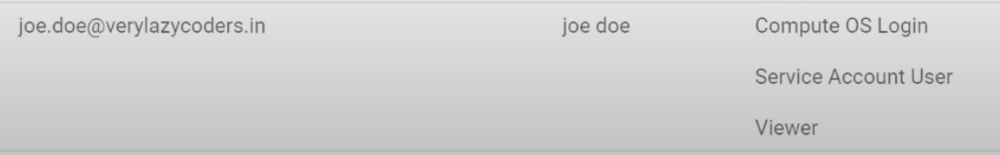
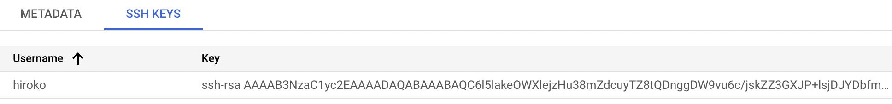
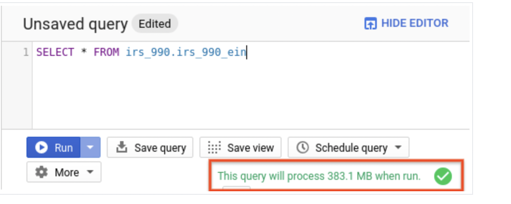
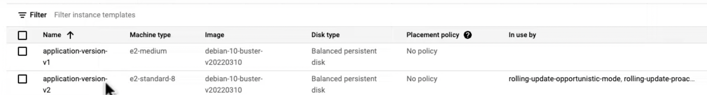
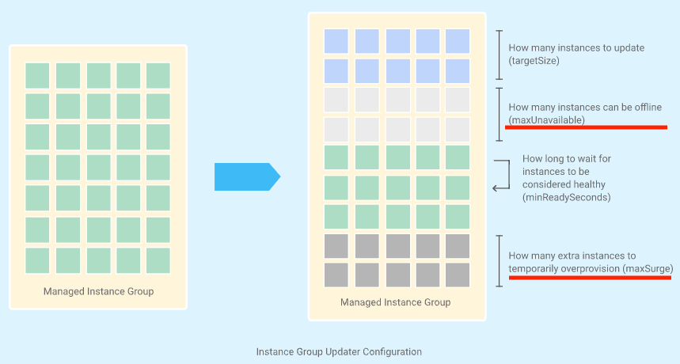
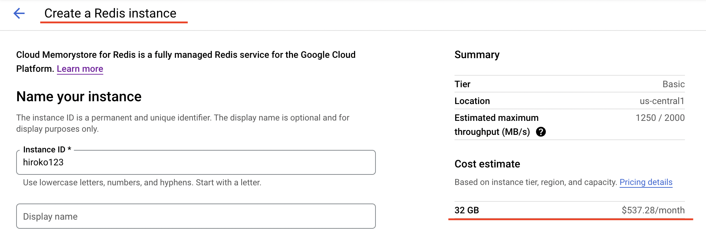
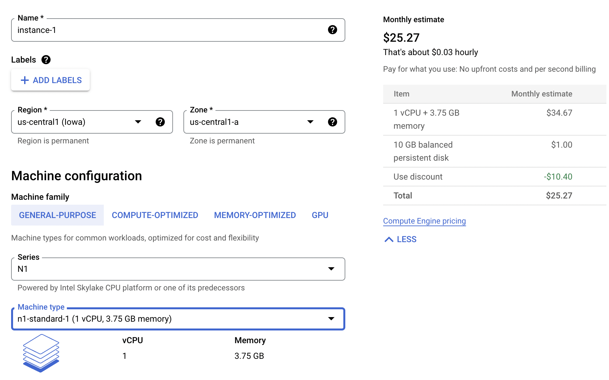
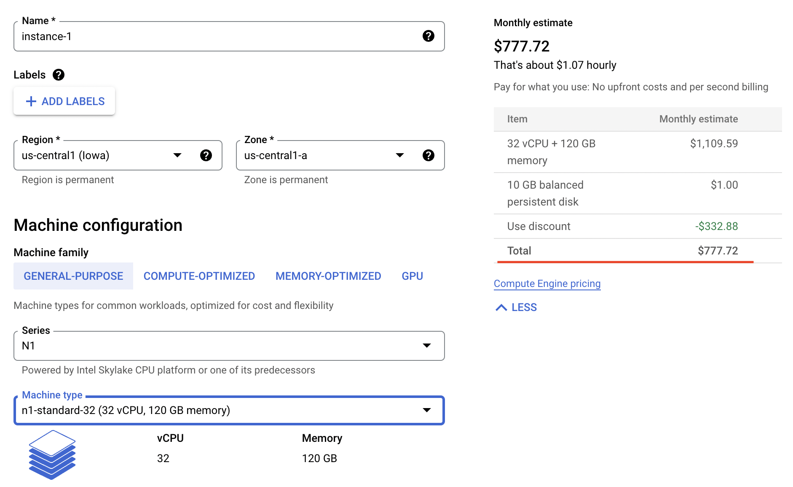
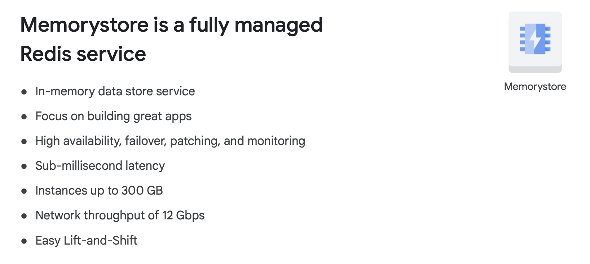
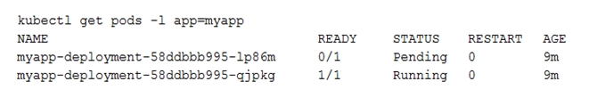

**Question 1** Every employee of your company has a Google account. Your operational team needs to manage a large number of instances on Compute Engine. Each member of this team needs only administrative access to the servers. Your security team wants to ensure that the deployment of credentials is operationally efficient and must be able to determine who accessed a given instance.

What should you do?

A: Generate a new SSH key pair. Give the private key to each member of your team. Configure the public key in the metadata of each instance.

B: Ask each member of the team to generate a new SSH key pair and to send you their public key. Use a configuration management tool to deploy those keys on each instance.

C: Ask each member of the team to generate a new SSH key pair and to add the public key to their Google account. Grant the "compute.osAdminLogin" role to the Google group corresponding to this team.

D: Generate a new SSH key pair. Give the private key to each member of your team. Configure the public key as a project-wide public SSH key in your Cloud Platform project and allow project-wide public SSH keys on each instance.

Answer: C

**There are two ways to enable OS login.**

**(1)Enable OS Login using Metadata:**

1. Go to Compute Engine -> Metadata and create key and value.

```
Key: enable-oslogin
Value: TRUE
```

2. Go to IAM and grant **roles/compute.osLogin** or **roles/compute.osAdminLogin**.

**(2)Enable OS Login using SSH key:**

1. Generate SSH key using below command.

```
// Generate SSH key
ssh-keygen -t rsa -f ~/.ssh/hiroko-ssh -C hiroko -b 2048

// ssh-keygen saves your private key file to ~/.ssh/KEY_FILENAME and your public key file to ~/.ssh/KEY_FILENAME.pub.
hiroko@owners-MacBook-Pro ~ % cd .ssh
hiroko@owners-MacBook-Pro .ssh % ls
-rw-------   1 hiroko  staff  1856 Dec  9 22:00 hiroko-ssh     # my private key
-rw-r--r--   1 hiroko  staff   388 Dec  9 22:00 hiroko-ssh.pub # my public key
// View public ssh key
cat hiroko-ssh.pub
ssh-rsa AAAZHu+Sf3B3x0/2e6si3+IHbAlHIFEvNHrqtvPGE5rIuGL1Yf9OEcAJVNri2fdTj3YVn9ALWG887oJK9 hiroko
```

2. Go to Compute Engine -> Metadata. Then click on SSH KEYS tab. and add your public key.

**Links:**

1. https://www.youtube.com/watch?v=pGIR9Cq3-Kk
2. https://cloud.google.com/compute/docs/connect/create-ssh-keys#create_an_ssh_key_pair
3. https://cloud.google.com/compute/docs/oslogin/set-up-oslogin#configure_users
4. https://cloud.google.com/compute/docs/oslogin/set-up-oslogin#enable_os_login






<hr />

**Question 2** You need to create a custom VPC with a single subnet. The subnet's range must be as large as possible. Which range should you use?

A: 0.0.0.0/0

B: 10.0.0.0/8

C: 172.16.0.0/12

D: 192.168.0.0/16

Answer: B

**Explanation**

- https://cloud.google.com/vpc/docs/vpc#restricted-ranges

**VPC (A Virtual Private Cloud)**

- VPC networks, including their associated routes and firewall rules.
- Subnets are regional resources.
- Each subnet defines a range of IPv4 addresses. Subnets in custom mode VPC networks can also have a range of IPv6 addresses.
- default, auto, custom
- When an auto mode VPC network is created, one subnet from each region is automatically created within it. These automatically created subnets use a set of predefined IPv4 ranges that fit within the 10.128.0.0/9 CIDR block.
- When a custom mode VPC network is created, no subnets are automatically created.

Links:

- 0.0.0.0/0 is a restricted range
- https://cloud.google.com/vpc/docs/vpc#valid-ranges

<hr />

**Question 3** You are a project owner and need your co-worker to deploy a new version of your application to App Engine. You want to follow Google’s recommended practices. Which IAM roles should you grant your co-worker?

A: Project Editor

B: App Engine Service Admin

C: App Engine Deployer

D: App Engine Code Viewer

Answer: C

**Explanation**

- A is not correct because this access is too wide, and Google recommends least-privilege. Also Google recommends predefined roles instead of primitive roles like Project Editor.
- B is not correct because although it gives write access to module-level and version-level settings, users cannot deploy a new version.
- C is correct because this gives write access only to create a new version.
- D is not correct because this is read-only access.¥
- https://cloud.google.com/iam/docs/understanding-roles

<hr />

**Question 4** You are a project owner and need your co-worker to deploy a new version of your application to App Engine. You want to follow Google’s recommended practices. Which IAM roles should you grant your co-worker?

A: Project Editor

B: App Engine Service Admin

C: App Engine Deployer

D: App Engine Code Viewer

Answer: C

**Explanation**

- A is not correct because this access is too wide, and Google recommends least-privilege. Also Google recommends predefined roles instead of primitive roles like Project Editor.
- B is not correct because although it gives write access to module-level and version-level settings, users cannot deploy a new version.
- C is correct because this gives write access only to create a new version.
- D is not correct because this is read-only access.

- https://cloud.google.com/iam/docs/understanding-roles

<hr />

**Question 5** You have a project using BigQuery. You want to list all BigQuery jobs for that project. You want to set this project as the default for the bq command-line tool. What should you do?

A: Use "gcloud config set project" to set the default project.

B: Use "bq config set project" to set the default project.

C: Use "gcloud generate config-url" to generate a URL to the Google Cloud Platform Console to set the default project.

D: Use "bq generate config-url" to generate a URL to the Google Cloud Platform Console to set the default project.
C
Answer: A

**Explanation**
A is correct because you need to use gcloud to manage the config/defaults.

B is not correct because the bq command-line tool assumes the gcloud configuration settings and can’t be set through BigQuery.

C is not correct because entering this command will not achieve the desired result and will generate an error.

D is not correct because entering this command will not achieve the desired result and will generate an error.

```
bq ls
bq ls coffee
$ bq cp coffee.coffee_dataset coffee.coffee_dataset_copy2
bq query 'select * from coffee.coffee_dataset'
bq mk sport_dataset
bq load --autodetect sports_dataaset.superbowls gs://doug-rehnstrom-public/superbowls-clean.csv
bq ls sports_dataset.superbowls
bq query 'select count(Game) as Win from sports_dataset.superbowls'
bq rm -f sports_dataset.superbowls
bq rm -f sports_dataset
```

**Links:**

- https://www.youtube.com/watch?v=SIE7Zpwk8zw&list=PLuJRcdtonlDAN73rZsRk_eiJ0NU9h1Cms&index=84
- https://www.youtube.com/watch?v=Lz1PZdtsJiM
- https://www.kaggle.com/datasets/psycon/daily-coffee-price

<hr />

**Question 6** Your project has all its Compute Engine resources in the europe-west1 region. You want to set europe-west1 as the default region for gcloud commands. What should you do?

A: Use Cloud Shell instead of the command line interface of your device. Launch Cloud Shell after you navigate to a resource in the europe-west1 region. The europe-west1 region will automatically become the default region.

B: Use "gcloud config set compute/region europe-west1" to set the default region for future gcloud commands.

C: Use "gcloud config set compute/zone europe-west1" to set the default region for future gcloud commands.

D: Create a VPN from on-premises to a subnet in europe-west1, and use that connection when executing gcloud commands.

Answer: B

**Explanation**

- A is not correct because Cloud Shell will not default to the location that it’s launched from.
- B is correct because this will ensure that the relevant region is used when not overwritten by a command parameter.
- C is not correct because this command should be used to set a zone, not a region.
- D is not correct because a VPN to a specific subnet does not have any effect on the gcloud command region.

<hr />

**Question 7** You developed a new application for App Engine and are ready to deploy it to production. You need to estimate the costs of running your application on Google Cloud Platform as accurately as possible. What should you do?

A: Create a YAML file with the expected usage. Pass this file to the "gcloud app estimate" command to get an accurate estimation.

B: Multiply the costs of your application when it was in development by the number of expected users to get an accurate estimation.

C: Use the pricing calculator for App Engine to get an accurate estimation of the expected charges.

D: Create a ticket with Google Cloud Billing Support to get an accurate estimation.

Answer: C

**Explanation**

A is not correct because that command will generate an error and not give you an estimation on workloads.

B is not correct because this does not result in an accurate estimation.

C is correct because this is the proper way to estimate charges.

D is not correct because billing support is available to help you set up billing and understand invoices, not to make estimations.

<hr />

**Question 8**

Your company processes high volumes of IoT data that are time-stamped. The total data volume can be several petabytes. The data needs to be written and changed at a high speed. You want to use the most performant storage option for your data. Which product should you use?

A: Cloud Datastore

B: Cloud Storage

C: Cloud Bigtable

D: BigQuery

Answer: C

**Explanation**
A is not correct because Cloud Bigtable is more performant in frequent writes, and lookup is based on timestamp key.

B is not correct because Cloud Storage stores blobs, which cannot be queried.

C is correct because Cloud Bigtable is the most performant storage option to work with IoT and time series data.

D is not correct because although it can store the data, BigQuery is very slow at changing data.

<hr />

**Question 9**

Your application has a large international audience and runs stateless virtual machines within a managed instance group across multiple locations. One feature of the application lets users upload files and share them with other users. Files must be available for 30 days; after that, they are removed from the system entirely. Which storage solution should you choose?

A: A Cloud Datastore database.

B: A multi-regional Cloud Storage bucket.

C: Persistent SSD on virtual machine instances.

D: A managed instance group of Filestore servers.

Answer: B

**Explanation**
A is not correct because a Datastore database is not designed for file storage

B is correct because buckets can be multi-regional and have lifecycle management

C is not correct because disks are generally ephemeral for virtual machines in managed instance groups

D is not correct because content would be restricted to a single region for all international users

<hr />

**Question 10**

You have a definition for an instance template that contains a web application. You are asked to deploy the application so that it can scale based on the HTTP traffic it receives. What should you do?

A: Create a VM from the instance template. Create a custom image from the VM’s disk. Export the image to Cloud Storage. Create an HTTP load balancer and add the Cloud Storage bucket as its backend service.

B: Create a VM from the instance template. Create an App Engine application in Automatic Scaling mode that forwards all traffic to the VM.

C: Create a managed instance group based on the instance template. Configure autoscaling based on HTTP traffic and configure the instance group as the backend service of an HTTP load balancer.

D: Create the necessary amount of instances required for peak user traffic based on the instance template. Create an unmanaged instance group and add the instances to that instance group. Configure the instance group as the Backend Service of an HTTP load balancer.

Answer: C is correct because a managed instance group can use an instance template to scale based on HTTP traffic.

Links:

1. https://cloud.google.com/compute/docs/instance-groups/#managed_instance_groups_and_autoscaling

<hr />

**Question 11**

You are creating a Kubernetes Engine cluster to deploy multiple pods inside the cluster. All container logs must be stored in BigQuery for later analysis. You want to follow Google-recommended practices. Which two approaches can you take?

A: Turn on Stackdriver Logging during the Kubernetes Engine cluster creation.

B: Turn on Stackdriver Monitoring during the Kubernetes Engine cluster creation.

C: Develop a custom add-on that uses Cloud Logging API and BigQuery API. Deploy the add-on to your Kubernetes Engine cluster.

D: Use the Stackdriver Logging export feature to create a sink to Cloud Storage. Create a Cloud Dataflow job that imports log files from Cloud Storage to BigQuery.

E: Use the Stackdriver Logging export feature to create a sink to BigQuery. Specify a filter expression to export log records related to your Kubernetes Engine cluster only.

Answer: A, E

**Explanation**
A Is correct because creating a cluster with Stackdriver Logging option will enable all the container logs to be stored in Stackdriver Logging.

B Is not correct because creating a cluster with Stackdriver Monitoring option will enable monitoring metrics to be gathered, but it has nothing to do with logging

C is not correct, because even if you can develop a Kubernetes addon that will send logs to BigQuery, this is not a Google-recommended practice.

D is incorrect because this is not a Google recommended practice.

E Is correct because Stackdriver Logging support exporting logs to BigQuery by creating sinks (documentation)

<hr />

**Question 12**

You need to create a new Kubernetes Cluster on Google Cloud Platform that can autoscale the number of worker nodes. What should you do?

A: Create a cluster on Kubernetes Engine and enable autoscaling on Kubernetes Engine.

B: Create a cluster on Kubernetes Engine and enable autoscaling on the instance group of the cluster.

C: Configure a Compute Engine instance as a worker and add it to an unmanaged instance group. Add a load balancer to the instance group and rely on the load balancer to create additional Compute Engine instances when needed.

D: Create Compute Engine instances for the workers and the master, and install Kubernetes. Rely on Kubernetes to create additional Compute Engine instances when needed.

Answer: A

**Explanation**
A is correct because this is the way to set up an autoscaling Kubernetes cluster.

B is not correct because you should not manage the scaling of Kubernetes through the MIG.

C is not correct because an UMIG cannot scale based on a load balancer and this is not the correct way to set up Kubernetes.

D is not correct because Kubernetes will not create additional instances when deployed on Compute Engine.

<hr />

**Question 13**

You have an application server running on Compute Engine in the europe-west1-d zone. You need to ensure high availability and replicate the server to the europe-west2-c zone using the fewest steps possible. What should you do?

A: Create a snapshot from the disk. Create a disk from the snapshot in the europe-west2-c zone. Create a new VM with that disk.

B: Create a snapshot from the disk. Create a disk from the snapshot in the europe-west1-d zone and then move the disk to europe-west2-c. Create a new VM with that disk.

C: Use "gcloud" to copy the disk to the europe-west2-c zone. Create a new VM with that disk.

D: Use "gcloud compute instances move" with parameter "--destination-zone europe-west2-c" to move the instance to the new zone.

Answer: A

**Explanation**
A is correct because this makes sure the VM gets replicated in the new zone.

B is not correct because this takes more steps than A.

C is not correct because this will generate an error, because gcloud cannot copy disks.

D is not correct because the original VM will be moved, not replicated.

<hr />

**Question 14**

Your company has a mission-critical application that serves users globally. You need to select a transactional, relational data storage system for this application. Which two products should you choose?

A: BigQuery

B: Cloud SQL

C: Cloud Spanner

D: Cloud Bigtable

E: Cloud Datastore

Answer: B, C

**Explanation**
A is not correct because BigQuery is not a transactional system.

B is correct because Cloud SQL is a relational and transactional database in the list.

C Is correct because Spanner is a relational and transactional database in the list.

D is not correct because Cloud Bigtable provides transactional support but it’s not relational.

E Is not correct because Datastore is not a relational data storage system.

<hr />

**Question 15**

You have a Kubernetes cluster with 1 node-pool. The cluster receives a lot of traffic and needs to grow. You decide to add a node. What should you do?

A: Use "gcloud container clusters resize" with the desired number of nodes.

B: Use "kubectl container clusters resize" with the desired number of nodes.

C: Edit the managed instance group of the cluster and increase the number of VMs by 1.

D: Edit the managed instance group of the cluster and enable autoscaling.

Answer: A

**Explanation**
A is correct because this resizes the cluster to the desired number of nodes.

B is not correct because you need to use gcloud, not kubectl.

C is not correct because you should not manually manage the MIG behind a cluster.

D is not correct because you should not manually manage the MIG behind a cluster.

<hr />

**Question 16**

You created an update for your application on App Engine. You want to deploy the update without impacting your users. You want to be able to roll back as quickly as possible if it fails. What should you do?

A: Delete the current version of your application. Deploy the update using the same version identifier as the deleted version.

B: Notify your users of an upcoming maintenance window. Deploy the update in that maintenance window.

C: Deploy the update as the same version that is currently running.

D: Deploy the update as a new version. Migrate traffic from the current version to the new version.

Answer: D

**Explanation**
And B are not correct because this will make the application temporarily unavailable to users.

C is not correct because to roll back, you’ll need to redeploy the previous deployment because the app was overwritten with the same version number. Therefore this takes longer than a rollback using method D.

D is correct because this makes sure there is no downtime and you can roll back the fastest.

<hr />

**Question 17**

You have created a Kubernetes deployment, called Deployment-A, with 3 replicas on your cluster. Another deployment, called Deployment-B, needs access to Deployment-A. You cannot expose Deployment-A outside of the cluster. What should you do?

A: Create a Service of type NodePort for Deployment A and an Ingress Resource for that Service. Have Deployment B use the Ingress IP address.

B: Create a Service of type LoadBalancer for Deployment Have Deployment B use the Service IP address.

C: Create a Service of type LoadBalancer for Deployment A and an Ingress Resource for that Service. Have Deployment B use the Ingress IP address.

D: Create a Service of type ClusterIP for Deployment Have Deployment B use the Service IP address.

Answer: D

**Explanation**
A is not correct because this exposes Deployment A over the public internet.

B is not correct because LoadBalancer will expose the service publicly.

C is not correct because this exposes the service externally using a cloud provider’s load balancer, and Ingress can work only with nodeport, not clusterIP.

D is correct because this exposes the service on a cluster-internal IP address. Choosing this method makes the service reachable only from within the cluster.

<hr />

**Question 18**

You need to estimate the annual cost of running a Bigquery query that is scheduled to run nightly. What should you do?

A: Use "gcloud query --dry_run" to determine the number of bytes read by the query. Use this number in the Pricing Calculator.

B: Use "bq query --dry_run" to determine the number of bytes read by the query. Use this number in the Pricing Calculator.

C: Use "gcloud estimate" to determine the amount billed for a single query. Multiply this amount by 365.

D: Use "bq estimate" to determine the amount billed for a single query. Multiply this amount by 365.

Answer: B

```
 bq query \
--use_legacy_sql=false \
--dry_run \
'SELECT * from coffee.coffee_dataset'
// Result
Query successfully validated. Assuming the tables are not modified, running this query will process 304538 bytes of data.
```

**Links:**

https://cloud.google.com/bigquery/docs/dry-run-queries

<hr />

**Question 19**

You want to find out who in your organization has Owner access to a project called "my-project".What should you do?

A: In the Google Cloud Platform Console, go to the IAM page for your organization and apply the filter "Role:Owner".

B: In the Google Cloud Platform Console, go to the IAM page for your project and apply the filter "Role:Owner".

C: Use "gcloud iam list-grantable-role --project my-project" from your Terminal.

D: Use "gcloud iam list-grantable-role" from Cloud Shell on the project page.

Answer: B

**Explanation**
A is not correct because it will give the org-wide owners, but you are interested in the project owners, which could be different.

B is correct because this shows you the Owners of the project.

C is not correct because this command is to list grantable roles for a resource, but does not return who has a specific role.

D is not correct because this command is to list grantable roles for a resource, but does not return who has a specific role.

<hr />

**Question 20**

You want to create a new role for your colleagues that will apply to all current and future projects created in your organization. The role should have the permissions of the BigQuery Job User and Cloud Bigtable User roles. You want to follow Google’s recommended practices. How should you create the new role?

A: Use "gcloud iam combine-roles --global" to combine the 2 roles into a new custom role.

B: For one of your projects, in the Google Cloud Platform Console under Roles, select both roles and combine them into a new custom role. Use "gcloud iam promote-role" to promote the role from a project role to an organization role.

C: For all projects, in the Google Cloud Platform Console under Roles, select both roles and combine them into a new custom role.

D: For your organization, in the Google Cloud Platform Console under Roles, select both roles and combine them into a new custom role.

Answer: D

**Explanation**

- A is not correct because this does not create a new role.
- B is not correct because gcloud cannot promote a role to org level.
- C is not correct because it’s recommended to define the role on the organization level. Also, the role will not be applied on new projects.
- D is correct because this creates a new role with the combined permissions on the organization level.

<hr />

**Question 21**

You work in a small company where everyone should be able to view all resources of a specific project. You want to grant them access following Google’s recommended practices. What should you do?

A: Create a script that uses "gcloud projects add-iam-policy-binding" for all users’ email addresses and the Project Viewer role.

B: Create a script that uses "gcloud iam roles create" for all users’ email addresses and the Project Viewer role.

C: Create a new Google Group and add all users to the group. Use "gcloud projects add-iam-policy-binding" with the Project Viewer role and Group email address.

D: Create a new Google Group and add all members to the group. Use "gcloud iam roles create" with the Project Viewer role and Group email address.

Answer: C

**Explanation**

- A is not correct because groups are recommended over individual assignments.
- B is not correct because this command is to create roles, not to assign them.
- C is correct because Google recommends to use groups where possible.
- D is not correct because this command is to create roles, not to assign them.

**--member**

- user|group|serviceAccount:email or domain:domain.
- user:test-user@gmail.com
- group:admins@example.com
- serviceAccount:test123@example.domain.com
- domain:example.domain.com

```
gcloud projects add-iam-policy-binding example-project-id-1 --member='user:test-user@gmail.com' --role='roles/editor'
```

```
gcloud projects add-iam-policy-binding example-project-id-1 --member='serviceAccount:test-proj1@example.domain.com' --role='roles/editor'
```

**Links:**
https://cloud.google.com/sdk/gcloud/reference/projects/add-iam-policy-binding

<hr />

**Question 22**

You need to verify the assigned permissions in a custom IAM role. What should you do?

A: Use the GCP Console, IAM section to view the information.

B: Use the "gcloud init" command to view the information.

C: Use the GCP Console, Security section to view the information.

D: Use the GCP Console, API section to view the information.

Answer: A

**Explanation**

- A is correct because this is the correct console area to view permission assigned to a custom role in a particular project.
- B is not correct because 'gcloud init' will not provide the information required.
- C and D are not correct because these are not the correct areas to view this information

<hr />

**Question 23**

Question 23
You need to create a custom VPC with a single subnet. The subnet's range must be as large as possible. Which range should you use?

A: 0.0.0.0/0

B: 10.0.0.0/8

C: 172.16.0.0/12

D: 192.168.0.0/16

Answer: B

<hr />

**Question 24**

You want to select and configure a cost-effective solution for relational data on Google Cloud Platform. You are working with a small set of operational data in one geographic location. You need to support point-in-time recovery. What should you do?

A: Select Cloud SQL (MySQL). Verify that the enable binary logging option is selected.

B: Select Cloud SQL (MySQL). Select the create failover replicas option.

C: Select Cloud Spanner. Set up your instance with 2 nodes.

D: Select Cloud Spanner. Set up your instance as multi-regional.

Answer: A

- Point-in-time recovery is enabled by default when you create a new Cloud SQL instance.[1][2]
- Point-in-time recovery uses binary logs. These logs update regularly and use storage space.[3]
- In the event of an instance or zone failure, the standby instance becomes the new primary instance. Users are then rerouted to the new primary instance. This process is called a failover [4]
- fail-over 障害迂回

**Links:**

1. https://cloud.google.com/sql/docs/mysql/backup-recovery/restore#tips-pitr
2. https://cloud.google.com/sql/docs/mysql/backup-recovery/pitr#enablingpitr
3. https://cloud.google.com/sql/docs/mysql/backup-recovery/pitr#disk-usage
4. https://cloud.google.com/sql/docs/mysql/high-availability

<hr />

**Question 25**

You want to configure autohealing for network load balancing for a group of Compute Engine instances that run in multiple zones, using the fewest possible steps. You need to configure re-creation of VMs if they are unresponsive after 3 attempts of 10 seconds each. What should you do?

A: Create an HTTP load balancer with a backend configuration that references an existing instance group. Set the health check to healthy (HTTP)

B: Create an HTTP load balancer with a backend configuration that references an existing instance group. Define a balancing mode and set the maximum RPS to 10.

C: Create a managed instance group. Set the Autohealing health check to healthy (HTTP)

D: Create a managed instance group. Verify that the autoscaling setting is on.

Answer: C

- Option C is correct because creating a managed instance group allows you to use autohealing to automatically recreate VMs that are unresponsive after 3 attempts of 10 seconds each. You can set the Autohealing health check to healthy (HTTP) to specify the health check that determines whether the instances are considered healthy or not. If an instance becomes unresponsive, Autohealing will recreate the instance and attach it to the managed instance group.

- Pro Tip: Use separate health checks for load balancing and for autohealing. Health checks for load balancing detect unresponsive instances and direct traffic away from them. Health checks for autohealing detect and recreate failed instances, so they should be less aggressive than load balancing health checks. Using the same health check for these services would remove the distinction between unresponsive instances and failed instances, causing unnecessary latency and unavailability for your users.

**Links:**

1. https://cloud.google.com/compute/docs/tutorials/high-availability-autohealing


<hr />

**Question 26**

You are using multiple configurations for gcloud. You want to review the configured Kubernetes Engine cluster of an inactive configuration using the fewest possible steps. What should you do?

A: Use gcloud config configurations describe to review the output.

B: Use gcloud config configurations activate and gcloud config list to review the output.

C: Use kubectl config get-contexts to review the output.

D: Use kubectl config use-context and kubectl config view to review the output.

Answer: C

```
kubectl config get-contexts
CURRENT   NAME          CLUSTER AUTHINFO           NAMESPACE
*         white         white   dazwilkin
          black         black   dazwilkin
```

```
kubectl config use-context black
Switched to context "black"
kubectl config use-context white
Switched to context "white"
```

- C is correct , Use kubectl config get-contexts to review the output : shows the clusters and the configurations and based on the output we can identify the inactive configurations

**Links:**
https://www.examtopics.com/discussions/google/view/20299-exam-associate-cloud-engineer-topic-1-question-5-discussion/

<hr />

**Question 27**

Your company uses Cloud Storage to store application backup files for disaster recovery purposes. You want to follow Google's recommended practices. Which storage option should you use?

A: Multi-Regional Storage

B: Regional Storage

C: Nearline Storage

D: Coldline Storage

Answer: D

<hr />

**Question 28**

Several employees at your company have been creating projects with Cloud Platform and paying for it with their personal credit cards, which the company reimburses. The company wants to centralize all these projects under a single, new billing account. What should you do?

A: Contact cloud-billing@google.com with your bank account details and request a corporate billing account for your company.

B: Create a ticket with Google Support and wait for their call to share your credit card details over the phone.

C: In the Google Platform Console, go to the Resource Manage and move all projects to the root Organizarion.

D: In the Google Cloud Platform Console, create a new billing account and set up a payment method.

Answer: C

- C is incomplete. Moving projects under an organisation doesn't change their linked billing project.
  https://cloud.google.com/resource-manager/docs/migrating-projects-billing

- Note: The link between projects and billing accounts is preserved, irrespective of the hierarchy. When you move your existing projects into the organization they will continue to work and be billed as they used to before the migration, even if the corresponding billing account has not been migrated yet.

- D is incomplete as well, after setting the billing account in the organisation you need to link the projects to the new billing account.

- https://cloud.google.com/billing/docs/how-to/billing-access#relationships-between-resources

<hr />

**Question 29**

You have an application that looks for its licensing server on the IP 10.0.3.21. You need to deploy the licensing server on Compute Engine. You do not want to change the configuration of the application and want the application to be able to reach the licensing server. What should you do?

A: Reserve the IP 10.0.3.21 as a static internal IP address using gcloud and assign it to the licensing server.

B: Reserve the IP 10.0.3.21 as a static public IP address using gcloud and assign it to the licensing server.

C: Use the IP 10.0.3.21 as a custom ephemeral IP address and assign it to the licensing server.

D: Start the licensing server with an automatic ephemeral IP address, and then promote it to a static internal IP address.

Answer: A

<hr />

**Question 30**

You are deploying an application to App Engine. You want the number of instances to scale based on request rate. You need at least 3 unoccupied instances at all times. Which scaling type should you use?

A: Manual Scaling with 3 instances.

B: Basic Scaling with min_instances set to 3.

C: Basic Scaling with max_instances set to 3.

D: Automatic Scaling with min_idle_instances set to 3.

Answer: D

**App Engine scaling types**

You specify the scaling type in your app's app.yaml.

- Automatic (default)
- Basic
- Manual

```
automatic_scaling:
  target_cpu_utilization: 0.65
  min_instances: 5
  max_instances: 100
  min_pending_latency: 30ms
  max_pending_latency: automatic
  max_concurrent_requests: 50
```

- For example, if App Engine calculates that 5 instances are necessary to serve traffic, and min_idle_instances is set to 2, App Engine will run 7 instances (5, calculated based on traffic, plus 2 additional per min_idle_instances)."[3]

- Automatic scaling creates instances based on request rate, response latencies, and other application metrics.

- Basic scaling creates instances when your application receives requests. Each instance will be shut down when the application becomes idle. Basic scaling is ideal for work that is intermittent

- Manual scaling specifies the number of instances that continuously run regardless of the load level.

  **Links:**

1. https://cloud.google.com/appengine/docs/standard/how-instances-are-managed#scaling_types
2. https://cloud.google.com/appengine/docs/standard/reference/app-yaml?tab=node.js
3. https://www.examtopics.com/discussions/google/view/20302-exam-associate-cloud-engineer-topic-1-question-9-discussion/

<hr />

**Question 31**

You have a development project with appropriate IAM roles defined. You are creating a production project and want to have the same IAM roles on the new project, using the fewest possible steps. What should you do?

A: Use gcloud iam roles copy and specify the production project as the destination project.

B: Use gcloud iam roles copy and specify your organization as the destination organization.

C: In the Google Cloud Platform Console, use the'create role from role' functionality.

D: In the Google Cloud Platform Console, use the'create role' functionality and select all applicable permissions.

Answer: A

- The correct answer is Option A.

- To create the same IAM roles in a production project as in a development project, using the fewest possible steps, you can use the gcloud iam roles copy command and specify the production project as the destination project.

- The `gcloud iam roles copy` command allows you to copy IAM roles between projects or organizations. By specifying the production project as the destination project, you can copy the IAM roles from the development project to the production project.

- Option B is incorrect because specifying your organization as the destination organization will copy the IAM roles to all projects within the organization, which is not what you want.

```
//To create a copy of an existing role spanner.databaseAdmin into a project with PROJECT_ID, run:
gcloud iam roles copy --source="roles/spanner.databaseAdmin" --destination=CustomSpannerDbAdmin --dest-project=PROJECT_ID
```

Links:

- https://cloud.google.com/sdk/gcloud/reference/iam/roles/copy#--destination

<hr />

**Question 32**

You need a dynamic way of provisioning VMs on Compute Engine. The exact specifications will be in a dedicated configuration file. You want to follow Google's recommended practices. Which method should you use?

A: Deployment Manager

B: Cloud Composer

C: Managed Instance Group

D: Unmanaged Instance Group

Answer: A

<hr />

**Question 33**

You have a Dockerfile that you need to deploy on Kubernetes Engine. What should you do?

A: Use kubectl app deploy <dockerfilename>.

B: Use gcloud app deploy <dockerfilename>.

C: Create a docker image from the Dockerfile and upload it to Container Registry. Create a Deployment YAML file to point to that image. Use kubectl to create the deployment with that file.

D: Create a docker image from the Dockerfile and upload it to Cloud Storage. Create a Deployment YAML file to point to that image. Use kubectl to create the deployment with that file.

Answer: C

**Hello App**

- Dockerfile
- main.go
- Dockerfile is used to build the Docker image for the application.

```
// 1. Download the hello-app source code and Dockerfile by running the following commands:

git clone https://github.com/GoogleCloudPlatform/kubernetes-engine-samples
cd kubernetes-engine-samples/hello-app

// 2. Build and tag the Docker image for hello-app:
docker build -t us-cenral1-docker.pkg.dev/${PROJECT_ID}/hello-repo/hello-app:v1 .

// 3. Run the docker images command to verify that the build was successful:
docker images

// Output
REPOSITORY                                                 TAG     IMAGE ID       CREATED          SIZE
us-west1-docker.pkg.dev/my-project/hello-repo/hello-app    v1      25cfadb1bf28   10 seconds ago   54 MB
```

> C is correct.
> A can be eliminated because kubectl app \* is not a valid command
> B can be eliminated because gcloud app deploy deploys on app engine, not on kubernetes (also it still requires a config file pointing to the image).
> D is not correct, since you cannot deploy a container image directly from GCS

**Links:**

1. https://github.com/GoogleCloudPlatform/kubernetes-engine-samples/tree/main/hello-app
2. https://www.examtopics.com/discussions/google/view/18826-exam-associate-cloud-engineer-topic-1-question-12-discussion/

<hr />

**Question 34**

Your development team needs a new Jenkins server for their project. You need to deploy the server using the fewest steps possible. What should you do?

A: Download and deploy the Jenkins Java WAR to App Engine Standard.

B: Create a new Compute Engine instance and install Jenkins through the command line interface.

C: Create a Kubernetes cluster on Compute Engine and create a deployment with the Jenkins Docker image.

D: Use GCP Marketplace to launch the Jenkins solution.

Answer: D

<hr />

**Question 35**

You need to update a deployment in Deployment Manager without any resource downtime in the deployment. Which command should you use?

A: gcloud deployment-manager deployments create --config <deployment-config-path>

B: gcloud deployment-manager deployments update --config <deployment-config-path>

C: gcloud deployment-manager resources create --config <deployment-config-path>

D: gcloud deployment-manager resources update --config <deployment-config-path>

Answer: B

- This command will update a deployment with the new config file provided.

```
gcloud deployment-manager deployments update my-deployment --config=new_config.yaml
```

**Links:**

1. https://cloud.google.com/sdk/gcloud/reference/deployment-manager/deployments/update

<hr />

**Question 36**

You need to run an important query in BigQuery but expect it to return a lot of records. You want to find out how much it will cost to run the query. You are using on-demand pricing. What should you do?

A: Arrange to switch to Flat-Rate pricing for this query, then move back to on-demand.

B: Use the command line to run a dry run query to estimate the number of bytes read. Then convert that bytes estimate to dollars using the Pricing Calculator.

C: Use the command line to run a dry run query to estimate the number of bytes returned. Then convert that bytes estimate to dollars using the Pricing Calculator.

D: Run a select count (\*) to get an idea of how many records your query will look through. Then convert that number of rows to dollars using the Pricing Calculator.

Answer: B

**Estimate query costs by Console**

- When you enter a query in the Google Cloud console, the query validator verifies the query syntax and provides an estimate of the number of bytes read. You can use this estimate to calculate query cost in the Pricing Calculator.
  

**Estimate query costs by bq command**

When you run a query in the bq command-line tool, you can use the --dry_run flag to estimate the number of bytes read.

```
bq query \
--use_legacy_sql=false \
--dry_run \
'SELECT
   COUNTRY,
   AIRPORT,
   IATA
 FROM
   `project_id`.dataset.airports
 LIMIT
   1000'
```

> Query successfully validated. Assuming the tables are not modified,
> running this query will process 10918 bytes of data.

**Links:**

1. https://cloud.google.com/bigquery/docs/dry-run-queries

<hr />

**Question 37**

You have a single binary application that you want to run on Google Cloud Platform. You decided to automatically scale the application based on underlying infrastructure CPU usage. Your organizational policies require you to use virtual machines directly. You need to ensure that the application scaling is operationally efficient and completed as quickly as possible. What should you do?

A: Create a Google Kubernetes Engine cluster, and use horizontal pod autoscaling to scale the application.

B: Create an instance template, and use the template in a managed instance group with autoscaling configured.

C: Create an instance template, and use the template in a managed instance group that scales up and down based on the time of day.

D: Use a set of third-party tools to build automation around scaling the application up and down, based on Stackdriver CPU usage monitoring.

Answer: B

<hr />

**Question 38**

You are analyzing Google Cloud Platform service costs from three separate projects. You want to use this information to create service cost estimates by service type, daily and monthly, for the next six months using standard query syntax. What should you do?

A: Export your bill to a Cloud Storage bucket, and then import into Cloud Bigtable for analysis.

B: Export your bill to a Cloud Storage bucket, and then import into Google Sheets for analysis.

C: Export your transactions to a local file, and perform analysis with a desktop tool.

D: Export your bill to a BigQuery dataset, and then write time window-based SQL queries for analysis.

Answer: D

<hr />

**Question 39**

You need to set up a policy so that videos stored in a specific Cloud Storage Regional bucket are moved to Coldline after 90 days, and then deleted after one year from their creation. How should you set up the policy?

A: Use Cloud Storage Object Lifecycle Management using Age conditions with SetStorageClass and Delete actions. Set the SetStorageClass action to 90 days and the Delete action to 275 days (365 "" 90)

B: Use Cloud Storage Object Lifecycle Management using Age conditions with SetStorageClass and Delete actions. Set the SetStorageClass action to 90 days and the Delete action to 365 days.

C: Use gsutil rewrite and set the Delete action to 275 days (365-90).

D: Use gsutil rewrite and set the Delete action to 365 days.

Answer: B

<hr />

**Question 40**

You have a Linux VM that must connect to Cloud SQL. You created a service account with the appropriate access rights. You want to make sure that the VM uses this service account instead of the default Compute Engine service account. What should you do?

A: When creating the VM via the web console, specify the service account under the'Identity and API Access' section.

B: Download a JSON Private Key for the service account. On the Project Metadata, add that JSON as the value for the key compute-engine-service- account.

C: Download a JSON Private Key for the service account. On the Custom Metadata of the VM, add that JSON as the value for the key compute-engine- service-account.

D: Download a JSON Private Key for the service account. After creating the VM, ssh into the VM and save the JSON under ~/.gcloud/compute-engine-service- account.json.

```text
Answer: A
```

- Menu -> Compute Engine -> Create an instance -> Identity and API access
- **Cloud SQL Admin**: Full control of Cloud SQL resources.
- **Cloud SQL Client**: Connectivity access to Cloud SQL instances.
- **Cloud SQL Editor**:Full control of existing Cloud SQL instances excluding modifying users, SSL certificates or deleting resources.
- **Cloud SQL Instance User**: Role allowing access to a Cloud SQL instance
- **Cloud SQL Viewer**: Read-only access to Cloud SQL resources.
- Linux VM and install Cloud SQL ??
  https://cloud.google.com/compute/docs/instances/sql-server/creating-sql-server-instances

<hr />

**Question 41**

You created an instance of SQL Server 2017 on Compute Engine to test features in the new version. You want to connect to this instance using the fewest number of steps. What should you do?

A: Install a RDP client on your desktop. Verify that a firewall rule for port 3389 exists.

B: Install a RDP client in your desktop. Set a Windows username and password in the GCP Console. Use the credentials to log in to the instance.

C: Set a Windows password in the GCP Console. Verify that a firewall rule for port 22 exists. Click the RDP button in the GCP Console and supply the credentials to log in.

D: Set a Windows username and password in the GCP Console. Verify that a firewall rule for port 3389 exists. Click the RDP button in the GCP Console, and supply the credentials to log in.

Answer: B (D is NOT correct so B is the answer.)

- I tested this on on Compute Engine today by deploying a new instance. D is not correct. When you click the RDP button, you are asked to install a client or use the Windows RDP client if you are running Windows. There is no option to enter credentials or get an RDP session through the web interface.

- If the VM instance has a public IP address and firewall rules permit RDP access, use an RDP client. For more information, see Microsoft Remote Desktop clients to connect to the Windows instance.[1]


**Links:**

1. https://cloud.google.com/compute/docs/instances/connecting-to-windows#before-you-begin

<hr />

**Question 42**

You have one GCP account running in your default region and zone and another account running in a non-default region and zone. You want to start a new Compute Engine instance in these two Google Cloud Platform accounts using the command line interface. What should you do?

A: Create two configurations using gcloud config configurations create [NAME]. Run gcloud config configurations activate [NAME] to switch between accounts when running the commands to start the Compute Engine instances.

B: Create two configurations using gcloud config configurations create [NAME]. Run gcloud configurations list to start the Compute Engine instances.

C: Activate two configurations using gcloud configurations activate [NAME]. Run gcloud config list to start the Compute Engine instances.

D: Activate two configurations using gcloud configurations activate [NAME]. Run gcloud configurations list to start the Compute Engine instances.

Answer: A
https://www.examtopics.com/discussions/google/view/16692-exam-associate-cloud-engineer-topic-1-question-21-discussion/

- https://www.youtube.com/watch?v=M8z1Wldsj-g

<hr />

**Question 43**

You significantly changed a complex Deployment Manager template and want to confirm that the dependencies of all defined resources are properly met before committing it to the project. You want the most rapid feedback on your changes. What should you do?

A: Use granular logging statements within a Deployment Manager template authored in Python.

B: Monitor activity of the Deployment Manager execution on the Stackdriver Logging page of the GCP Console.

C: Execute the Deployment Manager template against a separate project with the same configuration, and monitor for failures.

D: Execute the Deployment Manager template using the ""-preview option in the same project, and observe the state of interdependent resources.

Answer: D

- You can preview the update you want to make before committing any changes, with the Google Cloud CLI or the API.[1]

```js
//With the Google Cloud CLI, make an update request with the --preview parameter:
gcloud deployment-manager deployments update example-deployment \
    --config configuration-file.yaml \
    --preview
```

**Links:**

1. https://cloud.google.com/deployment-manager/docs/deployments/updating-deployments#optional_preview_an_updated_configuration

<hr />

**Question 44**

You are building a pipeline to process time-series data. Which Google Cloud Platform services should you put in boxes 1,2,3, and 4?


A: Cloud Pub/Sub, Cloud Dataflow, Cloud Datastore, BigQuery

B: Firebase Messages, Cloud Pub/Sub, Cloud Spanner, BigQuery

C: Cloud Pub/Sub, Cloud Storage, BigQuery, Cloud Bigtable

D: Cloud Pub/Sub, Cloud Dataflow, Cloud Bigtable, BigQuery

**Answer: D**

> D is correct
> as per google docs.
> https://cloud.google.com/bigtable/docs/schema-design-time-series#time-series-cloud-bigtable
> Storing time-series data in Cloud **Bigtable** is a natural fit.

> A time series is a collection of data that consists of measurements and the times when the measurements are recorded. Examples of time series include the following:

- The plot of memory usage on your computer
- Temperature over time on a news report
- Stock market prices over a period of time

> A good schema results in excellent performance and scalability, and a bad schema can lead to a poorly performing system. However, no single schema design provides the best fit for all use cases.

> The basic design patterns for storing time-series data in **Bigtable** are as follows:

**Links:**

1. https://cloud.google.com/bigtable/docs/schema-design-time-series#time-series-cloud-bigtable

<hr />

**Question 45** You have a project for your App Engine application that serves a development environment. The required testing has succeeded and you want to create a new project to serve as your production environment. What should you do?

A: Use gcloud to create the new project, and then deploy your application to the new project.

B: Use gcloud to create the new project and to copy the deployed application to the new project.

C: Create a Deployment Manager configuration file that copies the current App Engine deployment into a new project.

D: Deploy your application again using gcloud and specify the project parameter with the new project name to create the new project.

Answer: A (A is correct)

> Correct is A.

- Option B is wrong as the option to use gcloud app cp does not exist.
- Option C is wrong as Deployment Manager does not copy the application, but allows you to specify all the resources needed for your application in a declarative format using yaml
- Option D is wrong as gcloud app deploy would not create a new project. The project should be created before usage

Links:
https://www.examtopics.com/discussions/google/view/16693-exam-associate-cloud-engineer-topic-1-question-24-discussion/

<hr />

**Question 46** You need to configure IAM access audit logging in BigQuery for external auditors. You want to follow Google-recommended practices. What should you do?

A: Add the auditors group to the'logging.viewer' and'bigQuery.dataViewer' predefined IAM roles.

B: Add the auditors group to two new custom IAM roles.

C: Add the auditor user accounts to the'logging.viewer' and'bigQuery.dataViewer' predefined IAM roles.

D: Add the auditor user accounts to two new custom IAM roles.

Answer: A

- Autid logs-> Admin Activity, Data Access, Policy Denied, System Event -> Logging.viewer
- Admin Activity, Policy Denied, System Event -> Logging.viewer
- Data Access -> Logging.privateLogViewer

<hr />

**Question 47** You need to set up permissions for a set of Compute Engine instances to enable them to write data into a particular Cloud Storage bucket. You want to follow Google-recommended practices. What should you do?

A: Create a service account with an access scope. Use the access scope "https://www.googleapis.com/auth/devstorage.write_only".

B: Create a service account with an access scope. Use the access scope'https://www.googleapis.com/auth/cloud-platform'.

C: Create a service account and add it to the IAM role'storage.objectCreator' for that bucket.

D: Create a service account and add it to the IAM role'storage.objectAdmin' for that bucket.

Answer: A (or C)

- Storage Object Creator (roles/storage.objectCreator)
  > Allows users to create objects. Does not give permission to view, delete, or replace objects
- Storage Object Admin (roles/storage.objectAdmin)
  > Grants full control over objects, including listing, creating, viewing, and deleting objects
- As per as the least privileage recommended by google, C is the correct Option, A is incorrect because the scope doesnt exist. B incorrect because it will give him full of control
- [Cloud Storage - Scopes](https://cloud.google.com/storage/docs/authentication#oauth-scopes)
  > read-only, read-write, there is NO write_only

<hr />

**Question 48** You have sensitive data stored in three Cloud Storage buckets and have enabled data access logging. You want to verify activities for a particular user for these buckets, using the fewest possible steps. You need to verify the addition of metadata labels and which files have been viewed from those buckets. What should you do?

A: Using the GCP Console, filter the Activity log to view the information.

B: Using the GCP Console, filter the Stackdriver log to view the information.

C: View the bucket in the Storage section of the GCP Console.

D: Create a trace in Stackdriver to view the information.

Answer: B
https://cloud.google.com/storage/docs/audit-logging

- B is correct. In this scenario, you need to select data access audit logs in Cloud Logging.
- Note the Stackdriver Logging is now named Cloud Logging.
- B is the right ans. Activity log is not for data access audit logs, use log explorer for this purpose
- Cloud Storage: When Cloud Storage usage logs are enabled, Cloud Storage writes usage data to the Cloud Storage bucket, which generates Data Access audit logs for the bucket. The generated Data Access audit log has its caller identity redacted.[1]
- Admin Activity, **Data access**, policy denied, System event
- Cloud Audit Logs features Admin Activity logs documenting administrative events, and Data Access logs record accesses to your cloud data by your users.[2]

**Links:**

1. https://cloud.google.com/logging/docs/audit#types
2. https://cloud.google.com/audit-logs

<hr />

**Question 49** You are the project owner of a GCP project and want to delegate control to colleagues to manage buckets and files in Cloud Storage. You want to follow Google- recommended practices. Which IAM roles should you grant your colleagues?

A: Project Editor

B: Storage Admin

C: Storage Object Admin

D: Storage Object Creator

Answer: B

- https://cloud.google.com/storage/docs/access-control/iam-roles#standard-roles

- Storage Object Admin (roles/storage.objectAdmin)

  > Grants full control over objects, including listing, creating, viewing, and deleting objects.

- Storage Object Creator (roles/storage.objectCreator)
  > Allows users to create objects. Does not give permission to view, delete, or replace objects.
- Storage Admin (roles/storage.admin)
  > Grants full control of buckets and objects.
  <hr />

**Question 50** You have an object in a Cloud Storage bucket that you want to share with an external company. The object contains sensitive data. You want access to the content to be removed after four hours. The external company does not have a Google account to which you can grant specific user-based access privileges. You want to use the most secure method that requires the fewest steps. What should you do?

A: Create a signed URL with a four-hour expiration and share the URL with the company.

B: Set object access to'public' and use object lifecycle management to remove the object after four hours.

C: Configure the storage bucket as a static website and furnish the object's URL to the company. Delete the object from the storage bucket after four hours.

D: Create a new Cloud Storage bucket specifically for the external company to access. Copy the object to that bucket. Delete the bucket after four hours have passed.

Answer: A

<hr />

**Question 51**: You are creating a Google Kubernetes Engine (GKE) cluster with a cluster autoscaler feature enabled. You need to make sure that each node of the cluster will run a monitoring pod that sends container metrics to a third-party monitoring solution. What should you do?

A: Deploy the monitoring pod in a StatefulSet object.

B: Deploy the monitoring pod in a DaemonSet object.

C: Reference the monitoring pod in a Deployment object.

D: Reference the monitoring pod in a cluster initializer at the GKE cluster creation time.

Answer: B

- Kubernetes has several ways to deploy applications, including **deployments**, **DaemonSets** and **StatefulSets**. But each resource type has unique benefits, drawbacks and use cases.
- Like deployments, DaemonSets are files. T
  ```
  apiVersion: apps/v1
  kind: DaemonSet
  metadata:
  name: fluentd-elasticsearch
  namespace: kube-system
  labels:
     k8s-app: fluentd-logging
  ```
- DaemonSets are most often used to run background software, such as a **monitoring agent**, on each node in a cluster. DaemonSets are **not typically used to deploy the main apps** hosted on Kubernetes.

Links:
https://www.techtarget.com/searchitoperations/tip/Compare-Kubernetes-StatefulSet-vs-deployment-vs-DaemonSet

<hr />

**Question 52**:
You want to send and consume Cloud Pub/Sub messages from your App Engine application. The Cloud Pub/Sub API is currently disabled. You will use a service account to authenticate your application to the API. You want to make sure your application can use Cloud Pub/Sub. What should you do?

A: Enable the Cloud Pub/Sub API in the API Library on the GCP Console.

B: Rely on the automatic enablement of the Cloud Pub/Sub API when the Service Account accesses it.

C: Use Deployment Manager to deploy your application. Rely on the automatic enablement of all APIs used by the application being deployed.

D: Grant the App Engine Default service account the role of Cloud Pub/Sub Admin. Have your application enable the API on the first connection to Cloud Pub/ Sub.

Answer: A

<hr />

**Question 53**:
You need to monitor resources that are distributed over different projects in Google Cloud Platform. You want to consolidate reporting under the same Stackdriver Monitoring dashboard. What should you do?

A: Use Shared VPC to connect all projects, and link Stackdriver to one of the projects.

B: For each project, create a Stackdriver account. In each project, create a service account for that project and grant it the role of Stackdriver Account Editor in all other projects.

C: Configure a single Stackdriver account, and link all projects to the same account.

D: Configure a single Stackdriver account for one of the projects. In Stackdriver, create a Group and add the other project names as criteria for that Group.

Answer: C

- In the Monitoring navigation pane, select settings Settings.[1]
- Click Add GCP Projects and then select the projects that you want to add.[1]
- "View metrics for multiple Cloud projects: C. - Nothing about groups [2]

Links:

1. https://cloud.google.com/monitoring/settings/multiple-projects#add-monitored-project
2. https://www.examtopics.com/discussions/google/view/16702-exam-associate-cloud-engineer-topic-1-question-32-discussion/

<hr />

**Question 54**
You are deploying an application to a Compute Engine VM in a managed instance group. The application must be running at all times, but only a single instance of the VM should run per GCP project. How should you configure the instance group?

A: Set autoscaling to On, set the minimum number of instances to 1, and then set the maximum number of instances to 1.

B: Set autoscaling to Off, set the minimum number of instances to 1, and then set the maximum number of instances to 1.

C: Set autoscaling to On, set the minimum number of instances to 1, and then set the maximum number of instances to 2.

D: Set autoscaling to Off, set the minimum number of instances to 1, and then set the maximum number of instances to 2.

Answer: A

<hr />

**Question 55**
You want to verify the IAM users and roles assigned within a GCP project named my-project. What should you do?

A: Run gcloud iam roles list. Review the output section.

B: Run gcloud iam service-accounts list. Review the output section.

C: Navigate to the project and then to the IAM section in the GCP Console. Review the members and roles.

D: Navigate to the project and then to the Roles section in the GCP Console. Review the roles and status.

Answer: C

- (gcloud iam roles list) When an organization or project is specified, this command lists the custom roles that are defined for that organization or project.
  Otherwise, this command lists IAM's predefined roles.[1]

```
//To list custom roles for the organization 12345, run:
gcloud iam roles list --organization=12345

//To list custom roles for the project myproject, run:
gcloud iam roles list --project=myproject

//To list all predefined roles, run:
gcloud iam roles list
```

- A role is a group of permissions that you can assign to principals.

**Links:**

1. https://cloud.google.com/sdk/gcloud/reference/iam/roles/list

**IAM page and Roles page**


<hr />

**Question 56**
You need to create a new billing account and then link it with an existing Google Cloud Platform project. What should you do?

A: Verify that you are Project Billing Manager for the GCP project. Update the existing project to link it to the existing billing account.

B: Verify that you are Project Billing Manager for the GCP project. Create a new billing account and link the new billing account to the existing project.\*\*

C: Verify that you are Billing Administrator for the billing account. Create a new project and link the new project to the existing billing account.

D: Verify that you are Billing Administrator for the billing account. Update the existing project to link it to the existing billing account.

Answer: C(correct is B)

**Billing Account Administrator (roles/billing.admin)**

- Manage billing accounts (but not create them).

**Project Billing Manager(roles/billing.projectManager)**

- resourcemanager.projects.createBillingAssignment
- resourcemanager.projects.deleteBillingAssignment
- Link/unlink the project to/from a billing account.
- When granted in combination with the Billing Account User role, the Project Billing Manager role allows a user to attach the project to the billing account, but **does not** grant any rights over resources.

https://cloud.google.com/billing/docs/how-to/billing-access#overview-of-cloud-billing-roles-in-cloud-iam

<hr />

**Question 57**
You have one project called proj-sa where you manage all your service accounts. You want to be able to use a service account from this project to take snapshots of VMs running in another project called proj-vm. What should you do?

A: Download the private key from the service account, and add it to each VMs custom metadata.

B: Download the private key from the service account, and add the private key to each VM's SSH keys.

C: Grant the service account the IAM Role of Compute Storage Admin in the project called proj-vm.

D: When creating the VMs, set the service account's API scope for Compute Engine to read/write.

Answer: C

C is the correct answer.
It took me a while to figure it out because I didn't understand how service accounts work across project. This article made it clear for me. https://gtseres.medium.com/using-service-accounts-across-projects-in-gcp-cf9473fef8f0

You create the service account in proj-sa and take note of the service account email, then you go to proj-vm in IAM > ADD and add the service account's email as new member and give it the Compute Storage Admin role.

<hr />

**Question 58** You created a Google Cloud Platform project with an App Engine application inside the project. You initially configured the application to be served from the us- central region. Now you want the application to be served from the asia-northeast1 region. What should you do?

A: Change the default region property setting in the existing GCP project to asia-northeast1.

B: Change the region property setting in the existing App Engine application from us-central to asia-northeast1.

C: Create a second App Engine application in the existing GCP project and specify asia-northeast1 as the region to serve your application.

D: Create a new GCP project and create an App Engine application inside this new project. Specify asia-northeast1 as the region to serve your application.

Answer: D

- Yes, and you can't change an App Engine application region once created
- Each Cloud project can contain only a single App Engine application, and once created you cannot change the location of your App Engine application.

<hr />

**Question 59**
You need to grant access for three users so that they can view and edit table data on a Cloud Spanner instance. What should you do?

A: Run gcloud iam roles describe roles/spanner.databaseUser. Add the users to the role.

B: Run gcloud iam roles describe roles/spanner.databaseUser. Add the users to a new group. Add the group to the role.

C: Run gcloud iam roles describe roles/spanner.viewer - -project my-project. Add the users to the role.

D: Run gcloud iam roles describe roles/spanner.viewer - -project my-project. Add the users to a new group. Add the group to the role.

Answer: B

<hr />

**Question 60**
You create a new Google Kubernetes Engine (GKE) cluster and want to make sure that it always runs a supported and stable version of Kubernetes. What should you do?

A: Enable the Node Auto-Repair feature for your GKE cluster.

B: Enable the Node Auto-Upgrades feature for your GKE cluster.

C: Select the latest available cluster version for your GKE cluster.

D: Select "Container-Optimized OS (cos)" as a node image for your GKE cluster.

Answer: B


Links:

1. https://cloud.google.com/kubernetes-engine/docs/how-to/node-auto-upgrades
2. https://youtu.be/ODqpwJZrSKI

<hr />

**Question 61**
You have an instance group that you want to load balance. You want the load balancer to terminate the client SSL session. The instance group is used to serve a public web application over HTTPS. You want to follow Google-recommended practices. What should you do?

A: Configure an HTTP(S) load balancer.

B: Configure an internal TCP load balancer.

C: Configure an external SSL proxy load balancer.

D: Configure an external TCP proxy load balancer.

Answer: A

<hr />

**Question 62**
You have 32 GB of data in a single file that you need to upload to a Nearline Storage bucket. The WAN connection you are using is rated at 1 Gbps, and you are the only one on the connection. You want to use as much of the rated 1 Gbps as possible to transfer the file rapidly. How should you upload the file?

A: Use the GCP Console to transfer the file instead of gsutil.

B: Enable parallel composite uploads using gsutil on the file transfer.

C: Decrease the TCP window size on the machine initiating the transfer.

D: Change the storage class of the bucket from Nearline to Multi-Regional.

Answer: B

<hr />

**Question 63**
You've deployed a microservice called myapp1 to a Google Kubernetes Engine cluster using the YAML file specified below:

</img>

You need to refactor this configuration so that the database password is not stored in plain text. You want to follow Google-recommended practices. What should you do?

A. Store the database password inside the Docker image of the container, not in the YAML file.

B. Store the database password inside a Secret object. Modify the YAML file to populate the DB_PASSWORD environment variable from the Secret.

C. Store the database password inside a ConfigMap object. Modify the YAML file to populate the DB_PASSWORD environment variable from the ConfigMap.

D. Store the database password in a file inside a Kubernetes persistent volume, and use a persistent volume claim to mount the volume to the container.

Answer: B

<hr />

**Question 64**
You are running an application on multiple virtual machines within a managed instance group and have autoscaling enabled. The autoscaling policy is configured so that additional instances are added to the group if the CPU utilization of instances goes above 80%. VMs are added until the instance group reaches its maximum limit of five VMs or until CPU utilization of instances lowers to 80%. The initial delay for HTTP health checks against the instances is set to 30 seconds.

The virtual machine instances take around three minutes to become available for users. You observe that when the instance group autoscales, it adds more instances then necessary to support the levels of end-user traffic. You want to properly maintain instance group sizes when autoscaling. What should you do?

A: Set the maximum number of instances to 1.

B: Decrease the maximum number of instances to 3.

C: Use a TCP health check instead of an HTTP health check.

D: Increase the initial delay of the HTTP health check to 200 seconds.

Answer: D

- D is correct. The reason is that when you do health check, you want the VM to be working. Do the first check after initial setup time of 3 mins = 180 s < 200 s is reasonable.

**MIGs**

- (MIGs) maintain high availability of your applications by proactively keeping your virtual machine (VM) instances available,
- If a managed instance stops running, but the change of state was not initiated by the MIG, then the MIG automatically recreates that instance.
- Changes of instance state that are not initiated by the MIG include:
  1. Hardware failures.
  2. Infrastructure maintenance events when the VM instance is not set to live migrate.

**Autohealing behavior**
Autohealing doesn't recreate a VM during that VM's initialization period. For more information, see the autoHealingPolicies[].initialDelaySec property.


**Links:**

1. https://cloud.google.com/compute/docs/instance-groups/autohealing-instances-in-migs#example_health_check_set_up

<hr />

**Question 65**
You need to select and configure compute resources for a set of batch processing jobs. These jobs take around 2 hours to complete and are run nightly. You want to minimize service costs. What should you do?

A: Select Google Kubernetes Engine. Use a single-node cluster with a small instance type.

B: Select Google Kubernetes Engine. Use a three-node cluster with micro instance types.

C: Select Compute Engine. Use preemptible VM instances of the appropriate standard machine type.

D: Select Compute Engine. Use VM instance types that support micro bursting.

Answer: C

> - preemptible VMs can only run for up to 24 hours at a time,
> - Preemptible VM instances are available at much lower price—a 60-91% discount—compared to the price of standard VMs.

<hr />

**Question 66**
You recently deployed a new version of an application to App Engine and then discovered a bug in the release. You need to immediately revert to the prior version of the application. What should you do?

A: Run gcloud app restore.

B: On the App Engine page of the GCP Console, select the application that needs to be reverted and click Revert.

C: On the App Engine Versions page of the GCP Console, route 100% of the traffic to the previous version.

D: Deploy the original version as a separate application. Then go to App Engine settings and split traffic between applications so that the original version serves 100% of the requests.

Answer: D (the correct is C)

- correct is C NOT D.
  Option A is wrong as gcloud app restore was used for backup and restore and has been deprecated.Option B is wrong as there is no application revert functionality available.Option D is wrong as App Engine maintains version and need not be redeployed.

- D - is wrong because there is only one app engine per project. C is correct, you have to split traffic

- Correct option is C. AppEngine already creates a version for you. Also you do not create a application as one project is associated with one AppEngine application.

**Links:**

- https://www.examtopics.com/discussions/google/view/16707-exam-associate-cloud-engineer-topic-1-question-45-discussion/

<hr />

**Question 67**
You deployed an App Engine application using gcloud app deploy, but it did not deploy to the intended project. You want to find out why this happened and where the application deployed. What should you do?

A: Check the app.yaml file for your application and check project settings.

B: Check the web-application.xml file for your application and check project settings.

C: Go to Deployment Manager and review settings for deployment of applications.

D: Go to Cloud Shell and run gcloud config list to review the Google Cloud configuration used for deployment.

Answer: D

- I would opt option D : as it would help to check the config details and Option A is not correct, as app.yaml would have only the runtime and script to run parameters and not the Project details

- The web.xml file is only used when deploying a Java app to a runtime that includes the Eclipse Jetty 9/ servlet 3 server.

**app.yaml**

- You configure your App Engine app's settings in the app.yaml file. This file specifies how URL paths correspond to request handlers and static files. The app.yaml file also contains information about your app's code, such as the runtime and the latest version identifier.[1]

```
runtime: python27
api_version: 1
threadsafe: true

handlers:
- url: /
  script: home.app

- url: /index\.html
  script: home.app

- url: /stylesheets
  static_dir: stylesheets

- url: /(.*\.(gif|png|jpg))$
  static_files: static/\1
  upload: static/.*\.(gif|png|jpg)$

- url: /admin/.*
  script: admin.app
  login: admin

- url: /.*
  script: not_found.app
```

**web.xml**

- Java web applications use a deployment descriptor file to determine how URLs map to servlets, which URLs require authentication, and other information.[2]

**appengine-web.xml**

- In addition to the web.xml deployment descriptor, App Engine Java applications use a configuration file, named appengine-web.xml,[3]

**Links:**

1. https://cloud.google.com/appengine/docs/legacy/standard/python/config/appref
2. https://cloud.google.com/appengine/docs/legacy/standard/java/config/webxml
3. https://cloud.google.com/appengine/docs/legacy/standard/java/config/appref

<hr />

**Question 68**
You want to configure 10 Compute Engine instances for availability when maintenance occurs. Your requirements state that these instances should attempt to automatically restart if they crash. Also, the instances should be highly available including during system maintenance. What should you do?

A: Create an instance template for the instances. Set the'Automatic Restart' to on. Set the'On-host maintenance' to Migrate VM instance. Add the instance template to an instance group.

B: Create an instance template for the instances. Set'Automatic Restart' to off. Set'On-host maintenance' to Terminate VM instances. Add the instance template to an instance group.

C: Create an instance group for the instances. Set the'Autohealing' health check to healthy (HTTP).

D: Create an instance group for the instance. Verify that the'Advanced creation options' setting for'do not retry machine creation' is set to off.

Answer: A

**Set host maintenance policy of a VM**

- **onHostMaintenance**: determines the behavior when a maintenance event occurs that might cause your VM to reboot.

  1. MIGRATE: causes Compute Engine to live migrate an instance when there is a maintenance event. This is the default value.
  2. TERMINATE: stops a VM instead of migrating it.

- **automaticRestart**: determines the behavior when a VM crashes or is stopped by the system.


**Links:**

1. https://cloud.google.com/compute/docs/instances/setting-vm-host-options

<hr />

**Question 69**
You host a static website on Cloud Storage. Recently, you began to include links to PDF files on this site. Currently, when users click on the links to these PDF files, their browsers prompt them to save the file onto their local system. Instead, you want the clicked PDF files to be displayed within the browser window directly, without prompting the user to save the file locally. What should you do?

A: Enable Cloud CDN on the website frontend.

B: Enable'Share publicly' on the PDF file objects.

C: Set Content-Type metadata to application/pdf on the PDF file objects.

D: Add a label to the storage bucket with a key of Content-Type and value of application/pdf.

Answer: C
You can edit the following metadata for objects,

- [content-type](https://cloud.google.com/storage/docs/metadata#content-type)

<hr />

**Question 70**
You have a virtual machine that is currently configured with 2 vCPUs and 4 GB of memory. It is running out of memory. You want to upgrade the virtual machine to have 8 GB of memory. What should you do?

A: Rely on live migration to move the workload to a machine with more memory.

B: Use gcloud to add metadata to the VM. Set the key to required-memory-size and the value to 8 GB.

C: Stop the VM, change the machine type to n1-standard-8, and start the VM.

D: Stop the VM, increase the memory to 8 GB, and start the VM.

Answer: D

- D is correct. If you pay attention to the question, option C mentions n1-standard-8. That instance type has **8vCPUs** and 30 GB RAM, and we only need 8GB. On top of that, it is possible to use custom machine type to adjust current VM RAM to the value we need.

Links:

1. https://www.examtopics.com/discussions/google/view/16710-exam-associate-cloud-engineer-topic-1-question-49-discussion/


<hr />

**Question 71**
You have production and test workloads that you want to deploy on Compute Engine. Production VMs need to be in a different subnet than the test VMs. All the VMs must be able to reach each other over Internal IP without creating additional routes. You need to set up VPC and the 2 subnets. Which configuration meets these requirements?

A: Create a single custom VPC with 2 subnets. Create each subnet in a different region and with a different CIDR range.

B: Create a single custom VPC with 2 subnets. Create each subnet in the same region and with the same CIDR range.

C: Create 2 custom VPCs, each with a single subnet. Create each subnet in a different region and with a different CIDR range.

D: Create 2 custom VPCs, each with a single subnet. Create each subnet in the same region and with the same CIDR range.

Answer: A

- When a custom mode VPC network is created, no subnets are **automatically** created. [1]


**A Custom mode VPC**


**Links:**

1. https://cloud.google.com/vpc/docs/vpc#subnet-ranges

<hr />

**Question 72**
You need to create an autoscaling managed instance group for an HTTPS web application. You want to make sure that unhealthy VMs are recreated. What should you do?

A: Create a health check on port 443 and use that when creating the Managed Instance Group.

B: Select Multi-Zone instead of Single-Zone when creating the Managed Instance Group.

C: In the Instance Template, add the label'health-check'.

D: In the Instance Template, add a startup script that sends a heartbeat to the metadata server.

Answer: A

**MIGs**

1. Name for the instance group.
2. Single or Multi-zoned,
3. Instance Template
4. Autoscale and under what circumstances.
5. Health check

<hr />

**Question 73**
Your company has a Google Cloud Platform project that uses BigQuery for data warehousing. Your data science team changes frequently and has few members.

You need to allow members of this team to perform queries. You want to follow Google-recommended practices. What should you do?

A: 1. Create an IAM entry for each data scientist's user account. 2. Assign the BigQuery jobUser role to the group.

B: 1. Create an IAM entry for each data scientist's user account. 2. Assign the BigQuery dataViewer user role to the group.

C: 1. Create a dedicated Google group in Cloud Identity. 2. Add each data scientist's user account to the group. 3. Assign the BigQuery jobUser role to the group.

D: 1. Create a dedicated Google group in Cloud Identity. 2. Add each data scientist's user account to the group. 3. Assign the BigQuery dataViewer user role to the group.

Answer: D (C is correct)

- C is correct, doc's said: When applied to a dataset, dataViewer provides permissions to:

**BigQuery Job User (roles/bigquery.jobUser)**

- Provides permissions to run jobs, including **queries**, within the project.[1]

**BigQuery Data Viewer (roles/bigquery.dataViewer)**

- When applied at the project or organization level, this role can also enumerate all datasets in the project. Additional roles, however, are necessary to allow the running of jobs[2]

**Links:orrect is C NOT D.
Option A is wrong as gcloud app restore was used for backup and restore and has been deprecated.Option B is wrong as there is no application revert functionality available.Option D is wrong as App Engine maintains version and need not be redeployed.**

1.https://cloud.google.com/bigquery/docs/access-control#bigquery.jobUser 2.https://cloud.google.com/bigquery/docs/access-control#bigquery.dataViewer

<hr />

**Question 74**
Your company has a 3-tier solution running on Compute Engine. The configuration of the current infrastructure is shown below.


Each tier has a service account that is associated with all instances within it. You need to enable communication on TCP port 8080 between tiers as follows:

- Instances in tier #1 must communicate with tier #2.
- Instances in tier #2 must communicate with tier #3.

What should you do?

**A:**

1. Create an ingress firewall rule with the following settings:
   - Targets: all instances
   - Source filter: IP ranges (with the range set to 10.0.2.0/24)
   - Protocols: allow all
2. Create an ingress firewall rule with the following settings:
   - Targets: all instances
   - Source filter: IP ranges (with the range set to 10.0.1.0/24)
   - Protocols: allow all

**B:**

1.  Create an ingress firewall rule with the following settings:

    - Targets: all instances with tier #2 service account
    - Source filter: all instances with tier #1 service account
    - Protocols: allow TCP:8080

2.  Create an ingress firewall rule with the following settings:
    - Targets: all instances with tier #3 service account
    - Source filter: all instances with tier #2 service account
    - Protocols: allow TCP: 8080

**C:**

1. Create an ingress firewall rule with the following settings:

- Targets: all instances with tier #2 service account
- Source filter: all instances with tier #1 service account
- Protocols: allow all

2. Create an ingress firewall rule with the following settings:

- Targets: all instances with tier #3 service account
- Source filter: all instances with tier #2 service account
- Protocols: allow all

**D:**

1. Create an egress firewall rule with the following settings:
   - Targets: all instances
   - Source filter: IP ranges (with the range set to 10.0.2.0/24)
   - Protocols: allow TCP: 8080
2. Create an egress firewall rule with the following settings: ]
   - Targets: all instances
   - Source filter: IP ranges (with the range set to 10.0.1.0/24)
   - Protocols: allow TCP: 8080

Answer: B

```
Option A is wrong. The target IP ranges and the protocol ranges are too open.
Option C is wrong. The protocol ranges are too open.
Option D is wrong. The target IP ranges are too open.
```

<hr />

**Question 75**
You are given a project with a single Virtual Private Cloud (VPC) and a single subnetwork in the us-central1 region. There is a Compute Engine instance hosting an application in this subnetwork. You need to deploy a new instance in the same project in the europe-west1 region. This new instance needs access to the application. You want to follow Google-recommended practices. What should you do?

A: 1. Create a subnetwork in the same VPC, in europe-west1. 2. Create the new instance in the new subnetwork and use the first instance's private address as the endpoint.

B: 1. Create a VPC and a subnetwork in europe-west1. 2. Expose the application with an internal load balancer. 3. Create the new instance in the new subnetwork and use the load balancer's address as the endpoint.

C: 1. Create a subnetwork in the same VPC, in europe-west1. 2. Use Cloud VPN to connect the two subnetworks. 3. Create the new instance in the new subnetwork and use the first instance's private address as the endpoint.

D: 1. Create a VPC and a subnetwork in europe-west1. 2. Peer the 2 VPCs. 3. Create the new instance in the new subnetwork and use the first instance's private address as the endpoint.

Answer: A

- "use the first instance's private address as the endpoint" means that this new instance will be accessing the app via first intance's private IP (so there should be some routing rules created).


<hr />

**Question 76**
Your projects incurred more costs than you expected last month. Your research reveals that a development GKE container emitted a huge number of logs, which resulted in higher costs. You want to disable the logs quickly using the minimum number of steps. What should you do?

A: 1. Go to the Logs ingestion window in Stackdriver Logging, and disable the log source for the GKE container resource.

B: 1. Go to the Logs ingestion window in Stackdriver Logging, and disable the log source for the GKE Cluster Operations resource.

C: 1. Go to the GKE console, and delete existing clusters. 2. Recreate a new cluster. 3. Clear the option to enable legacy Stackdriver Logging.

D: 1. Go to the GKE console, and delete existing clusters. 2. Recreate a new cluster. 3. Clear the option to enable legacy Stackdriver Monitoring.

Answer: A

The question mentioned that "GKE container emitted a huge number of logs", in my opinion A is correct.

| Resource type            | Description                                          |
| ------------------------ | ---------------------------------------------------- |
| container(GKE Container) | A Google Kubernetes Engine (GKE) container instance. |

- **project_id**:
- **cluster_name**:
- **namespace_id**:
- **instance_id**:
- **pod_id**:
- **container_name**:
- **zone**:

<hr />

**Question 77**
You have a website hosted on App Engine standard environment. You want 1% of your users to see a new test version of the website. You want to minimize complexity. What should you do?

A: Deploy the new version in the same application and use the --migrate option.

B: Deploy the new version in the same application and use the --splits option to give a weight of 99 to the current version and a weight of 1 to the new version.

C: Create a new App Engine application in the same project. Deploy the new version in that application. Use the App Engine library to proxy 1% of the requests to the new version.

D: Create a new App Engine application in the same project. Deploy the new version in that application. Configure your network load balancer to send 1% of the traffic to that new application.

Answer: B

<hr />

**Question 78**
You have a web application deployed as a managed instance group. You have a new version of the application to gradually deploy. Your web application is currently receiving live web traffic. You want to ensure that the available capacity does not decrease during the deployment. What should you do?

A: Perform a rolling-action start-update with maxSurge set to 0 and maxUnavailable set to 1.

B: Perform a rolling-action start-update with maxSurge set to 1 and maxUnavailable set to 0.

C: Create a new managed instance group with an updated instance template. Add the group to the backend service for the load balancer. When all instances in the new managed instance group are healthy, delete the old managed instance group.

D: Create a new instance template with the new application version. Update the existing managed instance group with the new instance template. Delete the instances in the managed instance group to allow the managed instance group to recreate the instance using the new instance template.

Answer: B

**Links:**

1. https://cloud.google.com/compute/docs/instance-groups/rolling-out-updates-to-managed-instance-groups#starting_a_basic_rolling_update

**Instance Template v1,v2**


**Migs for v1**


**Edit Migs from template v1 to v2**


**Migs is updating to v2**


**maxSurge/maxUnavailable**


```
gcloud compute instance-groups managed rolling-action start-update INSTANCE_GROUP_NAME \
    --version=template=INSTANCE_TEMPLATE_NAME
    [--zone=ZONE | --region=REGION]
```

<hr />

**Question 79**
You are building an application that stores relational data from users. Users across the globe will use this application. Your CTO is concerned about the scaling requirements because the size of the user base is unknown. You need to implement a database solution that can scale with your user growth with minimum configuration changes. Which storage solution should you use?

A: Cloud SQL

B: Cloud Spanner

C: Cloud Firestore

D: Cloud Datastore

Answer: B

<hr />

**Question 80**
You are the organization and billing administrator for your company. The engineering team has the Project Creator role on the organization. You do not want the engineering team to be able to link projects to the billing account. Only the finance team should be able to link a project to a billing account, but they should not be able to make any other changes to projects. What should you do?

A: Assign the finance team only the Billing Account User role on the billing account.

B: Assign the engineering team only the Billing Account User role on the billing account.

C: Assign the finance team the Billing Account User role on the billing account and the Project Billing Manager role on the organization.

D: Assign the engineering team the Billing Account User role on the billing account and the Project Billing Manager role on the organization.

Answer: C

- you can't link project to billing accounts without Project billing manager. C is Correct[3]
- Billing Account User (roles/billing.user)
  Project Billing Manager(roles/billing.projectManager)


**Billing Account Creator[2]**

Use Billing Account Creator's role for initial billing setup or to allow creation of additional billing accounts. Users must have this role to sign up for Google Cloud with a credit card using their corporate identity.

**Project Billing Manager Vs Billing Account User[2]**

- Project Billing Manager is the role in charge of link/unlink the project to/from a billing account as you well said.

- This role allows a user to attach the project to the billing account, but does not grant any rights over resources.

- As for Billing Account User, the role allows to link projects to billing accounts.

- This role allow a user to create new projects linked to the billing account on which the role is granted.

**Links:**

1. https://cloud.google.com/billing/docs/how-to/billing-access#overview-of-cloud-billing-roles-in-cloud-iam

2. https://stackoverflow.com/questions/59559885/project-billing-manager-vs-billing-account-user-gcp#:~:text=Project%20Billing%20Manager%20is%20the,link%20projects%20to%20billing%20accounts.

3. https://www.examtopics.com/exams/google/associate-cloud-engineer/view/15/

<hr />

**Question 81**
You have an application running in Google Kubernetes Engine (GKE) with cluster autoscaling enabled. The application exposes a TCP endpoint. There are several replicas of this application. You have a Compute Engine instance in the same region, but in another Virtual Private Cloud (VPC), called gce-network, that has no overlapping IP ranges with the first VPC. This instance needs to connect to the application on GKE. You want to minimize effort. What should you do?

A: 1. In GKE, create a Service of type LoadBalancer that uses the application's Pods as backend. 2. Set the service's externalTrafficPolicy to Cluster. 3. Configure the Compute Engine instance to use the address of the load balancer that has been created.

B: 1. In GKE, create a Service of type NodePort that uses the application's Pods as backend. 2. Create a Compute Engine instance called proxy with 2 network interfaces, one in each VP3. Use iptables on this instance to forward traffic from gce-network to the GKE nodes. 4. Configure the Compute Engine instance to use the address of proxy in gce-network as endpoint.

C: 1. In GKE, create a Service of type LoadBalancer that uses the application's Pods as backend. 2. Add an annotation to this service: cloud.google.com/load-balancer-type: Internal 3. Peer the two VPCs together. 4. Configure the Compute Engine instance to use the address of the load balancer that has been created.

D: 1. In GKE, create a Service of type LoadBalancer that uses the application's Pods as backend. 2. Add a Cloud Armor Security Policy to the load balancer that whitelists the internal IPs of the MIG's instances. 3. Configure the Compute Engine instance to use the address of the load balancer that has been created.

Answer: C

<hr />

**Question 82**
Your organization is a financial company that needs to store audit log files for 3 years. Your organization has hundreds of Google Cloud projects. You need to implement a cost-effective approach for log file retention. What should you do?

A: Create an export to the sink that saves logs from Cloud Audit to BigQuery.

B: Create an export to the sink that saves logs from Cloud Audit to a Coldline Storage bucket.

C: Write a custom script that uses logging API to copy the logs from Stackdriver logs to BigQuery.

D: Export these logs to Cloud Pub/Sub and write a Cloud Dataflow pipeline to store logs to Cloud SQL.

Answer: B

```
cost effective - sink the logs 1to Cold Storage
```

<hr />

**Question 83**
You want to run a single caching HTTP reverse proxy on GCP for a latency-sensitive website. This specific reverse proxy consumes almost no CPU. You want to have a 30-GB in-memory cache, and need an additional 2 GB of memory for the rest of the processes. You want to minimize cost. How should you run this reverse proxy?

A: Create a Cloud Memorystore for Redis instance with 32-GB capacity.

B: Run it on Compute Engine, and choose a custom instance type with 6 vCPUs and 32 GB of memory.

C: Package it in a container image, and run it on Kubernetes Engine, using n1-standard-32 instances as nodes.

D: Run it on Compute Engine, choose the instance type n1-standard-1, and add an SSD persistent disk of 32 GB.

Answer: A
Memorystore in Redis


**n1-standard-1**


**n1-standard-32**





Links:

1. https://cloud.google.com/compute/docs/instances/creating-instance-with-custom-machine-type#create

<hr />

**Question 84**
You are hosting an application on bare-metal servers in your own data center. The application needs access to Cloud Storage. However, security policies prevent the servers hosting the application from having public IP addresses or access to the internet. You want to follow Google-recommended practices to provide the application with access to Cloud Storage. What should you do?

A: 1. Use nslookup to get the IP address for storage.googleapis.com. 2. Negotiate with the security team to be able to give a public IP address to the servers. 3. Only allow egress traffic from those servers to the IP addresses for storage.googleapis.com.

B: 1. Using Cloud VPN, create a VPN tunnel to a Virtual Private Cloud (VPC) in Google Cloud. 2. In this VPC, create a Compute Engine instance and install the Squid proxy server on this instance. 3. Configure your servers to use that instance as a proxy to access Cloud Storage.

C: 1. Use Migrate for Compute Engine (formerly known as Velostrata) to migrate those servers to Compute Engine. 2. Create an internal load balancer (ILB) that uses storage.googleapis.com as backend. 3. Configure your new instances to use this ILB as proxy.

D: 1. Using Cloud VPN or Interconnect, create a tunnel to a VPC in Google Cloud. 2. Use Cloud Router to create a custom route advertisement for 199.36.153.4/30. Announce that network to your on-premises network through the VPN tunnel. 3. In your on-premises network, configure your DNS server to resolve \*.googleapis.com as a CNAME to restricted.googleapis.com.

Answer: D

- D VPN/interconnect without exposing to public
- Private Google Access for on-premises hosts provides a way for on-premises systems to connect to Google APIs and services by routing traffic through a Cloud VPN tunnel or a VLAN attachment for Cloud Interconnect. Private Google Access for on-premises hosts is an alternative to connecting to Google APIs and services over the internet.

- Let me walk through an example of Cloud VPN. This diagram shows a simple VPN connection between your VPC and on-premises network. Your VPC network has subnets in us-east1 and us-west1, with GCP resources in each of those regions. These resources are able to communicate using their **internal IP addresses** because routing within a network is automatically configured


**Links:**

1. https://cloud.google.com/vpc/docs/configure-private-google-access-hybrid

<hr />

**Question 85**
You want to deploy an application on Cloud Run that processes messages from a Cloud Pub/Sub topic. You want to follow Google-recommended practices. What should you do?

A: 1. Create a Cloud Function that uses a Cloud Pub/Sub trigger on that topic. 2. Call your application on Cloud Run from the Cloud Function for every message.

B: 1. Grant the Pub/Sub Subscriber role to the service account used by Cloud Run. 2. Create a Cloud Pub/Sub subscription for that topic. 3. Make your application pull messages from that subscription.

C: 1. Create a service account. 2. Give the Cloud Run Invoker role to that service account for your Cloud Run application. 3. Create a Cloud Pub/Sub subscription that uses that service account and uses your Cloud Run application as the push endpoint.

D: 1. Deploy your application on Cloud Run on GKE with the connectivity set to Internal. 2. Create a Cloud Pub/Sub subscription for that topic. 3. In the same Google Kubernetes Engine cluster as your application, deploy a container that takes the messages and sends them to your application.

Answer: C

**Integrating with Pub/Sub**
https://cloud.google.com/run/docs/tutorials/pubsub#integrating-pubsub

Remember this:

- Push subscription -> Pub/Sub server initiates a request to your subscriber client to deliver messages
- Pull subscription -> Your subscriber client initiates requests to a Pub/Sub server to retrieve messages

Documentation: https://cloud.google.com/pubsub/docs/subscriber

<hr />

**Question 86**
You need to deploy an application, which is packaged in a container image, in a new project. The application exposes an HTTP endpoint and receives very few requests per day. You want to minimize costs. What should you do?

A: Deploy the container on Cloud Run.

B: Deploy the container on Cloud Run on GKE.

C: Deploy the container on App Engine Flexible.

D: Deploy the container on GKE with cluster autoscaling and horizontal pod autoscaling enabled.

Answer: A
https://cloud.google.com/run/docs

```
Cloud Run is a managed compute platform that enables you to run containers that are invocable via requests or events.
```

<hr />

**Question 87**
Your company has an existing GCP organization with hundreds of projects and a billing account. Your company recently acquired another company that also has hundreds of projects and its own billing account. You would like to consolidate all GCP costs of both GCP organizations onto a single invoice. You would like to consolidate all costs as of tomorrow. What should you do?

A: Link the acquired company's projects to your company's billing account.

B: Configure the acquired company's billing account and your company's billing account to export the billing data into the same BigQuery dataset.

C: Migrate the acquired company's projects into your company's GCP organization. Link the migrated projects to your company's billing account.

D: Create a new GCP organization and a new billing account. Migrate the acquired company's projects and your company's projects into the new GCP organization and link the projects to the new billing account.

Answer: A (A will be correct within 24 hours or B)

**Billing account permissions**

- Cloud Billing accounts can be used across organization resources. Moving a project from one organization resource to another won't impact billing, and charges will continue against the old billing account.

**Overview of Cloud Billing roles in IAM**


**Links:**

1. https://cloud.google.com/resource-manager/docs/project-migration#permissions-billing
2. https://cloud.google.com/billing/docs/how-to/billing-access

<hr />

**Question 88**
You built an application on Google Cloud that uses Cloud Spanner. Your support team needs to monitor the environment but should not have access to table data. You need a streamlined solution to grant the correct permissions to your support team, and you want to follow Google-recommended practices. What should you do?

A: Add the support team group to the roles/monitoring.viewer role

B: Add the support team group to the roles/spanner.databaseUser role.

C: Add the support team group to the roles/spanner.databaseReader role.

D: Add the support team group to the roles/stackdriver.accounts.viewer role.

Answer: A

- should not have access to table data
- [roles/spanner.databaseReader](https://cloud.google.com/spanner/docs/iam#roles)

  > Read from the Cloud Spanner database.

- Cloud Spanner Database Reader (roles/spanner.databaseReader)
  > Read from the Cloud Spanner database.
- Cloud Spanner Database User (roles/spanner.databaseUser)
  > Read from and write to the Cloud Spanner database.
  > View and update schema for the database.
- https://cloud.google.com/monitoring/access-control#predefined_roles
- Monitoring Viewer(roles/monitoring.viewer)
  > Grants read-only access to Monitoring in the Google Cloud console and API.

<hr />

**Question 89**
For analysis purposes, you need to send all the logs from all of your Compute Engine instances to a BigQuery dataset called platform-logs. You have already installed the Cloud Logging agent on all the instances. You want to minimize cost. What should you do?

A: 1. Give the BigQuery Data Editor role on the platform-logs dataset to the service accounts used by your instances. 2. Update your instances' metadata to add the following value: logs-destination: bq://platform-logs.

B: 1. In Cloud Logging, create a logs export with a Cloud Pub/Sub topic called logs as a sink. 2. Create a Cloud Function that is triggered by messages in the logs topic. 3. Configure that Cloud Function to drop logs that are not from Compute Engine and to insert Compute Engine logs in the platform-logs dataset.

C: 1. In Cloud Logging, create a filter to view only Compute Engine logs. 2. Click Create Export. 3. Choose BigQuery as Sink Service, and the platform-logs dataset as Sink Destination.

D: 1. Create a Cloud Function that has the BigQuery User role on the platform-logs dataset. 2. Configure this Cloud Function to create a BigQuery Job that executes this query: INSERT INTO dataset.platform-logs (timestamp, log) SELECT timestamp, log FROM compute.logs WHERE timestamp > DATE_SUB(CURRENT_DATE(), INTERVAL 1 DAY) 3. Use Cloud Scheduler to trigger this Cloud Function once a day.

Answer: C

```
Logs Explorer
resource.type="gce_instance"
```

<hr />

**Question 90**
You are using Deployment Manager to create a Google Kubernetes Engine cluster. Using the same Deployment Manager deployment, you also want to create a DaemonSet in the kube-system namespace of the cluster. You want a solution that uses the fewest possible services. What should you do?

D: In the cluster's definition in Deployment Manager, add a metadata that has kube-system as key and the DaemonSet manifest as value.

Answer: C (**A is correct**)

- [Adding an API as a type provider](https://cloud.google.com/deployment-manager/docs/configuration/type-providers/creating-type-provider)

  > This page describes how to add an API to Google Cloud Deployment Manager as a type provider. To learn more about types and type providers, read the Types overview documentation.

  > A type provider exposes all of the resources of a third-party API to Deployment Manager as base types that you can use in your configurations. These types must be directly served by a RESTful API that supports Create, Read, Update, and Delete (CRUD).

- [Cloud Deployment Manager & Kubernetes](https://medium.com/google-cloud/cloud-deployment-manager-kubernetes-2dd9b8124223)

<hr />

**Question 91**
You are building an application that will run in your data center. The application will use Google Cloud Platform (GCP) services like AutoML. You created a service account that has appropriate access to AutoML. You need to enable authentication to the APIs from your on-premises environment. What should you do?

A: Use service account credentials in your on-premises application.

B: Use gcloud to create a key file for the service account that has appropriate permissions.

C: Set up direct interconnect between your data center and Google Cloud Platform to enable authentication for your on-premises applications.

D: Go to the IAM & admin console, grant a user account permissions similar to the service account permissions, and use this user account for authentication from your data center.

Answer: B

- To use a service account outside of Google Cloud, such as on other platforms or on-premises, you must first establish the identity of the service account. Public/private key pairs provide a secure way of accomplishing this goal.

**Console**


**gcloud**

```
gcloud iam service-accounts keys create KEY_FILE \
    --iam-account=SA_NAME@PROJECT_ID.iam.gserviceaccount.com
```

Links:

1. https://cloud.google.com/iam/docs/creating-managing-service-account-keys#creating

<hr />

**Question 92**
You are using Container Registry to centrally store your company's container images in a separate project. In another project, you want to create a Google Kubernetes Engine (GKE) cluster. You want to ensure that Kubernetes can download images from Container Registry. What should you do?

A: In the project where the images are stored, grant the Storage Object Viewer IAM role to the service account used by the Kubernetes nodes.

B: When you create the GKE cluster, choose the Allow full access to all Cloud APIs option under'Access scopes'.

C: Create a service account, and give it access to Cloud Storage. Create a P12 key for this service account and use it as an imagePullSecrets in Kubernetes.

D: Configure the ACLs on each image in Cloud Storage to give read-only access to the default Compute Engine service account.

Answer: A

- A is correct...
  Container Registry uses Cloud Storage buckets as the underlying storage for container images. You control access to your images by granting appropriate Cloud Storage permissions to a user, group, service account, or other identity.[1]

- Permissions and roles
  

**Links:**

1. https://cloud.google.com/container-registry/docs/access-control#grant

<hr />

**Question 93**
You deployed a new application inside your Google Kubernetes Engine cluster using the YAML file specified below.


You check the status of the deployed pods and notice that one of them is still in PENDING status:



You want to find out why the pod is stuck in pending status. What should you do?

A: Review details of the myapp-service Service object and check for error messages.

B: Review details of the myapp-deployment Deployment object and check for error messages.

C: Review details of myapp-deployment-58ddbbb995-lp86m Pod and check for warning messages.

D: View logs of the container in myapp-deployment-58ddbbb995-lp86m pod and check for warning messages.

Answer: C

**Debugging Pods**

The first step in debugging a Pod is taking a look at it. Check the current state of the Pod and recent events with the following command:

```
kubectl describe pods ${POD_NAME}
```

**My pod stays pending**

- If a Pod is stuck in Pending it means that it can not be scheduled onto a node. Generally this is because there are insufficient resources of one type or another that prevent scheduling. Look at the output of the **kubectl describe** ... command above. There should be **messages** from the scheduler about why it can not schedule your pod. Reasons include:

- You don't have enough resources:[2]
- You are using hostPort:[2]

Links:

1. https://kubernetes.io/docs/tasks/debug/debug-application/debug-pods/#debugging-pods

2. https://kubernetes.io/docs/tasks/debug/debug-application/debug-pods/#my-pod-stays-pending

<hr />

**Question 94**
You are setting up a Windows VM on Compute Engine and want to make sure you can log in to the VM via RDP. What should you do?

A: After the VM has been created, use your Google Account credentials to log in into the VM.

B: After the VM has been created, use gcloud compute reset-windows-password to retrieve the login credentials for the VM.

C: When creating the VM, add metadata to the instance using'windows-password' as the key and a password as the value.

D: After the VM has been created, download the JSON private key for the default Compute Engine service account. Use the credentials in the JSON file to log in to the VM.

Answer: B

**Generate credentials for Windows VMs**

- you must generate new credentials before connecting to the VM.

**gcloud**

```

gcloud compute reset-windows-password VM_NAME

```

**Console**


**Links:**

1. https://cloud.google.com/compute/docs/instances/windows/generating-credentials

2. https://www.youtube.com/watch?v=up1EP-c0GWc&list=PLuJRcdtonlDAN73rZsRk_eiJ0NU9h1Cms&index=4

<hr />

**Question 95**
You want to configure an SSH connection to a single Compute Engine instance for users in the dev1 group. This instance is the only resource in this particular Google Cloud Platform project that the dev1 users should be able to connect to. What should you do?

A: Set metadata to enable-oslogin=true for the instance. Grant the dev1 group the compute.osLogin role. Direct them to use the Cloud Shell to ssh to that instance.

B: Set metadata to enable-oslogin=true for the instance. Set the service account to no service account for that instance. Direct them to use the Cloud Shell to ssh to that instance.

C: Enable block project wide keys for the instance. Generate an SSH key for each user in the dev1 group. Distribute the keys to dev1 users and direct them to use their third-party tools to connect.

D: Enable block project wide keys for the instance. Generate an SSH key and associate the key with that instance. Distribute the key to dev1 users and direct them to use their third-party tools to connect.

Answer: A

```

gcloud compute instances create VM_NAME \
 --image-family=IMAGE_FAMILY \
 --image-project=IMAGE_PROJECT \
 --metadata enable-oslogin=TRUE

```

- OS Login enables you to control access to virtual machine (VM) instances based on IAM permissions.[1]

- IAM-based access (OS Login)
  This restricts VM access to users with the Compute OS Login or Compute OS Admin Login role (roles/compute.osLogin, roles/compute.osAdminLogin), or predefined or custom roles with permissions to enable IAM-based access. You assign the role in the IAM & Admin section, IAM page.


**Links:**

1. https://cloud.google.com/compute/docs/oslogin/set-up-oslogin

<hr />

**Question 96**
You need to produce a list of the enabled Google Cloud Platform APIs for a GCP project using the gcloud command line in the Cloud Shell. The project name is my-project. What should you do?

A: Run gcloud projects list to get the project ID, and then run gcloud services list --project <project ID>.

B: Run gcloud init to set the current project to my-project, and then run gcloud services list --available.

C: Run gcloud info to view the account value, and then run gcloud services list --account <Account>.

D: Run gcloud projects describe <project ID> to verify the project value, and then run gcloud services list --available.

Answer: A

https://cloud.google.com/sdk/gcloud/reference/services/list#--enabled

```

//--enabled: (DEFAULT) Return the services which the project has enabled.
gcloud services list --enabled

//--available
Return the services available to the project to enable.
gcloud services list --available

```

<hr />

**Question 97**
You are building a new version of an application hosted in an App Engine environment. You want to test the new version with 1% of users before you completely switch your application over to the new version. What should you do?

A: Deploy a new version of your application in Google Kubernetes Engine instead of App Engine and then use GCP Console to split traffic.

B: Deploy a new version of your application in a Compute Engine instance instead of App Engine and then use GCP Console to split traffic.

C: Deploy a new version as a separate app in App Engine. Then configure App Engine using GCP Console to split traffic between the two apps.

D: Deploy a new version of your application in App Engine. Then go to App Engine settings in GCP Console and split traffic between the current version and newly deployed versions accordingly.

Answer: D

https://cloud.google.com/sdk/gcloud/reference/app/services/set-traffic

```

//To send all traffic to 'v2' of service 's1', run:
gcloud app services set-traffic s1 --splits=v2=1

```

```

//To split traffic evenly between 'v1' and 'v2' of service 's1', run:
gcloud app services set-traffic s1 --splits=v2=.5,v1=.5

```

<hr />

**Question 98**
You need to provide a cost estimate for a Kubernetes cluster using the GCP pricing calculator for Kubernetes. Your workload requires high IOPs, and you will also be using disk snapshots. You start by entering the number of nodes, average hours, and average days. What should you do next?

A: Fill in local SSD. Fill in persistent disk storage and snapshot storage.

B: Fill in local SSD. Add estimated cost for cluster management.

C: Select Add GPUs. Fill in persistent disk storage and snapshot storage.

D: Select Add GPUs. Add estimated cost for cluster management.

Answer: A

```

This one is Tricky, local SSD is require for High IOPS - https://cloud.google.com/compute/docs/disks/local-ssd , but it say using disk snapshots. A is correct.

```

<hr />

**Question 99**
You are using Google Kubernetes Engine with autoscaling enabled to host a new application. You want to expose this new application to the public, using HTTPS on a public IP address. What should you do?

A: Create a Kubernetes Service of type NodePort for your application, and a Kubernetes Ingress to expose this Service via a Cloud Load Balancer.

B: Create a Kubernetes Service of type ClusterIP for your application. Configure the public DNS name of your application using the IP of this Service.

C: Create a Kubernetes Service of type NodePort to expose the application on port 443 of each node of the Kubernetes cluster. Configure the public DNS name of your application with the IP of every node of the cluster to achieve load-balancing.

D: Create a HAProxy pod in the cluster to load-balance the traffic to all the pods of the application. Forward the public traffic to HAProxy with an iptable rule. Configure the DNS name of your application using the public IP of the node HAProxy is running on.

Answer: A

```

// 1. Create a container cluster
gcloud container clusters create loadbalancedcluster

// 2.Deploying a web application
// load-balancing/web-deployment.yaml
// Apply the resource to the cluster:
kubectl apply -f web-deployment.yaml

// 3. Exposing your Deployment inside your cluster
// load-balancing/web-service.yaml
kubectl apply -f web-service.yaml
NAME TYPE CLUSTER-IP EXTERNAL-IP PORT(S) AGE
web NodePort 10.35.245.219 <none> 8080:32640/TCP 5m

//---
In the sample output, the node port for the web Service is 32640. Also, note that there is no external IP allocated for this Service. Since the GKE nodes are not externally accessible by default, creating this Service does not make your application accessible from the internet.

//---
To make your HTTP(S) web server application publicly accessible, you must create an Ingress resource.

// 4. Creating an Ingress resource
// load-balancing/basic-ingress.yaml
// Apply the resource to the cluster:
kubectl apply -f basic-ingress.yaml

// 5. Visiting your application

kubectl get ingress basic-ingress
NAME HOSTS ADDRESS PORTS AGE
basic-ingress \* 203.0.113.12 80 2m

```

**ClusterIp exposure < NodePort exposure < LoadBalancer exposure**

- ClusterIp
  Expose service through k8s cluster with ip/name:port
- NodePort
  Expose service through Internal network VM's also external to k8s ip/name:port
- LoadBalancer
  Expose service through External world or whatever you defined in your LB.

**Links:**

1. https://cloud.google.com/kubernetes-engine/docs/tutorials/http-balancer
2. https://medium.com/google-cloud/kubernetes-nodeport-vs-loadbalancer-vs-ingress-when-should-i-use-what-922f010849e0
3. https://stackoverflow.com/questions/41509439/whats-the-difference-between-clusterip-nodeport-and-loadbalancer-service-types

```

```
