**Question 51**: You are creating a Google Kubernetes Engine (GKE) cluster with a cluster autoscaler feature enabled. You need to make sure that each node of the cluster will run a monitoring pod that sends container metrics to a third-party monitoring solution. What should you do?

A: Deploy the monitoring pod in a StatefulSet object.

B: Deploy the monitoring pod in a DaemonSet object.

C: Reference the monitoring pod in a Deployment object.

D: Reference the monitoring pod in a cluster initializer at the GKE cluster creation time.

Answer: B

- Kubernetes has several ways to deploy applications, including **deployments**, **DaemonSets** and **StatefulSets**. But each resource type has unique benefits, drawbacks and use cases.
- Like deployments, DaemonSets are files. T
  ```
  apiVersion: apps/v1
  kind: DaemonSet
  metadata:
  name: fluentd-elasticsearch
  namespace: kube-system
  labels:
     k8s-app: fluentd-logging
  ```
- DaemonSets are most often used to run background software, such as a **monitoring agent**, on each node in a cluster. DaemonSets are **not typically used to deploy the main apps** hosted on Kubernetes.

Links:
https://www.techtarget.com/searchitoperations/tip/Compare-Kubernetes-StatefulSet-vs-deployment-vs-DaemonSet

<hr />

**Question 52**:
You want to send and consume Cloud Pub/Sub messages from your App Engine application. The Cloud Pub/Sub API is currently disabled. You will use a service account to authenticate your application to the API. You want to make sure your application can use Cloud Pub/Sub. What should you do?

A: Enable the Cloud Pub/Sub API in the API Library on the GCP Console.

B: Rely on the automatic enablement of the Cloud Pub/Sub API when the Service Account accesses it.

C: Use Deployment Manager to deploy your application. Rely on the automatic enablement of all APIs used by the application being deployed.

D: Grant the App Engine Default service account the role of Cloud Pub/Sub Admin. Have your application enable the API on the first connection to Cloud Pub/ Sub.

Answer: A

<hr />

**Question 53**:
You need to monitor resources that are distributed over different projects in Google Cloud Platform. You want to consolidate reporting under the same Stackdriver Monitoring dashboard. What should you do?

A: Use Shared VPC to connect all projects, and link Stackdriver to one of the projects.

B: For each project, create a Stackdriver account. In each project, create a service account for that project and grant it the role of Stackdriver Account Editor in all other projects.

C: Configure a single Stackdriver account, and link all projects to the same account.

D: Configure a single Stackdriver account for one of the projects. In Stackdriver, create a Group and add the other project names as criteria for that Group.

Answer: C

- In the Monitoring navigation pane, select settings Settings.[1]
- Click Add GCP Projects and then select the projects that you want to add.[1]
- "View metrics for multiple Cloud projects: C. - Nothing about groups [2]

Links:

1. https://cloud.google.com/monitoring/settings/multiple-projects#add-monitored-project
2. https://www.examtopics.com/discussions/google/view/16702-exam-associate-cloud-engineer-topic-1-question-32-discussion/

<hr />

**Question 54**
You are deploying an application to a Compute Engine VM in a managed instance group. The application must be running at all times, but only a single instance of the VM should run per GCP project. How should you configure the instance group?

A: Set autoscaling to On, set the minimum number of instances to 1, and then set the maximum number of instances to 1.

B: Set autoscaling to Off, set the minimum number of instances to 1, and then set the maximum number of instances to 1.

C: Set autoscaling to On, set the minimum number of instances to 1, and then set the maximum number of instances to 2.

D: Set autoscaling to Off, set the minimum number of instances to 1, and then set the maximum number of instances to 2.

Answer: A

<hr />

**Question 55**
You want to verify the IAM users and roles assigned within a GCP project named my-project. What should you do?

A: Run gcloud iam roles list. Review the output section.

B: Run gcloud iam service-accounts list. Review the output section.

C: Navigate to the project and then to the IAM section in the GCP Console. Review the members and roles.

D: Navigate to the project and then to the Roles section in the GCP Console. Review the roles and status.

Answer: C

- (gcloud iam roles list) When an organization or project is specified, this command lists the custom roles that are defined for that organization or project.
  Otherwise, this command lists IAM's predefined roles.[1]

```
//To list custom roles for the organization 12345, run:
gcloud iam roles list --organization=12345

//To list custom roles for the project myproject, run:
gcloud iam roles list --project=myproject

//To list all predefined roles, run:
gcloud iam roles list
```

- A role is a group of permissions that you can assign to principals.

**Links:**

1. https://cloud.google.com/sdk/gcloud/reference/iam/roles/list

**IAM page and Roles page**

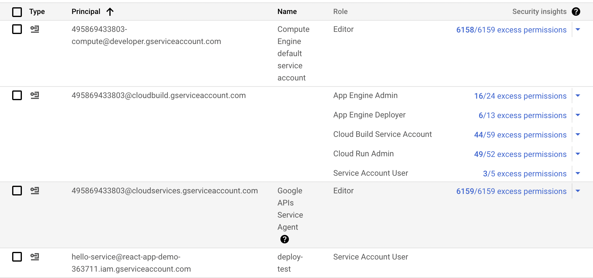
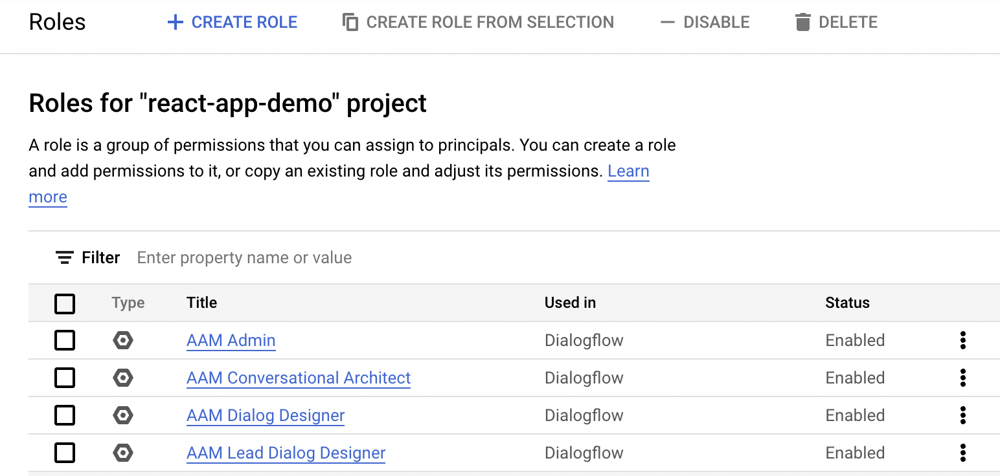

<hr />

**Question 56**
You need to create a new billing account and then link it with an existing Google Cloud Platform project. What should you do?

A: Verify that you are Project Billing Manager for the GCP project. Update the existing project to link it to the existing billing account.

B: Verify that you are Project Billing Manager for the GCP project. Create a new billing account and link the new billing account to the existing project.\*\*

C: Verify that you are Billing Administrator for the billing account. Create a new project and link the new project to the existing billing account.

D: Verify that you are Billing Administrator for the billing account. Update the existing project to link it to the existing billing account.

Answer: C(correct is B)

**Billing Account Administrator (roles/billing.admin)**

- Manage billing accounts (but not create them).

**Project Billing Manager(roles/billing.projectManager)**

- resourcemanager.projects.createBillingAssignment
- resourcemanager.projects.deleteBillingAssignment
- Link/unlink the project to/from a billing account.
- When granted in combination with the Billing Account User role, the Project Billing Manager role allows a user to attach the project to the billing account, but **does not** grant any rights over resources.

https://cloud.google.com/billing/docs/how-to/billing-access#overview-of-cloud-billing-roles-in-cloud-iam

<hr />

**Question 57**
You have one project called proj-sa where you manage all your service accounts. You want to be able to use a service account from this project to take snapshots of VMs running in another project called proj-vm. What should you do?

A: Download the private key from the service account, and add it to each VMs custom metadata.

B: Download the private key from the service account, and add the private key to each VM's SSH keys.

C: Grant the service account the IAM Role of Compute Storage Admin in the project called proj-vm.

D: When creating the VMs, set the service account's API scope for Compute Engine to read/write.

Answer: C

C is the correct answer.
It took me a while to figure it out because I didn't understand how service accounts work across project. This article made it clear for me. https://gtseres.medium.com/using-service-accounts-across-projects-in-gcp-cf9473fef8f0

You create the service account in proj-sa and take note of the service account email, then you go to proj-vm in IAM > ADD and add the service account's email as new member and give it the Compute Storage Admin role.

<hr />

**Question 58** You created a Google Cloud Platform project with an App Engine application inside the project. You initially configured the application to be served from the us- central region. Now you want the application to be served from the asia-northeast1 region. What should you do?

A: Change the default region property setting in the existing GCP project to asia-northeast1.

B: Change the region property setting in the existing App Engine application from us-central to asia-northeast1.

C: Create a second App Engine application in the existing GCP project and specify asia-northeast1 as the region to serve your application.

D: Create a new GCP project and create an App Engine application inside this new project. Specify asia-northeast1 as the region to serve your application.

Answer: D

<hr />

**Question 59**
You need to grant access for three users so that they can view and edit table data on a Cloud Spanner instance. What should you do?

A: Run gcloud iam roles describe roles/spanner.databaseUser. Add the users to the role.

B: Run gcloud iam roles describe roles/spanner.databaseUser. Add the users to a new group. Add the group to the role.

C: Run gcloud iam roles describe roles/spanner.viewer - -project my-project. Add the users to the role.

D: Run gcloud iam roles describe roles/spanner.viewer - -project my-project. Add the users to a new group. Add the group to the role.

Answer: B

<hr />

**Question 60**
You create a new Google Kubernetes Engine (GKE) cluster and want to make sure that it always runs a supported and stable version of Kubernetes. What should you do?

A: Enable the Node Auto-Repair feature for your GKE cluster.

B: Enable the Node Auto-Upgrades feature for your GKE cluster.

C: Select the latest available cluster version for your GKE cluster.

D: Select "Container-Optimized OS (cos)" as a node image for your GKE cluster.

Answer: B

<hr />

**Question 61**
You have an instance group that you want to load balance. You want the load balancer to terminate the client SSL session. The instance group is used to serve a public web application over HTTPS. You want to follow Google-recommended practices. What should you do?

A: Configure an HTTP(S) load balancer.

B: Configure an internal TCP load balancer.

C: Configure an external SSL proxy load balancer.

D: Configure an external TCP proxy load balancer.

Answer: A

<hr />

**Question 62**
You have 32 GB of data in a single file that you need to upload to a Nearline Storage bucket. The WAN connection you are using is rated at 1 Gbps, and you are the only one on the connection. You want to use as much of the rated 1 Gbps as possible to transfer the file rapidly. How should you upload the file?

A: Use the GCP Console to transfer the file instead of gsutil.

B: Enable parallel composite uploads using gsutil on the file transfer.

C: Decrease the TCP window size on the machine initiating the transfer.

D: Change the storage class of the bucket from Nearline to Multi-Regional.

Answer: B

<hr />

**Question 63**
You've deployed a microservice called myapp1 to a Google Kubernetes Engine cluster using the YAML file specified below:

</img>

You need to refactor this configuration so that the database password is not stored in plain text. You want to follow Google-recommended practices. What should you do?

A. Store the database password inside the Docker image of the container, not in the YAML file.

B. Store the database password inside a Secret object. Modify the YAML file to populate the DB_PASSWORD environment variable from the Secret.

C. Store the database password inside a ConfigMap object. Modify the YAML file to populate the DB_PASSWORD environment variable from the ConfigMap.

D. Store the database password in a file inside a Kubernetes persistent volume, and use a persistent volume claim to mount the volume to the container.

Answer: B

<hr />

**Question 64**
You are running an application on multiple virtual machines within a managed instance group and have autoscaling enabled. The autoscaling policy is configured so that additional instances are added to the group if the CPU utilization of instances goes above 80%. VMs are added until the instance group reaches its maximum limit of five VMs or until CPU utilization of instances lowers to 80%. The initial delay for HTTP health checks against the instances is set to 30 seconds.

The virtual machine instances take around three minutes to become available for users. You observe that when the instance group autoscales, it adds more instances then necessary to support the levels of end-user traffic. You want to properly maintain instance group sizes when autoscaling. What should you do?

A: Set the maximum number of instances to 1.

B: Decrease the maximum number of instances to 3.

C: Use a TCP health check instead of an HTTP health check.

D: Increase the initial delay of the HTTP health check to 200 seconds.

Answer: D

[Autohealing behavior](https://cloud.google.com/compute/docs/instance-groups/autohealing-instances-in-migs#example_health_check_set_up)

- In this example, a VM is marked as healthy if it returns successfully once. It is marked as unhealthy if it returns unsuccessfully 3 consecutive times.

```
gcloud compute health-checks create http example-check --port 80 \
       --check-interval 30s \
       --healthy-threshold 1 \
       --timeout 10s \
       --unhealthy-threshold 3
```

- Apply the health check by configuring an autohealing policy for your regional or zonal MIG.

- The initial-delay setting delays autohealing from potentially prematurely recreating the VM if the VM is in the process of starting up. The initial delay timer starts when the VM's currentAction field changes to VERIFYING

```
gcloud compute instance-groups managed update my-mig \
        --health-check example-check \
        --initial-delay 300 \
        --zone us-east1-b
```

<hr />

**Question 65**
You need to select and configure compute resources for a set of batch processing jobs. These jobs take around 2 hours to complete and are run nightly. You want to minimize service costs. What should you do?

A: Select Google Kubernetes Engine. Use a single-node cluster with a small instance type.

B: Select Google Kubernetes Engine. Use a three-node cluster with micro instance types.

C: Select Compute Engine. Use preemptible VM instances of the appropriate standard machine type.

D: Select Compute Engine. Use VM instance types that support micro bursting.

Answer: C

> - preemptible VMs can only run for up to 24 hours at a time,
> - Preemptible VM instances are available at much lower price—a 60-91% discount—compared to the price of standard VMs.

<hr />

**Question 66**
You recently deployed a new version of an application to App Engine and then discovered a bug in the release. You need to immediately revert to the prior version of the application. What should you do?

A: Run gcloud app restore.

B: On the App Engine page of the GCP Console, select the application that needs to be reverted and click Revert.

C: On the App Engine Versions page of the GCP Console, route 100% of the traffic to the previous version.

D: Deploy the original version as a separate application. Then go to App Engine settings and split traffic between applications so that the original version serves 100% of the requests.

Answer: D (the correct is C)

- correct is C NOT D.
  Option A is wrong as gcloud app restore was used for backup and restore and has been deprecated.Option B is wrong as there is no application revert functionality available.Option D is wrong as App Engine maintains version and need not be redeployed.

- D - is wrong because there is only one app engine per project. C is correct, you have to split traffic

- Correct option is C. AppEngine already creates a version for you. Also you do not create a application as one project is associated with one AppEngine application.

**Links:**

- https://www.examtopics.com/discussions/google/view/16707-exam-associate-cloud-engineer-topic-1-question-45-discussion/

<hr />

**Question 67**
You deployed an App Engine application using gcloud app deploy, but it did not deploy to the intended project. You want to find out why this happened and where the application deployed. What should you do?

A: Check the app.yaml file for your application and check project settings.

B: Check the web-application.xml file for your application and check project settings.

C: Go to Deployment Manager and review settings for deployment of applications.

D: Go to Cloud Shell and run gcloud config list to review the Google Cloud configuration used for deployment.

Answer: D

https://cloud.google.com/appengine/docs/standard/reference/app-yaml?tab=node.js#top

- The app.yaml file configures your App Engine app's settings. It is required to contain at least a runtime entry.

- I would opt option D : as it would help to check the config details and Option A is not correct, as app.yaml would have only the runtime and script to run parameters and not the Project details

```
runtime: nodejs18 # required

instance_class: F2 # Automatic scaling: (**F1**, F2, F4, F4_1G). Basic and manual scaling: (B1, **B2**, B4, B4_1G, B8)

env_variables:
  BUCKET_NAME: "example-gcs-bucket"

handlers:
- url: /stylesheets
  static_dir: stylesheets

- url: /.*
  secure: always
  redirect_http_response_code: 301
  script: auto
```

https://cloud.google.com/appengine/docs/flexible/java/configuring-the-web-xml-deployment-descriptor

- The web.xml file is only used when deploying a Java app to a runtime that includes the Eclipse Jetty 9/ servlet 3 server.

<hr />

**Question 68**
You want to configure 10 Compute Engine instances for availability when maintenance occurs. Your requirements state that these instances should attempt to automatically restart if they crash. Also, the instances should be highly available including during system maintenance. What should you do?

A: Create an instance template for the instances. Set the'Automatic Restart' to on. Set the'On-host maintenance' to Migrate VM instance. Add the instance template to an instance group.

B: Create an instance template for the instances. Set'Automatic Restart' to off. Set'On-host maintenance' to Terminate VM instances. Add the instance template to an instance group.

C: Create an instance group for the instances. Set the'Autohealing' health check to healthy (HTTP).

D: Create an instance group for the instance. Verify that the'Advanced creation options' setting for'do not retry machine creation' is set to off.

Answer: A

- [Set host maintenance policy of a VM](https://cloud.google.com/compute/docs/instances/setting-vm-host-options#settingoptions)
- onHostMaintenance: determines the behavior when a maintenance event occurs that might cause your VM to reboot.

  > MIGRATE: causes Compute Engine to live migrate an instance when there is a maintenance event. This is the default value.
  > TERMINATE: stops a VM instead of migrating it.

- automaticRestart: determines the behavior when a VM crashes or is stopped by the system.
  > true: Compute Engine restarts an instance if the instance crashes or is stopped. This is the default value.
  > false: Compute Engine does not restart a VM if the VM crashes or is stopped.

<hr />

**Question 69**
You host a static website on Cloud Storage. Recently, you began to include links to PDF files on this site. Currently, when users click on the links to these PDF files, their browsers prompt them to save the file onto their local system. Instead, you want the clicked PDF files to be displayed within the browser window directly, without prompting the user to save the file locally. What should you do?

A: Enable Cloud CDN on the website frontend.

B: Enable'Share publicly' on the PDF file objects.

C: Set Content-Type metadata to application/pdf on the PDF file objects.

D: Add a label to the storage bucket with a key of Content-Type and value of application/pdf.

Answer: C
You can edit the following metadata for objects,

- [content-type](https://cloud.google.com/storage/docs/metadata#content-type)

<hr />

**Question 70**
You have a virtual machine that is currently configured with 2 vCPUs and 4 GB of memory. It is running out of memory. You want to upgrade the virtual machine to have 8 GB of memory. What should you do?

A: Rely on live migration to move the workload to a machine with more memory.

B: Use gcloud to add metadata to the VM. Set the key to required-memory-size and the value to 8 GB.

C: Stop the VM, change the machine type to n1-standard-8, and start the VM.

D: Stop the VM, increase the memory to 8 GB, and start the VM.

Answer: D

- D is correct. If you pay attention to the question, option C mentions n1-standard-8. That instance type has **8vCPUs** and 30 GB RAM, and we only need 8GB. On top of that, it is possible to use custom machine type to adjust current VM RAM to the value we need.

Links:

1. https://www.examtopics.com/discussions/google/view/16710-exam-associate-cloud-engineer-topic-1-question-49-discussion/

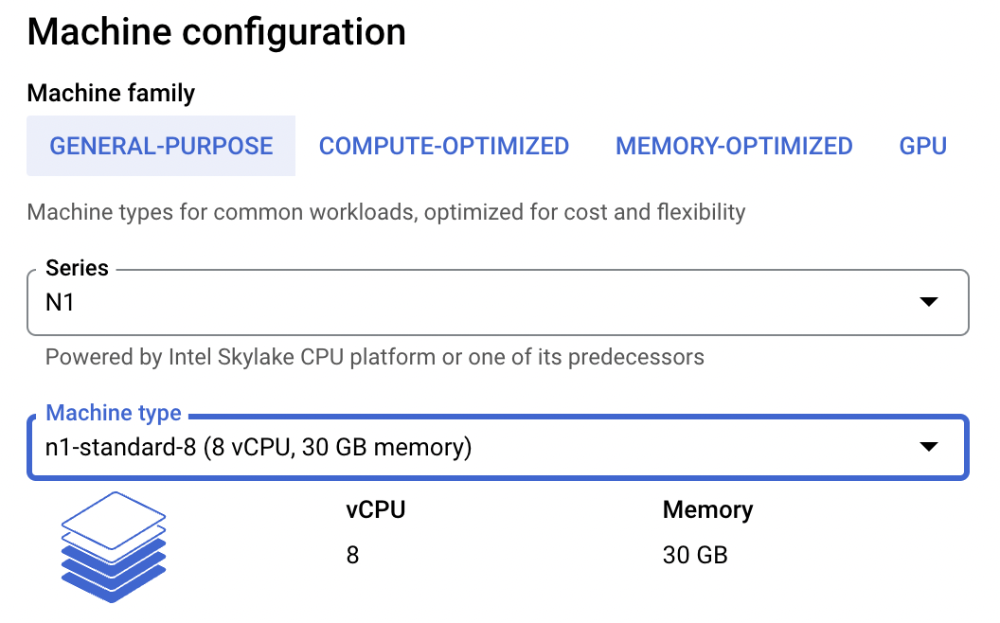

<hr />

**Question 71**
You have production and test workloads that you want to deploy on Compute Engine. Production VMs need to be in a different subnet than the test VMs. All the VMs must be able to reach each other over Internal IP without creating additional routes. You need to set up VPC and the 2 subnets. Which configuration meets these requirements?

A: Create a single custom VPC with 2 subnets. Create each subnet in a different region and with a different CIDR range.

B: Create a single custom VPC with 2 subnets. Create each subnet in the same region and with the same CIDR range.

C: Create 2 custom VPCs, each with a single subnet. Create each subnet in a different region and with a different CIDR range.

D: Create 2 custom VPCs, each with a single subnet. Create each subnet in the same region and with the same CIDR range.

Answer: A

- When a custom mode VPC network is created, no subnets are **automatically** created. This type of network provides you with complete control over its subnets and IP ranges. You decide which subnets to create in regions that you choose by using IP ranges that you specify.[1]

**Links:**

1. https://cloud.google.com/vpc/docs/vpc#subnet-ranges

<hr />

**Question 72**
You need to create an autoscaling managed instance group for an HTTPS web application. You want to make sure that unhealthy VMs are recreated. What should you do?

A: Create a health check on port 443 and use that when creating the Managed Instance Group.

B: Select Multi-Zone instead of Single-Zone when creating the Managed Instance Group.

C: In the Instance Template, add the label'health-check'.

D: In the Instance Template, add a startup script that sends a heartbeat to the metadata server.

Answer: A

<hr />

**Question 73**
Your company has a Google Cloud Platform project that uses BigQuery for data warehousing. Your data science team changes frequently and has few members.

You need to allow members of this team to perform queries. You want to follow Google-recommended practices. What should you do?

A: 1. Create an IAM entry for each data scientist's user account. 2. Assign the BigQuery jobUser role to the group.

B: 1. Create an IAM entry for each data scientist's user account. 2. Assign the BigQuery dataViewer user role to the group.

C: 1. Create a dedicated Google group in Cloud Identity. 2. Add each data scientist's user account to the group. 3. Assign the BigQuery jobUser role to the group.

D: 1. Create a dedicated Google group in Cloud Identity. 2. Add each data scientist's user account to the group. 3. Assign the BigQuery dataViewer user role to the group.

Answer: D

<hr />

**Question 74**
Your company has a 3-tier solution running on Compute Engine. The configuration of the current infrastructure is shown below.

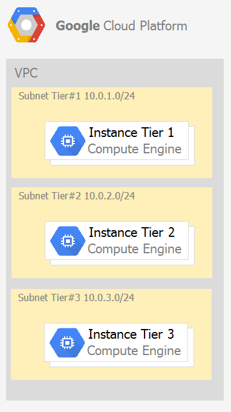

Each tier has a service account that is associated with all instances within it. You need to enable communication on TCP port 8080 between tiers as follows:

"¢ Instances in tier #1 must communicate with tier #2.

"¢ Instances in tier #2 must communicate with tier #3.

What should you do?

A: 1. Create an ingress firewall rule with the following settings: "¢ Targets: all instances "¢ Source filter: IP ranges (with the range set to 10.0.2.0/24) "¢ Protocols: allow all 2. Create an ingress firewall rule with the following settings: "¢ Targets: all instances "¢ Source filter: IP ranges (with the range set to 10.0.1.0/24) "¢ Protocols: allow all

B: 1. Create an ingress firewall rule with the following settings: "¢ Targets: all instances with tier #2 service account "¢ Source filter: all instances with tier #1 service account "¢ Protocols: allow TCP:8080 2. Create an ingress firewall rule with the following settings: "¢ Targets: all instances with tier #3 service account "¢ Source filter: all instances with tier #2 service account "¢ Protocols: allow TCP: 8080

C: 1. Create an ingress firewall rule with the following settings: "¢ Targets: all instances with tier #2 service account "¢ Source filter: all instances with tier #1 service account "¢ Protocols: allow all 2. Create an ingress firewall rule with the following settings: "¢ Targets: all instances with tier #3 service account "¢ Source filter: all instances with tier #2 service account "¢ Protocols: allow all

D: 1. Create an egress firewall rule with the following settings: "¢ Targets: all instances "¢ Source filter: IP ranges (with the range set to 10.0.2.0/24) "¢ Protocols: allow TCP: 8080 2. Create an egress firewall rule with the following settings: "¢ Targets: all instances "¢ Source filter: IP ranges (with the range set to 10.0.1.0/24) "¢ Protocols: allow TCP: 8080

Answer: B

```
Option A is wrong. The target IP ranges and the protocol ranges are too open.
Option C is wrong. The protocol ranges are too open.
Option D is wrong. The target IP ranges are too open.
```

<hr />

**Question 75**
You are given a project with a single Virtual Private Cloud (VPC) and a single subnetwork in the us-central1 region. There is a Compute Engine instance hosting an application in this subnetwork. You need to deploy a new instance in the same project in the europe-west1 region. This new instance needs access to the application. You want to follow Google-recommended practices. What should you do?

A: 1. Create a subnetwork in the same VPC, in europe-west1. 2. Create the new instance in the new subnetwork and use the first instance's private address as the endpoint.

B: 1. Create a VPC and a subnetwork in europe-west1. 2. Expose the application with an internal load balancer. 3. Create the new instance in the new subnetwork and use the load balancer's address as the endpoint.

C: 1. Create a subnetwork in the same VPC, in europe-west1. 2. Use Cloud VPN to connect the two subnetworks. 3. Create the new instance in the new subnetwork and use the first instance's private address as the endpoint.

D: 1. Create a VPC and a subnetwork in europe-west1. 2. Peer the 2 VPCs. 3. Create the new instance in the new subnetwork and use the first instance's private address as the endpoint.

Answer: A

<hr />

**Question 76**
Your projects incurred more costs than you expected last month. Your research reveals that a development GKE container emitted a huge number of logs, which resulted in higher costs. You want to disable the logs quickly using the minimum number of steps. What should you do?

A: 1. Go to the Logs ingestion window in Stackdriver Logging, and disable the log source for the GKE container resource.

B: 1. Go to the Logs ingestion window in Stackdriver Logging, and disable the log source for the GKE Cluster Operations resource.

C: 1. Go to the GKE console, and delete existing clusters. 2. Recreate a new cluster. 3. Clear the option to enable legacy Stackdriver Logging.

D: 1. Go to the GKE console, and delete existing clusters. 2. Recreate a new cluster. 3. Clear the option to enable legacy Stackdriver Monitoring.

Answer: A

<hr />

favorite_border

**Question 77**
You have a website hosted on App Engine standard environment. You want 1% of your users to see a new test version of the website. You want to minimize complexity. What should you do?

A: Deploy the new version in the same application and use the --migrate option.

B: Deploy the new version in the same application and use the --splits option to give a weight of 99 to the current version and a weight of 1 to the new version.

C: Create a new App Engine application in the same project. Deploy the new version in that application. Use the App Engine library to proxy 1% of the requests to the new version.

D: Create a new App Engine application in the same project. Deploy the new version in that application. Configure your network load balancer to send 1% of the traffic to that new application.

Answer: B

<hr />

**Question 78**
You have a web application deployed as a managed instance group. You have a new version of the application to gradually deploy. Your web application is currently receiving live web traffic. You want to ensure that the available capacity does not decrease during the deployment. What should you do?

A: Perform a rolling-action start-update with maxSurge set to 0 and maxUnavailable set to 1.

B: Perform a rolling-action start-update with maxSurge set to 1 and maxUnavailable set to 0.

C: Create a new managed instance group with an updated instance template. Add the group to the backend service for the load balancer. When all instances in the new managed instance group are healthy, delete the old managed instance group.

D: Create a new instance template with the new application version. Update the existing managed instance group with the new instance template. Delete the instances in the managed instance group to allow the managed instance group to recreate the instance using the new instance template.

Answer: B

**Links:**

1. https://cloud.google.com/compute/docs/instance-groups/rolling-out-updates-to-managed-instance-groups#starting_a_basic_rolling_update

**Instance Template v1,v2**
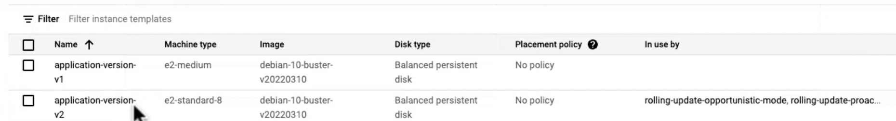

**Migs for v1**
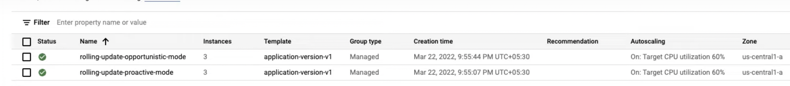

**Edit Migs from template v1 to v2**
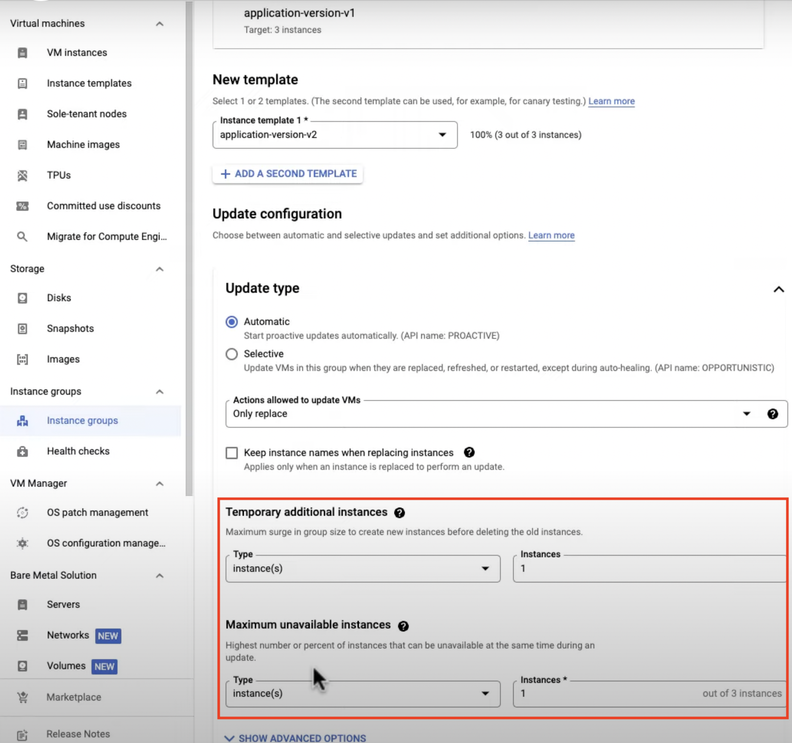

**Migs is updating to v2**
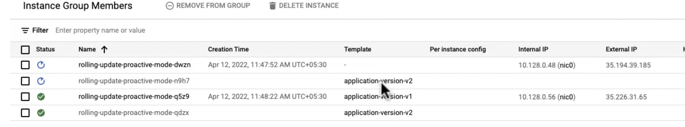

**maxSurge/maxUnavailable**
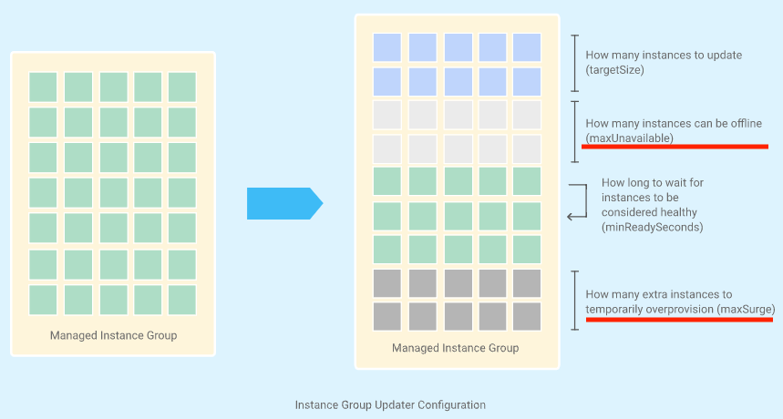

```
gcloud compute instance-groups managed rolling-action start-update INSTANCE_GROUP_NAME \
    --version=template=INSTANCE_TEMPLATE_NAME
    [--zone=ZONE | --region=REGION]
```

<hr />

**Question 79**
You are building an application that stores relational data from users. Users across the globe will use this application. Your CTO is concerned about the scaling requirements because the size of the user base is unknown. You need to implement a database solution that can scale with your user growth with minimum configuration changes. Which storage solution should you use?

A: Cloud SQL

B: Cloud Spanner

C: Cloud Firestore

D: Cloud Datastore

Answer: B

<hr />

**Question 80**
You are the organization and billing administrator for your company. The engineering team has the Project Creator role on the organization. You do not want the engineering team to be able to link projects to the billing account. Only the finance team should be able to link a project to a billing account, but they should not be able to make any other changes to projects. What should you do?

A: Assign the finance team only the Billing Account User role on the billing account.

B: Assign the engineering team only the Billing Account User role on the billing account.

C: Assign the finance team the Billing Account User role on the billing account and the Project Billing Manager role on the organization.

D: Assign the engineering team the Billing Account User role on the billing account and the Project Billing Manager role on the organization.

Answer: C

- Billing Account User (roles/billing.user)

  > Link projects to billing accounts.

  > This role allow a user to create new projects linked to the billing account on which the role is granted.

  > Create new billable projects.

- Project Billing Manager(roles/billing.projectManager)

  > Link/unlink the project to/from a billing account.

  > This role allows a user to attach the project to the billing account, but does not grant any rights over resources.

```
- Billing Account User (roles/billing.user) on the destination billing account
- Project billing manager (roles/billing.projectManager) on the project
```

- https://cloud.google.com/billing/docs/how-to/billing-access
- https://stackoverflow.com/questions/59559885/project-billing-manager-vs-billing-account-user-gcp#:~:text=Project%20Billing%20Manager%20is%20the,link%20projects%20to%20billing%20accounts.
- https://cloud.google.com/billing/docs/how-to/billing-access#cloud-billing_access-control-examples

<hr />

**Question 81**
You have an application running in Google Kubernetes Engine (GKE) with cluster autoscaling enabled. The application exposes a TCP endpoint. There are several replicas of this application. You have a Compute Engine instance in the same region, but in another Virtual Private Cloud (VPC), called gce-network, that has no overlapping IP ranges with the first VPC. This instance needs to connect to the application on GKE. You want to minimize effort. What should you do?

A: 1. In GKE, create a Service of type LoadBalancer that uses the application's Pods as backend. 2. Set the service's externalTrafficPolicy to Cluster. 3. Configure the Compute Engine instance to use the address of the load balancer that has been created.

B: 1. In GKE, create a Service of type NodePort that uses the application's Pods as backend. 2. Create a Compute Engine instance called proxy with 2 network interfaces, one in each VP3. Use iptables on this instance to forward traffic from gce-network to the GKE nodes. 4. Configure the Compute Engine instance to use the address of proxy in gce-network as endpoint.

C: 1. In GKE, create a Service of type LoadBalancer that uses the application's Pods as backend. 2. Add an annotation to this service: cloud.google.com/load-balancer-type: Internal 3. Peer the two VPCs together. 4. Configure the Compute Engine instance to use the address of the load balancer that has been created.

D: 1. In GKE, create a Service of type LoadBalancer that uses the application's Pods as backend. 2. Add a Cloud Armor Security Policy to the load balancer that whitelists the internal IPs of the MIG's instances. 3. Configure the Compute Engine instance to use the address of the load balancer that has been created.

Answer: C

<hr />

**Question 82**
Your organization is a financial company that needs to store audit log files for 3 years. Your organization has hundreds of Google Cloud projects. You need to implement a cost-effective approach for log file retention. What should you do?

A: Create an export to the sink that saves logs from Cloud Audit to BigQuery.

B: Create an export to the sink that saves logs from Cloud Audit to a Coldline Storage bucket.

C: Write a custom script that uses logging API to copy the logs from Stackdriver logs to BigQuery.

D: Export these logs to Cloud Pub/Sub and write a Cloud Dataflow pipeline to store logs to Cloud SQL.

Answer: B

```
cost effective - sink the logs 1to Cold Storage
```

<hr />

**Question 83**
You want to run a single caching HTTP reverse proxy on GCP for a latency-sensitive website. This specific reverse proxy consumes almost no CPU. You want to have a 30-GB in-memory cache, and need an additional 2 GB of memory for the rest of the processes. You want to minimize cost. How should you run this reverse proxy?

A: Create a Cloud Memorystore for Redis instance with 32-GB capacity.

B: Run it on Compute Engine, and choose a custom instance type with 6 vCPUs and 32 GB of memory.

C: Package it in a container image, and run it on Kubernetes Engine, using n1-standard-32 instances as nodes.

D: Run it on Compute Engine, choose the instance type n1-standard-1, and add an SSD persistent disk of 32 GB.

Answer: A
Memorystore in Redis
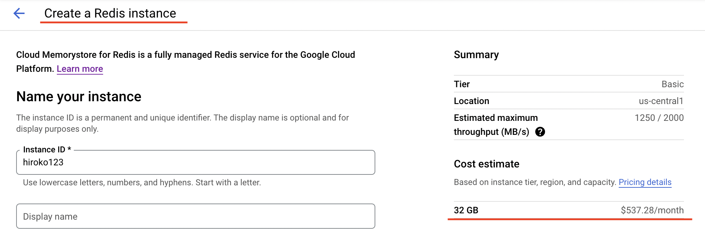

**n1-standard-1**
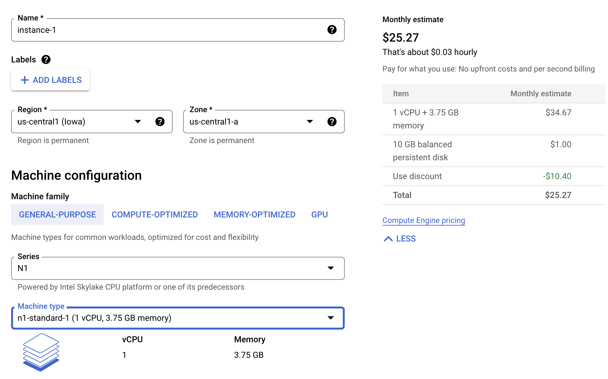

**n1-standard-32**
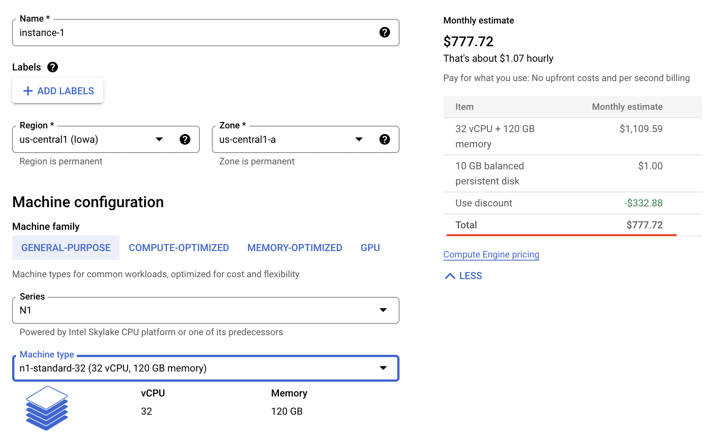

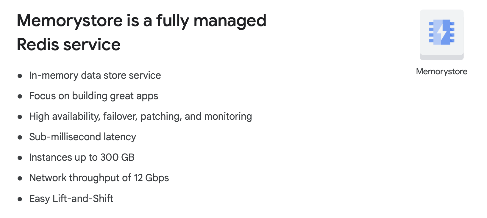

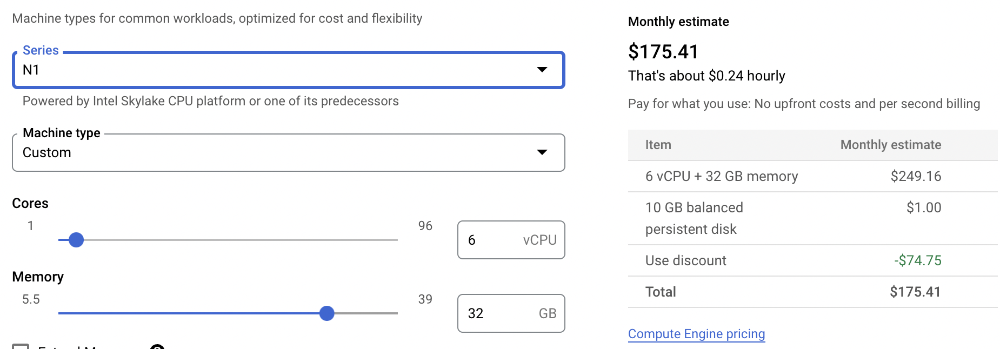

Links:

1. https://cloud.google.com/compute/docs/instances/creating-instance-with-custom-machine-type#create

<hr />

**Question 84**
You are hosting an application on bare-metal servers in your own data center. The application needs access to Cloud Storage. However, security policies prevent the servers hosting the application from having public IP addresses or access to the internet. You want to follow Google-recommended practices to provide the application with access to Cloud Storage. What should you do?

A: 1. Use nslookup to get the IP address for storage.googleapis.com. 2. Negotiate with the security team to be able to give a public IP address to the servers. 3. Only allow egress traffic from those servers to the IP addresses for storage.googleapis.com.

B: 1. Using Cloud VPN, create a VPN tunnel to a Virtual Private Cloud (VPC) in Google Cloud. 2. In this VPC, create a Compute Engine instance and install the Squid proxy server on this instance. 3. Configure your servers to use that instance as a proxy to access Cloud Storage.

C: 1. Use Migrate for Compute Engine (formerly known as Velostrata) to migrate those servers to Compute Engine. 2. Create an internal load balancer (ILB) that uses storage.googleapis.com as backend. 3. Configure your new instances to use this ILB as proxy.

D: 1. Using Cloud VPN or Interconnect, create a tunnel to a VPC in Google Cloud. 2. Use Cloud Router to create a custom route advertisement for 199.36.153.4/30. Announce that network to your on-premises network through the VPN tunnel. 3. In your on-premises network, configure your DNS server to resolve \*.googleapis.com as a CNAME to restricted.googleapis.com.

Answer: D

```
on-prem - app
GCP - Cloud Storage
wants to access with internal IP
on-prem -> Cloud VPN -> D
```

<hr />

**Question 85**
You want to deploy an application on Cloud Run that processes messages from a Cloud Pub/Sub topic. You want to follow Google-recommended practices. What should you do?

A: 1. Create a Cloud Function that uses a Cloud Pub/Sub trigger on that topic. 2. Call your application on Cloud Run from the Cloud Function for every message.

B: 1. Grant the Pub/Sub Subscriber role to the service account used by Cloud Run. 2. Create a Cloud Pub/Sub subscription for that topic. 3. Make your application pull messages from that subscription.

C: 1. Create a service account. 2. Give the Cloud Run Invoker role to that service account for your Cloud Run application. 3. Create a Cloud Pub/Sub subscription that uses that service account and uses your Cloud Run application as the push endpoint.

D: 1. Deploy your application on Cloud Run on GKE with the connectivity set to Internal. 2. Create a Cloud Pub/Sub subscription for that topic. 3. In the same Google Kubernetes Engine cluster as your application, deploy a container that takes the messages and sends them to your application.

Answer: C

**Integrating with Pub/Sub**
https://cloud.google.com/run/docs/tutorials/pubsub#integrating-pubsub

<hr />

**Question 86**
You need to deploy an application, which is packaged in a container image, in a new project. The application exposes an HTTP endpoint and receives very few requests per day. You want to minimize costs. What should you do?

A: Deploy the container on Cloud Run.

B: Deploy the container on Cloud Run on GKE.

C: Deploy the container on App Engine Flexible.

D: Deploy the container on GKE with cluster autoscaling and horizontal pod autoscaling enabled.

Answer: A
https://cloud.google.com/run/docs

```
Cloud Run is a managed compute platform that enables you to run containers that are invocable via requests or events.
```

<hr />

**Question 87**
Your company has an existing GCP organization with hundreds of projects and a billing account. Your company recently acquired another company that also has hundreds of projects and its own billing account. You would like to consolidate all GCP costs of both GCP organizations onto a single invoice. You would like to consolidate all costs as of tomorrow. What should you do?

A: Link the acquired company's projects to your company's billing account.

B: Configure the acquired company's billing account and your company's billing account to export the billing data into the same BigQuery dataset.

C: Migrate the acquired company's projects into your company's GCP organization. Link the migrated projects to your company's billing account.

D: Create a new GCP organization and a new billing account. Migrate the acquired company's projects and your company's projects into the new GCP organization and link the projects to the new billing account.

Answer: A (A will be correct within 24 hours or B)

https://cloud.google.com/resource-manager/docs/project-migration#permissions-billing

- [Billing account permissions](https://cloud.google.com/resource-manager/docs/project-migration#permissions-billing)

  > Cloud Billing accounts can be used across organization resources. Moving a project from one organization resource to another won't impact billing, and charges will continue against the old billing account.

- https://fargyle.medium.com/google-cloud-platform-cross-org-billing-41c5db8fefa6

```
- Billing Account User (roles/billing.user) on the destination billing account
- Project billing manager (roles/billing.projectManager) on the project
```

<hr />

**Question 88**
You built an application on Google Cloud that uses Cloud Spanner. Your support team needs to monitor the environment but should not have access to table data. You need a streamlined solution to grant the correct permissions to your support team, and you want to follow Google-recommended practices. What should you do?

A: Add the support team group to the roles/monitoring.viewer role

B: Add the support team group to the roles/spanner.databaseUser role.

C: Add the support team group to the roles/spanner.databaseReader role.

D: Add the support team group to the roles/stackdriver.accounts.viewer role.

Answer: A

- should not have access to table data
- [roles/spanner.databaseReader](https://cloud.google.com/spanner/docs/iam#roles)

  > Read from the Cloud Spanner database.

- Cloud Spanner Database Reader (roles/spanner.databaseReader)
  > Read from the Cloud Spanner database.
- Cloud Spanner Database User (roles/spanner.databaseUser)
  > Read from and write to the Cloud Spanner database.
  > View and update schema for the database.
- https://cloud.google.com/monitoring/access-control#predefined_roles
- Monitoring Viewer(roles/monitoring.viewer)
  > Grants read-only access to Monitoring in the Google Cloud console and API.

<hr />

**Question 89**
For analysis purposes, you need to send all the logs from all of your Compute Engine instances to a BigQuery dataset called platform-logs. You have already installed the Cloud Logging agent on all the instances. You want to minimize cost. What should you do?

A: 1. Give the BigQuery Data Editor role on the platform-logs dataset to the service accounts used by your instances. 2. Update your instances' metadata to add the following value: logs-destination: bq://platform-logs.

B: 1. In Cloud Logging, create a logs export with a Cloud Pub/Sub topic called logs as a sink. 2. Create a Cloud Function that is triggered by messages in the logs topic. 3. Configure that Cloud Function to drop logs that are not from Compute Engine and to insert Compute Engine logs in the platform-logs dataset.

C: 1. In Cloud Logging, create a filter to view only Compute Engine logs. 2. Click Create Export. 3. Choose BigQuery as Sink Service, and the platform-logs dataset as Sink Destination.

D: 1. Create a Cloud Function that has the BigQuery User role on the platform-logs dataset. 2. Configure this Cloud Function to create a BigQuery Job that executes this query: INSERT INTO dataset.platform-logs (timestamp, log) SELECT timestamp, log FROM compute.logs WHERE timestamp > DATE_SUB(CURRENT_DATE(), INTERVAL 1 DAY) 3. Use Cloud Scheduler to trigger this Cloud Function once a day.

Answer: C

```
Logs Explorer
resource.type="gce_instance"
```

<hr />

**Question 90**
You are using Deployment Manager to create a Google Kubernetes Engine cluster. Using the same Deployment Manager deployment, you also want to create a DaemonSet in the kube-system namespace of the cluster. You want a solution that uses the fewest possible services. What should you do?

D: In the cluster's definition in Deployment Manager, add a metadata that has kube-system as key and the DaemonSet manifest as value.

Answer: C (**A is correct**)

- [Adding an API as a type provider](https://cloud.google.com/deployment-manager/docs/configuration/type-providers/creating-type-provider)

  > This page describes how to add an API to Google Cloud Deployment Manager as a type provider. To learn more about types and type providers, read the Types overview documentation.

  > A type provider exposes all of the resources of a third-party API to Deployment Manager as base types that you can use in your configurations. These types must be directly served by a RESTful API that supports Create, Read, Update, and Delete (CRUD).

- [Cloud Deployment Manager & Kubernetes](https://medium.com/google-cloud/cloud-deployment-manager-kubernetes-2dd9b8124223)

<hr />

**Question 91**
You are building an application that will run in your data center. The application will use Google Cloud Platform (GCP) services like AutoML. You created a service account that has appropriate access to AutoML. You need to enable authentication to the APIs from your on-premises environment. What should you do?

A: Use service account credentials in your on-premises application.

B: Use gcloud to create a key file for the service account that has appropriate permissions.

C: Set up direct interconnect between your data center and Google Cloud Platform to enable authentication for your on-premises applications.

D: Go to the IAM & admin console, grant a user account permissions similar to the service account permissions, and use this user account for authentication from your data center.

Answer: B

```
To use a service account outside of Google Cloud, such as on other platforms or on-premises, you must first establish the identity of the service account. Public/private key pairs provide a secure way of accomplishing this goal.

https://cloud.google.com/iam/docs/creating-managing-service-account-keys

gcloud iam service-accounts keys create KEY_FILE \
    --iam-account=SA_NAME@PROJECT_ID.iam.gserviceaccount.com
```

<hr />

**Question 92**
You are using Container Registry to centrally store your company's container images in a separate project. In another project, you want to create a Google Kubernetes Engine (GKE) cluster. You want to ensure that Kubernetes can download images from Container Registry. What should you do?

A: In the project where the images are stored, grant the Storage Object Viewer IAM role to the service account used by the Kubernetes nodes.

B: When you create the GKE cluster, choose the Allow full access to all Cloud APIs option under'Access scopes'.

C: Create a service account, and give it access to Cloud Storage. Create a P12 key for this service account and use it as an imagePullSecrets in Kubernetes.

D: Configure the ACLs on each image in Cloud Storage to give read-only access to the default Compute Engine service account.

Answer: A

```
https://cloud.google.com/container-registry/docs/access-control

IAM permissions determine who can access resources. All users, service accounts, and other identities that interact with Container Registry must have the appropriate Cloud Storage permissions.
```

<hr />

**Question 93**
You deployed a new application inside your Google Kubernetes Engine cluster using the YAML file specified below.

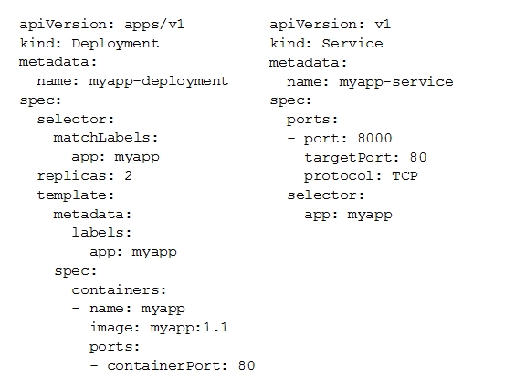

You check the status of the deployed pods and notice that one of them is still in PENDING status:

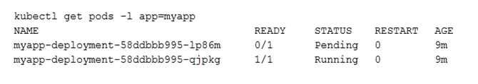

You want to find out why the pod is stuck in pending status. What should you do?

A: Review details of the myapp-service Service object and check for error messages.

B: Review details of the myapp-deployment Deployment object and check for error messages.

C: Review details of myapp-deployment-58ddbbb995-lp86m Pod and check for warning messages.

D: View logs of the container in myapp-deployment-58ddbbb995-lp86m pod and check for warning messages.

Answer: C

[Debugging Pods](https://kubernetes.io/docs/tasks/debug/debug-application/debug-pods/#debugging-pods)

```
kubectl describe pods ${POD_NAME}
```

<hr />

**Question 94**
You are setting up a Windows VM on Compute Engine and want to make sure you can log in to the VM via RDP. What should you do?

A: After the VM has been created, use your Google Account credentials to log in into the VM.

B: After the VM has been created, use gcloud compute reset-windows-password to retrieve the login credentials for the VM.

C: When creating the VM, add metadata to the instance using'windows-password' as the key and a password as the value.

D: After the VM has been created, download the JSON private key for the default Compute Engine service account. Use the credentials in the JSON file to log in to the VM.

Answer: B

> gcloud beta compute reset-windows-password allows a user to reset and retrieve a password for a Windows virtual machine instance. If the Windows account does not exist, this command will cause the account to be created and the password for that new account will be returned.

https://cloud.google.com/sdk/gcloud/reference/beta/compute/reset-windows-password

```
gcloud beta compute reset-windows-password my-instance --zone=us-central1-f --user=foo
```

<hr />

**Question 95**
You want to configure an SSH connection to a single Compute Engine instance for users in the dev1 group. This instance is the only resource in this particular Google Cloud Platform project that the dev1 users should be able to connect to. What should you do?

A: Set metadata to enable-oslogin=true for the instance. Grant the dev1 group the compute.osLogin role. Direct them to use the Cloud Shell to ssh to that instance.

B: Set metadata to enable-oslogin=true for the instance. Set the service account to no service account for that instance. Direct them to use the Cloud Shell to ssh to that instance.

C: Enable block project wide keys for the instance. Generate an SSH key for each user in the dev1 group. Distribute the keys to dev1 users and direct them to use their third-party tools to connect.

D: Enable block project wide keys for the instance. Generate an SSH key and associate the key with that instance. Distribute the key to dev1 users and direct them to use their third-party tools to connect.

Answer: A

- [Set up OS Login](https://cloud.google.com/compute/docs/oslogin/set-up-oslogin)

- [Enable OS Login](https://cloud.google.com/compute/docs/oslogin/set-up-oslogin#enable_os_login)

```
gcloud compute instances create VM_NAME \
  --image-family=IMAGE_FAMILY \
  --image-project=IMAGE_PROJECT \
  --metadata enable-oslogin=TRUE
```

<hr />

**Question 96**
You need to produce a list of the enabled Google Cloud Platform APIs for a GCP project using the gcloud command line in the Cloud Shell. The project name is my-project. What should you do?

A: Run gcloud projects list to get the project ID, and then run gcloud services list --project <project ID>.

B: Run gcloud init to set the current project to my-project, and then run gcloud services list --available.

C: Run gcloud info to view the account value, and then run gcloud services list --account <Account>.

D: Run gcloud projects describe <project ID> to verify the project value, and then run gcloud services list --available.

Answer: A

https://cloud.google.com/sdk/gcloud/reference/services/list#--enabled

```
//--enabled: (DEFAULT) Return the services which the project has enabled.
gcloud services list --enabled

//--available
Return the services available to the project to enable.
gcloud services list --available
```

<hr />

**Question 97**
You are building a new version of an application hosted in an App Engine environment. You want to test the new version with 1% of users before you completely switch your application over to the new version. What should you do?

A: Deploy a new version of your application in Google Kubernetes Engine instead of App Engine and then use GCP Console to split traffic.

B: Deploy a new version of your application in a Compute Engine instance instead of App Engine and then use GCP Console to split traffic.

C: Deploy a new version as a separate app in App Engine. Then configure App Engine using GCP Console to split traffic between the two apps.

D: Deploy a new version of your application in App Engine. Then go to App Engine settings in GCP Console and split traffic between the current version and newly deployed versions accordingly.

Answer: D

https://cloud.google.com/sdk/gcloud/reference/app/services/set-traffic

```
//To send all traffic to 'v2' of service 's1', run:
gcloud app services set-traffic s1 --splits=v2=1
```

```
//To split traffic evenly between 'v1' and 'v2' of service 's1', run:
gcloud app services set-traffic s1 --splits=v2=.5,v1=.5
```

<hr />

**Question 98**
You need to provide a cost estimate for a Kubernetes cluster using the GCP pricing calculator for Kubernetes. Your workload requires high IOPs, and you will also be using disk snapshots. You start by entering the number of nodes, average hours, and average days. What should you do next?

A: Fill in local SSD. Fill in persistent disk storage and snapshot storage.

B: Fill in local SSD. Add estimated cost for cluster management.

C: Select Add GPUs. Fill in persistent disk storage and snapshot storage.

D: Select Add GPUs. Add estimated cost for cluster management.

Answer: A

```
This one is Tricky, local SSD is require for High IOPS - https://cloud.google.com/compute/docs/disks/local-ssd , but it say using disk snapshots. A is correct.
```

<hr />

**Question 99**
You are using Google Kubernetes Engine with autoscaling enabled to host a new application. You want to expose this new application to the public, using HTTPS on a public IP address. What should you do?

A: Create a Kubernetes Service of type NodePort for your application, and a Kubernetes Ingress to expose this Service via a Cloud Load Balancer.

B: Create a Kubernetes Service of type ClusterIP for your application. Configure the public DNS name of your application using the IP of this Service.

C: Create a Kubernetes Service of type NodePort to expose the application on port 443 of each node of the Kubernetes cluster. Configure the public DNS name of your application with the IP of every node of the cluster to achieve load-balancing.

D: Create a HAProxy pod in the cluster to load-balance the traffic to all the pods of the application. Forward the public traffic to HAProxy with an iptable rule. Configure the DNS name of your application using the public IP of the node HAProxy is running on.

Answer: A

- https://cloud.google.com/kubernetes-engine/docs/tutorials/http-balancer

- https://medium.com/google-cloud/kubernetes-nodeport-vs-loadbalancer-vs-ingress-when-should-i-use-what-922f010849e0
